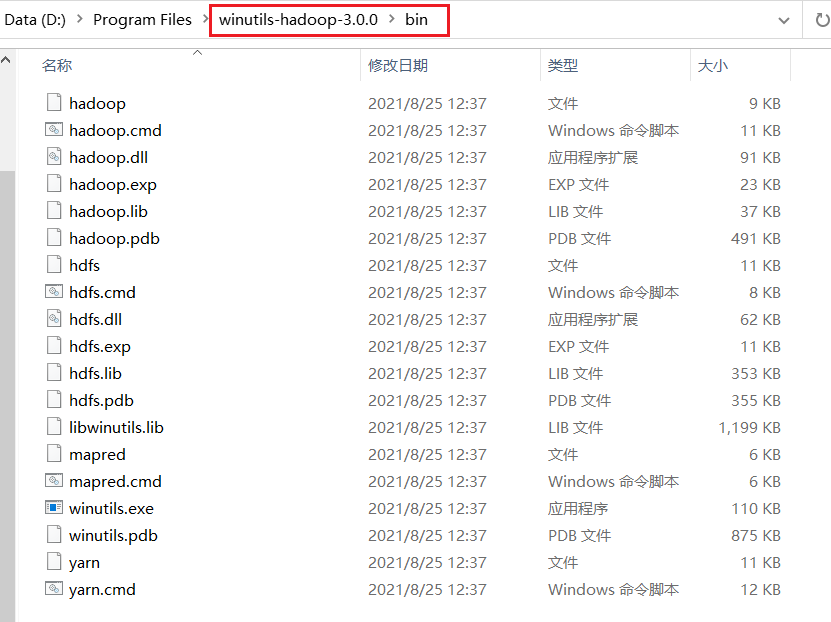
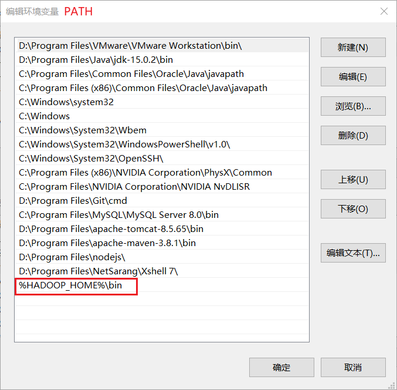

---

Created at: 2021-08-25
Last updated at: 2021-09-14
Source URL: about:blank


---

# 4-MapReduce之WordCount


官方WordCount案例位置：/opt/module/hadoop-3.3.1/share/hadoop/mapreduce/hadoop-mapreduce-examples-3.3.1.jar

以本地WordCount为例解释MapReduce框架，这里不涉及与hdfs与yarn的交互：

1.Windows环境下使用MapReduce框架首先要配置好winutils依赖
下载地址：https://gitee.com/shockingblue/winutils ，下载一个与自己安装的Hadoop版本相近的
下载之后像下面这样组织好目录结构

接着配置环境变量 HADOOP\_HOME 和 PATH



2.代码

引入依赖
```
<dependency>
    <groupId>org.apache.hadoop</groupId>
    <artifactId>hadoop-client</artifactId>
    <version>3.3.1</version>
</dependency>
```

MapReduce 是一个分布式运算程序的编程框架，既然是框架，那么也就是我们只需要继承某些类，然后用业务逻辑重写其中的方法，即可完成分布式运算，这也就是框架之所以叫框架的原因，最大限度的简化编程，让程序员只需要关注业务逻辑即可，其中的设计模式就是模板方法模式。

Map阶段：
WordCountMapper需要继承Mapper，然后重写map()方法。

在Mapper类中，模板方法是run()方法
```
public void run(Context context) throws IOException, InterruptedException {
  setup(context);
  try {
    while (context.nextKeyValue()) {
      `map(context.getCurrentKey(), context.getCurrentValue(), context);`
    }
  } finally {
    cleanup(context);
  }
}
```

在执行run方法之前，框架已经将我们指定的文件以行为单位分割成k-v键值对作为输入，其中k是行的起始偏移量，v是该行的内容，Mapper的前两个泛型参数就是k和v的类型，然后k-v这两个值会传递给map()方法，map()方法再依据业务的逻辑来处理这一行的数据。从上面的while循环也可以看到这一点，先从contenxt对象中读的一行数据，再调用map()方法处理这一行数据，也就是`每一行都会调用map()方法进行处理，有多少行就会调用多少次map()方法`。这个context对象可以看成整个MapReduce框架的上下文，靠它来串联起整个MapReduce的流程。

WordCount单词统计的Map阶段的逻辑是把每一行数据分割成一个一个的单词，然后令每个单词的计数为1，单词就是key，计数就是value，这就是mapper的输出——k-v键值对，输出时需要调用context.write()。

WordCountMapper
```
public class WordCountMapper extends Mapper<LongWritable, Text, Text, IntWritable> {
    private Text outK = new Text();
    private IntWritable outV = new IntWritable(1);

    @Override
    protected void map(LongWritable key, Text value, Context context) throws IOException, InterruptedException {
        // 1 获取一行
        String line = value.toString();
        // 2 切割
        String[] words = line.split(" ");
        // 3 循环写出
        for (String word : words) {
            // 封装outk
            outK.set(word);
            // 写出
            context.write(outK, outV);
        }
    }
}
```

然后就是Reduce阶段：
WordCountReducer需要继承Reducer类，然后重写Reduce()方法

Reducer类与Mapper类的结构一样，模板方法也是run()方法
```
public void run(Context context) throws IOException, InterruptedException {
  setup(context);
  try {
    while (context.nextKey()) {
      `reduce(context.getCurrentKey(), context.getValues(), context);`
      // If a back up store is used, reset it
      Iterator<VALUEIN> iter = context.getValues().iterator();
      if(iter instanceof ReduceContext.ValueIterator) {
        ((ReduceContext.ValueIterator<VALUEIN>)iter).resetBackupStore();        
      }
    }
  } finally {
    cleanup(context);
  }
}
```

在执行run()方法之前，框架会对Map阶段的输出结果进行整理，这点和Map阶段执行run()方法之前框架会先将文件内容以行为单位分割成k-v键值对作为输入类似，这里整理的结果也是k-v键值对，不过key是单词，value是相同单词的计数的集合，比如，Map阶段的输出是(a,1)(b,1)(a,1)，那么整理的结果是(a,1)(a,1)(b,1)，整理的结果会排序，这个整理的过程被称为shuffle。上面run()方法的while循环从context对象中读出来就是这个整理结果，`有多少个不同的单词就会调用多少次reduce()方法`。

WordCount单词统计的Reduce阶段的逻辑是就是把单词计数的集合累加起来，然后把单词作为key，累加和作为value，以k-v键值对的形式输出。输出时同样需要调用context.write()。

WordCountReducer
```
public class WordCountReducer extends Reducer<Text, IntWritable,Text,IntWritable> {
    private IntWritable outV = new IntWritable();

    @Override
    protected void reduce(Text key, Iterable<IntWritable> values, Context context) throws IOException, InterruptedException {
        int sum = 0;
        //(a,1)(a,1)
        // 累加
        for (IntWritable value : values) {
            sum += value.get();
        }
        outV.set(sum);
        // 写出
        context.write(key,outV);
    }
}
```

最后是Driver类，设置一些必要的信息

WordCountDriver
```
public class WordCountDriver{
    public static void main(String[] args) throws IOException, ClassNotFoundException, InterruptedException {

        // 1 获取job
        Configuration conf = new Configuration();
        Job job = Job.getInstance(conf);

        // 2 设置jar包路径
        job.setJarByClass(WordCountDriver.class);

        // 3 关联mapper和reducer
        job.setMapperClass(WordCountMapper.class);
        job.setReducerClass(WordCountReducer.class);

        // 4 设置map输出的kv类型
        job.setMapOutputKeyClass(Text.class);
        job.setMapOutputValueClass(IntWritable.class);

        // 5 设置最终输出的kV类型
        job.setOutputKeyClass(Text.class);
        job.setOutputValueClass(IntWritable.class);

        //获取类路径
        String classPath = Thread.currentThread().getContextClassLoader().getResource("").getPath();
        System.out.println(classPath);

        // 6 设置输入路径和输出路径
        FileInputFormat.setInputPaths(job, new Path(classPath + "/input/word.txt"));
        FileOutputFormat.setOutputPath(job, new Path(classPath + "/output"));

        // 7 提交job
        boolean result = job.waitForCompletion(true);

        System.exit(result ? 0 : 1);
    }
}
```

在Hadoop集群上运行这个WordCount程序
1.修改WordCountDriver
```
public class WordCountDriver{
    public static void main(String[] args) throws IOException, ClassNotFoundException, InterruptedException {

        // 1 获取job
        Configuration conf = new Configuration();
        Job job = Job.getInstance(conf);

        // 2 设置jar包路径
        job.setJarByClass(WordCountDriver.class);

        // 3 关联mapper和reducer
        job.setMapperClass(WordCountMapper.class);
        job.setReducerClass(WordCountReducer.class);

        // 4 设置map输出的kv类型
        job.setMapOutputKeyClass(Text.class);
        job.setMapOutputValueClass(IntWritable.class);

        // 5 设置最终输出的kV类型
        job.setOutputKeyClass(Text.class);
        job.setOutputValueClass(IntWritable.class);

        `// 6 设置输入路径和输出路径`
 `FileInputFormat.setInputPaths(job, new Path(args[0]));`
 `FileOutputFormat.setOutputPath(job, new Path(args[1]));`

        // 7 提交job
        boolean result = job.waitForCompletion(true);
        System.exit(result ? 0 : 1);
    }
}
```

2.修改依赖，Hadoop主机上已经有相关依赖了，所以设置成provided，前面是在本地运行WordCount程序，不能设置成provided
```
<dependency>
    <groupId>org.apache.hadoop</groupId>
    <artifactId>hadoop-client</artifactId>
    <version>3.3.1</version>
 `<scope>provided</scope>`
</dependency>
```

可选：加上日志依赖，然后带依赖打包并指定主类
```
<dependency>
    <groupId>org.slf4j</groupId>
    <artifactId>slf4j-log4j12</artifactId>
    <version>1.7.30</version>
</dependency>

<build>
    <plugins>
        <plugin>
            <artifactId>maven-compiler-plugin</artifactId>
            <version>3.6.1</version>
            <configuration>
                <source>1.8</source>
                <target>1.8</target>
            </configuration>
        </plugin>
        <plugin>
            <groupId>org.apache.maven.plugins</groupId>
            <artifactId>maven-assembly-plugin</artifactId>
            <version>3.3.0</version>
            <configuration>
                <archive>
                    <manifest>
                        <addClasspath>true</addClasspath>
                        <!--指定主类-->
                        <mainClass>wordcount.WordCountDriver</mainClass>
                    </manifest>
                </archive>
                <descriptorRefs>
                    <descriptorRef>jar-with-dependencies</descriptorRef>
                </descriptorRefs>
            </configuration>
            <executions>
                <execution>
                    <id>make-assembly</id>
                    <phase>package</phase>
                    <goals>
                        <goal>single</goal>
                    </goals>
                </execution>
            </executions>
        </plugin>
    </plugins>
</build>
```

3.打包后传到Linux主机上，然后在Hadoop上运行，/input和/output都是HDFS上的路径
```
hadoop jar MapReduce-1.0-SNAPSHOT-jar-with-dependencies.jar /input /output
```

