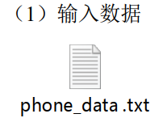
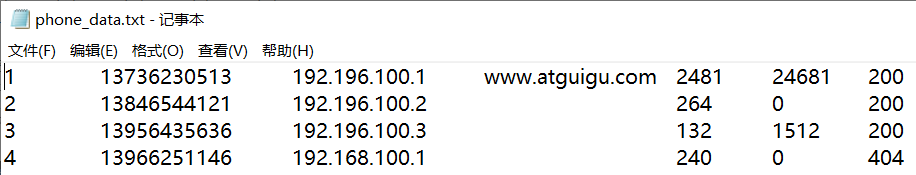
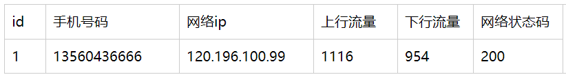
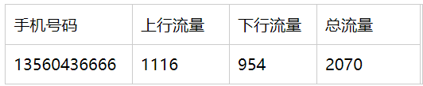
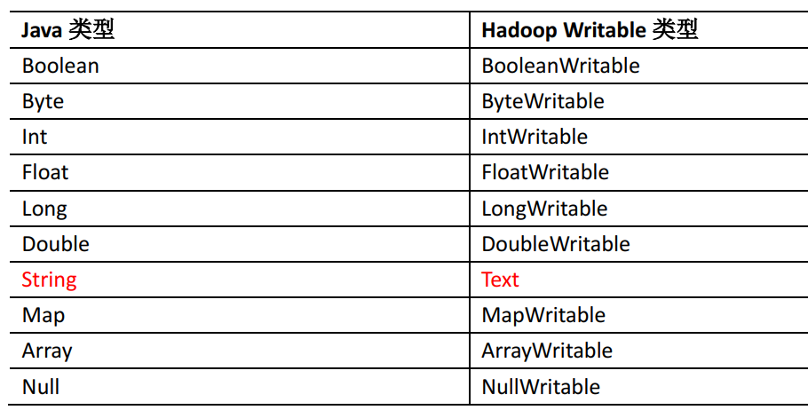

---

Created at: 2021-08-25
Last updated at: 2021-09-14
Source URL: about:blank


---

# 5-MapReduce之序列化


案例： 统计每一个手机号耗费的总上行流量、 总下行流量、总流量


（2）输入数据格式：

（3）期望输出数据格式


分析：从期望输出数据格式可以看出，输出数据的key是手机号码，而value并不能像WordCount那样是一个单个的值，必须的是一个对象，其中包含该手机号码的总上行流量、 总下行流量、总流量。

因为MapReduce程序将来是要在Hadoop集群上运行的，这涉及到不同主机之间的通信，也就是Map的结果会传给另一台主机上的Reduce程序作为输入，数据在不同主机之间的传递就涉及到序列化，而直接使用Java的序列化机制开销太大，所以Hadoop有自己的一套序列化机制。

Hadoop的基本序列化类型：


基本的序列化类型可以应对只需要使用基本数据类型的场景，前面的WordCount程序的map()方法和reduce()方法的输入输出就是这样。而对于本案例而言，基本序列化类型就满足不了需求了。必须自定义可序列的对象，使用Hadoop的序列化机制需要实现 Writable 接口，上面的基本序列化类型都是实现了 Writable 接口。

自定义序列化类需要以下7个步骤：

1. 必须实现 Writable 接口
2. 必须有空参构造，因为反序列化时需要反射调用空参构造函数
3. 必须重写序列化方法 public void write(DataOutput out) throws IOException
4. 必须重写反序列化方法  public void readFields(DataInput in) throws IOException
5. 反序列化的顺序和序列化的顺序需要完全一致
6. 输出到文件中需要toString()方法，所以需要重写toString()方法， 可用"\\t"分隔每个字段
7. 如该序列化对象是map输出结果的key，那么 还需要实现 Comparable 接口，因为MapReduce 框架中的 Shuffle 过程要求对 key 必须能排序

定义包含上行流量、 下行流量和总流量的序列化类
```
/**
* 1、定义类实现writable接口
* 2、重写序列化和反序列化方法
* 3、重写空参构造
* 4、toString方法
*/
public class FlowBean implements Writable {
    private long upFlow; // 上行流量
    private long downFlow; // 下行流量
    private long sumFlow; // 总流量

    // 空参构造
    public FlowBean() {
    }

    public long getUpFlow() {
        return upFlow;
    }
    public void setUpFlow(long upFlow) {
        this.upFlow = upFlow;
    }
    public long getDownFlow() {
        return downFlow;
    }
    public void setDownFlow(long downFlow) {
        this.downFlow = downFlow;
    }
    public long getSumFlow() {
        return sumFlow;
    }
    public void setSumFlow(long sumFlow) {
        this.sumFlow = sumFlow;
    }

    /**
     * 序列化
     */
    @Override
    public void write(DataOutput out) throws IOException {
        out.writeLong(upFlow);
        out.writeLong(downFlow);
        out.writeLong(sumFlow);
    }

    /**
     * 反序列化
     */
    @Override
    public void readFields(DataInput in) throws IOException {
        this.upFlow = in.readLong();
        this.downFlow = in.readLong();
        this.sumFlow = in.readLong();
    }

    @Override
    public String toString() {
        return upFlow + "\t" + downFlow + "\t" + sumFlow;
    }
}
```

Map
```
public class FlowMapper extends Mapper<LongWritable, Text, Text, `FlowBean`> {

    private Text outK = new Text();
    private FlowBean outV = new FlowBean();

    @Override
    protected void map(LongWritable key, Text value, Context context) throws IOException, InterruptedException {
        // 1 获取一行
        String line = value.toString();
        // 2 切割
        String[] split = line.split("\t");
        // 3 抓取想要的数据
        String phone = split[1];
        String up = split[split.length - 3];
        String down = split[split.length - 2];
        // 4封装
        outK.set(phone);
        outV.setUpFlow(Long.parseLong(up));
        outV.setDownFlow(Long.parseLong(down));
        outV.setSumFlow(Long.parseLong(up) + Long.parseLong(down));
        // 5 写出
        context.write(outK, outV);
    }
}
```

Reduce
```
public class FlowReducer extends Reducer<Text, `FlowBean`, Text, `FlowBean`> {
    private FlowBean outV = new FlowBean();

    @Override
    protected void reduce(Text key, Iterable<FlowBean> values, Context context) throws IOException, InterruptedException {
        // 1 遍历集合累加值
        long totalUp = 0;
        long totalDown = 0;
        for (FlowBean value : values) {
            totalUp += value.getUpFlow();
            totalDown += value.getDownFlow();
        }
        // 2 封装outk, outv
        outV.setUpFlow(totalUp);
        outV.setDownFlow(totalDown);
        outV.setSumFlow(totalUp + totalDown);
        // 3 写出
        context.write(key, outV);
    }
}
```

Driver
```
public class FlowDriver {

    public static void main(String[] args) throws IOException, ClassNotFoundException, InterruptedException {

        // 1 获取job
        Configuration conf = new Configuration();
        Job job = Job.getInstance(conf);

        // 2 设置jar
        job.setJarByClass(FlowDriver.class);

        // 3 关联mapper 和Reducer
        job.setMapperClass(FlowMapper.class);
        job.setReducerClass(FlowReducer.class);

        // 4 设置mapper 输出的key和value类型
        job.setMapOutputKeyClass(Text.class);
        job.setMapOutputValueClass(FlowBean.class);

        // 5 设置最终数据输出的key和value类型
        job.setOutputKeyClass(Text.class);
        job.setOutputValueClass(FlowBean.class);

        //获取类路径
        String classPath = Thread.currentThread().getContextClassLoader().getResource("").getPath();
        System.out.println(classPath);

        // 6 设置数据的输入路径和输出路径
        FileInputFormat.setInputPaths(job, new Path(classPath + "/input/phone_data.txt"));
        FileOutputFormat.setOutputPath(job, new Path(classPath + "/output"));

        // 7 提交job
        boolean result = job.waitForCompletion(true);
        System.exit(result ? 0 : 1);
    }
}
```

