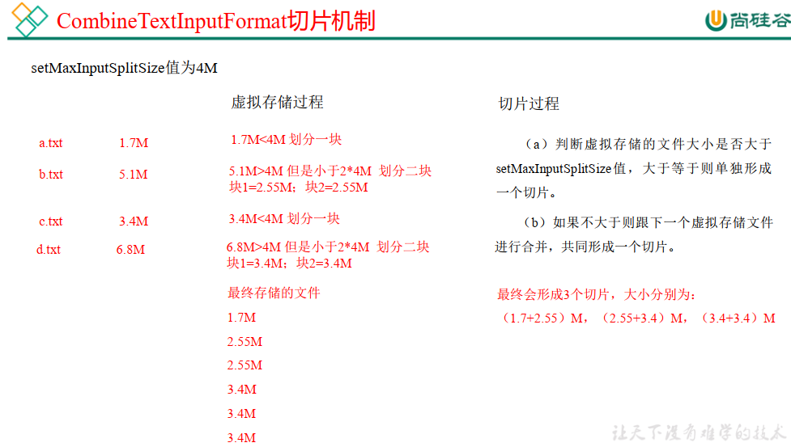

---

Created at: 2021-08-26
Last updated at: 2021-12-07
Source URL: about:blank


---

# 6-MapReduce之任务提交及InputFormat


基于MapReduce框架编写好MapReduce程序之后，需要将任务提交给YARN来调度运行。在任务提交前需要做一些准备工作，最主要是提交jar包到集群、创建切片计划 和 生成job的XML配置文件。 其中最重要的是计算切片计划，因为 MapTask 并行度完全由切片个数决定， 一个切片会对应启动一个 MapTask来处理，而切片个数由输入文件和切片规则决定。

简化流程：


任务提交的流程：
1.在Driver类中前6步是设置Job和输入路径和输出路径，最后一步才是提交任务：job.waitForCompletion(true);
2.第二步执行 org.apache.hadoop.mapreduce.Job 的 submit()方法
```
public void submit()
      throws IOException, InterruptedException, ClassNotFoundException {
`//检查任务状态`
 `ensureState(JobState.DEFINE);`
`//设置新API，兼容Hadoop1.x`
 `setUseNewAPI();`
`//连接，如果是本地模式运行MapReduce则使用LocalClientProtocolProvider，如果是在Hadoop集群上运行则使用YarnClientProtocolProvider`
 `connect();`
 final JobSubmitter submitter =
     getJobSubmitter(cluster.getFileSystem(), cluster.getClient());
 status = ugi.doAs(new PrivilegedExceptionAction<JobStatus>() {
   public JobStatus run() throws IOException, InterruptedException,
   ClassNotFoundException {
`//提交任务`
 `return submitter.submitJobInternal(Job.this, cluster);`
   }
 });
 state = JobState.RUNNING;
 LOG.info("The url to track the job: " + getTrackingURL());
}
```
connect()方法的关键步骤：
1540行 return new Cluster(getConfiguration());
org.apache.hadoop.mapreduce.Cluster 109行 initialize(jobTrackAddr, conf); 115行 initProviderList();

3.submitter.submitJobInternal(Job.this, cluster);才是真正的完整的提交流程，该方法位于org.apache.hadoop.mapreduce.JobSubmitter类中

3.1 143行 checkSpecs(job);  检查输出路径是否合法，点进去，227行output.checkOutputSpecs(job);调用的是OutputFormat的checkOutputSpecs()方法

3.2 148行 Path jobStagingArea = JobSubmissionFiles.getStagingDir(cluster, conf);   创建给集群提交数据的 Stag 路径 /tmp/hadoop/mapred/staging/Jmoon403907232/.staging

3.3 157行 JobID jobId = submitClient.getNewJobID();  获取 jobid，后面会根据这个jobid在Stag路径下创建一个文件夹，就是这样/tmp/hadoop/mapred/staging/Jmoon403907232/.staging/job\_local403907232\_0001

3.4 194行 copyAndConfigureFiles(job, submitJobDir);  拷贝 jar 包到集群，如果是LocalClientProtocolProvider就不用拷贝

3.5 200行 int maps = writeSplits(job, submitJobDir);  计算切片，生成切片规划文件，它的调用流程中比较重要的步骤是：
      327行 maps = writeNewSplits(job, jobSubmitDir);
      310行 List<InputSplit> splits = input.getSplits(job);这步才是真正的计算切片。
                 input是抽象类InputFormat的引用，InputFormat的getSplits()方法是抽象方法，InputFormat有众多的子类，比较重要的子类是抽象类FileInputFormat，FileInputFormat实现了getSplits()方法，该方法的切片计算逻辑主要是对每个文件进行切片，FileInputFormat比较重要的子类有TextInputFormat和抽象类CombineFileInputFormat，CombineFileInputFormat重写了FileInputFormat的getSplits()方法，该方法的切片计算逻辑主要是将小文件合并之后一起切，CombineFileInputFormat比较重要的子类是CombineTextInputFormat。
                 切片计算的结果会保存在Stag 路径下，切片只是逻辑上的，意思是getSplits()方法只是计算得到了MaskTask运行时的读取数据的计划，MaskTask在运行时会按照切片计算的结果读取数据。
                  FileInputFormat的getSplits()方法的404行List<FileStatus> files = listStatus(job);会得到输入路径下的所有文件和目录，然后在408行的for循环之中处理每一个文件和目录，如果是目录不做处理直接continue到下一个文件，如果是文件则会执行下面的代码计算分片，`这里可以说明FileInputFormat是针对每一个文件单独切片`。

3.6 245行 writeConf(conf, submitJobFile); 保存Job任务的 XML 配置文件到Stag 路径下

3.7 251行 status = submitClient.submitJob(jobId, submitJobDir.toString(), job.getCredentials());  准备工作已经做完，现在真正向Yarn或者Local提交Job，返回status

从上述流程可以看出InputFormat和OutputFormat在任务提交阶段都有涉及，OutputFormat检查输出路径是否合法，InputFormat用于计算切片计划，在getSplits()方法中会调用FileInputFormat的isSplitable()方法检查文件是否支持切片，比如压缩文件可能就不支持，isSplitable()需要由子类重写。

InputFormat还会在后续MapTask任务读取文件内容时用到，默认使用的是TextInputFormat，先调用TextInputFormat的 createRecordReader()方法创建一个RecordReader，然后由RecordReader按行读取文件的内容，key是行起始位置的偏移量，value是该行的内容，前面的WordCount程序用的就是TextInputFormat。

总结，InputFormat抽象类是最顶级的抽象类，它一共也就只定义了两个抽象方法getSplits()和createRecordReader()，这两个方法需要由其子类都实现。getSplits()在任务提交前计算分片以便决定MapTask的并行度；createRecordReader()创建RecordReader，用于读取文件内容。


MapTask 并行度由切片个数决定，切片个数由输入文件和切片规则决定。上面没有具体展开FileInputFormat 和 CombineFileInputFormat的getSplits()的切片规则，TextInputFormat 和 CombineTextInputFormat的切片规则分别继承自这两个抽象类，下面具体说明它俩的切片计算逻辑。

TextInputFormat的getSplits()方法继承自FileInputFormat，它的计算过程是：
（1）程序先找到你数据存储的目录。
（2）开始遍历处理（规划切片）目录下的每一个文件
（3）遍历第一个文件ss.txt
        a. 获取文件大小fs.sizeOf(ss.txt)
        b. 计算切片大小，`默认情况下切片大小=blocksize=128M` ，计算过程是 ：
 computeSplitSize(Math.max(minSize,Math.min(maxSize,blocksize)))=blocksize=128M（424行）
        c. 开始切，形成第1个切片： ss.txt—0:128M 第2个切片ss.txt—128:256M 第3个切片ss.txt—256M:300M
            （ 每次切片时，都要判断切完剩下的部分是否大于块的1.1倍，不大于1.1倍的话就不切，形成一整块切片，大于的话就切片，第一片128M，剩余作为一个切片再次判断是否要切片）
        d. 将切片信息写到一个切片规划文件中，只记录了切片的元数据信息，比如起始位置、长度以及所在的节点列表等。


TextInputFormat 切片机制是对任务按文件规划切片，不管文件多小，都会是一个单独的切片， 都会交给一个 MapTask， 这样如果有大量小文件， 就会产生大量的MapTask， 处理效率低。而CombineTextInputFormat 用于小文件过多的场景， 它可以将多个小文件从逻辑上规划到一个切片中， 这样多个小文件就可以交给一个 MapTask 处理。

CombineTextInputFormat的切片包括两个过程： 虚拟存储过程、切片过程
1.虚拟存储过程：
    将输入目录下所有文件大小， 依次和设置的 setMaxInputSplitSize 值比较， 如果不大于设置的最大值， 逻辑上划分一个块。如果输入文件大于设置的最大值且大于两倍，那么以最大值切割一块； 当剩余数据大小超过设置的最大值且不大于最大值 2 倍，此时将文件均分成 2 个虚拟存储块（防止出现太小切片） 。例如 setMaxInputSplitSize 值为 4M， 输入文件大小为 8.02M，则先逻辑上分成一个4M。 剩余的大小为 4.02M，如果按照 4M 逻辑划分，就会出现 0.02M 的小的虚拟存储文件， 所以将剩余的 4.02M 文件切分成（2.01M 和 2.01M）两个文件。

2.切片过程：
    （a） 判断虚拟存储的文件大小是否大于 setMaxInputSplitSize 值，大于等于则单独形成一个切片。
    （b） 如果不大于则跟下一个虚拟存储文件进行合并，共同形成一个切片。
    （c） 测试举例：有 4 个小文件大小分别为 1.7M、 5.1M、 3.4M 以及 6.8M 这四个小文件，则虚拟存储之后形成 6 个文件块，大小分别为：1.7M，（2.55M、 2.55M），3.4M 以及（3.4M、3.4M）最终会形成 3 个切片，大小分别为：（1.7+2.55） M，（2.55+3.4）M，（3.4+3.4）M



CombineTextInputFormat 案例：

实现过程：
1.不做任何处理，运行最开始的 WordCount 案例程序，查看打印日志，切片个数为 4： number of splits:4
2\. 在 WordcountDriver 中增加如下代码：
```
// 如果不设置 InputFormat，它默认用的是 TextInputFormat.class
job.setInputFormatClass(CombineTextInputFormat.class);
//虚拟存储切片最大值设置 4m
CombineTextInputFormat.setMaxInputSplitSize(job, 4194304);
```
查看打印日志，切片个数为 3： number of splits:3
3.将虚拟存储切片最大值设置 20m
```
// 如果不设置 InputFormat，它默认用的是 TextInputFormat.class
job.setInputFormatClass(CombineTextInputFormat.class);
//虚拟存储切片最大值设置 20m
CombineTextInputFormat.setMaxInputSplitSize(job, 20971520);
```
查看打印日志，切片个数为 1： number of splits:1

