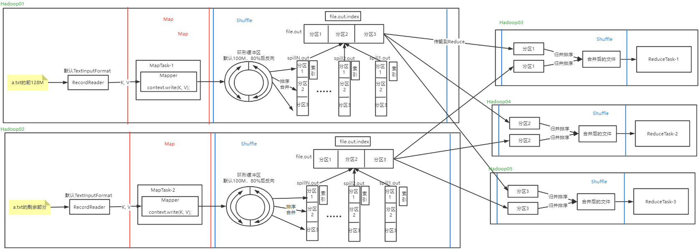

---

Created at: 2021-08-26
Last updated at: 2021-12-07

---

# 7-MapReduce之Shuffle

Yarn根据任务提交上来的切片计划，将Map任务分在Hadoop01 和 Hadoop02 上，Reduce任务分在Hadoop03 、Hadoop04 和 Hadoop05上。

Map的结果会先写到环形缓冲区，这个写的过程包含了 分区 操作。当环形缓冲区满了之后会写到磁盘文件中保存，这个写的过程包含 排序 操作。分区就是如果一个key-value键值对根据某个规则计算有相同的结果，那么在写到磁盘时会把这些k-v键值对保存到同一个分区中；排序就是保存到文件时会在分区内根据key的比较规则进行排序，如果用户有定义合并操作，那么在溢写时还会进行合并，一次溢写只会生成一个文件，所有分区都保存在这个文件中，靠索引文件来记录分区的信息。整个Map阶段可能会经历了多次溢写，也就是会产生多个溢写文件，这时还需要对多个溢写文件的每个分区进行归并排序生成一个大的排好序的文件，这步也会进行合并，所有的分区也都是保存在这个文件中，同样也是靠索引文件记录分区信息。让每个MapTask最终只生成一个数据文件，可避免同时打开大量文件和同时读取大量小文件产生的随机读取带来的开销。上述过程根据MapTask的数量可能会在多台Hadoop主机上进行，Reduce时每个ReduceTask负责一个分区，所以如果有多个分区，ReduceTask也有可能分布在多台主机上进行，ReduceTask的Shuffle阶段首先会从各台Map主机上拉取同一分区的文件，然后归并排序（如果内存不能存得下归并后的文件，那么还需借助磁盘存储），排完序后再进行Reduce。
所以，MapTask主机和ReduceTask主机都有shuffle阶段，Shuffle阶段得主要任务就是分区和排序，由于在MapTask主机和ReduceTask主机之间涉及数据得传输，所以MapTask主机的Shuffle阶段的最后可能还涉及对归并后文件的压缩，因为文件压缩可以提高传输效率，ReduceTask主机的Shuffle阶段的开始可能还涉及对传输过来的文件的解压缩。

注意：

1. 环形缓冲区左右两部分分别存储的是 元数据 和 <k,v> ，当到达80%之后就会直接从中间向两边开始反向写，所以称为环形缓冲区。
2. 缓冲区大小会影响到 MapReduce 程序的执行效率，原则上说，缓冲区越大，磁盘 io 的次数越少，执行速度就越快。
3. 缓冲区的大小可以通过参数调整，即：mapreduce.task.io.sort.mb 默认 100M。

