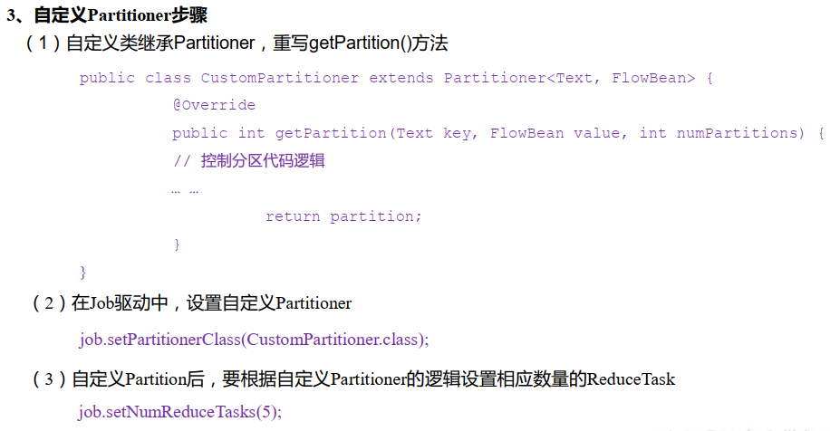
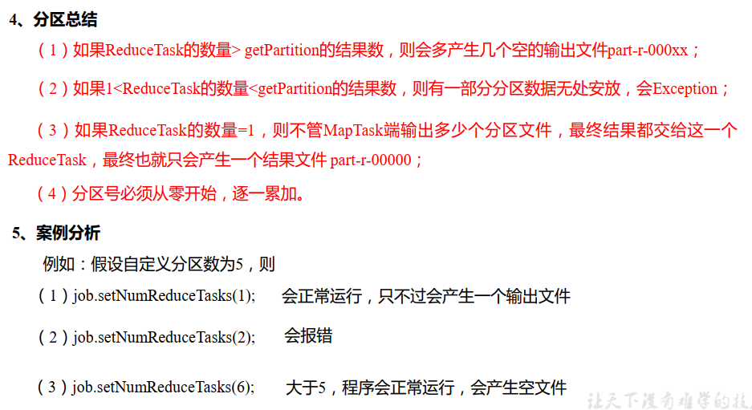

---

Created at: 2021-08-26
Last updated at: 2021-09-23
Source URL: about:blank


---

# 8-Shuffle之分区


如果不设置ReduceTask的数量，默认为1，此时分区也就只有一个。

MapTask类的706行是内部类环形缓冲区的构造方法，该构造方法会先于自定义的map()方法执行，也就是环形缓冲的创建先于map()方法的执行（MapTask类的runNewMapper()方法中，783行会先new NewOutputCollector()，然后执行800行mapper.run(mapperContext);，这个mapper.run()就是Mapper类的run方法，前面讲过这个run()方法是MapReduce的Map阶段的模板方法，由run方法调用map()方法），在构造方法中的712行是根据ReduceTask的数量决定分区数量，然后再根据分区数量决定partitioner，partitioner的getPartition()方法就是决定分区时调用的方法。自定义的map()方法最后的context.write()会调用partitioner的getPartition()方法，可以看出，分区是在Map向环形缓冲区写数据时就已经计算好，而不是等到溢写再计算。

如果不设置ReduceTask的数量，默认为1，此时分区也就只有一个，因为partitioner就是else中的匿名内部类，getPartition()方法永远返回0。所以当ReduceTask只有1个时，即使你在Driver里设置了分区方法所在的类job.setPartitionerClass(); partitioner也不会是你自定义的类，而是这个匿名内部类，分区永远只有1个。
```
NewOutputCollector(org.apache.hadoop.mapreduce.JobContext jobContext,
                   JobConf job,
                   TaskUmbilicalProtocol umbilical,
                   TaskReporter reporter
                   ) throws IOException, ClassNotFoundException {
  collector = createSortingCollector(job, reporter);
 `partitions = jobContext.getNumReduceTasks();`
  if (partitions > 1) {
    partitioner = (org.apache.hadoop.mapreduce.Partitioner<K,V>)
      ReflectionUtils.newInstance(`jobContext.getPartitionerClass()`, job);
  } else {
    partitioner = new org.apache.hadoop.mapreduce.Partitioner<K,V>() {
      @Override
      public int getPartition(K key, V value, int numPartitions) {
        return partitions - 1;
      }
    };
  }
}
```

在Driver类中可以设置ReduceTask的数量，比如设置ReduceTask的数量为2：job.setNumReduceTasks(2); 那么分区的数量也是2，于是就会走NewOutputCollector()方法中的else，new得到的partitioner其实是默认的HashPartitioner的实例，HashPartitioner的getPartition()方法如下，这是当ReduceTask数量大于1时默认的计算分区的方法，计算逻辑是用HashCode对numReduceTasks取余。
```
public int getPartition(K key, V value,
                        int numReduceTasks) {
  return (key.hashCode() & Integer.MAX_VALUE) % numReduceTasks;
}
```

我们也可以自定义计算分区的方法，在自定义分区方法中，可以任意指定分区计算的规则，不一定非得按key来计算，还可以按value来计算。自定义完后，需要设置分区方法所在的类 job.setPartitionerClass()，这样NewOutputCollector()方法中的else所new的Partitioner就是我们定义的对象了。


与 MapTask 的并发数由切片数决定不同， ReduceTask 数量是手动设置决定的，ReduceTask数量一般要与分区数量设置相同，所以可以说ReduceTask的并行度是由分区数量决定的（当然可以把ReduceTask 数量设置成与分区数量不一致，但这样出现上面说的问题）。

案例：继续前面的统计手机号流量的例子。
统计每一个手机号耗费的总上行流量、 总下行流量、总流量；并按手机号的归属地输出到不同的文件中去。

自定义分区方法：
```
public class ProvincePartitioner extends Partitioner<Text, FlowBean> {
    @Override
    public int getPartition(Text text, FlowBean flowBean, int numPartitions) {
        // text 是手机号
        String phone = text.toString();
        String prePhone = phone.substring(0, 3);
        int partition ;
        switch (prePhone) {
            case "136":
                partition = 0;
                break;
            case "137":
                partition = 1;
                break;
            case "138":
                partition = 2;
                break;
            case "139":
                partition = 3;
                break;
            default:
                partition = 4;
                break;
        }
        return partition;
    }
}
```

修改Driver类，主要是设置分区的类 job.setPartitionerClass(ProvincePartitioner.class); 和 ReduceTask的数量 job.setNumReduceTasks(5); ，ReduceTask的数量必须要与分区数一致。
```
public class FlowDriver {
    public static void main(String[] args) throws IOException, ClassNotFoundException, InterruptedException {
        // 1 获取job
        Configuration conf = new Configuration();
        Job job = Job.getInstance(conf);

        // 2 设置jar
        job.setJarByClass(FlowDriver.class);

        // 3 关联mapper 和Reducer
        job.setMapperClass(FlowMapper.class);
        job.setReducerClass(FlowReducer.class);

        // 4 设置mapper 输出的key和value类型
        job.setMapOutputKeyClass(Text.class);
        job.setMapOutputValueClass(FlowBean.class);

        // 5 设置最终数据输出的key和value类型
        job.setOutputKeyClass(Text.class);
        job.setOutputValueClass(FlowBean.class);

 `//设置分区方法所在的类`
 `job.setPartitionerClass(ProvincePartitioner.class);`
 `//设置ReduceTask的数量`
 `job.setNumReduceTasks(5);`

        //获取类路径
        String classPath = Thread.currentThread().getContextClassLoader().getResource("").getPath();
        System.out.println(classPath);

        // 6 设置数据的输入路径和输出路径
        FileInputFormat.setInputPaths(job, new Path(classPath + "/input/phone_data.txt"));
        FileOutputFormat.setOutputPath(job, new Path(classPath + "/output"));

        // 7 提交job
        boolean result = job.waitForCompletion(true);
        System.exit(result ? 0 : 1);
    }
}
```

Map、Reduce、自定义的序列化对象 的代码 和之前统计手机流量的例子一样。

