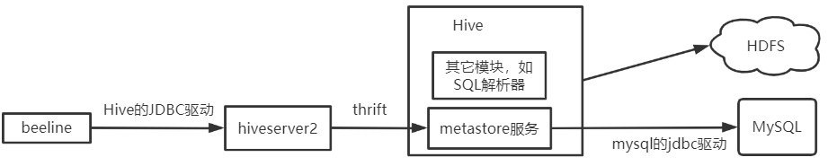

---

Created at: 2021-09-01
Last updated at: 2025-03-05


---

# 1-Hive安装配置


1.下载地址 https://dlcdn.apache.org/hive/hive-3.1.2/  ，目前这个版本不支持jdk8以下的版本，所以还是安装jdk8稳妥。
2.解压 tar -zxvf /opt/software/apache-hive-3.1.2-bin.tar.gz -C /opt/module/
3.重命名 mv /opt/module/apache-hive-3.1.2-bin /opt/module/hive-3.1.2
4\. 修改/etc/profile.d/my\_env.sh， 添加环境变量
    sudo vim /etc/profile.d/my\_env.sh
```
#HIVE_HOME
export HIVE_HOME=/opt/module/hive-3.1.2
export PATH=$PATH:$HIVE_HOME/bin
```
5\. 解决日志 Jar 包冲突
   mv $HIVE\_HOME/lib/log4j-slf4j-impl-2.10.0.jar $HIVE\_HOME/lib/log4j-slf4j-impl-2.10.0.bak
6\. 初始化元数据库 schematool -dbType derby -initSchema
    这里使用的是hive自带的默认数据库 derby，后面会改成使用mysql，使用 derby 初始化元数据库，会在当前执行的这条命令的目录下生成一个derby.log文件和一个metastore\_db目录，以后只能在这个目录下输入hive来启动Hive，并且只能开启一个Hive，因为 derby 不支持多个客户端访问，如果想开启多个Hive，那就再去其它目录重新初始化元数据库，然后再次输入hive命令来启动Hive。

7.在另一个终端中tail -f /tmp/jmoon/hive.log 实时查看Hive 的日志，比如接下来启动Hive时就会向这个日志文件中写数据，日志文件的位置可以修改。

8.启动Hive的命令是hive，然后就进入到了Hive的命令行，如果退出这个命令行也就关闭了Hive，从这点可以看出Hive默认的启动方式并不是客户端服务器的模式，也就是输入hive命令之后并没有在后台启动一个Hive服务，进入的命令行也不是一个独立的客户端进程，此时的Hive只是一个等待标准输入的前台进程，退出这个前台进程也就关闭了Hive。可以这样理解Hive默认的这个命令行只是一个等待标准输入的scanner。不像其它客户端-服务器架构的软件，在其它客户端-服务器架构的软件中，客户端和服务器是分离的两个软件（运行起来叫进程），靠网络或其它方式进行通信。
拿最常用的网络通信方式来说，服务器一般不作为前台进程，而是作为后台进程一直监听网络IO，客户端作为前台进程启动，通过网络发送数据到服务器，服务器接收数据然后处理。或者使用本地管道进行通信，这时客户端和服务器都应运行在同一台主机上，然后服务器仍是以后台进程的形式一直监听本地内存中的管道文件，客户端软件以前台进程的形式启动，然后向本地内存中的管道写数据，服务器这时就会接收到数据，然后进行处理。（管道应该不算是本地io的通信方式，因为io的意思是读写外部文件，只在内存中进行数据的读写不算io，读写磁盘或者网络中的文件才算io）。服务其实也可以作为前台进程开启，只不过你把前台关闭了之后服务也就关闭了，服务之所以称之为服务，是因为可以处理其它进程发过来的请求（不一定要先建立连接，比如DNS服务，DHCP服务）。
实现上可以让Hive开启一个服务，等待接收并处理客户端的请求。不过从Hive所做的工作来看，启动服务确实并不是必须的，因为Hive字是一个翻译SQL的，数据由HDFS管，元数据由数据库管，它的工作只是接收一条SQL，然后查数据库中的元数据，然后翻译成MR程序，最后交给Yarn调度运行，所以如果用户只是想执行一条sql的话，直接在前台提交给Hive就好了，但如果想实现应用程序与Hive交互那就必须让Hive启动服务了。

9.修改Hive日志存放的位置
Hive 的日志默认存放在/tmp/jmoon 即用户目录下， 可以把日志修改到 /opt/module/hive-3.1.2/logs 目录下：
9.1 将/opt/module/hive-3.1.2/conf/hive-log4j2.properties.template 文件名改成为hive-log4j2.properties
```
mv /opt/module/hive-3.1.2/conf/hive-log4j2.properties.template  /opt/module/hive-3.1.2/conf/hive-log4j2.properties
```
9.2  在 hive-log4j2.properties 文件中修改 log 存放位置
```
hive.log.dir=/opt/module/hive-3.1.2/logs
```

Hive 元数据配置到 MySQL：
1.在linux中安装mysql，或者使用Windows中已经安装好的mysql，本次使用的是Windows中的mysql
2.修改 mysql 库下的 user 表中的 root 用户允许任意 ip 连接
```
update mysql.user set host='%' where user='root';
flush privileges;
```
3.将 MySQL 的 JDBC 驱动拷贝到 Hive 的 lib 目录下
4.在mysql中新建 Hive的元数据库 create database metastore;
5.在$HIVE\_HOME/conf 目录下新建 hive-site.xml 文件并添加以下内容，hive是通过javax.jdo.option.ConnectionURL参数连接数据库的，默认是jdbc:derby:;databaseName=metastore\_db;create=true，也就是 derby
   vim $HIVE\_HOME/conf/hive-site.xml
```
<?xml version="1.0"?>
<?xml-stylesheet type="text/xsl" href="configuration.xsl"?>
<configuration>

   <!-- jdbc 连接的 URL -->
   <property>
       <name>javax.jdo.option.ConnectionURL</name>
       <value>jdbc:mysql://192.168.10.1:3306/metastore?serverTimezone=UTC&amp;characterEncoding=utf-8</value>
   </property>

   <!-- jdbc 连接的 Driver-->
   <property>
       <name>javax.jdo.option.ConnectionDriverName</name>
       <value>com.mysql.cj.jdbc.Driver</value>
   </property>

   <!-- jdbc 连接的 username-->
   <property>
       <name>javax.jdo.option.ConnectionUserName</name>
       <value>root</value>
   </property>

   <!-- jdbc 连接的 password -->
   <property>
       <name>javax.jdo.option.ConnectionPassword</name>
       <value>123456</value>
   </property>

   <!-- Hive 元数据存储版本的验证 -->
   <property>
       <name>hive.metastore.schema.verification</name>
       <value>false</value>
   </property>

   <!-- 元数据存储授权 -->
   <property>
       <name>hive.metastore.event.db.notification.api.auth</name>
       <value>false</value>
   </property>

   <!-- Hive 默认在 HDFS 的工作目录 -->
   <property>
       <name>hive.metastore.warehouse.dir</name>
       <value>/user/hive/warehouse</value>
   </property>

    <!-- 命令行提示符打印当前库名 -->
    <property>
        <name>hive.cli.print.header</name>
        <value>true</value>
    </property>

    <!-- 查询结果打印表名 -->
    <property>
        <name>hive.cli.print.current.db</name>
        <value>true</value>
    </property>

</configuration>
```

6\. 初始化 Hive 元数据库
   schematool -initSchema -dbType mysql -verbose
7\. 再次启动 Hive
    hive
8.Hive的简单操作
Hive命令行的简单操作：
show databases;
show tables;
create table test(id int); 创建表只是向mysql中的元数据库插入一条数据，不走MR。
insert into test values(1); 插入一台数据会走MR然后把数据写到HDFS里，并且也会向元数据库更新一些信息，比如表中有多少行。从这里可以看出元数据信息和HDFS中的数据其实是分离的，也就是说，我们可以直接hdfs dfs -put向HDFS中写数据，但这样元数据不会更新。
hive -e  可以不进入 hive 的交互窗口执行 sql 语句，比如：hive -e "select id from student;"
hive -f  执行脚本中 sql 语句
查看在 hive 中输入的所有历史命令： cat ~/hivehistory

开启Hive的服务，允许其它进程进行访问：
1.配置 metastore 服务，metastore 服务就是提供元数据信息的服务，也就是可以通过该服务获取Hive中创建的那些表的信息，该服务的通信是基于 thrift 的，thrift是一个RPC框架。配置metastore 服务后必须开启该服务，不然使用hive命令就会启动报错。
步骤：
在 hive-site.xml 文件中添加如下配置信息
```
<property>
    <name>hive.metastore.uris</name>
    <value>thrift://hadoop102:9083</value>
</property>
```
启动： hive --service metastore ，默认是前台启动，可以使用 hive --service metastore & 在后台启动服务

2.开启 hiveserver2 服务，开启 hiveserver2 后，客户端需要使用hive自己的jdbc驱动（应该就是这个/opt/module/hive-3.1.2/jdbc/hive-jdbc-3.1.2-standalone.jar）来连接到 hiveserver2 。

步骤：
```
<!-- 指定 hiveserver2 绑定的 host -->
<property>
    <name>hive.server2.thrift.bind.host</name>
    <value>hadoop102</value>
</property>

<!-- 指定 hiveserver2 绑定的端口号 -->
<property>
    <name>hive.server2.thrift.port</name>
    <value>10000</value>
</property>

<property>
    <name>hive.server2.enable.doAs</name>
    <value>false</value>
    <description>
      Setting this property to true will have HiveServer2 execute
      Hive operations as the user making the calls to it.
    </description>
</property>
```

启动： hive --service hiveserver2 ，同样默认是前台启动，可以使用 hive --service hiveserver2 & 在后台启动服务

这时就可以使用beeline客户端连接hiveserver2 了，不过再连接之前需要多等一会，然后才能连接成功
```
beeline -u jdbc:hive2://hadoop102:10000
```

可以编写一个脚本hiveservices.sh来完成以上两个服务的启动，需要注意的是如果在windows下编辑的话要把换行符调成Linux的换行符LF，然后再上传到~/bin/下，就可以直接使用hiveservices.sh start来启动了
```
#!/bin/bash

HIVE_LOG_DIR=$HIVE_HOME/logs

if [ ! -d $HIVE_LOG_DIR ]
then
    mkdir -p $HIVE_LOG_DIR
fi

#检查进程是否运行正常，参数 1 为进程名，参数 2 为进程端口
function check_process()
{
    pid=$(ps -ef 2>/dev/null | grep -v grep | grep -i $1 | awk '{print $2}')
    ppid=$(netstat -nltp 2>/dev/null | grep $2 | awk '{print $7}' | cut -d '/' -f 1)
    echo $pid
    [[ "$pid" =~ "$ppid" ]] && [ "$ppid" ] && return 0 || return 1
}

function hive_start()
{
    metapid=$(check_process HiveMetastore 9083)
    cmd="nohup hive --service metastore >$HIVE_LOG_DIR/metastore.log 2>&1 &"
    [ -z "$metapid" ] && eval $cmd || echo "Metastroe 服务已启动"
    server2pid=$(check_process HiveServer2 10000)
    cmd="nohup hiveserver2 >$HIVE_LOG_DIR/hiveServer2.log 2>&1 &"
    [ -z "$server2pid" ] && eval $cmd || echo "HiveServer2 服务已启动"
}

function hive_stop()
{
    metapid=$(check_process HiveMetastore 9083)
    [ "$metapid" ] && kill $metapid || echo "Metastore 服务未启动"
    server2pid=$(check_process HiveServer2 10000)
    [ "$server2pid" ] && kill $server2pid || echo "HiveServer2 服务未启动"
}

case $1 in
"start")
    hive_start
    ;;
"stop")
    hive_stop
    ;;
"restart")
    hive_stop
    sleep 2
    hive_start
    ;;
"status")
    check_process HiveMetastore 9083 >/dev/null && echo "Metastore 服务运行正常" || echo "Metastore 服务运行异常"
    check_process HiveServer2 10000 >/dev/null && echo "HiveServer2 服务运行正常" || echo "HiveServer2 服务运行异常"
    ;;
*)
    echo Invalid Args!
    echo 'Usage: '$(basename $0)' start|stop|restart|status'
;;
esac
```

