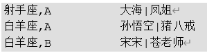

---

Created at: 2021-10-27
Last updated at: 2021-10-27


---

# 10-UDAF函数


常用的UDAF函数有：count、max、min、sum、avg，还有两个：
**COLLECT\_SET(col)**：是一个聚集函数，作用是把group by 分组后的一个列的所有值去重汇总形成一个ARRAY。
**COLLECT\_LIST(col)**：与COLLECT\_SET()一样是一个聚集函数，唯一的区别在于不去重。

案例：
表：
```
create table person_info(
    name string,
    constellation string,
    blood_type string
)row format delimited fields terminated by "\t";
```
数据：
```
孙悟空    白羊座    A
大海    射手座    A
宋宋    白羊座    B
猪八戒    白羊座    A
凤姐    射手座    A
苍老师    白羊座    B
```
导入到hive
```
load data local inpath "/opt/module/data/person_info.txt" into table person_info;
```
需求：把星座和血型一样的人归类到一起，结果如下：

HQL：
```
select concat(constellation, ',', blood_type), concat_ws('|', `collect_set`(name))
from person_info
group by constellation,blood_type;
```

