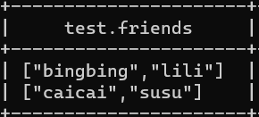
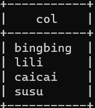
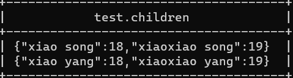
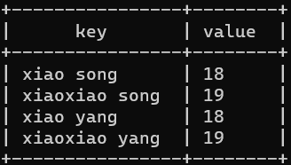
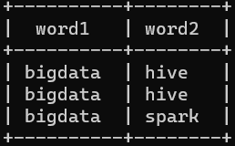

---

Created at: 2021-10-27
Last updated at: 2025-03-05
Source URL: https://yuanbao.tencent.com/chat/naQivTmsDa/c6983595-c89d-4537-a2f3-0cf9ae7e341a


---

# 11-UTDF 之 explode函数 和 LATERAL VIEW


**EXPLODE(col)**：把array类型的数据拆分成多行，把map类型的数据拆分成多行多列，
比如array类型的数据：

```
select explode(friends) from test;
```


比map类型的数据：

```
select explode(children) from test;
```


explode案例1：完成wordcount
数据
```
a       a       a
b       b       b
c       cc      ccc
```
表：
```
create table word(key string);
```
HQL：
```
insert overwrite local directory '/opt/module/data/wordcount'
select t.w,count(*)
from(select explode(split(key,'\t')) w from word) t
group by t.w;
```

explode案例2：把以下数据按指定格式输出
数据
```
bigdata,hive:bigdata,hive
bigdata,spark
```
输出格式：

建表：
```
create table word(key string);
```
HQL：
```
select split(t.w,',')[0] word1, split(t.w,',')[1] word2
from (select explode(split(key,':')) w from word) t;
```

**LATERAL VIEW** **EXPLODE**
然而还有很多需求在使用explode的同时需要输出其它列，但explode之后行就变多了，而其它列的行数并没有变，还是一行，这时就需要 lateral view 子句来帮忙（lateral view子句是专门用来帮助explode，应该不能单独使用）。
侧面视图的语法： LATERAL VIEW udtf(expression) tableAlias AS columnAlias
因为UDTF函数炸裂的结果包含多行多列，所以这个结果可以看作是一张表，tableAlias就是这个表的别名，columnAlias就这张表的每一列的别名，所以如果结果有多列，那么columnAlias就需要写多个，如果不写columnAlias，那么就是默认的列名（自定义UDTF在initialize方法的返回值中指定了）。

比如这个案例：
有如下数据，电影名及其对应的类型：
```
《疑犯追踪》    悬疑,动作,科幻,剧情
《Lie to me》    悬疑,警匪,动作,心理,剧情
《战狼 2》    战争,动作,灾难
```
表创建的语句如下，注意电影的类型不是array：
```
create table movie_info(
    movie string,
    category string
)row format delimited fields terminated by "\t";
```
需要将数据展开成这样，方便对每一种类型的电影进行统计：
```
《疑犯追踪》    悬疑
《疑犯追踪》    动作
《疑犯追踪》    科幻
《疑犯追踪》    剧情
《Lie to me》    悬疑
《Lie to me》    警匪
《Lie to me》    动作
《Lie to me》    心理
《Lie to me》    剧情
《战狼 2》    战争
《战狼 2》    动作
《战狼 2》    灾难
```
由于不仅需要将category展开，还要与movie列连接在一起，这时就需要lateral view 来帮忙了：
```
select movie, category_name
from movie_info
lateral view explode(split(category,",")) category_lateral as category_name;
```

如果
```
select *
from movie_info
lateral view explode(split(category,",")) category_lateral as category_name
where movie != '《战狼 2》';
```
结果是这样的，注意列名，不要想着lateral view explode把表原来的那一列炸开了，而应该这样思考，lateral view explode是形成了一张新表，然后与原来的表做连接，原来表的列没有变化，新表也有自己的列。
```
+-------------------+----------------------+---------------------------------+
| movie_info.movie  | movie_info.category  | category_lateral.category_name  |
+-------------------+----------------------+---------------------------------+
| 《疑犯追踪》            | 悬疑,动作,科幻,剧情          | 悬疑                              |
| 《疑犯追踪》            | 悬疑,动作,科幻,剧情          | 动作                              |
| 《疑犯追踪》            | 悬疑,动作,科幻,剧情          | 科幻                              |
| 《疑犯追踪》            | 悬疑,动作,科幻,剧情          | 剧情                              |
| 《Lie to me》       | 悬疑,警匪,动作,心理,剧情       | 悬疑                              |
| 《Lie to me》       | 悬疑,警匪,动作,心理,剧情       | 警匪                              |
| 《Lie to me》       | 悬疑,警匪,动作,心理,剧情       | 动作                              |
| 《Lie to me》       | 悬疑,警匪,动作,心理,剧情       | 心理                              |
| 《Lie to me》       | 悬疑,警匪,动作,心理,剧情       | 剧情                              |
+-------------------+----------------------+---------------------------------+
```

还可以连续使用lateral view explode，因为是原表与新表做连接，所以函数会成倍增加：
```
select *
from movie_info
lateral view explode(split(category,",")) e1 as col1
lateral view explode(split(category,",")) e2 as col2
where movie == '《疑犯追踪》';
```
```
+-------------------+----------------------+----------+----------+
| movie_info.movie  | movie_info.category  | e1.col1  | e2.col2  |
+-------------------+----------------------+----------+----------+
| 《疑犯追踪》            | 悬疑,动作,科幻,剧情          | 悬疑       | 悬疑       |
| 《疑犯追踪》            | 悬疑,动作,科幻,剧情          | 悬疑       | 动作       |
| 《疑犯追踪》            | 悬疑,动作,科幻,剧情          | 悬疑       | 科幻       |
| 《疑犯追踪》            | 悬疑,动作,科幻,剧情          | 悬疑       | 剧情       |
| 《疑犯追踪》            | 悬疑,动作,科幻,剧情          | 动作       | 悬疑       |
| 《疑犯追踪》            | 悬疑,动作,科幻,剧情          | 动作       | 动作       |
| 《疑犯追踪》            | 悬疑,动作,科幻,剧情          | 动作       | 科幻       |
| 《疑犯追踪》            | 悬疑,动作,科幻,剧情          | 动作       | 剧情       |
| 《疑犯追踪》            | 悬疑,动作,科幻,剧情          | 科幻       | 悬疑       |
| 《疑犯追踪》            | 悬疑,动作,科幻,剧情          | 科幻       | 动作       |
| 《疑犯追踪》            | 悬疑,动作,科幻,剧情          | 科幻       | 科幻       |
| 《疑犯追踪》            | 悬疑,动作,科幻,剧情          | 科幻       | 剧情       |
| 《疑犯追踪》            | 悬疑,动作,科幻,剧情          | 剧情       | 悬疑       |
| 《疑犯追踪》            | 悬疑,动作,科幻,剧情          | 剧情       | 动作       |
| 《疑犯追踪》            | 悬疑,动作,科幻,剧情          | 剧情       | 科幻       |
| 《疑犯追踪》            | 悬疑,动作,科幻,剧情          | 剧情       | 剧情       |
+-------------------+----------------------+----------+----------+
```

**LATERAL VIEW POSEXPLODE**
将数组或Map的每个元素展开为一行，同时输出元素值和其在原数组中的下标（从0开始）。与EXPLODE的区别是，EXPLODE仅展开元素值，而POSEXPLODE额外提供位置信息。
```
-- 原始表结构：id INT, items ARRAY<STRING>
SELECT id, itemIndex, item
FROM array_table
LATERAL VIEW POSEXPLODE(items) e AS itemIndex, item;
```
```
id | itemIndex | item
1  | 0         | apple
1  | 1         | banana
2  | 0         | watermelon
...
```
所以如果需要同时拆分多个列并保持元素对应关系，那么就要用POSEXPLODE（带索引的拆分）并关联索引：
```
SELECT t1_col, t2_col
FROM main_tbl
LATERAL VIEW POSEXPLODE(array1) t1 AS idx1, t1_col
LATERAL VIEW POSEXPLODE(array2) t2 AS idx2, t2_col
WHERE idx1 = idx2;
```

**LATERAL VIEW OUTER**
处理空值：当被拆分的列为空（NULL或空数组）时，默认LATERAL VIEW会丢弃该行。使用OUTER关键字可保留原行，拆分后的字段值为NULL。
```
SELECT id, item
FROM array_table
LATERAL VIEW OUTER EXPLODE(items) tmp AS item;
```
此时即使items为空，id仍会出现在结果中，item为NULL。

