---

Created at: 2021-09-03
Last updated at: 2022-07-23
Source URL: https://cwiki.apache.org/confluence/display/Hive/LanguageManual+WindowingAndAnalytics#LanguageManualWindowingAndAnalytics-WINDOWclause


---

# 14-窗口


SQL语句执行的过程是：
```
1.from
2.where
3.group by
4.having
5.select
6.order by
7.limit
```
select中的开窗可以对where或者having过滤之后的数据再次进行统计。

开窗的函数是over()，没有开窗的时候，在没有分组的情况下，select后面聚集函数是不能和非分组字段在一起的，但是使用开窗函数之后就不是了，因为对于每一行，聚集函数都会在开窗里计算一个结果。
over见名知意，在，聚集函数在窗口里面计算结果，其实over前面不光可以是聚集函数，也可是其它功能的函数：
第一种是聚合函数

* COUNT()
* SUM()
* MIN()
* MAX()
* AVG()

第二种是窗口函数

* LAG(col,n,default\_val)：往前第 n 行的col列的数据，没有就是default\_val
* LEAD(col,n, default\_val)：往后第 n 行的col列的数据，没有就是default\_val
* FIRST\_VALUE(col,\[boolean\])：选择col列的第一个数据，第二个参数可选，默认是false，表示不跳过null值，如果设置为true，表示跳过null值
* LAST\_VALUE(col,\[boolean\])：选择col列的最后一个数据，第二个参数可选，默认是false，表示不跳过null值，如果设置为true，表示跳过null值

第三种是分析函数

* RANK()：排序相同时会重复，总数不会变
* DENSE\_RANK()：排序相同时会重复，总数会减少
* ROW\_NUMBER()：按行数计算
* NTILE(n)：把分区中的数据分成n等分，然后返回当前行在哪一等分中

其中，第二种和第三种只能和开窗一起使用。

over中的语句可以有如下几种，任意搭配有不同的效果：

* partition by
* order by
* rows between xxx and xxx

其中rows between xxx and xxx 的xxx可以是

* CURRENT ROW：当前行
* n PRECEDING：往前 n 行到当前行的数据
* n FOLLOWING：当前行到往后 n 行的数据
* UNBOUNDED PRECEDING  最前面的起点
* UNBOUNDED FOLLOWING 最后面的终点

注：over()中也可以使用distribute by 和 sort by，不过distribute by只能和 sort by在一起用，不能有distribute by order by 和 partition by sort by 这样的搭配。

比如常见典型用法：

* over()：where或者having过滤之后的数据作为一个分区，下面就都不提where或者having过滤的事了，因为开窗本来就是select中执行的，也就是在where和having过滤之后的数据中执行，为了方便，把where或者having过滤后的数据称为整张表
* over(order by)：整张表排序之后作为一个分区，使用聚集函数时是一种累加的效果，因为不加 rows between and 默认是 rows between unbounded preceeding and current row，也就是起始行到当前行为一组
* over(partition by)：把整张表再次分区
* over(rows between xxx and xxx)：整张表作为一个分区，计算时是以当前行 为基准的前后xxx行
* over(partition by order by)：分区并排序
* over(partition by rows between xxx and xxx)：分区后，计算时是以当前行 为基准的前后xxx行
* over(partition by order by rows between xx and xx)：分区排序后，计算时是以当前行 为基准的前后xxx行

总结一下：

* over()前面的开窗函数计算的范围是当前行所在分区的rows between xxx and xxx
* 不加partition by 等于整张表作为一个分区，也是整张表作为一组；
* 加了partition by 不加 order by 和 rows between and，整张表被分成多个分区，每个分区作为一组计算，因为不加 order by 和 rows between and的效果默认是在分区内rows between unbounded preceeding and unbounded following
* 加了partition by 和 order by，不加 rows between and，整张表被分成多个分区，分区内是起始行到当前行为一组计算，因为只加order by不加rows between and的默认效果是在分区内rows between unbounded preceeding and current row，也就是起始行到当前行为一组。
* 加了rows between and，就是rows between and，你指定的范围作为一组。

over()里面的分区排序对最后的结果有影响，意思是如果over()里面有partition by或者order by，那么最后的输出的结果也被分区和排序了，over()前面的函数就是在这个结果上计算得到的。

总结：

* 只加order by不加rows between and的默认效果是在分区内rows between unbounded preceeding and current row，也就是起始行到当前行为一组。
* 不加order by不加rows between and是整个分区。
* 加rows between and就是你表达的意思。

案例：
数据：
```
jack,2017-01-01,10
tony,2017-01-02,15
jack,2017-02-03,23
tony,2017-01-04,29
jack,2017-01-05,46
jack,2017-04-06,42
tony,2017-01-07,50
jack,2017-01-08,55
mart,2017-04-08,62
mart,2017-04-09,68
neil,2017-05-10,12
mart,2017-04-11,75
neil,2017-06-12,80
mart,2017-04-13,94
```
表：
```
create table business(
    name string,
    orderdate string,
    cost int
)ROW FORMAT DELIMITED FIELDS TERMINATED BY ',';
```

需求
（1）查询在 2017 年 4 月份购买过的顾客及总人数（不是该顾客的消费次数）
```
select name,count(*) over()
from business
where substr(orderdate,1,7)='2017-04'
group by name;
```
结果，有mart和jack两个人，所以结果是2，并不是指每个人消费的总记录数，并且从结果中可以知道，group by之后使用开窗并不是在group by的分组里计算，而是在select了group by的结果之后，在再此结果上开窗：
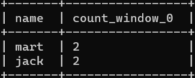

不过可以查询一下2017 年 4 月份购买过的顾客及其消费的总记录数：
```
SELECT NAME,COUNT(*) AS '消费次数'
FROM business
WHERE SUBSTR(orderdate,1,7)='2017-04'
GROUP BY NAME;
```
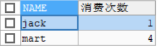
MySQL中同样支持开窗，如果用开窗的效果：
```
SELECT NAME,COUNT(*) OVER(PARTITION BY NAME) AS '消费次数'
FROM business
WHERE SUBSTR(orderdate,1,7)='2017-04'
```
可见开窗是在select的每一行结果上做聚合计算：
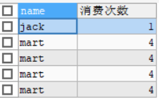

（2）查询顾客的购买明细及每个月的购买总额
```
SELECT NAME,orderdate,cost,SUM(cost) OVER(PARTITION BY NAME,MONTH(orderdate)) AS '当月的消费总额'
FROM business;
```
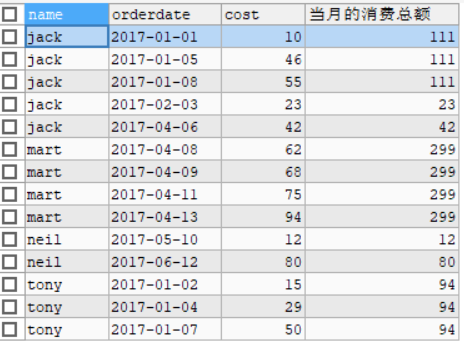

（3）上述的场景,  将每个顾客的 cost 按照日期进行累加
```
SELECT name,cost,SUM(cost) OVER(PARTITION BY name ORDER BY (orderdate))
FROM business
```
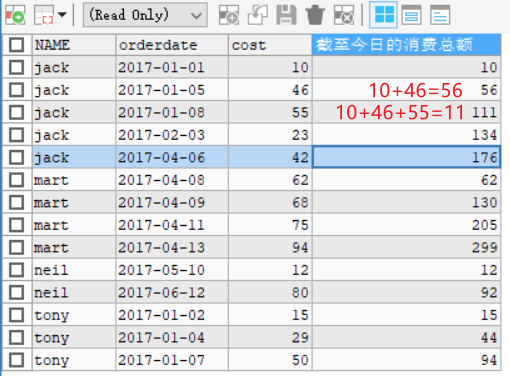

（4）查询每个顾客上次的购买时间
```
SELECT NAME,orderdate,cost,LAG(orderdate,1,NULL) OVER(PARTITION BY NAME ORDER BY orderdate) AS '上次购买的日期'
FROM business;
```
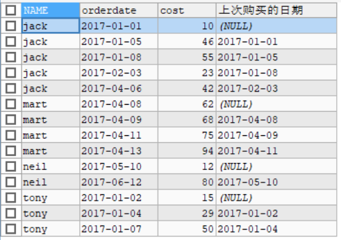

（5）查询前 20%时间的订单信息
先把数据分成5等分：
```
SELECT NAME,orderdate,cost,NTILE(5) OVER(ORDER BY orderdate) AS '第几等分'
FROM business;
```
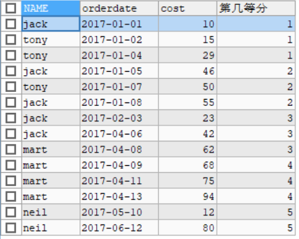
然后取第一等分的数据，也就是前20%的数据：
```
SELECT t.name,t.orderdate,t.cost
FROM (
    SELECT NAME,orderdate,cost,NTILE(5) OVER(ORDER BY orderdate) AS portion
    FROM business
) t
WHERE t.portion=1
```
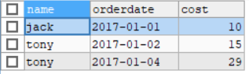

然后是以下三个行数的案例：

* RANK()：排序相同时会重复，总数不会变
* DENSE\_RANK()：排序相同时会重复，总数会减少
* ROW\_NUMBER()：按行数计算

数据：
```
孙悟空    语文    87
孙悟空    数学    95
孙悟空    英语    68
大海    语文    94
大海    数学    56
大海    英语    84
宋宋    语文    64
宋宋    数学    86
宋宋    英语    84
婷婷    语文    65
婷婷    数学    85
婷婷    英语    78
```
表：
```
create table score(
    name string,
    subject string,
    score int
)row format delimited fields terminated by "\t";
```

需求：按成绩排序
```
SELECT *,RANK() OVER(PARTITION BY `subject` ORDER BY score desc) AS '单科排名'
FROM score;
```
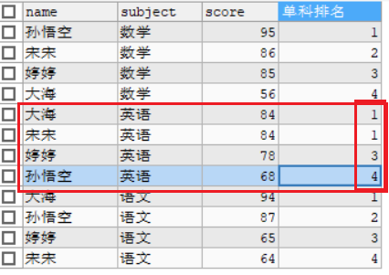
```
SELECT *, DENSE_RANK() OVER(PARTITION BY `subject` ORDER BY score DESC) AS '单科排名'
FROM score;
```
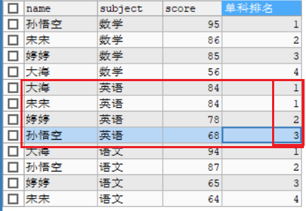
```
SELECT *, ROW_NUMBER() OVER(PARTITION BY `subject` ORDER BY score DESC) AS '单科排名'
FROM score;
```
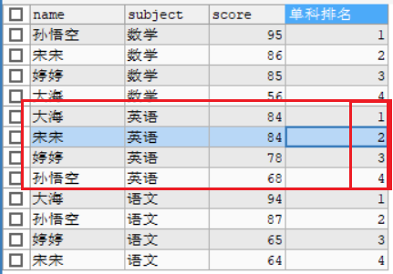

求出每门学科前三名的学生
```
SELECT *
FROM(
    SELECT *, ROW_NUMBER() OVER(PARTITION BY `subject` ORDER BY score DESC) AS `rank`
    FROM score
) t
WHERE t.rank<=3;
```
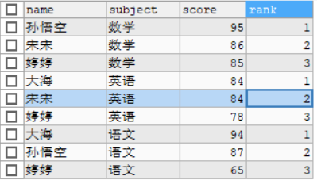

注意：数据相同行开窗的结果相同
以下数据
```
CREATE TABLE test(num INT);
```
```
1
2
3
3
4
5
```
然后
```
select sum(num) over(order by num)
from test;
```
开窗的结果是
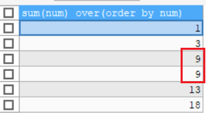
也就是说相同行开窗计算的结果是一样的。

