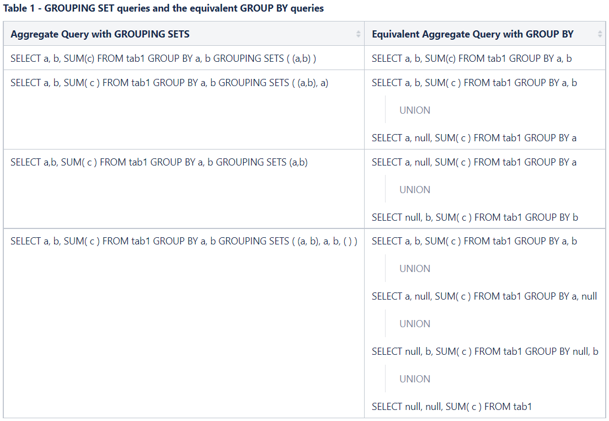
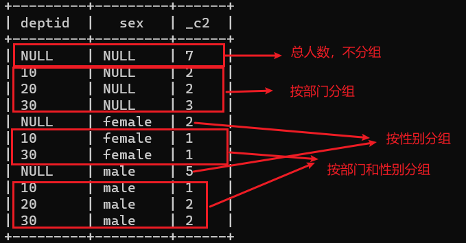

---

Created at: 2021-10-27
Last updated at: 2021-10-27


---

# 15-grouping sets子句


不常用，不重要。
grouping sets：在group by 后面使用grouping\_set，等价于将多个group by的结果union起来


案例：
表：
```
create table staff(
   id int,
   name string,
   sex string,
   deptid int
)row format delimited fields terminated by ",";
```
数据：
```
1001,zhangsan,male,10
1002,lisi,female,10
1003,wangwu,male,20
1004,zhaoliu,male,20
1005,tianqi,male,30
1006,sunba,female,30
1007,qianjiu,male,30
```

查询每个部门两种性别各有多少人（按部门和性别分组），所有部门中两种性别各有多少人（按性别分组），每个部门有多少人（按部门分组），一共有多少人（不分组，或者说所有部门作为一组）。一个SQL查询得到结果：
```
select deptid,sex,count(*) num
from staff
group by deptid,sex
grouping sets((deptid,sex),sex,deptid,());
```


