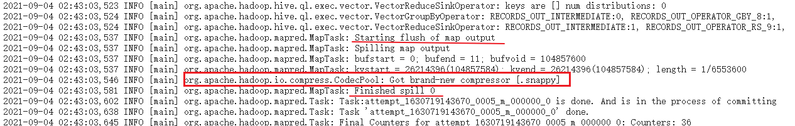
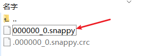

---

Created at: 2021-09-04
Last updated at: 2021-10-27


---

# 17-压缩


压缩方式等内容见hadoop有关压缩的笔记：[17-压缩](17-压缩)

开启 Map 输出阶段压缩（MR 引擎），可以减少 job 中 map 和 Reduce task 间数据传输量。
在会话中开启 map 输出阶段压缩，操作如下：
（1）开启 hive 中间传输数据压缩功能
```
set hive.exec.compress.intermediate=true;
```
（2）开启 mapreduce 中 map 输出压缩功能
```
set mapreduce.map.output.compress=true;
```
（3）设置 mapreduce 中 map 输出数据的压缩方式
```
set mapreduce.map.output.compress.codec=org.apache.hadoop.io.compress.SnappyCodec;
```
（4）执行查询语句，在map输出端开启压缩只能在日志中看到效果，所以可以先不开启压缩执行一遍，然后再开启执行一遍，对比两次的日志，在历史服务器中可以看到日志。
```
select count(ename) name from emp;
```
开启压缩之后的日志，没有开启压缩是没有这一行的：


开启 Reduce 输出阶段压缩，可以以压缩文件的方式保存查询结果。
操作过程：
（1）开启 hive 最终输出数据压缩功能
```
set hive.exec.compress.output=true;
```
（2）开启 mapreduce 最终输出数据压缩
```
set mapreduce.output.fileoutputformat.compress=true;
```
（3）设置 mapreduce 最终数据输出压缩方式
```
set mapreduce.output.fileoutputformat.compress.codec=org.apache.hadoop.io.compress.SnappyCodec;
```
（4）设置 mapreduce 最终数据输出压缩为块压缩，默认是RECORD，以记录为单位压缩。
```
set mapreduce.output.fileoutputformat.compress.type=BLOCK;
```
（5）测试一下输出结果是否是压缩文件
```
insert overwrite local directory '/opt/module/data/distribute-result'
select * from emp distribute by deptno sort by empno desc;
```


