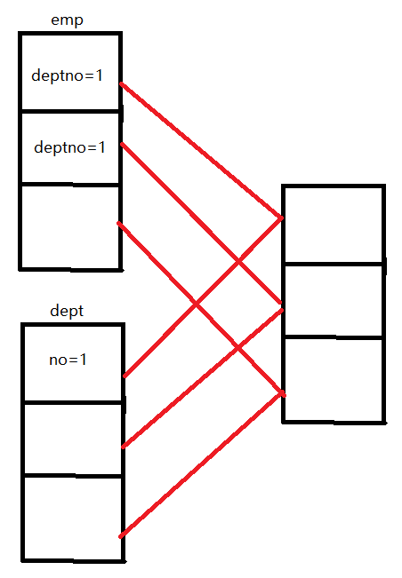
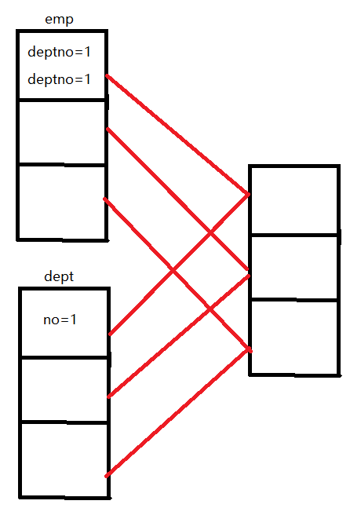

---

Created at: 2021-09-04
Last updated at: 2022-07-24


---

# 18-优化


1.执行计划
查看执行计划：explain
查看详细的执行计划：explain extended

2.Fetch 抓取
Fetch 抓取是指Hive对一些简单的查询可以不必使用 MapReduce 计算。例如：SELECT\* FROM employees;在这种情况下，Hive 可以简单地读取 employee 对应的存储目录下的文件， 然后输出查询结果到控制台。
什么是简单的查询呢？见配置文件中的描述，目前简单查询语句是指没有任何子查询、没有任何聚集函数、没有distinct、没有lateral view、没有join的语句。
在 hive-default.xml.template 文件中 hive.fetch.task.conversion 默认是 more。指定为none则所有简单查询都会走MR；指定为minimal，则只有select \*、用分区字段过滤、limit的简单查询才不走MR，其它简单查询均会走MR；指定为more，则简单查询（支持简单的抽样查询和虚拟列查询）均不会走MR。
```
<property>
    <name>hive.fetch.task.conversion</name>
    <value>more</value>
    <description>
      Expects one of [none, minimal, more].
      Some select queries can be converted to single FETCH task minimizing latency.
      Currently the query should be single sourced not having any subquery and should not have
      any aggregations or distincts (which incurs RS), lateral views and joins.
      0. none : disable hive.fetch.task.conversion
      1. minimal : SELECT STAR, FILTER on partition columns, LIMIT only
      2. more    : SELECT, FILTER, LIMIT only (support TABLESAMPLE and virtual columns)
    </description>
  </property>
```

3.本地模式
没有开启本地模式时，所有任务都会提交给yarn来调度执行，开启本地模式之后，hive会先判断查询的数据量大不大，如果不大就直接在本地运行，不提交给yarn。
```
//开启本地 mr，默认是关闭的
set hive.exec.mode.local.auto=true;
//设置 local mr 的最大输入数据量，当输入数据量小于这个值时采用 local mr 的方式，默认为 134217728，即 128M
set hive.exec.mode.local.auto.inputbytes.max=50000000;
//设置 local mr 的最大输入文件个数，当输入文件个数小于这个值时采用 local mr 的方式，默认为 4
set hive.exec.mode.local.auto.input.files.max=10;
```

4.优化大表和小表的join
4.1 开启 MapJoin
(1)开启 Map join，默认就是 true
```
set hive.auto.convert.join = true;
```
(2)大表小表的阈值设置（默认 25M 以下认为是小表）：
```
set hive.mapjoin.smalltable.filesize = 25000000;
```

4.2  空 key 过滤。key是指map阶段输出结果中的key，在join时，on后面做连接的字段就是map输出中的key。比如拿左连接来说，由于需要保留左边表的所有数据，如果左边表做连接的字段有大量的null值，这些null值所在的行在连接时是会保留下来的，又如果包含这些null值的行我们本来不想要，那么这时就应该先过滤掉这些null值所在的行，然后再做连接。right join和full join情况类似。在做内连接时，如果连接的字段是null，那么该行的数据会直接丢弃，不会参与连接的计算，所以不需要考虑先空 key 过滤。
```
select n.*
from (select * from nullidtable where id is not null) n
left join bigtable o
on n.id = o.id;
```

4.3  空 key 转换。空 key 过滤是当做连接的字段是null，并且这些数据本来就是我们不想要的，那么应该先过滤掉这些数据。而当这些null值所在行的数据我们还想要，那么这时我们就需要考虑数据倾斜的问题了，因为具有相同key值的数据是一定会进入到同一个reduce中的，如果当key是null的数据有很多，那么就会造成拉取null值的reduce数据倾斜，这时我们就可以采取空 key 转换的手段来优化，具体做法是把null值用一个随机值来替换，这样就可以把这些数据分散到不同的reduce中去了。注意，分配随机值要保证原来join不上的null值现在还是join不上。
```
select n.*
from nullidtable n
full join bigtable o
on nvl(n.id,rand()) = o.id;
```

5.使用分桶表来优化两张大表的join
我们知道把两张大表分成几张小表之后分开join，然后把所有结果合并起来的得到的最终结果是错误（如左图所示），但是对于分桶表而言，我们可以把两张都建成分桶表，分桶的字段就是做连接的字段，这样在两张表中连接字段相同的数据一定同一个桶中，于是把小表分开join，然后把结果合并起来得到的最终结果就是正确的（如右图所示），此方式其实就是Hash join，只不过是在保存数据时就提前做好了hash，这样就可以在Map端的多个map中完成每两个桶的join，然后只在一个Reduce中完成结果的聚合。
                         

6.优化group by
如果使用了set mapreduce.job.reduces设置reduce的个数，那么使用group by就会开启相应个数的reduce来计算（但目前为止，好像设置reduce的个数只对order by与count(distinct)两种情况无效，无论设置多少个，它俩的reduce个数都是1，其它语句都是设置多少个开就多少reduce，如果设置为默认值-1，那么hive就会根据后面要讲的式子计算得到）。
与join on做连接的字段会被作为map阶段输出结果中key一样，group by的字段也会被当作key，由于key相同的数据一定会进到同一个reduce中进行处理，当某一个或几个key的数据量太大时，同样有数据倾斜的问题，会造成部分reduce任务执行的时间过长。
两种优化手段，这两个优化手段通常是一起开启：
6.1  开启 Map 端聚合
设置开启 Map 端聚合，默认为true即开启
```
set hive.map.aggr=true
```
设置在 Map 端进行聚合操作的条目数目
```
set hive.groupby.mapaggr.checkinterval=100000;
```

6.2 开启负载均衡，默认为false，没有开启
```
set hive.groupby.skewindata=true;
```
负载均衡是指，当同一key的数据量过多时，会在key后面拼接一些随机数，这样原本相同的key就会进到不同的reduce中去了。但是这样会导致算出来的结果不对，所以还需要再来一个job，即再进行一次MapReduce，这次是把前一个job的结果的key的随机数去掉，然后reduce得到最终正确的结果。

7.优化count(distinct)
由于count(distinct)操作只能用一个 ReduceTask 来完成，当数据量很大时，一个 Reduce 需要处理的数据量太大，会导致这个 Job 很难完成。比如下面这条SQL，即使设置reduce的个数为5，最后也只会启动一个reduce来完成，因为涉及去重操作。（如果bigtable是张分桶表，当count(distinct(field))的field和分桶的字段相同时，理论上可以启动多个reduce来完成，每个reduce负责一个桶，但实际hive并没实现。）
```
set mapreduce.job.reduces = 5;
```
```
select count(distinct id) from bigtable;
```
优化的方法是用先 GROUP BY 再 COUNT 的方式来替换count(distinct)
```
select count(id) from (select id from bigtable group by id) a;
```
这样就会开两个job来完成任务。第一个job会开启5个reduce来完成select id from bigtable group by id，因为设置的reduce的个数是5，id相同的数据进到同一个reduce，同一个reduce里面可以有多个不同的id。第二个job只会有一个reduce，因为要完成count(id)。当然在使用 group by时要考虑数据倾斜的问题。

8.行列过滤
列处理：在 SELECT 中，只拿需要的列，如果有分区，尽量使用分区过滤，少用 SELECT \*。
行处理：虽然有谓词下推，但谓词下推可能会在复杂的SQL语句中失效，所以尽量在连接时先过滤掉一部分数据，然后再join。

9\. 合理设置 Map 及 Reduce 数

合理设置MapTask的数量：
1.MapTask的个数由切片数量决定，所以可以设置最大切片的大小来控制切片数量，以下是默认值。
```
mapreduce.input.fileinputformat.split.maxsize=256000000;
```
2.对小文件进行合并
map端输入时对小文件进行合并可以减少MapTask的数量，CombineHiveInputFormat 具有对小文件进行合并的功能，也是系统默认的输入类型。HiveInputFormat 没有对小文件合并功能。
```
set hive.input.format = org.apache.hadoop.hive.ql.io.CombineHiveInputFormat;
```

附：设置在 Map-Reduce 的任务结束时对小文件进行合并，这不属于调整MapTask数量的优化
在 map-only 任务（没有reduce的任务）结束时合并小文件，默认 true
```
set hive.merge.mapfiles = true;
```
在 map-reduce 任务结束时合并小文件，默认 false
```
set hive.merge.mapredfiles = true;
```
设置合并文件的大小，默认 256M
```
set hive.merge.size.per.task = 268435456;
```
设置小文件的平均大小，当输出文件大小小于该值时，启动一个独立的 map-reduce 任务进行文件 merge  
```
set hive.merge.smallfiles.avgsize = 16777216;
```

合理设置ReduceTask的数量：
目前为止，好像设置reduce的个数只对order by与Count(Distinct)两种情况无效，无论设置多少个，它俩的reduce个数都是1，其它语句都是根据方法二设置的多少个开就多少reduce，如果为默认值-1，那么hive就会根据下面的方法一计算得到。

调整reduce个数方法一，只在set mapreduce.job.reduces = -1时生效：
（1）设置每个 Reduce 处理的数据量默认是 256MB
```
hive.exec.reducers.bytes.per.reducer=256000000
```
（2）设置每个任务最大的 reduce 数，默认为 1009
```
hive.exec.reducers.max=1009     
```
reduce的个数由以上两个参数以及map端输出数量量共同决定，计算公式如下：
```
N=min(参数2，总输入数据量/参数1)
```

调整reduce个数方法二：
在 hadoop 的 mapred-default.xml 文件中修改，或者在hive会话中设置每个 job 的 Reduce 个数：
```
set mapreduce.job.reduces = 15;
```

reduce 个数并不是越多越好：
（1）过多的启动和初始化 reduce 也会消耗时间和资源；
（2）另外，有多少个 reduce，就会有多少个输出文件，如果生成了很多个小文件，那 么如果这些小文件作为下一个任务的输入，则也会出现小文件过多的问题；
在设置 reduce 个数的时候也需要考虑这两个原则：处理大数据量利用合适的 reduce 数； 使单个 reduce 任务处理数据量大小要合适；

10.并行执行
Hive 会将一个SQL查询转化成一个或者多个阶段， 设置参数 hive.exec.parallel 值为 true，可以让多个阶段并发执行，默认是false。
```
set hive.exec.parallel=true;
set hive.exec.parallel.thread.number=16; //同一个 sql 允许最大并行度，默认为8。
```

11.严格模式
11.1 以下参数设置为true，对于分区表，除非 where 语句中含有分区字段过滤条件来限制范围，否则不允许执行，也就是不允许用户扫描所有分区，默认是false。
```
set hive.strict.checks.no.partition.filter=true;
```
11.2  以下参数设置为true，对于使用了 order by 语句的查询，要求必须使用 limit 语句，否则不能执行，默认是false。
```
set hive.strict.checks.orderby.no.limit=true;    
```
11.3 做连接时不加on连接条件，或者连接条件失效，都将产生笛卡尔积，以下参数设置为true，将不允许笛卡尔积查询执行，默认是false。
```
set hive.strict.checks.cartesian.product=true;
```

12.开启JVM重用

13.压缩

