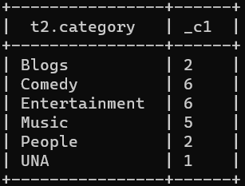
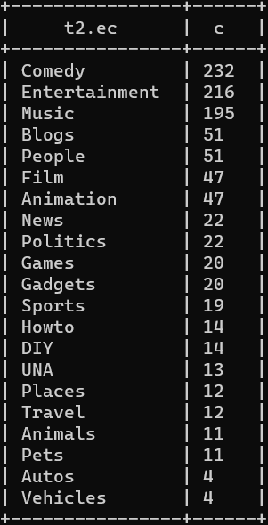
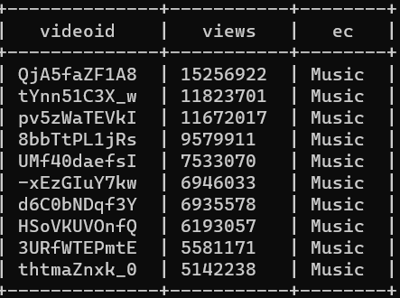
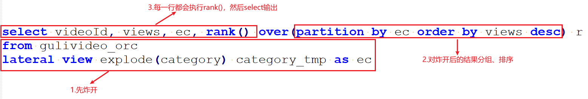
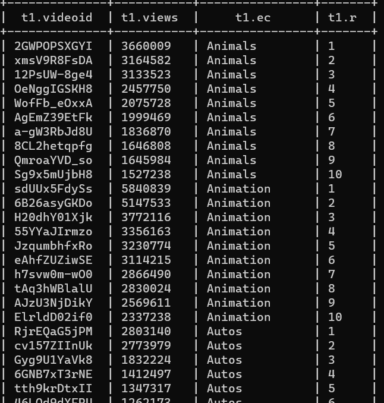

---

Created at: 2021-09-05
Last updated at: 2021-10-27


---

# 19-练习


先创建两张TEXTFILE格式的表
视频表
```
create table gulivideo_ori(
    videoId string,
    uploader string,
    age int,
    category array<string>,
    length int,
    views int,
    rate float,
    ratings int,
    comments int,
    relatedId array<string>
)row format delimited fields terminated by "\t"
collection items terminated by "&"
stored as textfile;
```
用户表
```
create table gulivideo_user_ori(
    uploader string,
    videos int,
    friends int
)row format delimited fields terminated by "\t";
```

把数据导入
```
load data local inpath "/opt/module/data/guliVideo/video" into table gulivideo_ori;
load data local inpath "/opt/module/data/guliVideo/user" into table gulivideo_user_ori;
```

还是上面两张表，但是把存储格式改成ORC，压缩格式改成Snappy
```
create table gulivideo_orc(
    videoId string,
    uploader string,
    age int,
    category array<string>,
    length int,
     int,
    rate float,
    ratings int,
    comments int,
    relatedId array<string>
)stored as orc
tblproperties("orc.compress"="SNAPPY");
```
```
create table gulivideo_user_orc(
    uploader string,
    videos int,
    friends int
)stored as orc
tblproperties("orc.compress"="SNAPPY");
```

把上面两张的数据插到下面两张表中，非TEXTFILE格式的表只能这样做，因为load无法导入到非TEXTFILE格式的表中，但是load可以导分区表和分桶表
```
insert into table gulivideo_orc select * from gulivideo_ori;
insert into table gulivideo_user_orc select * from gulivideo_user_ori;
```

需求：
1.统计视频观看数 Top10
```
select videoId
from gulivideo_orc
order by views desc
limit 10;
```


2.统计视频类别热度 Top10，也就是类别标签出现最多的10个
```
select t.ec,count(t.ec) c
from(
    select explode(category) ec
    from gulivideo_orc
) t
group by t.ec
order by c desc
limit 10;
```


3.统计出视频观看数最高的 20 个视频的所属类别以及类别包含 Top20 视频的个数
```
select t2.category,count(*)
from (
    select explode(t1.category) category
    from (
        select category
        from gulivideo_orc
        order by views desc
        limit 20
    )t1
)t2
group by t2.category;
```

下面的写法是错误的，因为select 在order by 之前执行，使用explode(category)就没有views了，如果只使用 category 就还有views
```
select explode(category)
from gulivideo_orc
order by views desc
limit 20;
```

4.统计视频观看数 Top50 所关联视频的所属类别排序
```
select t2.ec,count(*) c
from(
    select explode(category) ec
    from gulivideo_orc
    where videoId in (
        select explode(t1.relatedId)
        from (
            select relatedId
            from gulivideo_orc
            order by views desc
            limit 50
        )t1
    )
)t2
group by t2.ec
order by c desc;
```


5.统计每个类别中的视频热度 Top10,以 Music 为例
```
select videoId, views, ec
from gulivideo_orc
lateral view explode(category) category_tmp as ec
where ec='Music'
order by views desc
limit 10;
```


6.统计每个类别视频观看数 Top10
```
select t1.videoId, t1.views, t1.ec, t1.r
from(
    select videoId, views, ec, rank() over(partition by ec order by views desc) r
    from gulivideo_orc
    lateral view explode(category) category_tmp as ec
)t1
where t1.r<=10;
```
开窗和炸裂函数执行流程：




7.统计上传视频最多的用户 Top10 以及他们上传的视频观看次数在前 20 的视频
```
select t1.uploader, t1.videoId, t1.views, t1.r
from(
    select uploader, videoId, views, rank() over(partition by uploader order by views desc) r
    from gulivideo_orc
    where uploader in (
        select uploader
        from gulivideo_user_orc
        order by videos desc
        limit 10
    )
)t1
where t1.r<=20;
```

