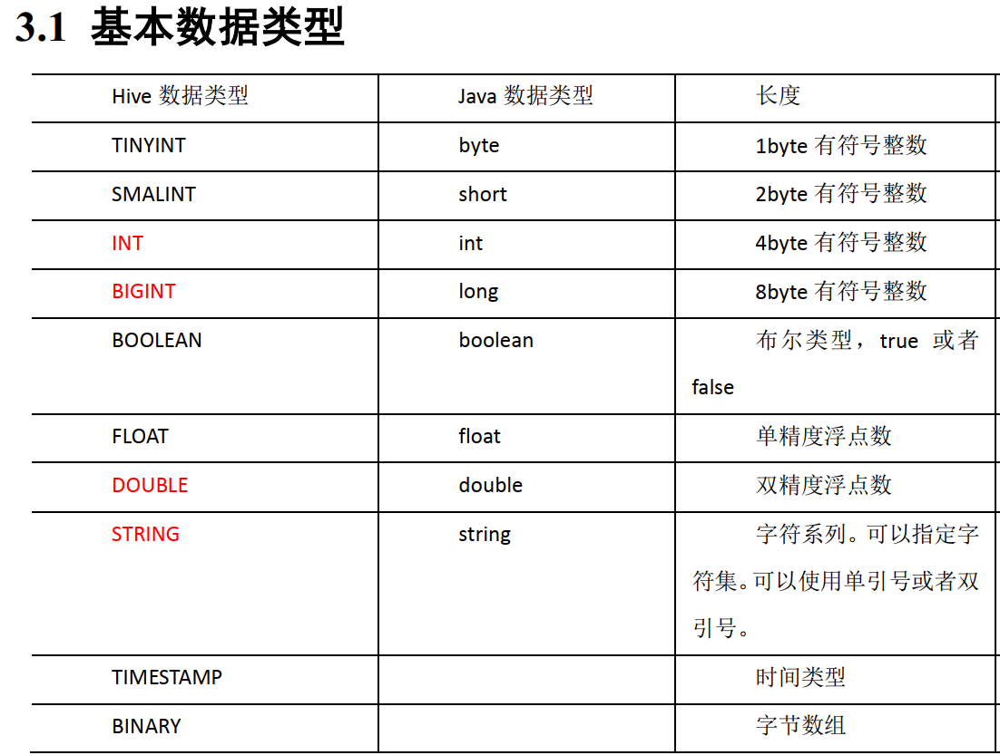
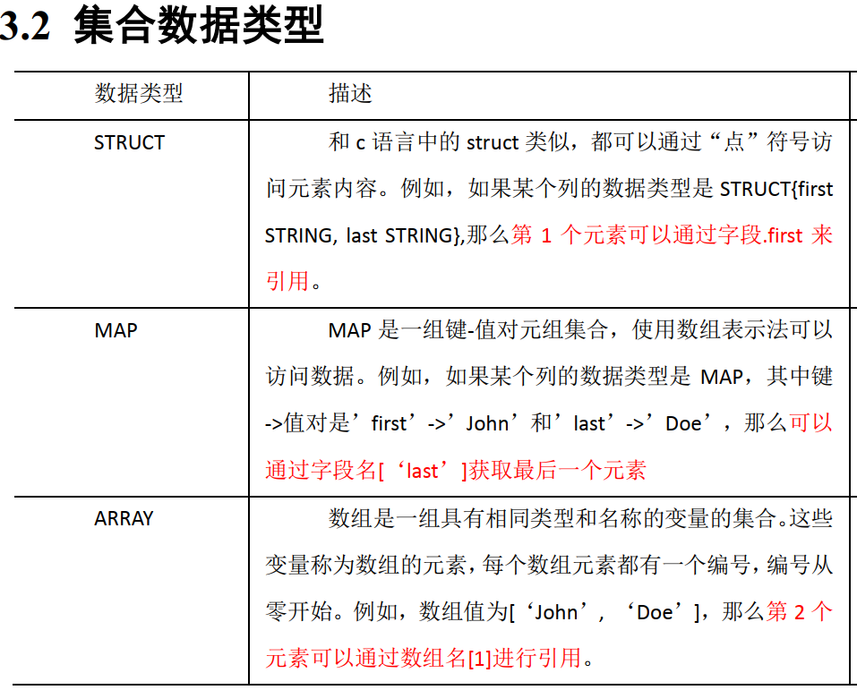

---

Created at: 2021-09-02
Last updated at: 2025-03-05


---

# 2-DDL（数据定义语言）


DDL 数据定义语言重点是建库和建表

**一、****对数据库的增删改操作：**
1.创建数据库
```
CREATE DATABASE [IF NOT EXISTS] database_name
[COMMENT database_comment]
[LOCATION hdfs_path]
[WITH DBPROPERTIES (property_name=property_value, ...)];
```
COMMENT 注释，解释这个库是做什么用的
LOCATION 用于指定数据库在HDFS上存放的位置，使用LOCATION指定位置的话就直接使用指定的目录作为数据库，否则默认是在/user/hive/warehouse下创建一个目录表示数据库，并且目录的名字是database\_name后面加上.db后缀，加上这个后缀其实是为了于default库区分，因为/user/hive/warehouse这个目录就是default数据库，在这个目录下的不带.db的目录就是default库中的表（当然元数据库中得有这张表的元数据信息）。
WITH DBPROPERTIES 指定诸如创建作者是谁、创建时间等自定义信息。

2.查看数据库
查看有哪些数据库：
```
show databases;
show databases like 'db_hive*';
```
查看某个库的信息，看不到DBPROPERTIES：
```
desc database db_hive;
```
查看某个库的详细信息，看得到DBPROPERTIES：
```
desc database extended db_hive;
```
以上信息其实记录在MySQL元数据库中的表DBS中，直接查看这张表也是一样的。

3.修改数据库，alter 只能修改DBPROPERTIES中的值
```
alter database db_hive set dbproperties('createtime'='20170830');
```

4.删除数据库
直接drop只能删除空的数据库
```
drop database db_hive;
drop database if exists db_hive2;
```
如果数据库不为空，可以使用 cascade 命令，强制删除
```
drop database db_hive cascade;
```

**二、对表的增删改操作：**
1\. 创建表
```
CREATE [EXTERNAL] TABLE [IF NOT EXISTS] table_name
[(col_name data_type [COMMENT col_comment], ...)]
[COMMENT table_comment]
[PARTITIONED BY (col_name data_type [COMMENT col_comment], ...)]
[CLUSTERED BY (col_name, col_name, ...) INTO num_buckets BUCKETS]
[SORTED BY (col_name [ASC|DESC], ...)]
[ROW FORMAT row_format]
[STORED AS file_format]
[LOCATION hdfs_path]
[TBLPROPERTIES (property_name=property_value, ...)]
[AS select_statement]
```
解释说明
（1）CREATE TABLE  创建一个指定名字的表。如果相同名字的表已经存在，则抛出异常； 用户可以用 IF NOT EXISTS  选项来忽略这个异常。
`（2）EXTERNAL` 关键字可以让用户创建一个外部表，在删除表的时候，内部表的元数据和数据会被一起删除，而外部表只删除元数据，不删除数据。
（3）COMMENT 为表和列添加注释
`（4）PARTITIONED BY` 创建分区表
（5）CLUSTERED BY 创建分桶表
（6）SORTED BY 不常用，对桶中的一个或多个列另外排序
`（7）ROW FORMAT DELIMITED \[FIELDS TERMINATED BY char\]`
     \[COLLECTION ITEMS TERMINATED BY char\]
     \[MAP KEYS TERMINATED BY char\]
     \[LINES TERMINATED BY char\]
（8）STORED AS 指定存储文件类型，常用的存储文件类型：SEQUENCEFILE（二进制序列文件）、TEXTFILE（文本）、RCFILE（列式存储格式文件），默认是纯文本，等同于使用 STORED AS TEXTFILE。如果数据需要压缩，使用 STORED AS SEQUENCEFILE。
（9）LOCATION 指定表在 HDFS 上的存储位置，默认在指定数据库的目录下。
（10）TBLPROPERTIES 用于指定一些属性的信息，比如该表是否启用压缩.
（11）AS 后跟查询语句，根据查询结果创建表。
（12）LIKE 允许用户复制现有的表结构，但是不复制数据。

**管理表和外部表：**
管理表，也称为内部表， 删除一个管理表时，Hive 也会删除这个表中数据，也就是HDFS上的内容也会被删除。但是外部表在删除表时并不会删除HDFS上的数据，只会删除MySQL中的元数据信息。所以通常创建的都是外部表，数据更安全。

Hive中的数据类型有如下这些，最常用的也就INT、BIGINT、DOUBLE、STRING



1.1 创建表的例子：
文件中有如下内容：
```
songsong,bingbing_lili,xiao song:18_xiaoxiao song:19,beijing_hui long guan_10
yangyang,caicai_susu,xiao yang:18_xiaoxiao yang:19,beijing_chao yang_20
```
上面的一行数据如果用json表示其想表达的内容的话就是下面这样的：
```
{
  "name": "songsong",
  "friends": [
    "bingbing",
    "lili"
  ],
  "children": {
    "xiao song": 18,
    "xiaoxiao song": 19
  },
  "address": {
    "city": "beijing",
    "street": "hui long guan",
    "number": 10
  }
}
```
上述数据的建表语句是下面这样的：
```
create external table test(
    name string,
    friends array<string>,
    children map<string, int>,
    address struct<city:string, street:string, number:int>
)row format delimited fields terminated by ','
collection items terminated by '_'
map keys terminated by ':'
lines terminated by '\n';
```
建表时，row format delimited fields terminated by一定要指定一下，不然就是默认的不知道是啥的一个字符。

1.2 根据查询结果创建表，查询的结果会添加到新创建的表中：
```
create table if not exists student1 as select id, name from student;
```

1.3 根据已经存在的表结构创建表
```
create table if not exists student3 like student;
```

2.查看表结构
```
desc student3
```

3.查看表的详细信息，在元数据库中的表table\_params中
```
desc formatted student3
```

4到6是修改表的操作：
4.管理表与外部表的互相转换
```
修改内部表为外部表：alter table student2 set tblproperties('EXTERNAL'='TRUE');
修改外部表为内部表：alter table student2 set tblproperties('EXTERNAL'='FALSE');
```
注意：('EXTERNAL'='TRUE')和('EXTERNAL'='FALSE')为固定写法，区分大小写！

5\. 重命名表
```
ALTER TABLE table_name RENAME TO new_table_name
```
比如： 
```
alter table dept_partition2 rename to dept_partition3;
```

6.添加/替换/修改列信息
6.1添加/替换 列
```
ALTER TABLE table_name ADD|REPLACE COLUMNS (col_name data_type [COMMENT col_comment], ...)
```
比如添加列：
```
alter table dept add columns(deptdesc string);
```
替换列是将整个表的列都替换掉
```
alter table dept replace columns(deptno string, dname string, loc string);
```

6.2修改 列
```
ALTER TABLE table_name CHANGE [COLUMN] col_old_name col_new_name column_type [COMMENT col_comment]
```
比如把deptdesc改成desc并且类型是string
```
alter table dept change column deptdesc desc string;
```

7.删除表
```
drop table dept;
```

8.Truncate清除表中数据是删除hdfs上的数据，但是Truncate 只能删除管理表中的数据，不能删除外部表中的数据
```
truncate table student;
```

