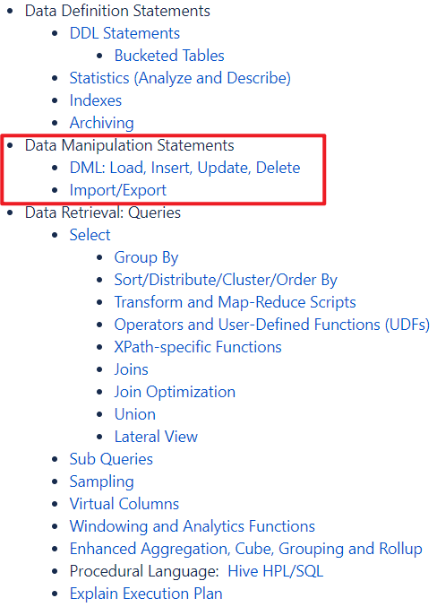

---

Created at: 2021-10-27
Last updated at: 2025-03-05


---

# 3-DML（数据操作语言）


Hive的DML（数据操作语言）包括对表中数据的 导入(load)、插入(insert)、删除(delete) 和 修改(update) 以及 对整张表数据的导入(import)和数据的导出(Export)，删除和修改不常用，所以只说明数据的导入和导出。

**数据导入**
1\. 向表中装载数据（Load）
```
load data [local] inpath '数据的path' [overwrite] into table student [partition (partcol1=val1,…)];
```
local表示从本地加载数据到 hive 表；否则从 HDFS 加载数据到 hive 表
overwrite表示覆盖表中已有数据，否则表示添加
partition表示上传到指定分区
比如加载本地文件到 hive：
```
load data local inpath '/opt/module/hive/datas/student.txt' into table default.student;
```

Load与直接使用hdfs的put命令的区别是，使用hdfs的put命令不会经过hive，所以也就不会修改任何元数据信息，在使用select count(\*)等直接访问元数据库就可以得到结果的命令时，不会访问hdfs上的文件，所以得到结果就不是真实的结果。而使用load会修改元数据信息中的numFiles，但不会修改numRows（这两个字段在元数据库的table\_params表中），所以导入数据和hdfs put数据一样快，但在使用select count(\*)查询语句时会走MR访问hdfs文件，因为此时numFlis>0，而numRows=0，所以能得到正确的结果。

2.向表中插入数据（Insert）
基本插入数据如下，会走MR同时更新元数据信息中的numFile和numRows
```
insert into table student_par values(1,'wangwu'),(2,'zhaoliu');
```
单张表查询结果插入
```
insert overwrite table student_par
select id, name from student where month='201709';
```
insert into：以追加数据的方式插入到表或分区，原有数据不会删除
insert overwrite：会覆盖表中已存在的数据
注意：insert 不支持插入部分字段

3\. 创建表时将其它表的查询结果作为数据导入（as select）
```
create table if not exists student3 as select id, name from student;
```

4\. 创建表时通过 Location 指定数据存放的路径，如果路径下已经有数据了，那么等同于直接将数据导入到表中了
```
create external table if not exists student5(id int, name string)
row format delimited fields terminated by '\t'
location '/student;
```

6\. Import 数据到指定 Hive 表中
注意：必须先用 export 导出后，才能使用import命令将数据导入。被导入的表必须不存在或是一张空表，不能是一张有数据的表
```
import table student2 from '/user/hive/warehouse/export/student';
```

**数据导出**
1.insert 加个 local 可以将数据导出到本地
```
insert overwrite local directory '/opt/module/hive/data/export/student'
select * from student;
```

2.insert 将查询的结果格式化导出到本地
```
insert overwrite local directory '/tmp/student1'
ROW FORMAT DELIMITED FIELDS TERMINATED BY '\t'
select * from student;
```

3\. .Insert 没有 local 将查询的结果导出到 HDFS 上
```
insert overwrite directory '/user/atguigu/student2'
ROW FORMAT DELIMITED FIELDS TERMINATED BY '\t'
select * from student;
```

4.Hadoop 命令导出到本地(可以在hive中使用hadoop的命令)
```
hive> dfs -get /user/hive/warehouse/student/student.txt /opt/module/data/export/student3.txt;
```

5.Hive Shell 命令导出
```
hive -e 'select * from default.student;' > /opt/module/hive/data/export/student4.txt;
```

6.export 导出到 HDFS 上，与前面的import是配套使用的， export 和 import 主要用于两个 Hadoop 平台集群之间 Hive 表迁移
```
export table default.student to '/student1'
```

7\. Sqoop 导出

