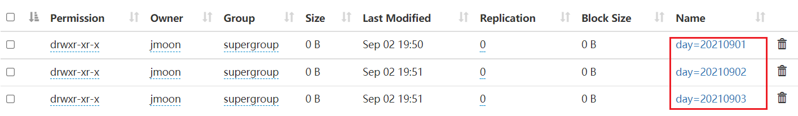
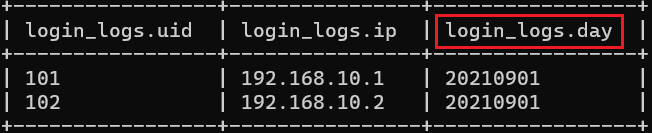
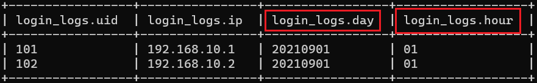
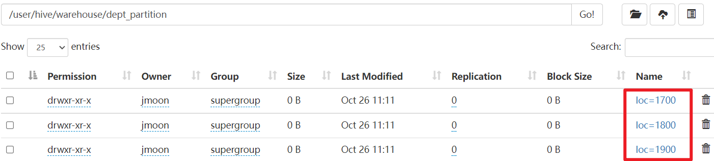

---

Created at: 2021-09-02
Last updated at: 2021-10-27


---

# 4-分区表和分桶表


**分区表：**
建库其实就是在HDFS上新建了一个目录，建表就是该目录下又新建了一个目录，以后查询该表中的数据时，就是扫描表对应目录下的所有文件，而分区表指的就是在表对应的目录下再新建目录作为表的分区，以后只要带上分区条件查询表，那么就只需要扫描分区对应目录下的所有文件即可，这样就极大的提升了查询效率。

新建一张用于记录每天用户登录信息的分区表，用每一天作为分区
```
create table if not exists login_logs(uid string,ip string)
`partitioned by (day string)`
row format delimited fields terminated by '\t';
```
分区表的分区字段在以后查询时和表的其它字段一样的用，它就相当于表的一个伪列

创建三个用户登录记录的log文件
login\_20210901.log
```
101    192.168.10.1
102    192.168.10.2
```
login\_20210902.log
```
201    192.168.20.1
202    192.168.20.2
```
login\_20210903.log
```
301    192.168.30.1
302    192.168.30.2
```

把上面的本地数据加载到Hive中
```
load data local inpath '/opt/module/data/login_20210901.log' into table login_logs partition(day='20210901');
load data local inpath '/opt/module/data/login_20210902.log' into table login_logs partition(day='20210902');
load data local inpath '/opt/module/data/login_20210903.log' into table login_logs partition(day='20210903');
```
注意：往分区表中导入数据必须指定分区

查询分区表中数据，分区字段和表的普通列一样的用
```
select * from login_logs where day='20210901';
```


增加一个或多个分区
```
alter table login_logs add partition(day='20210904') partition(day='20210905');
```

删除多个分区，注意中间的逗号，增加分区时使用空格分开，删除分区时使用逗号隔开，删除管理表的分区会删除hdfs上的数据
```
alter table login_logs drop partition(day='20210904'),partition(day='20210905');
```

查看有多少个分区
```
show partitions login_logs;
```

还可以对分区再进行拆分，也就是二级分区，比如先按天进行分区，再按小时进行分区
先删除之前的表，然后再创建二级分区表
```
drop table login_logs;
```
```
create table if not exists login_logs(uid string,ip string)
partitioned by (day string, hour string)
row format delimited fields terminated by '\t';
```

加载本地数据到Hive中
```
load data local inpath '/opt/module/data/login_20210901.log' into table login_logs partition(day='20210901', hour='01');
```

查询二级分区的数据
```
select * from login_logs where day='20210901' and hour='01';
```


把数据直接上传到分区目录上，让分区表和数据产生关联的两种方式：
在hive中执行HDFS的命令直接创建分区对应的目录和上传数据到分区中：
```
dfs -mkdir -p /user/hive/warehouse/login_logs/day=20210902/hour=13;
dfs -put /opt/module/data/login_20210902.log /user/hive/warehouse/login_logs/day=20210902/hour=13;
```
查询二级分区的数据，发现查不到，原因是分区信息是需要记录在元数据库中的，具体在partitions表中，元数据中没有分区的信息就查不到分区中的数据，就像没有创建表直接在hdfs上创建目录一样，是没有用的。
```
select * from login_logs where day='20210902' and hour='13';
```

方式一：执行修复命令
```
msck repair table login_logs;
```

方式二：添加分区
```
alter table login_logs add partition(day='20210902',hour='13');
```

**动态分区：**
如果想把一张表的查询结果导入到另外一张分区表中，并且想把查询结果中的某个字段作为分区表的分区字段，那么就需要动态的在分区表中创建分区了，因为分区字段的具体值不确定，无法预先手动创建，动态分区就是来解决这件事。
动态分区是使用insert插入语句往分区表里插入数据时的一个功能，并不是说有一种分区表的类型是动态分区表，动态分区走MR。
动态分区默认是开启的：
```
hive.exec.dynamic.partition=true
```
创建一张按部门位置作为分区的表
```
create table dept_partition(id int, name string) partitioned by (loc int) row format delimited fields terminated by '\t';
```
往分区表里插入数据，以查询出来的loc列的值作为分区的值：
```
insert into table dept_partition select deptno, dname, loc from dept;
```
注意，在select语句中loc必须在最后一个位置，动态分区只会把最后一个字段的值作为分区字段的值来创建分区，这是动态分区严格模式下的语法（即Dynamic partition strict mode requires at least one static partition column，动态分区严格模式需要至少一个静态分区列）

还可以在严格模式下使用下面的语法往分区中插入数据，不过这并不是动态分区插入，而是静态分区插入，即查询结果只会插入到loc=100的分区中：
```
insert into table dept_partition partition(loc='100') select deptno, dname from dept;
```
如果要使用下面的语法实现动态分区插入（注意从表中查出来的分区字段同样也应该放在最后，如果是多级分区，字段的顺序也不能乱）：
```
insert into table dept_partition partition(loc) select deptno, dname, loc from dept;
```
需要开启非严格模式，因为默认是严格模式：
```
set hive.exec.dynamic.partition.mode=nonstrict;
```
总结一点，严格模式和非严格模式除了语法上的区别，是真的没啥其它区别了，非严格模式下也可以使用严格模式下的语法往动态分区中插入数据。

**分桶表：**
hive中表就是一个目录，表中的数据就是目录下所有文件，分桶表就是把表中的数据拆分成多个文件来存放。与分区表不同，分区表是把表再拆分成目录，分区字段也作为表的一个列看待，而分桶则只是简单地把表中的数据拆分成多个文件而已。分桶规则是，对分桶字段的值进行哈希，然后除以桶的个数求余的方式决定该条记录存放在哪个桶当中，也就是说分桶字段相同的数据一定在同一个桶中，同一个桶中可以有多个不同的用于分桶的字段，只要它们计算的结果相同就行。（可能很奇怪，因为MapReduce最怕的就是小文件，但是分桶却要拆分成多个文件，原因是因为根据分桶字段相同的数据一定在同一个桶中这个特点，可以对某些SQL语句的执行做优化，比如优化两张大表的join [11-优化](11-优化)）
```
create table stu_buck(id int, name string)
`clustered by(id) into 4 buckets`
row format delimited fields terminated by '\t';
```

导入数据到表中，由于往分桶表中导入数据会走MR，所以使用loal data 从本地导入数据话可能会抛异常，因为将MR任务提交给yarn后，就不知道yarn会把任务分配给那台机器执行了，如果不是每台机器上都有如下的本地文件，并且恰好任务分配到一个没有stu.txt文件的主机上就会因为再找不到文件抛异常。
```
load data inpath '/opt/module/data/stu.txt' into table stu_buck;
```

分桶表操作需要注意的事项:
（1）reduce 的个数设置为-1,让 Job 自行决定需要用多少个 reduce 或者将 reduce 的个数设置为大于等于分桶表的桶数
（2）从 hdfs 中 load 数据到分桶表中，避免本地文件找不到问题
（3）不要使用本地模式

**抽样查询：**
使用分桶表最常用的功能就是抽样查询，语法： TABLESAMPLE(BUCKET x OUT OF y)，例如：
```
select * from stu_buck tablesample(bucket 1 out of 4 on id);
```
表示把表的数据分成4份，从第1份中抽样，注意：x 的值必须小于等于 y 的值，否则就会抛异常。

