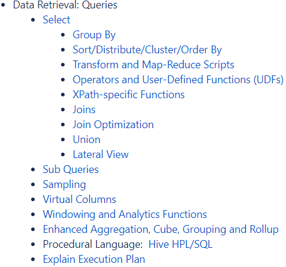
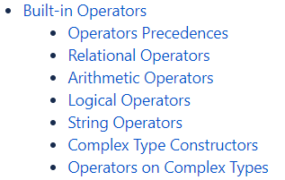

---

Created at: 2021-09-02
Last updated at: 2021-10-30
Source URL: https://cwiki.apache.org/confluence/display/Hive/LanguageManual+UDF#LanguageManualUDF-TypeConversionFunctions


---

# 5-DQL（数据查询语言）


Hive的sql查询语句基本上与MySQL相同，但也有许多不同。各种函数、分组、排序、连接、子查询、窗口等等内容都属于DQL的范围。（注意：测试用例用到的表的建表语句和数据在文末，在后面许多例子中都会用到。）


**Operators（****运算符****）**
Hive的运算符（Operators）包括 关系运算符、算数运算符、逻辑运算符、从复杂类型中取数的运算符等，复杂类型的构造函数也属于运算符：


1.关系运算符：A<=>B，如果 A和B相同 或者 A和B都为NULL，则返回 TRUE，否则返回 False。而 A=B不能处理有一个数为NULL的情况。

2.关系运算符：RLIKE，RLIKE 可以通过 Java 的正则表达式这个更强大的语言来指定匹配条件。
```
select * from emp where ename RLIKE '[A]';
```

3.复杂类型的构造函数

* map(key1, value1, key2, value2, ...)
* struct(val1, val2, val3, ...)
* named\_struct(name1, val1, name2, val2, ...)
* array(val1, val2, ...)

例如：
```
> select map('a', 1, 'b', 'b');
{"a":"1","b":"b"}
```
```
> select struct('a', 1, 'b', 'b');
{"col1":"a","col2":1,"col3":"b","col4":"b"}
```
```
> select named_struct('a', 1, 'b', 'b');
{"a":1,"b":"b"}
```
```
> select array('a', 1, 'b', 'b');
["a","1","b","b"]
```
当然，这几个函数不应该这样用，而是应该用在需要将表中查询出来的数据构造成复杂类型的场景。

4.从复杂类型中取数的运算符
4.1 Array中取值： A\[n\]
4.2 Map中取值： M\[key\]
4.3 Struct中取值： S.x

**JOIN（连接）**
MySQL不支持全外连接，但Hive支持，所以 A U B 就可以写成全外连接了。
nvl函数的作用和MySQL的ifnull函数功能一样，第一参数为null，就取第二个参数的值。
```
select e.empno,e.ename,nvl(e.deptno,d.deptno),d.dname
from emp e
full join dept d
on e.deptno=d.deptno;
```
A - B 差集的两种写法：
```
select e.empno,e.ename,e.deptno
from emp e
left join dept d
on e.deptno=d.deptno
where d.deptno is null;
```
```
select e.empno,e.ename,e.deptno
from emp e
where e.deptno not in (
   select d.deptno
   from deptno
);
```

**UNION**
union的语法：
```
select_statement UNION [ALL | DISTINCT] select_statement UNION [ALL | DISTINCT] select_statement ...
```
1.union 等于 union distinct，效果是会对子查询结果去重
2.union all 不会对子查询结果去重
注意：union distinct  覆盖掉对前面所有的 union all

**准备数据**
1\. 创建部门表
```
create table if not exists dept(
   deptno int comment '部门号',
   dname string comment '部门名称',
   loc int  comment '部门位置'
)row format delimited fields terminated by '\t';
```
部门表数据
```
10    ACCOUNTING    1700
20    RESEARCH    1800
30    SALES    1900
40    OPERATIONS    1700
```
2\. 创建员工表
```
create table if not exists emp(
   empno int comment '员工编号',
   ename string comment '员工姓名',
   job string comment '员工职位',
   mgr int comment '上级领导的员工编号',
   hiredate string comment '入职日期',
   sal double comment '薪水',
   comm double comment '奖金',
   deptno int comment '所在部门号'
)row format delimited fields terminated by '\t';
```
员工表数据
```
7369    SMITH    CLERK    7902    1980-12-17    800.00        20
7499    ALLEN    SALESMAN    7698    1981-2-20    1600.00    300.00    30
7521    WARD    SALESMAN    7698    1981-2-22    1250.00    500.00    30
7566    JONES    MANAGER    7839    1981-4-2    2975.00        20
7654    MARTIN    SALESMAN    7698    1981-9-28    1250.00    1400.00    30
7698    BLAKE    MANAGER    7839    1981-5-1    2850.00        30
7782    CLARK    MANAGER    7839    1981-6-9    2450.00        10
7788    SCOTT    ANALYST    7566    1987-4-19    3000.00        20
7839    KING    PRESIDENT        1981-11-17    5000.00        10
7844    TURNER    SALESMAN    7698    1981-9-8    1500.00    0.00    30
7876    ADAMS    CLERK    7788    1987-5-23    1100.00        20
7900    JAMES    CLERK    7698    1981-12-3    950.00        30
7902    FORD    ANALYST    7566    1981-12-3    3000.00        20
7934    MILLER    CLERK    7782    1982-1-23    1300.00        10
```
3.加载数据到hive表中
```
load data local inpath '/opt/module/data/dept.txt' into table dept;
load data local inpath '/opt/module/data/emp.txt' into table emp;
```

