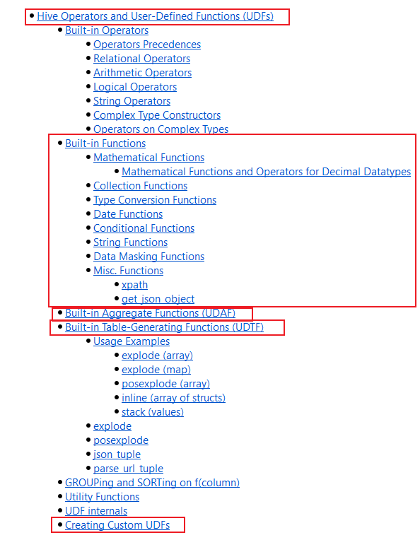

---

Created at: 2021-10-27
Last updated at: 2021-10-27
Source URL: https://cwiki.apache.org/confluence/display/Hive/LanguageManual+UDF#LanguageManualUDF-TypeConversionFunctions

---

# 7-Hive函数

Hive的函数称为UDF（User-Defined-Function），按输入输出的形式可分为3类，即一进一出、多进一出、一进多出，虽然说UDF包括这3类函数，但通常将一进一出的函数称为UDF函数，多进一出的函数称为UDAF函数，一进多出的函数称为UDTF。即：
（1）UDF（User-Defined-Function），一进一出，
（2）UDAF（User-Defined Aggregation Function） 聚集函数，多进一出，如：count、max、min、sum、avg
（3）UDTF（User-Defined Table-Generating Functions） 一进多出，类似于：lateral view explode()

**与函数有关的常用命令：**
查看系统自带的函数：show functions;
显示自带的函数的用法：desc function upper;
显示自带的函数的详细用法，有例子：desc function extended upper;

