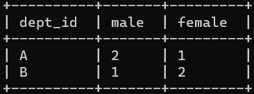

---

Created at: 2021-09-03
Last updated at: 2023-09-15
Source URL: https://cwiki.apache.org/confluence/display/Hive/LanguageManual+UDF#LanguageManualUDF-CollectionFunctions


---

# 9-UDF 之 条件函数 和 字符串函数


**条件函数**
**NVL(value，default\_value)**：value不为null则返回value，否则返回default\_value，如果两个参数都为NULL ，则返回 NULL。
该函数的目的是把一个空值（null）转换成一个实际的值。其表达式的值可以是数字型、字符型和日期型。但是表达式1和表达式2的数据类型必须为同一个类型。

**COALESCE(T v1, T v2, ...)**：v1不为null则返回v1，否则v2不为null则返回v2，依次类推。

**IF(expr1,expr2,expr3)**
相当于Java中的三元运算符，expr1为true，则结果为expr2，否则结果为expr3。
案例：
创建一张表
```
create table emp_sex(
    name string,
    dept_id string,
    sex string
)row format delimited fields terminated by "\t";
```
数据sex.txt：
```
悟空    A    男
大海    A    男
宋宋    B    男
凤姐    A    女
婷姐    B    女
婷婷    B    女
```
导入到hive
```
load data local inpath '/opt/module/data/sex.txt' into table emp_sex;
```
需求：求出不同部门男女各多少人。结果如下：

HQL：
```
select dept_id,
    sum(if(sex='男',1,0)) male,
    sum(if(sex='女',1,0)) female
from emp_sex
group by dept_id;
```

**CASE a WHEN b THEN c \[WHEN d THEN e\]\* \[ELSE f\] END**：当a=b时返回c，a=d时返回e
**CASE WHEN a THEN b \[WHEN c THEN d\]\* \[ELSE e\] END**：当a=true时返回b，c=true时返回d
用case when then 解决上面的那个问题：
```
select dept_id,
    sum(case sex when '男' then 1 else 0 end) male,
    sum(case sex when '女' then 1 else 0 end) female
from emp_sex
group by dept_id;
```

**字符串函数**
upper： 转大写
```
select upper('low');
```
lower： 转小写
```
select lower('low');
```
length： 长度
```
select length("atguigu");
```
trim：  前后去空格
```
select trim(" atguigu ");
```
lpad： 向左补齐到指定长度，最后一个参数是用于补齐的字符
```
select lpad('atguigu',9,'g');
```
rpad：  向右补齐，到指定长度
```
select rpad('atguigu',9,'g');
```
regexp\_replace：使用正则表达式匹配目标字符串，匹配成功后替换！
```
SELECT regexp_replace('2020/10/25', '/', '-');
```
**concat(str1, str2, ... strN)**：拼接字符串
```
> select concat('a', ',', 'b', '-', 'c');
a,b-c
```
**concat\_ws(separator, \[string | array(string)\]+)**：也是拼接字符串，不过第一个参数是拼接每个字符时中间使用的分隔符，后面可变参数，既可以是多个字符串，也可以是一个或多个字符数组。
```
> select concat_ws(',', 'a', 'b', 'c');
a,b,c
```
**str\_to\_map(text\[, delimiter1, delimiter2\])**：使用分隔符将一个字符串转换成Map，delimiter1是每两个K-V键值对之间的分隔符，delimiter2是每个K-V键值对K和V之间的分隔符，delimiter1默认是逗号，delimiter2默认是 : 
```
> select str_to_map('a:1,b:2,c:3', ',', ':');
{"a":"1","b":"2","c":"3"}
```
**split(string str, string pat)**：按pat分割字符串str

