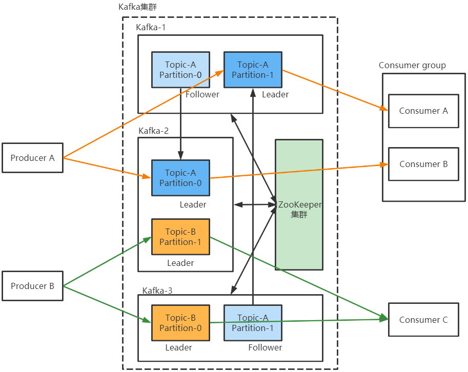

---

Created at: 2021-09-07
Last updated at: 2021-10-22

---

# 1-Kafka架构及理解

Kafka 是一个分布式的基于发布/订阅模式的消息队列（Message Queue），主要应用于大数据实时处理领域。
Flume针对的是文件数据，Kafka针对的是消息数据。Flume是主动的，主动地监控变化读取数据，然后主动地把数据写出。Kafka是被动的，由生产者主动往消息队列里发送数据，由消费者主动从消息队列里面拉取数据。

Kafka架构图：
Topic-A有两个分区，每个分区有两个副本，同一个分区的不同副本必须分布在不同的主机上；Topic-B也有两个分区，但是每个分区只有一个副本，这两个分区可以分布在同一个主机上，但是通常Kafka会优先把不同分区分布在不同的机器上，这样可以提高并发度和吞吐量。

* Broker ： 一台 kafka 服务器就是一个 broker。
* Producer ： 生产者，就是向 kafka broker 发消息的客户端；
* Consumer ：消费者，向 kafka broker 取消息的客户端；
* Topic ： 生产者和消费者面向的都是topic，topic中保存的是生产者发送过来的消息，一个 topic 可以分为多个 partition，每个partition只保存topic的一部分数据。如果Topic只有一个分区，那么所有发送到此topic的消息都是有序的，但是如果topic被划分成了多个分区，那么在整个topic中消息就不是全局有序了，而只是在分区内有序。
* Partition： 一个 topic 可以分为多个 partition，每个 partition 都是一个有序的队列；一个topic的多个partition通常分布在不同的机器上，这样可以提高并发度和吞吐量，当然也可以在同一台机器上。

         在上图中，消费者A、B属于同一个消费者组，它们各自负责消费Topic-A两个分区中的消息，系统的并行度和吞吐很高，因为有两个消费者在同时消费消息嘛；而消费者C就不一样了，它需要一个人负责消费Topic-B的所有消息，虽然Topic-B有两个分区，但是两个分区并发度的优势并没有被利用到，系统的瓶颈在于消费者C的消费速度。

* Replica：副本，一个Partition可以有一个或多个Replica，每个Replica必须分布在不同的机器上，Replica有两种角色，一个Leader和多个Follower，生产者和消费者都是和Leader打交道，Follower只负责备份Leader的数据，当Leader发生故障时，某个 Follower会成为新的 Leader。副本策略提高了Kafka的可用性，但是设置Replica的数量不能超过Kafka集群Broker的数量。Topic、partition、Replica、Leader、Follower与 redis的集群和主从复制的思想一样，只不过redis的主从复制可以做到读写分离，而Replica的Leader与Follower不能做到读写分离，生产者和消费者的读写操作都是和Leader进行。
* Consumer Group：消费者组，同一个消费者组中的不同消费者不能同时订阅同一个topic的同一个partition，只能订阅同一个topic的不同partition，或者订阅不同的topic。
* Kafka主机启动需要向zookeeper集群注册信息，这样才能加入到Kafka集群中，Kafka集群还会把topic信息存放到zookeeper集群中

