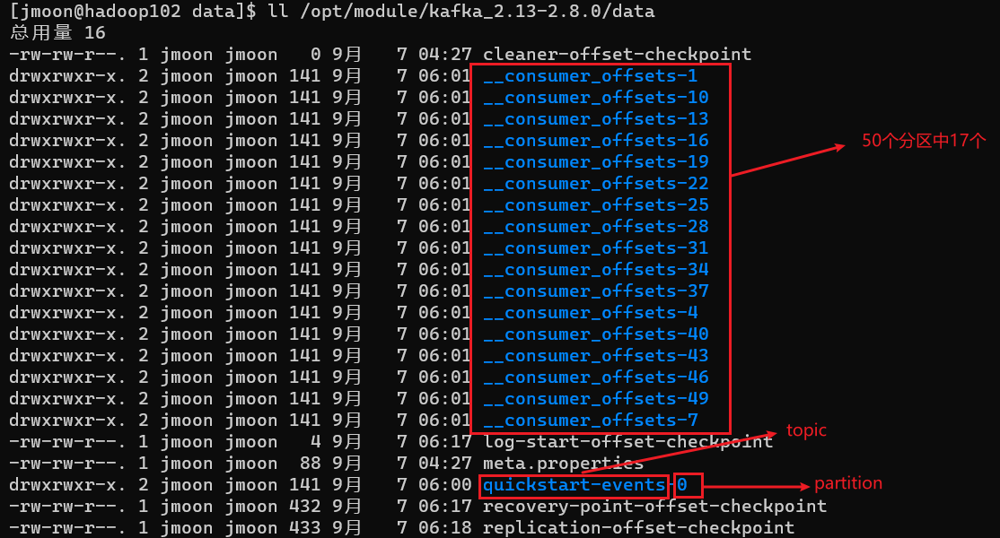
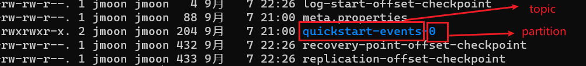
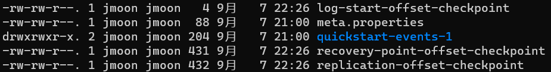
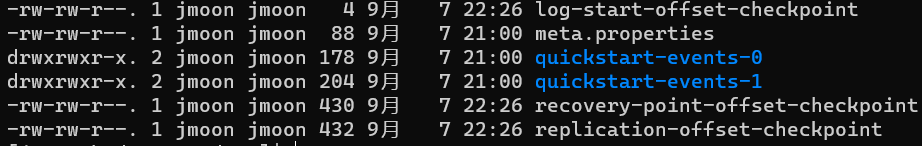
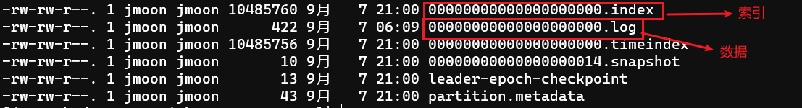
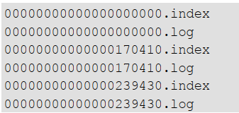

---

Created at: 2021-09-07
Last updated at: 2021-09-11
Source URL: https://kafka.apache.org/documentation/#quickstart


---

# 3-kafka的shell命令 及 Kafka文件存储机制


1.查看当前服务器中的所有 topic
kafka有关topic的数据信息是存放在zookeeper中的，这样kafka的集群就可以方便同步到这些信息了，所以在kafka-topics.sh的参数中指定要连接的zookeeper的地址，然后直接从这台zookeeper中获取到topic的信息。
```
bin/kafka-topics.sh --zookeeper hadoop102:2181 --list
```
上面kafka的旧版本中的命令，新版本虽然还兼容，但是官网介绍说将来kafka是要解除对zookeeper的依赖的，所以为了平滑过渡，新版使用了下面的命令，不直接查zookeeper，而是连接kafka，让Kafka去zookeeper中查询数据然后返回。
```
kafka-topics.sh --list --bootstrap-server localhost:9092
```

2.创建topic
```
kafka-topics.sh --create --topic quickstart-events --partitions 2 --replication-factor 2 --bootstrap-server localhost:9092
```
选项说明：
\--topic 定义 topic 名
\--partitions 定义分区数
\--replication-factor 定义副本数
分区数任意，但副本数不能超过Kafka集群机器的个数。topic创建完成之后，分区数可以增加，但是不能减少，因为分区里面已经存储数据了。

3\. 删除 topic
```
kafka-topics.sh --delete --topic quickstart-events --bootstrap-server localhost:9092
```

4.查看topic详情
```
kafka-topics.sh --describe --topic quickstart-events --bootstrap-server localhost:9092
```

5.在Hadoop102上启动控制台客户端生产者
```
kafka-console-producer.sh --topic quickstart-events --bootstrap-server localhost:9092
```

6.在Hadoop103、Hadoop104上启动控制台客户端消费者，因为Kafka是分布式的，在Hadoop103、Hadoop104上有属于同一个集群的Kafka，所以直接在Hadoop103、Hadoop104上连localhost:9092没有问题。只要是在配置文件里配置连接的zookeeper集群是同一个，那么这些Kafka实例就属于同一集群。
```
kafka-console-consumer.sh --topic quickstart-events --from-beginning --bootstrap-server localhost:9092
```
\--from-beginning： 会把主题中以往所有的数据都读取出来。
第一次启动消费者后，Kafka会创建1个topic来存储消费读取数据的偏移位置，这个topic有50分区，每一个分区都只有一个副本


Kafka文件存储机制：
一个topic分为一个或多个分区，一个分区又有一个或多个副本，比如创建一个有两个分区和两个副本的topic：
```
kafka-topics.sh --create --topic quickstart-events --partitions 2 --replication-factor 2 --bootstrap-server localhost:9092
```
那么在Kafka集群上数据是这样存储的：
Hadoop102上的/opt/module/kafka\_2.13-2.8.0/data目录（这个目录与前面在配置文件里配置的log.dirs有关）：

Hadoop103上：

Hadoop104上：

进到分区quickstart-events-0目录里面， Kafka 采取了分片和索引机制，将每个 partition 分为多个 segment：

当数据量大起来之后，segment就是这样的效果，文件名的数字是承接上一个 segment中的最大消息数：

总结Kafka文件存储机制就是，主题分区，分区分片（topic分成partition，partition分成segment）。写数据时采用顺序写磁盘和零拷贝技术，实现了快速写入；读数据时采用二分查找定位消息在哪一个segment，然后利用segment对应的索引就能快速找到消息的位置。另外，在分区中还维护着HW（High Watermark，高水位）和 LEO（Long End Offset）两个值，来保证消费者的消费不出现数据混乱的问题。

