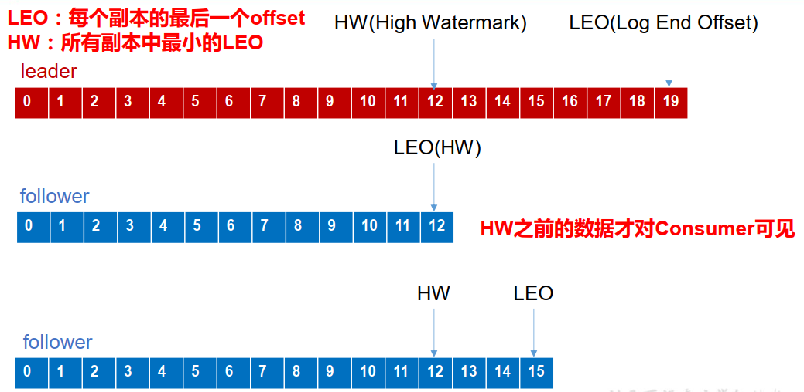

---

Created at: 2021-09-08
Last updated at: 2025-03-05

---

# 4-生产者和Kafka之间的 消息丢失 和 消息重复

保证生产者和Kafka之间数据的可靠性需要考虑两个问题：数据丢失、数据重复。或者称为 消息丢失 和 消息重复。

为保证数据不丢失，topic 的每个 partition 的 Leader 在收到 producer 发送的数据后，都需要向producer 发送ack（acknowledgement） ，producer 收到 ack后， 才会进行下一轮的发送，否则重新发送数据。

不过Leader 收到 producer 发送的数据后，并不一定是立即向producer发送ack，Leader还需要考虑Follower同步数据的情况，因为Leader可能会在发送完ack之后立马就挂掉了，这时如果没有Follower同步完数据，就会出现数据丢失的情况，毕竟producer在收到ack之后就不会再重复发送数据了。所以Leader应该何时发送ack消息呢，Kafka 为用户提供了三种可靠性级别的策略，生产者配置acks参数来选择使用哪种策略。

acks=0： producer不必等待 broker 的 ack，只管发送消息即可，显然这种策略会因为网络故障消息没能从生产者发送到Leader，或者Follwer同步完成之前Leader宕机丢失数据。

acks=1：leader接收到producer的数据并保存成功后就会向producer发送ack，Leader不必等Follower同步数据完成，这种策略不会因为网络故障丢失数据，但是会因为Follwer同步完成之前Leader宕机丢失数据。

acks=-1 或 "all"：如果选择等待所有Follwer同步完数据之后再发送ack未免等的是将太长了，于是Kafka让Leader维护了一个 动态的 ISR(in-sync replica set)集合，ISR集合里面记录的是几个同步数据比较快的Follower（多快才能称之为快，这个时间阈值由 replica.lag.time.max.ms 参数设定），当ISR集合里面的所有Follower都同步完数据，Leader才向producer发送ack消息。ISR集合是动态的，如果某个Follower同步数据的时间超过了设定的阈值就会被踢出ISR。这种策略既不会因为网络故障丢失数据，也不会因为Follwer同步完成之前Leader宕机丢失数据。（ack解决因网络原因丢失数据，副本解决因为机器故障丢数据，二者结合才能保证数据不会丢失）

所以acks=-1这种策略最为可靠，能解决的数据丢失的问题，但是并没有解决数据重复的问题。acks=0时不会出现数据重复的问题，因为producer只会发送一次消息，但是acks=1和acks=-1均会出现数据重复的问题，因为在这两种策略下，producer均可能会重复发送消息。
当acks=1时，leader发送的ack因为网络故障丢失，那么此时producer会重复向leader发送消息。
当acks=-1时，有两种情况会导致producer重复向leader发送消息。一是，leader发送的ack因为网络故障丢失，那么此时producer会重复向leader发送消息；二是，leader等Follower同步的过程中，leader挂了，Follower们同步到了部分数据或者全部数据，这时producer会因为没有收到ack而向新的leader重复发送消息。

为解决数据重复问题，Kafka引入了幂等性， 启用幂等性只需要将 Producer 的参数中 enable.idompotence 设置为 true 即可。 开启幂等性的 Producer 在初始化的时候会被分配一个 PID，并且会给每条消息附带一个 单调递增的Sequence Number。Broker 端会为每一个<PID, Partition>维护一个SeqNumber，只有当生产者发送过来的消息的序列号比broker维护的序列号大1时，broker才会接收它，如果生产者发送过来的消息的序号小于等于当前维护的SeqNumber，则为重复消息，如果生产者发送过来的消息的序号大于当前维护的SeqNumber+1，则是乱序消息，中间可能出现了消息丢失。可以看到，开启幂等后在分区内不仅可以消息去重（生产者虽然会往不同的分区发送消息，但是重发的消息一定是发到同一个分区的），而且还可以保持生产者发送消息的顺序。PID是生产者和Kafka一次会话的唯一标识，所以如果生产者断开连接后重连Kafka会再次生成一个新的PID，这时生产者发送的消息就与上次会话发送的消息就没有重复的关系了。

以上是Kafka解决与生产者之间的数据丢失和数据重复问题的具体措施。但是由于 生产者生产消息 和 消费者消费消息 这两个过程是异步的，所以Kafka和消费者之间也会存在着问题。即，当Follower正在同步Leader数据时，Leader挂了，这时Follower们只同步到了部分数据或者全部数据，我们知道出现这种情况，生产者会重复发送消息，保证数据不丢失，但是这是生产者和Kafka之间的问题，在上面已经解决，我们要谈的是此时Follower重新选举出Leader之后，消费该如何消费新Leader中的数据，因为这时新Leader中的数据与原Leader中的数据并不是一致的，要等到生产者重复发送消息之后才会到达一致，但在生产者重复发送消息之前，消费者的消费请求并没有停止，有可能出现消费者在原Leader（下图第一个）中已经消费到18号数据了，但是现在的新Leader（下图第三个）并没有18及之后的数据，可能最多也就只有15号数据，这时就有问题了。为了避免出现这种情况，Kafka引入了HW（High Watermark，高水位）的概念，High Watermark就是所有副本中数据的最小序号，只有High Watermark及之前的数据对消费者可见，这样就保证不出上面的情况了，还有一个概念就是LEO（Long End Offset），指的是每个副本数据中的最大序号，当新Leader产生之后，Leader和Follower会首先同步到最大的LEO处，然后再向生产者发送ack，以免让生产者重复发送太多数据（和tcp的ack类似）。

