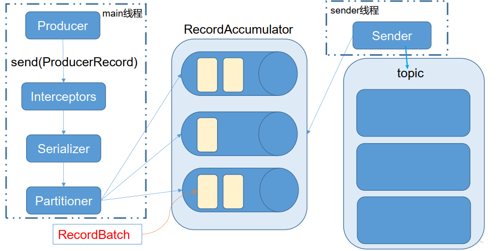
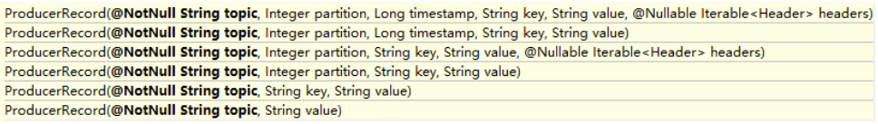

---

Created at: 2021-09-08
Last updated at: 2022-06-25


---

# 5-生产者的分区策略 及 生产者API


消息发送流程：
Kafka 的 Producer 发送消息采用的是**异步发送**的方式。在消息发送的过程中，涉及到了两个线程——main 线程和 Sender 线程，以及一个线程共享变量——RecordAccumulator。main 线程将消息发送给 RecordAccumulator， Sender 线程不断从 RecordAccumulator 中拉取消息发送到 Kafka broker。如下图所示：

在main线程中，消息的发送需要经过拦截器、序列化器、分区器才会进入RecordAccumulator。
分区器是用来决定将消息发送到哪个分区的，在发送消息时需要将数据封装成一个 ProducerRecord 对象，Kafka中提供的默认分区器是DefaultPartitioner，它实现了Partitioner接口，DefaultPartitioner会根据new ProducerRecord对象时指定的参数来决定， 具体规则如下：

（1）指明 partition 的情况下，直接将指明的值直接作为 partiton 值。
（2）没有指明 partition 值但有 key 的情况下，将 key 的 hash 值与 topic 的 partition 数进行取余得到 partition 值，该方式可以保证具有相同key的消息进入到同一个分区。
（3）既没有 partition 值又没有 key 值的情况下，会将连续的消息发送给一个分区，然后再将下一波连续消息发送给下一个分区。控制台客户端生产者就是这种策略，因为控制台生产者只能提供value。
（4）用户也可以自定义分区策略。

生产者代码测试，开启两个属于同一个消费者组的控制台客户端消费者，观察打印结果。
1.导入依赖
```
<dependency>
    <groupId>org.apache.kafka</groupId>
    <artifactId>kafka-clients</artifactId>
    <version>2.8.0</version>
</dependency>
<dependency>
    <groupId>org.slf4j</groupId>
    <artifactId>slf4j-simple</artifactId>
    <version>1.7.30</version>
</dependency>
```

2\. 不带回调函数的 API
KafkaProducer：需要创建一个生产者对象，用来发送数据
ProducerConfig：获取所需的一系列配置参数
    相关参数：
    batch.size： 只有数据积累到 batch.size 之后， sender 才会发送数据。
    linger.ms： 如果数据迟迟未达到 batch.size， sender 等待 linger.time 之后就会发送数据。
ProducerRecord：每条数据都要封装成一个 ProducerRecord 对象
```
public class ProducerTest {
    public static void main(String[] args) {
        Properties properties = new Properties();
        ////kafka集群连接地址
        properties.put(ProducerConfig.BOOTSTRAP_SERVERS_CONFIG, "Hadoop102:9092,Hadoop103:9092,Hadoop104:9092");
        //消息发送失败后重发消息的次数
        properties.put(ProducerConfig.RETRIES_CONFIG, 1);
        //acks类型
        properties.put(ProducerConfig.ACKS_CONFIG, "all");
        //只有数据积累到 batch.size 之后， sender 才会发送数据
        properties.put(ProducerConfig.BATCH_SIZE_CONFIG, 16384);//16KB
        //如果数据迟迟未达到 batch.size， sender 等待 linger.time 之后也会发送数据。
        properties.put(ProducerConfig.LINGER_MS_CONFIG, 1);
        //RecordAccumulator 缓冲区大小
        properties.put(ProducerConfig.BUFFER_MEMORY_CONFIG, 33554432);//32Mb
        //指明序列化key的类
        properties.put(ProducerConfig.KEY_SERIALIZER_CLASS_CONFIG, "org.apache.kafka.common.serialization.StringSerializer");
        //指明序列化value的类
        properties.put(ProducerConfig.VALUE_SERIALIZER_CLASS_CONFIG, "org.apache.kafka.common.serialization.StringSerializer");
        //生产者
        Producer<String, String> producer = new KafkaProducer<>(properties);
        //发送消息
        for (int i = 0; i < 100; i++) {
            //既没有 partition 值又没有 key 值的情况下，会将连续的消息发送给一个分区，再运行则会将下一波连续消息发送给下一个分区
            //producer.send(new ProducerRecord<>("test-group", Integer.toString(i)));
            //没有指明 partition 值但有 key 的情况下，将 key 的 hash 值与 topic 的 partition 数进行取余得到 partition 值，这里key是递增的，所以会轮流地发往每一个分区
            producer.send(new ProducerRecord<>("test-group", Integer.toString(i), Integer.toString(i)));
        }
        producer.close();
    }
}
```

3\. 带回调函数的 API
回调函数会在 producer 收到 ack 时调用，为异步调用， 该方法有两个参数，分别是RecordMetadata 和 Exception，如果 Exception 为 null，说明消息发送成功，如果Exception 不为 null，说明消息发送失败。 注意：设置acks=1或-1时，消息发送失败会自动重试，不需要我们在回调函数中手动重试。
```
public class CallbackProducer {
    public static void main(String[] args) {
        Properties properties = new Properties();
        ////kafka集群连接地址
        properties.put(ProducerConfig.BOOTSTRAP_SERVERS_CONFIG, "Hadoop102:9092,Hadoop103:9092,Hadoop104:9092");
        //消息发送失败后重发消息的次数
        properties.put(ProducerConfig.RETRIES_CONFIG, 1);
        //acks类型
        properties.put(ProducerConfig.ACKS_CONFIG, "all");
        //指明序列化key的类
        properties.put(ProducerConfig.KEY_SERIALIZER_CLASS_CONFIG, "org.apache.kafka.common.serialization.StringSerializer");
        //指明序列化value的类
        properties.put(ProducerConfig.VALUE_SERIALIZER_CLASS_CONFIG, "org.apache.kafka.common.serialization.StringSerializer");
        //生产者
        Producer<String, String> producer = new KafkaProducer<>(properties);
        //发送消息
        for (int i = 0; i < 100; i++) {
            producer.send(new ProducerRecord<>("test-group", Integer.toString(i)), (metadata, exception) -> {
                System.out.println(Thread.currentThread().getName());
                if (exception != null) {
                    System.out.println("send fail");
                } else {
                    System.out.println("send success");
                    System.out.println("topic: " + metadata.topic());
                    System.out.println("partition: " + metadata.partition());
                    System.out.println("offset: " + metadata.offset());
                }
            });
        }
        producer.close();
    }
}
```

4\. 同步发送
同步发送的意思就是，一条消息发送之后，会阻塞当前线程， 直至返回 ack。由于 send 方法返回的是一个 Future 对象，根据 Futrue 对象的特点，我们也可以实现同步发送的效果，只需在调用 Future 对象的 get 方发即可。
```
public class SyncSend {
    public static void main(String[] args) throws ExecutionException, InterruptedException {
        Properties properties = new Properties();
        ////kafka集群连接地址
        properties.put(ProducerConfig.BOOTSTRAP_SERVERS_CONFIG, "Hadoop102:9092,Hadoop103:9092,Hadoop104:9092");
        //消息发送失败后重发消息的次数
        properties.put(ProducerConfig.RETRIES_CONFIG, 1);
        //acks类型
        properties.put(ProducerConfig.ACKS_CONFIG, "all");
        //指明序列化key的类
        properties.put(ProducerConfig.KEY_SERIALIZER_CLASS_CONFIG, "org.apache.kafka.common.serialization.StringSerializer");
        //指明序列化value的类
        properties.put(ProducerConfig.VALUE_SERIALIZER_CLASS_CONFIG, "org.apache.kafka.common.serialization.StringSerializer");
        //生产者
        Producer<String, String> producer = new KafkaProducer<>(properties);
        //发送消息
        for (int i = 0; i < 100; i++) {
            producer.send(new ProducerRecord<>("test-group", Integer.toString(i), Integer.toString(i)))`.get();`
        }
        producer.close();
    }
}
```

**如何保持生产者发送消息的顺序？**
我们知道消息只在一个分区内是有序的，如果一个topic有多个分区，那么所有消息在整个topic全局是无序的，所以要想保持生产者发送消息的顺序，topic就必须只能有一个分区，不过即使topic只有一个分区也不能完全保持消费者发送消息的顺序性，因为生产者发送消息是异步的，并不会每次都等待上一次消息发送成功并收到返回的ack之后再发送下一条消息，比如出现1、2、3号消息按序发送到只有一个分区的topic，但是由于1号消息发送过程中丢失了，只能重发1号消息，导致最终Kafka收到消息的顺序是2、3、1。如果想要在消息队列中保持生产者发送消息的顺序，有3种办法，当然3种办法的前提都是topic只能有一个分区：

1. 开启幂等，Kafka的幂等性会保证一个分区内消息不重复，和保持消费者发送消息的顺序
2. 使用以上同步发送消息的方式
3. 设置生产者参数max.in.flight.requests.per.connection=1，此参数的意思是，在生产者收到服务器发送过来的ack之前能发送多少条消息，设置参数值为1就和上面同步发送消息一样了。

5.自定义分区策略
（1）实现Partitioner接口，configure()在分区器第一次使用时执行，并且只会执行一次；partition()方法会在生产者发送每一条数据时执行，close()方法会在生产者调用producer.close()时执行，producer.close()不仅会执行所有分区器的close方法，还会执行所有拦截器的close方法。
```
public class MyPartition implements Partitioner {
    @Override
    public int partition(String topic, Object key, byte[] keyBytes, Object value, byte[] valueBytes, Cluster cluster) {
        return 1;
    }
    @Override
    public void close() {}
    @Override
    public void configure(Map<String, ?> configs) {}
}
```
（2）在生产者的配置信息中指定分区器
```
public class Producer {
    public static void main(String[] args) {
        Properties properties = new Properties();
        ////kafka集群连接地址
        properties.put(ProducerConfig.BOOTSTRAP_SERVERS_CONFIG, "Hadoop102:9092,Hadoop103:9092,Hadoop104:9092");
        //开启幂等
        properties.put(ProducerConfig.ENABLE_IDEMPOTENCE_CONFIG, true);
        `//指定自定义的分区器`
 `properties.put(ProducerConfig.PARTITIONER_CLASS_CONFIG, "producer.partition.MyPartition");`
        //指明序列化key的类
        properties.put(ProducerConfig.KEY_SERIALIZER_CLASS_CONFIG, "org.apache.kafka.common.serialization.StringSerializer");
        //指明序列化value的类
        properties.put(ProducerConfig.VALUE_SERIALIZER_CLASS_CONFIG, "org.apache.kafka.common.serialization.StringSerializer");
        //生产者
        org.apache.kafka.clients.producer.Producer<String, String> producer = new KafkaProducer<>(properties);
        //发送消息
        for (int i = 0; i < 100; i++) {
            producer.send(new ProducerRecord<>("test-group", Integer.toString(i), Integer.toString(i)));
        }
        producer.close();
    }
}
```

