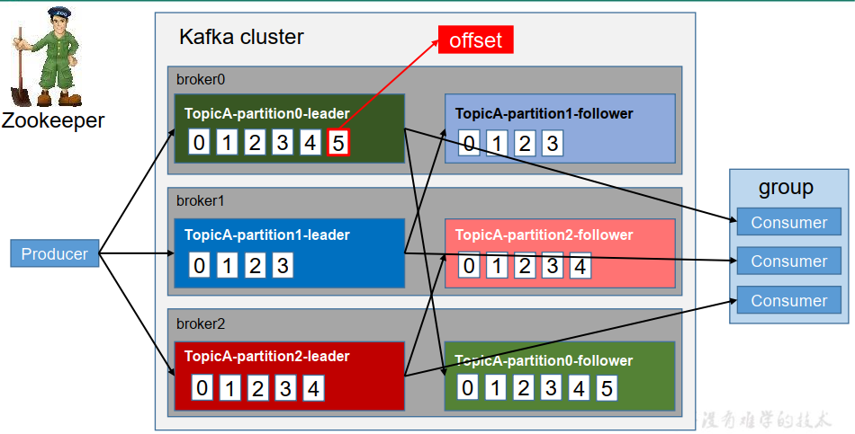
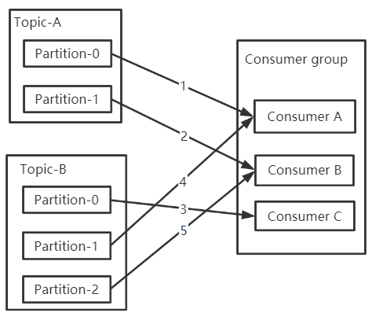
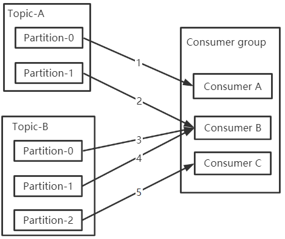
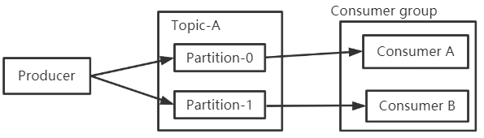

---

Created at: 2021-09-08
Last updated at: 2021-10-22
Source URL: https://segmentfault.com/a/1190000023723090


---

# 7-消费者组的offset 和 消费者组的分区分配策略


为什么说消息是以消费者组为单位进行消费的（当没有指定一个消费者属于哪个组时，Kafka会默认给它分配一个组，这个组里就它一个消费者）？
因为不允许同一个消费者组的不同消费者消费一个消息两次，所以整个消费者组在逻辑上视为一个消费者，也就是说消息是以消费者组为单位进行消费的。这很合理， 因为消费者组里的消费者应该是整个微服务架构里面的同一个服务的多个实体（整多个实体是为提升系统性能），这多个实体之间不能出现重复消费消息的情况。

消费者组的offset
因为不允许同一个消费者组的不同消费者消费一个消息两次，所以整个消费者组在逻辑上视为一个消费者，也就是说消息是以消费者组为单位进行消费的；又因为消费者组是以分区为单位消费topic的消息，而且一个分区可以被不同的消费者组消费，所以Kafka必须为每一个消费者组记录一个在此分区消费的位置offset。每一个消费者组都有一个唯一的consumer-group-id，于是使用<consumer-group-id，topic，partition>作为key是具有唯一性的，value就是offset的值。如下图所示，分区里的每一个消息都有一个偏移量，从0开始，offset正是记录的这个值。


为什么同一个消费者组里面的两个及以上的消费者不能同时消费同一个分区的消息？
因为offset是以消费者为单位进行维护的，而不是以单个消费者为单位，比如说如果有A、B两个消费者同时消费一个分区的消息（这里并没有重复消息的情况），A消费者消费这个分区的1、2、3号消息，B消费者消费这个分区的4、5、6号消息，然后B消费者先提交修改offset为6，接着A消费者提交修改offset为3，那么就出现问题了，这与多线程修改同一个变量类似。

以上说明了为什么要以消费者组为单位消费消息，和为什么同一个消费者组里面不能有多个消费者同时消费消息。那具体该如何把分区分配给消费者组里的消费者呢，这就是消费者组的分区分配策略要讨论的问题。Kafka提供了三种分配策略：

* RangeAssignor
* RoundRobinAssignor
* StickyAssignor

默认使用的是 RangeAssignor，可以通过配置 partition.assignment.strategy 来改变消费组的分区策略。当然，我们也可以自定义分区分配策略，只需要继承 AbstractPartitionAssignor 抽象类即可。

RoundRobinAssignor：
把topic的分区轮流地分配给同一个消费者组里的消费者，此种分配方式可以保证分得分区最多的消费者和分得分区最少的消费者只差一个分区，这样很均匀，但是这样不能实现同一个消费者组里的消费者订阅不同的topic（我也搞不懂一个消费者组里的消费者为什么要订阅不同的topic，这与我上面的理解相悖，想订阅不同的topic，你就不应该放在同一组里）。


RangeAssignor：
Range分配方式可以实现同一个消费者组里的消费者订阅不同的topic，比如A、B消费者订阅Topic-A，那就把Topic-A的分区除以2，前一半分给A消费者，后一半分给B消费者；B、C消费者订阅Topic-B，同样也是把Topic-B的分区除以2，前一半分给B消费者，后一半分给C消费者。这样分就不是很均匀了，分得分区最多的消费者和分得分区最少的消费者可能会相差很多，其实轮流分也相当于是除以消费者个数，这里分得不均匀的根本问题在于按topic分。（下面出现了一个消费者订阅同一个topic的多个分区，这是允许的，并没有出现一个分区被同一组的多个消费者订阅）


出现以下三种情况都会启用分配策略重新分配分区（Rebalance）：
1.有新的消费者加入消费者组
2.有消费者退出消费者组
3.topic新增分区

消费者组测试案例，验证：
a.同一个消费者组的消费者只能订阅同一个topic的不同分区，如果有消费者加入或退出消费者组就会引起分区重新分配消费者组里的每一位消费者。
b.如果整个消费者组下线了，当这个消费者组里的某一位消费者上线时，会接着从上次消费的位置继续消费

1.在 hadoop103、 hadoop104 上修改 /opt/module/kafka\_2.13-2.8.0/config/consumer.properties 配置文件中的组名 group.id
```
group.id=AAA
```
2.创建一个两个分区的topic
```
kafka-topics.sh --create --topic test-group --partitions 2 --bootstrap-server localhost:9092
```
3\. 在 hadoop103、 hadoop104 上分别启动消费者
```
kafka-console-consumer.sh --topic test-group --consumer.config /opt/module/kafka_2.13-2.8.0/config/consumer.properties --bootstrap-server localhost:9092
```
4\. 在 hadoop102 上启动生产者
```
kafka-console-producer.sh --topic test-group --bootstrap-server localhost:9092
```
5.如果这时再开一个消费者加入到AAA组，就会引起消费者组的分区分配，效果就是之前的某一个消费者可能会被挤下去，被挤下去的消费者就是没有分配到分区的，不过也有可能之前的消费者都没有被挤下去，这时就是新加入的消费者没有分配到分区。没有分配到分区的消费者是接收不到消息的。
6.关闭所有消费者，生产者继续发送消息，这时再启动AAA消费者组的一个消费者，会发现这个消费者会从上次消费的位置继续消费，也就是会消费消费者组下线期间生产者生产的消息，如果再启动AAA消费者组的另一个消费者，则不会消费消费者组下线期间生产者生产的消息，因为消费者组的前一个消费者已经把这些消息消费了，并且改变并提交了offset。

