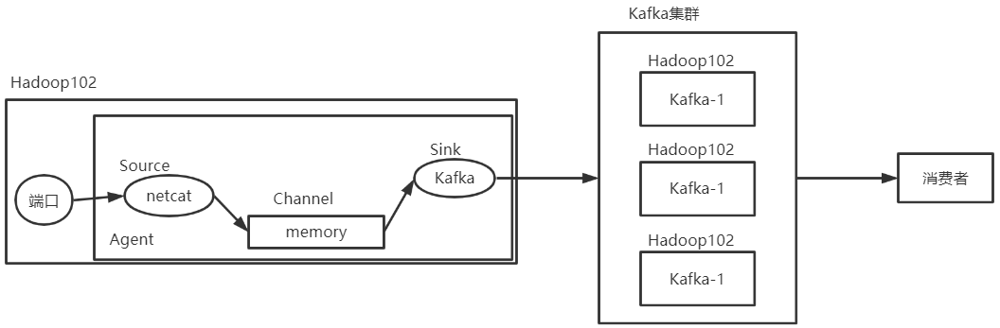

---

Created at: 2021-09-10
Last updated at: 2021-10-22
Source URL: about:blank


---

# 9-Flume 与 Kafka 对接



Flume 与 Kafka 对接：在Kafka上创建两个topic，实现端口数据中包含hello的进入topic-a，不包含hello的进入topic-b，然后启动两个消费者分别消费topic-a 和 topic-b的数据。
实现思路：Kafka sink就是Kafka的生产者，该生产者会对flume event的头进行检查，根据event head中的topic属性的值将消息发送到相应的topic。
1.要想实现在event 头里面设置属性，就必须实现flume的拦截器
flume拦截器的代码：
```
public class TopicInterceptor implements Interceptor {
    @Override
    public void initialize() {}

    @Override
    public Event intercept(Event event) {
        Map<String, String> headMap = event.getHeaders();
        String body = new String(event.getBody());
        if (body.contains("hello")) {
            headMap.put("topic", "topic-a");
        } else {
            headMap.put("topic", "topic-b");
        }
        return event;
    }

    @Override
    public List<Event> intercept(List<Event> list) {
        for (Event event : list) {
            intercept(event);
        }
        return list;
    }

    @Override
    public void close() {}

    public static class Builder implements Interceptor.Builder{
        @Override
        public Interceptor build() {
            return new TopicInterceptor();
        }
        @Override
        public void configure(Context context) {
        }
    }
}
```

2.把拦截器打包放到/opt/module/flume-1.9.0/lib，然后flume配置文件 flume-kafka.conf：
```
# Name the components on this agent
a1.sources = r1
a1.sinks = k1
a1.channels = c1

# Describe/configure the source
a1.sources.r1.type = netcat
a1.sources.r1.bind = localhost
a1.sources.r1.port = 44444

`# 拦截器`
`a1.sources.r1.interceptors = i1`
`a1.sources.r1.interceptors.i1.type =interceptor.TopicInterceptor$Builder`

# Describe the sink
`a1.sinks.k1.type = org.apache.flume.sink.kafka.KafkaSink`
`# 如果event head中没有指定topic，那么消息将发往a1.sinks.k1.kafka.topic指定的topic`
`a1.sinks.k1.kafka.topic = topic-a`
`a1.sinks.k1.kafka.bootstrap.servers = hadoop102:9092,hadoop103:9092,hadoop104:9092`
`a1.sinks.k1.kafka.flumeBatchSize = 20`
`a1.sinks.k1.kafka.producer.acks = 1`
`a1.sinks.k1.kafka.producer.linger.ms = 1`

# Use a channel which buffers events in memory
a1.channels.c1.type = memory
a1.channels.c1.capacity = 1000
a1.channels.c1.transactionCapacity = 100

# Bind the source and sink to the channel
a1.sources.r1.channels = c1
a1.sinks.k1.channel = c1
```

3.在Hadoop102上启动flume
```
bin/flume-ng agent -c conf/ -n a1 -f job/flume-kafka.conf
```
启动netcat客户端
```
nc localhost 44444
```
启动两个消费者分别消费topic-a 和 topic-b的数据
```
kafka-console-consumer.sh --topic topic-a --bootstrap-server localhost:9092
```
```
kafka-console-consumer.sh --topic topic-b --bootstrap-server localhost:9092
```

