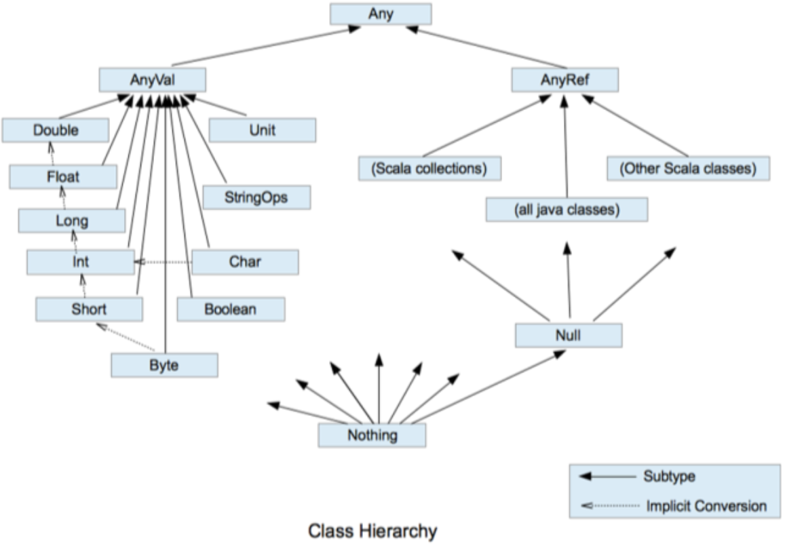
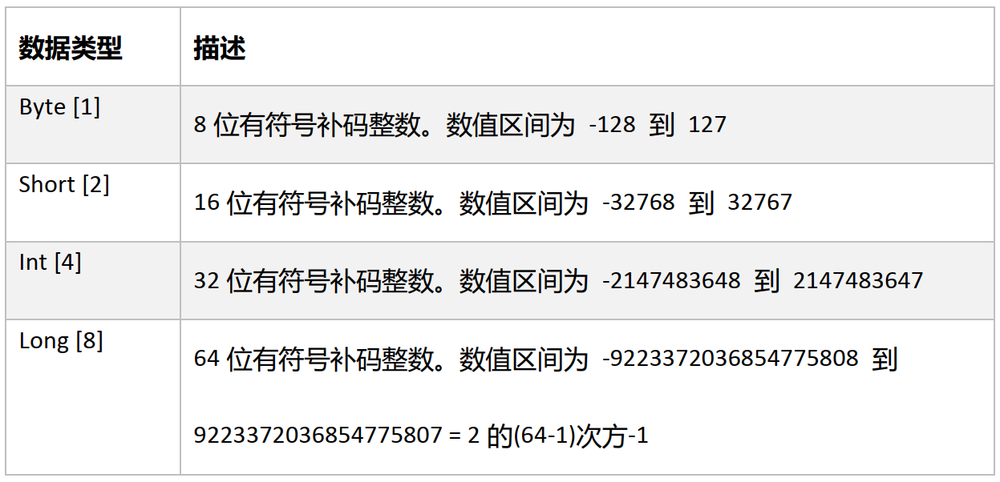
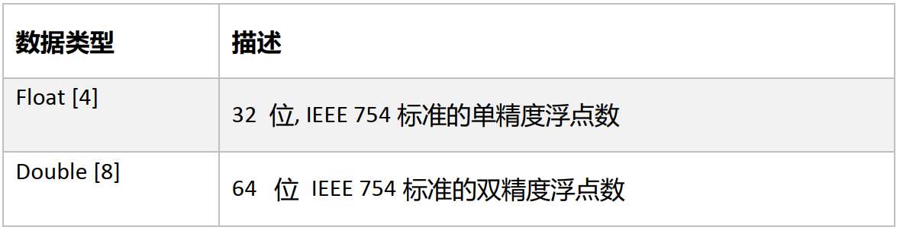
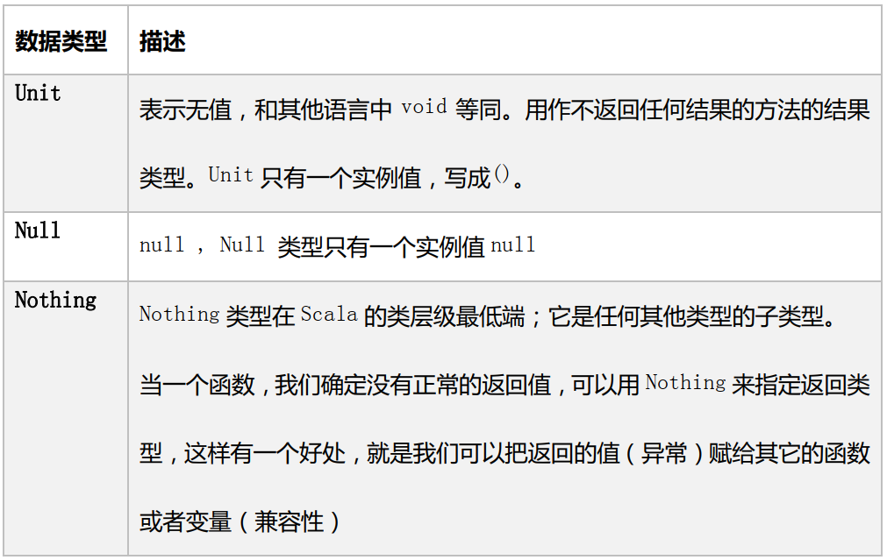
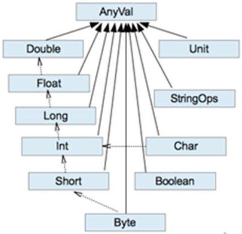

---

Created at: 2021-09-16
Last updated at: 2021-11-14


---

# 3-变量和数据类型


**变量声明**
声明变量：var 变量名 \[: 变量类型\] = 初始值，如：var i:Int = 10
声明常量：val 常量名 \[: 常量类型\] = 初始值，如：val i:Int = 10
注意： 能用常量的地方不用变量
1.声明变量时，类型可以省略，编译器自动推导，即类型推导
2.变量声明时，必须要有初始值
3.Scala 是强数据类型语言，类型确定后不能修改
```
var a = 10
a = "a"//错误
```

**标识符的命名规范**
Scala 对各种变量、 方法、 函数等命名时使用的字符序列称为标识符。即： 凡是自己可以起名字的地方都叫标识符。
命名规则：
1\. 以字母或者下划线开头，后接字母、数字、下划线
2\. 以操作符开头，且只包含操作符（ + - \* / # !等），这就是为什么Scala中+等等符号其实是一个方法
3\. 用反引号\`....\`包括的任意字符串，即使是 Scala 关键字（ 39 个）也可以

**字符串的操作**
1\. +号连接
```
var str = 2 + "2"
println(str)   //22
```
2\. \*号
```
var str = "2" * 3
println(str) //222
```
3\. printf 字符串格式化输出，通过%传值
```
printf("name=%s, age=%d\n", "alice", 12)
```
3\. 字符串模板（插值字符串） ： 通过$获取变量值，注意：①双引号前面的s不能掉 ②大括号可以省略，但是一般加上，可读性更好
```
val name = "alice"
val age = 12
var str = s"name=${name}, age=${age}"
println(str)  //name=alice, age=12

var d: Double = 1.23456789
str = s"d=${d}"
println(str) //d=1.23456789
```
格式化浮点数，双引号前面加的是f，10表示最后输出的整个浮点数占10位，不足10位用空格补齐，.2表示保留两位小数
```
var d: Double = 1.23456789
println(f"d=${d}%10.2f")  //d=      1.23
```
等价于：
```
var d: Double = 1.23456789
println(d.formatted("%10.2f"))
```
双引号前面加的是raw，表示的是原封不动的输出字符串中的内容，不管有没有转义字符等等
```
println(raw"\t\n")  \\  \t\n
```
4\. 三个双引号
4.1 使用三个双引号可以直接输出三个双引号包裹的原封不动的内容，不管有没有转义字符等等，与双引号前面加的是raw的功能一样
```
var str = """\t\n"""
println(str) \\  \t\n
```
4.2使用三个双引号的.stripMargin，可以格式化多行内容，通过竖杠|来对齐，也就是输出时会把竖杠 | 及前面空格去掉
```
var str = """select *
       |from emp
       |where eno<1001;
       |""".stripMargin
println(str)
```
输出：
```
select *
from emp
where eno<1001;
```

**输入输出**
标准输入输出
标准输入：StdIn.readLine()、 StdIn.readShort()、 StdIn.readDouble()等等
```
println(StdIn.readLine())
```
从文件中读取
```
val a = Source.fromFile("src/main/resources/a.txt")
a.foreach(print)
a.close()
```
写入到文件，Scala没有提供输出到文件的api，不过可以直接使用Java的io
```
val writer = new PrintWriter(new File("src/main/resources/b.txt"))
writer.write("bbbbb")
writer.close()
```

**数据类型**
不像Java的八大基本数据类型不是类，在Scala中一切皆是对象，所以Scala的所有数据类型都是类，并且有共同的祖先Any。
Scala中数据类型分为两大类：数值类型（ AnyVal） 、引用类型（AnyRef）

1\. Scala数据类型仍然遵守低精度的值类型向高精度值类型的自动转换（隐式转换）
2\. Scala中的StringOps是对Java String的增强，Scala也有String类型，Scala的String其实就是Java的String，属于AnyRef下的(all java classes)
3\. Unit：Unit是一个数据类型， 只有一个对象就是()。对应Java中的void， 用于方法返回值的位置， 表示方法没有返回值。
4\. Null：Null是一个数据类型，只有一个对象就是null。 它是所有引用类型（AnyRef） 的子类。
5\. Nothing， 是所有数据类型的子类，当一个函数没有明确返回值时使用。

整数类型（ Byte、 Short、 Int、 Long）

1\. Scala 各整数类型有固定的字节数和表示范围，超出表示的范围的赋值会报错
```
// 正确
var n1:Byte = 127
var n2:Byte = -128
// 错误
// var n3:Byte = 128
// var n4:Byte = -129
```
2.Scala 的整型，默认为 Int 型，声明 Long 型，须后加‘l’或‘L
```
var n5 = 10 //默认为 Int 型
println(n5)
var n6 = 9223372036854775807L
println(n6)
```

浮点类型（ Float、 Double）

Scala 的浮点型常量默认为 Double 型，声明 Float 型常量，须后加‘f’或‘F’
```
var n7 = 2.2345678912f
var n8 = 2.2345678912
```

Unit 类型、 Null 类型和 Nothing 类型（重点）

Unit：Unit是一个数据类型， 只有一个对象就是()。对应Java中的void， 用于方法返回值的位置， 表示方法没有返回值。
```
val a: Unit = ()
println(a)

def func(): Unit = {}
val b = func()
println(b)
```
Null是一个数据类型，只有一个对象就是null。 它是所有引用类型（AnyRef） 的子类。
```
val a: Null = null
println(a)

var b: Student = new Student("alice", 20)
b = null
println(b)

// 报错，因为null是Null的实例，Null是所有引用类型（AnyRef） 的子类，
// 不是AnyVal的子类，所以无法进行隐式类型转换
val c: Int = null
```
Nothing，是所有数据类型的子类，当一个函数没有明确返回值时使用，比如Breaks类的break()方法。也因为 Nothing 是所有类型的子类型，所以 throw 表达式可以用在需要类型的地方。
```
def break(): Nothing = { throw breakException }
```

**数值类型自动转换**
当 Scala 程序在进行赋值或者运算时，精度小的类型自动转换为精度大的数值类型，这个就是自动类型转换（隐式转换）。转换关系如下图：

1.把精度大的数值类型赋值给精度小的数值类型时，就会报错，反之就会进行自动类型转换。
```
val a: Int = 10
val b: Byte = a //错误，不能把高精度赋给低精度
```
2.自动提升原则：有多种类型的数据混合运算时，系统首先自动将所有数据转换成精度大的那种数据类型，然后再进行计算。
```
var n = 1 + 2.0   //n 是 Double类型
```
3.（ byte， short）和 char 之间不会相互自动转换。
```
val a: Char = 'c'
val b: Byte = a//错误
val c: Short = a//错误

val d: Byte = 97
val e: Short = 97
val f: Char = d//错误
val g: Char = e//错误
```
Char可以自动转换成Int，但是Int不能自动转换成Char
```
val a: Char = 'c'
val b: Int = a  //可以
println(b)

val c: Char = b  //错误
println(c)
```
4.byte， short， char 他们三者可以计算， 在计算时会转换为 int 类型。
```
val a: Byte = 10
val b: Short = 20
val c: Char = 'c'
val d: Short = a + b //错误，Byte和Short相加的结果是Int，这点是与第二点自动提升原则相悖的
val d: Short = a + c  //错误，Byte和Char相加的结果是Int
```

**强制类型转换**
高精度向低精度的强制转换
```
var n: Int = 2.5.toInt
```
String 类型向数值类型转换
```
val s1: String = "123"
val n1: Byte = s1.toByte
val n2: Short = s1.toShort
val n3: Int = s1.toInt
val n4: Long = s1.toLong
val n5: Float = s1.toFloat

val n6: Int = "12.3".toInt  //错误
val n6: Int = "12.3".toFloat.toInt //可以
```

