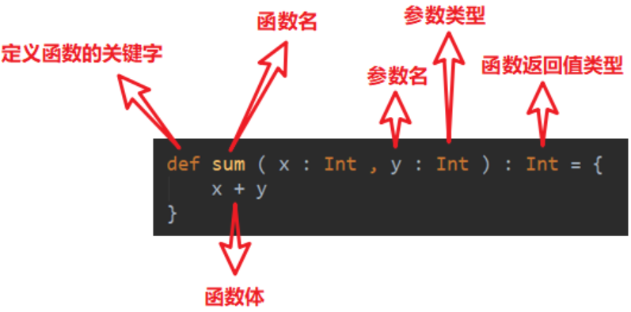

---

Created at: 2021-09-17
Last updated at: 2021-10-08


---

# 5-函数式编程


**函数定义的基本语法：**

在Java中只有方法的概念，并且只能在类中定义，但是在Scala中是区分函数和方法两个概念的，只有在类中定义的函数才称之为方法，于是在Scala中方法与函数的区别有两点：
1.函数没有重载和重写的概念，不能在同一个作用域内定义两个同名的函数，但是方法可以进行重载和重写。
2.方法只能提供类的对象来调用，而函数声明之后可以直接调用。
函数和方法除了以上两点不同外，其它没有什么不同，Scala中方法同样可以像函数一样赋值给变量。
在类的方法中定义的称为函数，同一个作用域不能有同名的函数，以下会报错：
```
object FunctionAndMethod {
  def main(args: Array[String]): Unit = {
    //错误，同一个作用域不能有同名的函数
    def func(name: String): Unit = {
      println(name)
    }
    def func(): Unit = {
      println("没有参数的函数")
    }
  }
}
```
在类中定义的称为方法，方法名可以相同，即方法可以进行重载和重写
```
object FunctionAndMethod {
  def main(args: Array[String]): Unit = {
    func("alice")
    func()
  }

  def func(name: String): Unit = {
    println(name)
  }

  def func(): Unit = {
    println("没有参数的方法")
  }
}
```

**Scala函数参数有如下特点**：
1.可变参数，如果参数列表中存在多个参数，那么可变参数只能放在最后
```
def test(args : String*): Unit = {
  println(args)
}
```

以下两个特点是Java方法没有的：
2.参数可以有默认值，一般将有默认值的参数放置在参数列表的后面
```
def test(name: String, age: Int = 30): Unit = {
  println(s"$name, $age")
}
```
3.带名参数调用
```
def test(name: String, age: Int = 30): Unit = {
  println(s"$name, $age")
}
test(age = 18, name = "bob")
```

**函数至简原则**：能省则省
完整函数的定义：
```
def f(name: String): String = {
  return name
}
```
**1.return可以省略**， Scala 会使用函数体的最后一行代码作为返回值
```
def f0(name: String): String = {
  name
}
```
2.如果函数体**只有一行代码，可以省略花括号**
```
def f1(name: String): String = name
```
3.返回值类型如果能够推断出来，那么**返回值类型可以省略**（ :和返回值类型一起省略）
```
def f2(name: String) = name
```
注意：如果有 return，则不能省略返回值类型，必须指定
```
def f3(name: String) = return name //错误，如果有 return，则不能省略返回值类型，必须指定
```
4.如果函数明确声明 unit，那么即使函数体中使用 return 关键字也不起作用
```
def f4(name: String): Unit = {
  return name
}

println(f4("alice")) //输出()
```
5.如果返回值类型是Unit，可以省略等号
```
def f5(name: String) {
  println(name)
}
```
6.如果函数无参，但是函数声明时加了()，那么调用时，小括号，可加可不加
```
def f6() {
  println("空参，但是函数声明时加了()")
}
f6
```
如果函数无参，那么函数声明时小括号可以省略，但是调用时小括号必须省略
```
def f7 {
  println("空参，但是函数声明时加了()")
}
f7
//f7() //错误，调用时小括号必须省略
```

7.**匿名函数，lambda表达式**
如果并不关心函数名，还可以使用匿名函数的写法，匿名函数的定义是：(参数名:参数类型，...) => {函数体} ，因为返回值类型都是编译器可以推断出来的，所以定义匿名函数时不需要，也不能指定返回值类型。
```
(name: String) => println(name)
```
7.1 匿名函数可以赋值给一个变量
```
val f8 = (name: String) => println(name)
f8("bob")
```
匿名函数的类型是：参数类型 => 返回值类型，所以上面f8的类型可以根据匿名函数的参数和返回值推导得到，也可以直接明确的写出来 String => Unit
```
val f8: String => Unit = (name: String) => println(name)
```

**7.2 匿名函数的简化：**
**7.2.1 匿名函数只有一个参数时，括号可以省略**，此时参数的类型也必须跟着一起省略，参数的类型可以根据f8的类型进行推导（根据被赋值的变量的类型进行推导），所以f8的类型必须明确指定。也就是在匿名函数中， 被赋值的变量的类型和匿名函数的参数类型必须指定一个：
```
val f8: String => Unit = name => println(name)
```
**7.2.2 匿名函数如果只有一行， 则花括号也可以省略**
**7.2.3 匿名函数作为参数进行传递时，匿名函数的参数类型可以省略**，会根据形参进行自动的推导（根据被赋值的变量的类型进行推导），匿名函数最主要的作用就是作为参数进行传递
```
def f9(func: String => Unit): Unit = {
  func("xxx")
}
f9(name => println(name))
```
7.2.4 如果匿名函数参数列表中的所有参数只在函数体出现一次，并且是按照参数列表中参数声明的顺序出现的，则参数可以省略，并将用到该参数的地方用\_下划线代替
```
f9(println(_))
```
7.2.5 可以看到匿名函数 name => println(name) 只是调用了println函数，所以可以直接将println函数进行传递，也就是将println函数直接赋值给形参func（这就是Java中的方法引用的来源 [10-Scala的方法 与 Java的方法引用](10-Scala的方法 与 Java的方法引用) ），这与前面将匿名函数赋值给形参func是有区别的。
```
f9(println)
```

**省略规则就记住一点：非匿名函数省return和返回值类型；在匿名函数中，** **被赋值的变量的类型和匿名函数的参数类型必须至少指定一个，所以如果****匿名函数如果作为参数传递可以更进一步省略参数类型，因为其参数类型可以根据形参（即被赋值的变量）的类型推导出来。**

**函数的高阶用法：**
1\. 函数可以作为值进行传递，也就是把函数体当作是一个对象赋值给一个引用
匿名函数可以直接赋值给一个变量
```
val f8: String => Unit = name => println(name)
```
那非匿名函数呢，是不是可以直接将函数名赋值给一个变量，答案是可以，这相当于是把一个引用赋值给另一个引用，有如下两种方式：
一是指直接将函数名赋值给一个变量，但必须指定变量的类型，也就是函数的类型
```
def fun(): Unit = {
  println("i like scala")
}
//如果想将fun函数赋值给常量f，不能直接像下面这样写，因为直接写fun是调用fun函数
val f0 = fun
println(f0) //打印()
//必须指定变量的类型，也就是必须指明变量是一个函数类型，这样才不会引起歧义
val f1: () => Unit = fun
println(f1) //打印fun函数的引用地址
```
二是指如果不指定变量的类型，那就需要在函数名后面加一个 \_，表示这是一个函数，不是函数调用
```
val f2 = fun _
println(f2) //打印fun函数的引用地址
```

2\. 函数可以作为参数进行传递
```
def calculator(a: Int, b: Int, op: (Int, Int) => Int): Int = {
  op(a, b)
}
println(calculator(2, 3, (x , y) => x + y))
```

3\. 函数可以作为函数返回值返回
```
def f(a:String): String => Unit ={
  def f(b:String): Unit ={
    println(a + ":" + b)
  }
  f  //将函数直接返回
}
f("a")("b") //调用
```

案例练习：
1.定义一个匿名函数，并将它作为值赋给变量 fun。函数有三个参数，类型分别 为 Int， String， Char，返回值类型为 Boolean。要求调用函数f(0) ("") ('0')得到返回值为 false，其它情况均返回 true。
```
val fun = (a: Int, b: String, c: Char) => !(a == 0 && b == "" && c == '0')
```
因为在匿名函数中， 被赋值的变量的类型和匿名函数的参数类型可以只指定一个，所以还可以这样写：
```
val fun: (Int, String, Char) => Boolean = (a, b, c) => !(a == 0 && b == "" && c == '0')
```
2\. 定义一个函数 f，它接收一个 Int 类型的参数，返回一个函数（记作 f1）。它返回的函数 f1，接收一个 String 类型的参数，同样返回一个函数（记作 f2）。函数 f2 接收一个 Char 类型的参数，返回一个 Boolean 的值。要求调用函数 f(0) ("") ('0')得到返回值为 false，其它情况均返回 true。
```
def f(a: Int): String => Char => Boolean = {
  def f(b: String): Char => Boolean = {
    def f(c: Char): Boolean = {
      !(a == 0 && b == "" && c == '0')
    }
    f
  }
  f
}
```
或者：
```
def f(a: Int) = {
  def f(b: String) = {
    def f(c: Char) = {
      !(a == 0 && b == "" && c == '0')
    }
    f _
  }
  f _
}
```
因为并不关心内层函数的名字，所以可以采用匿名函数的写法：
```
def f(a: Int) = {
  (b: String) => (c: Char) => !(a == 0 && b == "" && c == '0')
}
```
在匿名函数中， 被赋值的变量的类型和匿名函数的参数类型可以只指定一个，所以还可以这样写：
```
def f(a: Int): String => Char => Boolean = {
  b => c => !(a == 0 && b == "" && c == '0')
}
```
调用如下，可以看到f(0)的返回值是一个函数，于是可以继续进行函数的调用，但是从jvm执行的角度来看，当f(0)调用结束时，f(0)已经弹栈了，按道理来说f(0)的局部变量a也已经跟着没了，为什么内层函数可以继续使用a的值？因为在Scala中，函数也已经变成了一个对象，于是它的局部变量也就跟着对象一起分配在了堆空间中，于是到f(0)弹栈之后，它的局部变量并没有被跟着一起清除掉，于是内层函数依旧可以继续访问得到，此时内层函数所处的变量的环境称为**闭包**。
```
f(0)("")('0')
```
上面函数中套函数的写法可以实现连续使用()调用的效果，这种连续使用()调用的效果就是**柯里化**，即 函数柯里化就是 把一个参数列表的多个参数变成多个参数列表。Scala支持了柯里化，于是上述函数还可以写成这样：
```
def f(a:Int)(b:String)(c:Char): Boolean ={
  !(a == 0 && b == "" && c == '0')
}
```
调用依旧是，但是f(0)的返回值已经不是函数了，更确切的说，f(0)没有返回值，再更确切的说，柯里化之后的函数就是一个整体的函数，不能分开调用了
```
f(0)("")('0')
```

闭包的一个典型应用是可以写出通用性很强的函数，比如下面可以通过改变传给addX的参数生成具有相似功能，但又功能不同的函数：
```
def addX(a:Int): Int => Int ={
  def f(b:Int): Int = a+b
  f
}

val addFour = addX(4) //生成一个功能是加4的函数
println(addFour(5))
val addFive = addX(5) ////生成一个功能是加5的函数
println(addFive(5))
```
上述addX函数根据简化原则还可以写成
```
def addX(a: Int): Int => Int = a + _
```

**递归与尾递归**
只要能用for循环解决的问题都可以使用递归来解决，但是有些问题使用for循环是解决不了的，必须递归，比如汉诺塔问题，所以递归是for循环的超集，在纯函数式编程语言中就没有for循环，只有递归。
计算n的阶乘的for循环的实现：
```
var result: Int = 1
for (i <- 1 to 5) {
  result *= i
}

println(result)
```
计算n的阶乘的递归实现：
```
def factorial(n: Int): Int = {
  if (n == 0) return 1 //这个return必须保留，因为不是最后一行代码
  n * factorial(n - 1)
}

println(factorial(5))
```
在递归实现中，每一层的函数调用的栈帧都要保留，这无疑是没有for循环实现来得更高效，我们知道所有for循环都可以使用递归实现，那有没有一种递归的形式可以实现for循环所做的事情，又不需要每次都保留递归调用的栈帧呢？答案就是尾递归，尾递归就是只在函数的末尾调用自己，不做需要等待下次调用结果的计算，形成一种循环的效果。上述for循环用尾递归实现：
```
def tailFactorial(n: Int): Int = {
  @tailrec
  def loop(n: Int, result: Int): Int = {
    if (n == 0) return result
    loop(n - 1, n * result)
  }
  loop(n, 1)
}

println(tailFactorial(5))
```
loop就是尾递归函数的实现，可以看到loop最后递归调用自己结束是可以直接弹栈的，不需要为自己保留栈帧，所以尾递归的实现和for循环一样高效。虽然上述尾递归代码可以在Java中实现，但是Java却不能真正地实现尾递归的效果，因为尾递归需要编译器的支持。Scala的注解@tailrec用于标明这是一个尾递归函数，和Java@override的作用类似，不是一个功能性的注解，只是标识作用，不标明@tailrec该函数同样是尾递归函数，标明了@tailrec当函数不是尾递归函数时，就会报错。

**控制抽象**
1.值调用，就是普通的值传递
2.名调用：代码块的传递，每次使用这个名，都是在执行代码块
名调用时，参数的类型是 => Int，表示应该传递一个代码块，因为代码块是没有参数的，并且此代码块的返回值是一个Int，注意代码的返回值就是执行最后一条语句的值，不能用return返回。
```
def foo(a: => Int): Unit ={
  println(a)
  println(a)
}

foo({
  println("传名参数")
  23
})
//调用时小括号可以省略
println("========")
foo {
  println("传名参数")
  23
}
```
结果如下，a在函数里被使用了几次，代码块就会被执行几次
```
传名参数
23
传名参数
23
========
传名参数
23
传名参数
23
```

**综合案例：自定义实现while循环**
使用编程语言自带的while：
```
var n = 10
// 1. 常规的while循环
while (n >= 1) {
  println(n)
  n -= 1
}
```
使用名调用实现自定义while，条件和循环里的操作都必须是名传递，也就是代码块，因为只有是代码块才能在每次调用的时候都执行
```
@tailrec
def myWhile(condition: => Boolean, op: => Unit): Unit = {
  if (condition) {
    op
    myWhile(condition, op)
  }
}

var n = 10
myWhile(n >= 1, {
  println(n)
  n -= 1
})
```
只用名调用必须要传递两个参数进行，不能做到自带while那种书写的效果，可以使用柯里化来实现将一个参数列表的多个参数变成多个参数列表
```
@tailrec
def myWhile(condition: => Boolean)(op: => Unit): Unit = {
  if (condition) {
    op
    myWhile(condition)(op)
  }
}
```
传名调用可以省略花括号外面的小括号，于是就做到了自带while那种书写
```
var n = 10
myWhile(n >= 1){
  println(n)
  n -= 1
}
```
也可结合闭包返回函数可以实现这种效果：
```
def myWhile(condition: => Boolean): (=> Unit) => Unit = {
  def doLoop(op: => Unit): Unit = {
    if (condition) {
      op
      myWhile(condition)(op)  //递归调用
    }
  }
  doLoop
}
```
用匿名函数简化内层函数：
```
def myWhile(condition: => Boolean): (=> Unit) => Unit = {
  op => {
    if (condition) {
      op
      myWhile(condition)(op)  //递归调用
    }
  }
}
```
传名调用可以省略花括号外面的小括号，于是就做到了自带while那种书写
```
var n = 10
myWhile(n >= 1){
  println(n)
  n -= 1
}
```

**惰性加载**
当函数返回值被声明为 lazy 时，函数的执行将被推迟，直到我们首次对此取值，该函数才会执行。 注意： lazy 不能修饰 var 类型的变量
```
def f(a: Int): Int ={
  println("1 f被调用")
  a
}
lazy val a = f(10)
println("2 ")
println("3 a="+a)
println("4 a="+a)
```
输出结果：
```
2
1 f被调用
3 a=10
4 a=10
```

