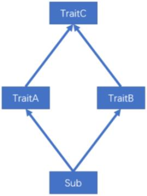
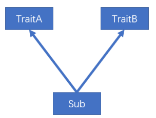

---

Created at: 2021-09-18
Last updated at: 2022-06-27
Source URL: about:blank


---

# 6-面向对象


**Scala 有两种包的管理风格**：
一种方式和 Java 的包管理风格相同，每个源文件一个包（ 包名和源文件所在路径不要求必须一致），包名用“.”进行分隔以表示包的层级关系，如com.atguigu.scala。
另一种风格，通过嵌套的风格表示层级关系，如下：
```
package com {
 package atguigu {
   package scala {
   }
 }
}
```
第二种风格有以下特点：

* 一个源文件中可以声明多个 package
* 子包中的类可以直接访问父包中的内容，而无需导包

**包对象**
在 Scala 中可以为每个包定义一个同名的包对象， 定义在包对象中的成员， 作为其对应包下所有 class 和 object 的共享变量， 可以被直接访问。
```
package object com {
  val shareValue = "share"
  def shareMethod() = {}
}
```

**导包说明**

1. 和 Java 一样，可以在顶部使用 import 导入， 在这个文件中的所有类都可以使用
2. 局部导入：什么时候使用，什么时候导入， 在其作用范围内都可以使用
3. 导入包下的所有成员： import java.util.\_
4. 给导入的类起别名： import java.util.{ArrayList=>AL}
5. 导入相同包的多个类： import java.util.{HashSet, ArrayList}
6. 屏蔽类： import java.util.{ArrayList =>\_,\_} ，表示只有ArrayList不导入，其它均导入
7. 导入包的绝对路径： new \_root\_.java.util.HashMap

Scala 中的三个默认导入分别是
import java.lang.\_
import scala.\_
import scala.Predef.\_

**类：**Scala 中没有 public，类不加修饰符就是公有的可见性（即默认就是public）， 一个 Scala 源文件可以包含多个类。
**属性：**

* 属性不加修饰符默认也是公有的可见性；
* 由于Scala中变量的声明必须初始化，当类的属性如果不需要初始化，那么可以使用\_下划线来赋默认值（比如Int类型就是0，String类型就是null，下划线赋默认初值只能在类中声明变量时使用，不能用在方法的参数上（作为调用方法的参数或者函数参数的默认值都不行）），但是 val 修饰的属性不能用下划线赋默认值，必须显示指定；
* 使用@BeanPropetry注解可以自动地为属性（除私有属性外）生成规范的 getter/setter方法；

**Scala的访问权限**与Java有点区别：

1. Scala 中的类、属性和方法的默认访问权限为 public，但 Scala 中无 public 关键字。
2. private 为私有权限，只在类的内部和伴生对象中可用。
3. protected 为受保护权限，Scala 中受保护权限比 Java 中更严格，只有同类、子类可以访问（不能在子类中通过对象.属性的方式访问，而是子类通过继承的方式访问），同包不能访问。
4. private\[包名\] 增加包访问权限，包名下的其他类也可以使用。

```
class Person {
  private var name: String = "bob"
  // _ 表示给属性一个默认值
 `@BeanProperty //Bean属性`
 `protected var age: Int = _`
  private[chapter03] var sex: String = "男"
 `//val 修饰的属性不能赋默认值，必须显示指定`
 `//val school: String = _`
}
object Person {
  def main(args: Array[String]): Unit = {
    val person = new Person
 `println(person.getAge)`
    println(person.name) //可以
    println(person.age) //可以
    println(person.sex) //可以
  }
}
```
```
class Student extends Person {
  def printInfo(): Unit = {
    //name = "alice" //不可以
    age = 18 //可以
    sex = "male" //可以
    val person = new Person
    //println(person.name) //不可以
 `//println(person.age) //不可以`
    println(person.sex) //可以
  }
}
object Student {
  def main(args: Array[String]): Unit = {
    val person = new Person //又无参构造器，所以可以省略方法调用的()
 `println(person.getSex)`
    //println(person.name) //不可以
    //println(person.age) //不可以
    println(person.sex) //可以
  }
}
```

**Scala 类的构造器包括： 主构造器和辅助构造器**
主构造器就是直接在类名后面声明参数的构造器。这就相当于把整个类的定义都作为了一个构造方法，所以可以直接在这个方法里面调用方法，在类实例化的时候被调用
```
class Animal(name: String, age: Int) {
  println(s"name=${name},age=${age}")
}
```
1\. 如果主构造器无参数，小括号可省略，构建对象时调用的构造方法的小括号也可以省略。
```
class Animal {}
object Animal {
  def main(args: Array[String]): Unit = {
    val animal = new Animal
  }
}
```
2\. 主构造器函数的形参包括三种类型：未用val和var修饰、 var 修饰、 val 修饰

* 未用val和var修饰，这个参数就是一个不可变的局部变量，即局部常量
* val 修饰的参数，作为类只读属性使用，不能修改

    未用val和var修饰 和 用val 修饰的参数的区别：未用val和var修饰时，一旦类中有方法访问到了这个参数，那么这个参数就立刻变为类的私有常量属性，外部访问不到；而用val 修饰的参数直接就是类的公有常量属性，外部可以访问到，只是不能修改。
    这个区别可以反编译成Java代码来看，其实JVM字节码的逻辑就是Java的语法规则，所以用Java的语法规则来理解Scala的面向对象语法规则的逻辑是完全可以的。从反编译成Java代码的结果来看，Scala类的属性都是私有的，只不过会自动生成与属性名同名的方法来访问属性，如果在Scala中定义属性是私有的，那么相应的与属性名同名的方法也就是私有的，所以用val 修饰的参数能在外部访问到是因为生成了公有的与属性名同名的方法，而 未用val和var修饰的参数不能在外部访问到，是因为根本不会自动生成与属性名同名的方法。

* var 修饰的参数，作为类的成员属性使用，可以修改

```
class Dog(private var name: String, private var age: Int) {
  override def toString = s"Dog(name=$name, age=$age)"
}
```

辅助构造器：

1. 辅助构造器就是在类里面定义的构造器，不过函数的名称必须是this， 可以有重载，编译器通过参数的个数及类型来区分
2. 辅助构造方法不能直接构建对象，必须直接或者间接调用主构造方法，而且调用主构造器的语句必须在辅助构造器的第一行
3. 辅助构造器调用其他的辅助构造器，要求被调用的辅助构造器必须提前声明

```
class Animal {
  var name: String = _
  var age: Int = _
  def this(name: String) {
    this() //必须调用主类构造器
    this.name = name
  }
  def this(name: String, age: Int) {
    this(name) //间接地调用主类构造器
    this.age = age
  }
}
```

注意：辅助构造器的函数名必须是this，从而与类同名的函数就只能是个普通函数了：
```
class Animal {
  var name: String = _
  var age: Int = _
  //这只是一个普通的方法
  def Animal(): Unit ={
    println("这只是一个普通的方法")
  }
}
```

最推荐的做法，name和age是Dog的私有字段，写完第一行就定义完了这两个字段，并且定义了两个参数的构造器，然后使用辅助构造器通过调用主构造器来定义其它一个参数的构造器，在Java里面很多类的构造器都是这样的，先定义一个全参数的构造器，然后其它构造器都调用这个全参数的构造器，并传入一些默认值，所以辅助构造器规定必须调用主构造器的原因应该就是这样的。（不过在Scala中方法和函数的参数都可以有默认值（不能是\_下划线的这种值），所以主构造器可以有默认值，如果只是想用辅助构造器传入默认值，好像用辅助构造器就没有必要了，辅助构造器应该是用来做一些复杂点的逻辑判断）
```
class Dog(private var name: String, private var age: Int) {
  def this(name: String) {
    this(name, 0)
  }
  def this(age: Int) {
    this("", age)
  }
  override def toString = s"Dog(name=$name, age=$age)"
}
```

**继承：**
Scala和Java一样是单继承，使用extends关键字。从Scala类构造器定义的形式来看，类和其构造器的定义是绑在一起的，也就是定义类名的同时也就定义了类的构造方法，这个也是很合理，因为在Java中，无论类有没有声明构造器，类都会有一个构造器，只不过是Scala换了一种写法。在Scala中extends关键字后面声明被继承的类的同时也就调用了父类的构造器，这同样也很合理，因为在Java中，无论有没有显式地调用父类构造器，子类都会调用父类的构造器，只不过是Scala换了一种写法。所以，综上一点就是，Scala中类名出现的地方就都调用了类的构造器。
继承关系中构造器的调用顺序是 先父类构造器 再 子类构造器，子类Student的声明继承关系时也声明了要调用父类的主构造器，因为父类Person中有无参的辅助构造器，所以也可以声明调用父类的无参构造器，那么此时可以省略Person后面的括号。因为类的主构造器时一定会被调用的，所以即使是调用子类的辅助构造器创建子类的对象，父类的主构造器也是一定会被调用到的。
因为在声明被继承的类的时候就已经指定了会调用父类的哪个构造器，并且在构建子类对象时，这个构造器也是一定会被调用的，所以Scala不能使用super关键字再来显式地声明调用父类的构造器，也就是不可以super()，只能使用super关键字调用父类的字段和其它方法。
```
// 定义一个父类
class Person(var name: String, var age: Int) {
  println("父类的主构造器调用")

  def this() {
    this(null, 0)
    println("父类的辅助构造器调用")
  }
}
// 定义子类
class Student(name: String, age: Int, var stdNo: String) extends Person(name, age) {
  println("子类的主构造器调用")

  def this(stdNo: String) {
    this(null, 0, stdNo)
    println("子类的辅助构造器调用")
  }
}
```
val person = new Student("123")的结果是：
```
父类的主构造器调用
子类的主构造器调用
子类的辅助构造器调用
```

**多态**，父类引用指向子类对象调用的是子类的方法和字段，这就是Scala的多态。在Java中字段是没有多态的，但是在Scala中字段是有多态的，所以Scala的多态更加彻底，但是在Scala中重写必须要加ovrride关键字。
Java中只有方法有多态，字段没有多态：
```
public class Person {
    String name = "person";
    public void printInfo() {
        System.out.println("name=" + name);
    }
}
public class Student extends Person {
    String name = "student";
    public void printInfo() {
        System.out.println("name=" + name);
    }
    public static void main(String[] args) {
        Person person = new Student();
        System.out.println(person.name);
        person.printInfo();
    }
}
```
打印结果是：
```
person
name=student
```

**Scala中字段和方法都有多态**，但是Scala不能override父类var类型的变量，也就是说只有val类型的常量才有多态：
```
class Person {
  val name: String = "peron"
  def printInfo(): Unit ={
    println(name)
  }
}
class Student extends Person {
  override val name: String = "student"
  override def printInfo(): Unit = {
    println(name)
  }
}
object Test {
  def main(args: Array[String]): Unit = {
    //val p = new Student //自动类型推断不能多态，因为它推断出来的类型就是Student
    val person: Person = new Student //必须显式地指定为父类的引用才能多态
    println(person.name)
    person.printInfo()
  }
}
```
打印结果：
```
student
student
```

**抽象类**，Scala中的抽象类的概念和Java的一样，只不过Scala有抽象属性，而Java中没有抽象属性。Scala在抽象类的语法上需要注意几点：
1.非抽象类的属性在定义时必须初始化，但是在抽象类中的抽象属性并不需要
2.必须实现父类var类型的抽象变量，必须实现父类val类型的抽象常量，override关键字可加可不加。注意与override非抽象属性的区别，只能override非抽象val常量，不能override非抽象var变量。
3.重写非抽象方法需要用 override 修饰，重写抽象方法则可加可不加 override
```
abstract class Person {
  var name: String
  val age: Int

  def printInfo(): Unit

  def printName(): Unit = {
    println("name: " + name)
  }
}
```
```
class Student extends Person {
  //必须实现父类var类型的抽象变量
  var name = "student"
  //必须实现父类val类型的抽象常量
  val age: Int = 18

  //重写抽象方法则可以不加 override
  def printInfo(): Unit = {
    println("name: " + name + ", age: " + age)
  }

  //重写非抽象方法需要用 override 修饰
  override def printName(): Unit = super.printName()
}
```

**匿名子类**，Scala的匿名子类和Java的匿名一样，只不过在语法上有点不同，Scala定义匿名子类时不需要加()，但是Java要。
```
val person = new Person {
  override var name: String = "bob"
  override val age: Int = 19
  override def printInfo(): Unit = println("name: " + name + ", age: " + age)
}
```

**伴生类和伴生对象**
Scala中没有static关键字，为了实现static关键字的效果，就引入了伴生对象，伴生对象有如下的特点：

1. 伴生对象是一个单例的已经实例化的对象
2. 伴生类与伴生对象的名字必须相同
3. 伴生类可以访问伴生对象的所有属性和方法
4. 伴生对象使用object关键字声明

因为伴生对象是单例的，所以伴生对象的属性全局就只有一份了，伴生对象对象的方法也就有通过这个伴生对象才能访问得到，于是就实现了Java中的静态字段和静态方法的效果了。
伴生对象有一个比较特殊的apply()方法，特殊的点就在于，通过调用伴生对象的apply方法时可以不用像调用其它方法那样，需要把方法显式的写出，而是直接在伴生对象后面加个括号写上参数就代表调用了apply方法。
使用伴生对象实现伴生类的单例对象：
```
object TestSingleton {
  def main(args: Array[String]): Unit = {
    //val dog = new Dog("XiaoHei", 6)//错误，Dog的构造器已经私有化了
    val dog1 = Dog.getInstance()
    val dog2 = Dog() //调用apply方法
    println(dog1.eq(dog2)) //true
  }
}
//直接在参数列表前面加上private就可以私有化构造器了
class Dog private(val name: String, val age: Int) {
  override def toString = s"Dog(name=$name, age=$age)"
}
object Dog {
  //饿汉式
  private val dog: Dog = new Dog("WangCai", 5)
  def getInstance(): Dog = dog
  def apply(): Dog = dog
}
```

**trait（特质）**
抽象类是对同一类事物的抽象，可以看作是一类事物的本质；而trait是对有些不同类事物所具有的共同的特点的抽象，有些事物有这种特质，有些事物没有这种特质。
Scala中的trait可以被一个类多继承，这称为一个类混入(Mixin)了多个特质，多继承的这个特点与Java的接口类似； Scala 中的 trait 即可以有抽象属性和方法，也可以有具体的属性和方法，这却与Java中的抽象类很类似；从字节码上看也是这样的，Scala的trait等于抽象类加接口。
Scala的trait与Scala自己对抽象类的定义很类似，但也有区别，如下：

1. 抽象类只能被一个类单继承，但是trait可以被一个类多扩展。
2. 抽象类可以定义构造器，但是trait不能定义构造器。

```
trait PersonTrait {
  // 具体属性
  var name: String = _
  // 抽象属性
  var age: Int
  // 具体方法
  def eat(): Unit = {
    println("person eat")
  }
  // 抽象方法
  def say(): Unit
}
```

让一个类具有某些特质，也就类继承特质的语法如下：
```
没有父类：class 类名 extends 特质1 with 特质2 with 特质3 …
有父类：class 类名 extends 父类 with 特质1 with 特质2 with 特质3 …
```

所有Java的接口都可以作为trait使用
```
//使用PersonTrait的name属性，实现PersonTrait的age属性
class Student(_name: String, var age: Int) extends PersonTrait with java.io.Serializable {
  this.name = _name
  override def say(): Unit = println("student say")
}
```

动态混入：可以在创建类的对象时动态混入 trait，而无需先使该类混入该 trait，然后再创建对象
```
object DynamicTrait {
  def main(args: Array[String]): Unit = {
    val stu = new Student("zhangsan", 18) with SexTrait {
      override var sex: String = "male"
    }
    println("name: " + stu.name + ", age: " + stu.age + ", sex:" + stu.sex)
  }
}
```

**特质叠加**
由于一个类可以混入（ mixin）多个 trait，如果混入的多个 trait 中有相同签名的具体方法，那就会产生冲突，解决冲突问题的方法就是重写冲突的方法。如果有相同var变量，也会产生冲突，但是无法解决这样的冲突，因为var变量不能被重写，只能被子类使用，感觉像是Scala的bug。

在重写的方法中通过super调用父类方法时，会调用哪个父类的方法呢，首先这与trait的声明顺序有关，Scala通过super关键字调用冲突的父类方法的规则就是这样的，super会调用在继承时声明在最后面的那个trait的方法。然后还要进一步看trait之间有没有共同的父类，以及最后一个trait有没有通过也通过super关键字调用父类的方法。
第一种情况，两个trait有共同的父类，并且TraitB、TraitA有通过super关键字调用父类的冲突方法：

```
trait TraitC {
  def fun(): Unit = {
    println("trait-c have a fun")
  }
}
trait TraitA extends TraitC {
  override def fun(): Unit = {
    println("trait-a have a fun")
 `super.fun()`
  }
}
trait TraitB extends TraitC {
  override def fun(): Unit = {
    println("trait-b have a fun")
 `super.fun()`
  }
}
class Sub `extends TraitA with TraitB` {
  //必须重写，不然就会产生冲突
  override def fun(): Unit = `super.fun()`
}
object Test {
  def main(args: Array[String]): Unit = {
    val sub = new Sub
    sub.fun()
  }
}
```
调用结果：
```
trait-b have a fun
trait-a have a fun
trait-c have a fun
```

第二种情况，两个trait有共同的父类，TraitB没有通过super关键字调用父类的冲突方法，TraitA有通过super关键字调用父类的冲突方法
调用结果：
```
trait-b have a fun
```

第三种情况，两个trait有共同的父类，TraitB有通过super关键字调用父类的冲突方法，但是TraitA没有通过super关键字调用父类的冲突方法
调用结果：
```
trait-b have a fun
trait-a have a fun
```

前三种情况中两个trait有共同的父类，这就是所谓的菱形继承问题。

第四种情况，两个trait没有共同的父类，所以即使TraitB有通过super关键字调用父类也不会调用到TraitA的冲突的方法。

```
trait TraitA {
  def fun(): Unit = {
    println("trait-a have a fun")
  }
}
trait TraitB {
  def fun(): Unit = {
    println("trait-b have a fun")
  }
}
class Sub extends TraitA with TraitB {
  //必须重写，不然就会产生冲突
  override def fun(): Unit = super.fun()
}
object Test {
  def main(args: Array[String]): Unit = {
    val sub = new Sub
    sub.fun()
  }
}
```
调用结果是：
```
trait-b have a fun
```

对于产生冲突时，super关键字到底调用哪个父类的方法，Scala采用了特质叠加的策略：
第一步：列出混入的第一个特质（ TraitA）的继承关系，作为临时叠加顺序
```
TraitA --> TraitC
```
第二步：列出混入的第二个特质（TraitB）的继承关系，并将该顺序叠加到前面的顺序上， 已经出现的特质不再重复
```
TraitB -->  TraitC
```
```
TraitB --> TraitA --> TraitC
```
第三步：将子类（Sub）放在临时叠加顺序的第一个，得到最终的叠加顺序
```
Sub --> TraitB --> TraitA --> TraitC
```

如果想要调用某个指定的混入特质中的方法，可以增加约束： super\[\]，比如把第一种情况的Sub中的调用改成super\[TraitA\].fun()，那么调用的结果就是：
```
trait-a have a fun
trait-c have a fun
```

**类型检查和转换**

* obj.isInstanceOf\[T\]：判断 obj 是不是 T 类型。
* obj.asInstanceOf\[T\]：将 obj 强转成 T 类型（Java中强制类型转换的语法是括号加类型，比如：(int)，Scala中没有这种强制转换类型的语法，而是使用obj.asInstanceOf\[T\]代替）。
* classOf 获取对象的类名。

```
class Person
class Student extends Person

object Test {
  def main(args: Array[String]): Unit = {
    val person: Person = new Student
    //判断对象是否为某个类型的实例
    if (person.isInstanceOf[Student]) {
      //转换引用的类型
      val person1: Student = person.asInstanceOf[Student]
      println(person1) //chapter06.Student@13c78c0b
    }
    //获取类的信息
    val pClass: Class[Person] = classOf[Person]
    println(pClass)  //class chapter06.Person
  }
}
```

**枚举类**需要继承 Enumeration
**应用类**需要继承 App，应用类就是已经帮你把main方法的定义写好的类，你只需要继承 App就可以直接写main方法里面的代码了
```
object Color `extends Enumeration` {
  val RED = Value(1, "red")
  val YELLOW = Value(2, "yellow")
  val BLUE = Value(3, "blue")
}

object Test `extends App` {
  println(Color.RED) //red
  println(Color.RED.id) //1
  println(Color.values) //Color.ValueSet(red, yellow, blue)
}
```

**Type** 定义新类型： 使用 type 关键字可以定义新的数据类型名称，本质上就是类型的一个别名、
```
object TestType extends App {
  `type MyString = String`
  val str: MyString = "abc"
  println(str)
}
```

