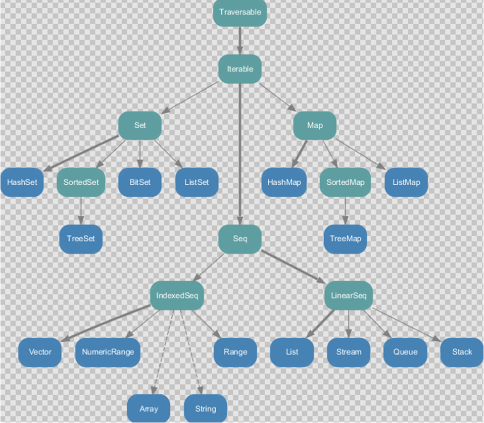
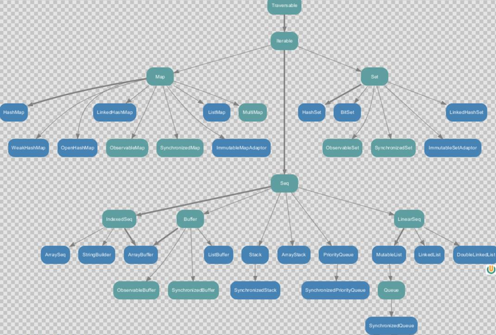

---

Created at: 2021-09-19
Last updated at: 2021-11-14


---

# 7-集合


Scala 的集合有三大类：序列 Seq、集合 Set、 映射 Map， 所有的集合都扩展自 Iterable特质。
对于几乎所有的集合类，Scala 都同时提供了可变和不可变的版本，分别位于scala.collection.mutable 和 scala.collection.immutable 。
不可变在不同的不可变集合中意思是不一样的。对于Array来说，不可变的意思是集合的大小不能动态变化，类似于Java中的数组（int\[\]），但是可以对Array中的元素进行修改；对于List而言，不可变的意思是Listi一旦创建之后，就不能新增加元素，也不能修改List中元素的值。对于Map也是既不能添加也不能修改。总之，不可变集合的大小是一定不能改变，所有会改变大小的操作，比如新增或者删除元素，都会重新生成一个新的集合然后返回，原有的集合不变，至于能不能修改集合中原有元素的值，好像只有Array能修改，其它集合均不能修改。
可变的意思是引用始终都是这个引用，集合内部是如何调整大小对于使用者是透明的，类似于Java中的ArrayList等集合。
不可变集合：

1\. Set、Map 是 Java 中也有的集合
2\. Seq 是 Java 没有的，我们发现 List 归属到 Seq 了，因此这里的 List 就和 Java 不是同一个概念了
3\. for 循环中的 1 to 3，就是 IndexedSeq 下的 Range
4\. String 也属于 IndexedSeq，实际上是Scala遍历器做了隐式转换，Array也是这样的
5\. Queue 和 Stack 被归属到 LinearSeq(线性序列)
IndexedSeq 和 LinearSeq 的区别：

* IndexedSeq 是通过索引来查找和定位，因此速度快，比如 String 就是一个索引集合，通过索引即可定位
* LinearSeq 是线型的，即有头尾的概念，这种数据结构一般是拿来遍历的

可变集合：


**数组Array**，类似于Java中的数组（比如：int\[\]）：
第一种定义数组的方式，方括号是Scala的泛型，如果先保存任何类型的元素就有Any类型，这里定义了一个大小为5的数组，定义之后数组的大小就不能再改变了
```
val arr: Array[Int] = new Array[Int](5)
```
第二种定义方式，此方式使用了伴生对象Array的apply()方法
```
val arr2 = Array(12, 37, 42, 58, 97)
```

**访问数组元素：**
读数组中的某一个元素调用的是伴生类Array的apply方法，和伴生对象的apply方法一样可以省略方法名，并不是说用户为伴生类自定义的apply方法也可以这样用，Array的这个apply方法的方法体是编译器自动生成的，许多集合类型都是这样的，是访问集合的语法糖
```
val i: Int = arr(0)
等价于
val i: Int = arr.apply(0)
```
修改集合中的元素调用的是伴生类Array的Update方法，和Array的apply方法一样可以省略方法名，也是编译器自动生成方法体
```
arr(0)=1
等价于
arr.update(0, 1)
```

**数组遍历**的方式：
1.普通for循环
```
for (i <- 0 until arr.length){
println(arr(i))
}
```
0 until arr.length 可以用arr.indices代替，返回的同样是Range
```
for (i <- arr.indices) println(arr(i))
```
2.增强for循环
```
for (elem <- arr) println(elem)
```
3.迭代器
```
val iter = arr.iterator
while (iter.hasNext)
println(iter.next())
```
4.调用foreach方法
```
arr.foreach( println )
```
5.可以直接把整个集合以字符串的形式返回
```
println(arr.mkString("--"))
```

为**数组添加元素**的方式，注意Array是不可变集合，不能直接添加元素，只能是先创建新的集合，然后再复制赋值，最后返回这个新的集合的引用。
1.在尾部添加元素，返回的是一个新的数组，:+ 是一个方法
```
val newArr = arr.:+(73)
```
我们知道方法调用可以简化，点.可以用空格代替，只有一个参数时小括号可以省略，于是上面的调用可以写成：
```
val newArr = arr :+ 73
```
2.在头部添加新的元素，返回的是一个新的数组，+: 是一个方法
```
val newArr2 = newArr.+:(15)
```
同样可以简化调用，但是Scala编译器规定以 : 结尾的方法的简化调用要反过来写，比如这个 +: 的简化调用：
```
val newArr2 = 15 +: newArr
```
于是可以这样为一个数组新增加元素：
```
val newArr3 = 19 +: 29 +: newArr2 :+ 26 :+ 73
```

合并两个数组用++
```
val newArr = Array(1, 2, 3) ++ Array(4, 5, 6)
```

总结：合并两个 不可变集合 和 可变集合 均可以用++，++会返回一个相应类型的新集合；合并可变集合还可以使用++=，++=并不会返回一个新的集合，而是直接将后一个可变集合的元素添加到前一个可变集合之中。
```
val newArr: Array[Int] = Array(1, 2, 3) ++ Array(4, 5, 6)
val newArrBuf1: ArrayBuffer[Int] = ArrayBuffer(1, 2, 3) ++= ArrayBuffer(4, 5, 6)
val newArrBuf2: ArrayBuffer[Int] = ArrayBuffer(1, 2, 3) ++= Array(4, 5, 6)
```

**可变数组ArrayBuffer**，类似于Java中的ArrayList:
定义ArrayBuffer的两种方式，与定义Array的两种方式一样：
```
val arr1: ArrayBuffer[Int] = new ArrayBuffer[Int]() //使用ArrayBuffer类的构造器
val arr2 = ArrayBuffer(23, 57, 92)  //使用伴生对象ArrayBuffer的apply方法
```
访问 ArrayBuffer元素的方式与Array一样，遍历 ArrayBuffer 的方式也一样，这些方法同样也是用于其它集合。

**添加元素**的方式：
1.同样可以使用 :+ 和 +: 两个方法为 ArrayBuffer 添加元素，但是也同样返回的是一个新的ArrayBuffer，所以极力不推荐这样做，因为ArrayBuffer是可变的数组
2.使用 += 方法为 ArrayBuffer 在尾部添加元素
```
arr2 += 100
```
3.使用 +=: 方法为 ArrayBuffer 在头部添加元素
```
77 +=: arr2
```
同样不推荐使用 += 和 +=: 两个方法，对于可变数组更推荐使用append等英文函数名更加直观明了的方法：
```
arr1.append(36) //在尾部添加元素
arr1.prepend(11, 76) //在头部添加元素
arr1.insert(1, 13, 59) //在索引为1的位置添加元素，第一个参数是索引，第二参数是可变参数
arr1.insertAll(2, newArr1)  //在索引为2的位置后面插入数组
arr1.prependAll(newArr2)  //在头部插入数组
```

约定： 在操作集合的时候，不可变用符号方法，可变用英文名方法

**删除元素**的方式：
1.使用 -= 删除指定值的元素
```
arr1 -= 13 //删除元素值为13的元素，只删除第一次出现的那一个，如果数组中没有这个值，就不做任何改变
```
2.使用其它方法删除元素
```
arr1.remove(3) //删除指定索引位置的元素
arr1.remove(0, 10) //删除指定索引位置即之后多少个元素
```

可变数组和不可变数组的转换
1.可变数组转换为不可变数组，调用toArray方法
```
val arr2 = ArrayBuffer[Int]()
val newArr: Array[Int] = arr.toArray
```
2.不可变数组转换为可变数组，调用toBuffer方法
```
val arr = Array(12, 37, 42, 58, 97)
val newBuffer: mutable.Buffer[Int] = arr.toBuffer
```

**二维数组**
创建二维数组：
```
val array: Array[Array[Int]] = Array.ofDim[Int](2, 3)
```
访问：
```
array(0)(2) = 19
```
遍历：
```
//第一种遍历方式
array.foreach(line => println(line.mkString(", ")))
//第二种遍历方式
for (i <- array.indices; j <- array(i).indices){
print(array(i)(j) + "\t")
if (j == array(i).length - 1) println()
}
```

**不可变 List**
不同于Java的划分，在Scala中List和Array是两种不同的集合类型，Array是混入了IndexedSeq特质的，而List是混入了LinearSeq特质的，也就是Array是可以通过索引来快速定位元素的，而List不行。

定义不可变List集合：
因为List在是一个抽象类，所以不能直接只用List的构造器来定义List，只能通过List的伴生对象的apply方法来创建List：
```
val list = List(1, 2, 3)
```
伴生对象List的apply方法的参数是一个可变参数（如下），Scala对于可变参数会封装成ArrayBuffer，然后在apply方法中调用 ArrayBuffer 的 toList 方法转换成了List：
```
override def apply[A](xs: A*): List[A] = xs.toList
```
抽象类List定义时前面还有一个sealed关键字，该关键字表示的意思是，被修饰的类的子类只能定义在当前文件中。List有两个子类 Nil 和 :: ，Nil表示的是一个空List对象，:: 是List的一个具体实现类。

访问List的元素：
虽然List不能通过索引随机访问，但是为了读取元素的方便，Scala为List也提供了一个可以省略方法名的apply方法，实现可以通过下标的方式访问到数组的元素，这种就类似于通过下标访问链表一样，实现的过程其实顺序遍历到下标所在的位置，而不是真正意思上的随机访问。
```
val i: Int = list(1)
```
但是List没有提供可以省略方法名的update方法，所以下面的调用是错误的：
```
list(1) = 0  //错误
```

遍历的方式于Array一样。

添加元素也与Array一样：
1.在尾部添加元素，返回的是一个新的List，:+ 是一个方法
```
val list1 = list :+ 4
```
2.在头部添加新的元素，返回的是一个新的数组，+: 是一个方法，以 : 结尾的方法的简化调用要反过来写
```
val list2 = 0 +: list
```
List有一个方法叫 :: ，这个方法会创建一个::对象（前面有说过List有一个子类也叫 ::），并将传进来的参数放在这个新的List的最前面，然后将原来List的元素放在后面，最后返回这个 ::对象，于是就实现了在头部添加新的元素
```
val list3 = list.::(0)
println(list3)  //结果是 List(0, 1, 2, 3)
```
前面还说过List 有一个空子类对象Nil，于是创建一个List的方式还可以是这样的，注意以 : 结尾的方法的简化调用要反过来写
```
val list4 = 1 :: 2 :: 3 :: 4 :: Nil
println(list4)  //结果是 List(1, 2, 3, 4)
```

**合并两个List用 ::: 方法**
```
val list5 = list3 ::: list4
println(list5)  //结果是List(0, 1, 2, 3, 1, 2, 3, 4)
```
也可以用 ++ 方法，++ 方法其实调用的就是 ::: 方法
```
val list6 = list3 ++ list4
println(list6)  //结果是List(0, 1, 2, 3, 1, 2, 3, 4)
```
合并不能用 :: 方法，这会把List集合作为一个整体添加
```
val list7 = list3 :: list4
println(list7)  //结果是List(List(0, 1, 2, 3), 1, 2, 3, 4)
```

**可变列表 ListBuffer**
创建ListBuffer
```
val lb1 = new ListBuffer[Int]() //使用ListBuffer的构造器
val lb2 = ListBuffer(1, 2, 3, 4)  //使用伴生对象ListBuffer的apply方法
```
访问元素：
因为 ListBuffer可变，所以 ListBuffer有可以省略方法名的update方法，也有可以省略方法名的apply方法
```
lb2(1) = 100
println(lb2(1))
```

添加元素
1.同样可以使用 :+ 和 +: 两个方法为 ListBuffer添加元素，但是也同样返回的是一个新的ListBuffer，所以极力不推荐这样做，因为ListBuffer是可变的
2.使用 += 方法为 ListBuffer 在尾部添加元素
```
lb1 += 0
println(lb1)  //ListBuffer(0)
```
3.使用 +=: 方法为 ListBuffer 在头部添加元素
```
1 +=: lb1
println(lb1)  // ListBuffer(1, 0)
```
同样不推荐使用 += 和 +=: 两个方法，在操作可变集合的时候用英文名方法语义更加明确：
```
lb2.append(5) //在尾部添加元素
lb2.prepend(-1, 0) //在头部添加元素
lb2.insert(1, 0, 0) //在索引为1的位置添加元素，第一个参数是索引，第二参数是可变参数
lb2.insertAll(2, lb1) //在索引为2的位置后面插入数组
lb2.prependAll(lb1) //在头部插入数组
```

**合并两个ListBuffer：**
++方法返回的是一个新的ListBuffer
```
val lb3 = lb1 ++ lb2
```
++=直接改变调用该方法的 ListBuffer
```
lb1 ++= lb2
println(lb1)
```
ListBuffer 没有 ::: 方法，List没有 ++= 方法

删除元素的方法和ArrayBuffer相同。

**Set 集合**
Scala中的不可变Set和可变Set都叫Set，只是在不同的包下，默认是不可变的Set，如果想用可变的Set， 需要引用scala.collection.mutable.Set 包。
**不可变Set**
创建不可变Set，因为Set是一个trait特质不能直接创建对象，所以只能用它的伴生对象来创建：
```
val set1 = Set(1, 1, 2, 2, 3, 3)
println(set1) //Set(1, 2, 3)，去重之后的结果
```
添加元素：
```
val set2 = set1 + 4
println(set2)  //Set(1, 2, 3, 4)
```
删除元素：
```
val set4 = set3 - 4
```
**合并set**
```
val set3 = set1 ++ set2
```

**可变Set**
注意可变的Set在import scala.collection.mutable.Set包下
定义Set：
```
val set1 = mutable.Set(1, 1, 2, 2, 3, 3)
```
添加元素用+=就会在原有的Set上进行添加，使用+的效果返回的是新的Set对象：
```
set1 += 4
println(set1)  //Set(1, 2, 3, 4)
```
推荐使用英文名的方法，add方法的返回值是Boolean，表示是否添加成功，如果set集合中已经有该元素了。返回false，即未添加成功，反之为true：
```
set1.add(5)  //Set(1, 5, 2, 3, 4)
```

删除元素：
```
set1 -= 4
set1.remove(5)
```

**合并Set调用++=方法**
```
val set1 = Set(1, 1, 2, 2, 3, 3)
val set2 = Set(4,5,6)
set1 ++= set2
println(set1)
```

**Map 集合**
Scala中的不可变Map和可变Map都叫Map，只是在不同的包下，默认是不可变的Map，如果想用可变的Map， 需要引用scala.collection.mutable.Map 包。
**不可变 Map**
因为Map是一个trait，所以不能直接调用构造方法创建不可变Map的实例，只能使用伴生对象的apply方法创建，此时传入的参数是多个二元组，Scala中Map与二元组的关系 和 Java中Map与Map的entrySet方法返回的Entry的关系一样。以Map的角度来看就是kv键值对，只能通过key获取value。但是把每一个kv键值对单拎出来看，它们是一个整体，在Scala中是一个二元组，遍历每个kv时它的类型就是二元组，在Java中就是一个Map.Entry（HashMap底层的Node节点其实就是Map.Entry的子类）。
```
val map = Map( "a"->1, "b"->2, "c"->3 )
```
遍历Map：
```
map.foreach((kv: (String, Int)) => println(kv))  //(String, Int)是一个二元组类型
简写形式：
map.foreach(println)
```
通过key遍历map：
```
for (key <- map.keys) {
println(s"${key}=${map.get(key)}")
}
```
输出：
```
a=Some(1)
b=Some(2)
c=Some(3)
```
为了避免空指针异常，Scala定义了一个抽象类Option，Some和None是它的两个具体的子类，map的get方法如果能get到值就包装到Some对象中，如果没有值就会包装到None对象中。（我也不知道为什么要这样做，避免空指针异常？？）

获取某个key的value：
因为Map的get方法会把返回的值包装到Some中，所以要想真正的拿到值，还得再调用Some的get方法：
```
val value = map.get("a").get  //返回1
val value1 = map.get("d") //返回None
map.get("d").get //空指针异常
val value2 = map.getOrElse("d", 100) //如果获取不到"d"的value，就用100代替，如果能获取到就直接返回其value，不在返回Some对象
```
为了能方便获取到值，Map提供了可以省略方法名的apply方法，不能获取到值时就抛出NoSuchElementException异常
```
val value = map("a")
```

不可变的Map不能新增加元素，也不能修改已有元素的value，所以还是得用可变的Map

**可变的Map**
注意可变的Map在import scala.collection.mutable.Map包下
创建Map：
```
val map = mutable.Map("a" -> 1, "b" -> 2, "c" -> 3)
```
添加元素，put其实调用的是update方法，update方法其实调用的是 +=方法，只有put方法有返回值，其返回值是包装在Some中的旧元素的值，没有旧元素则是None。
```
map.put("d", 4)
或者
map += (("e", 5))
```
删除元素：
```
map.remove("d")
或者
map -= "e"
```

修改元素，如果添加的key不存在，就变成添加元素了
```
map.update("a",10)
或者
map("a") = 10 //这实际上是update方法名省略之后的简写效果，不可变的Map没有update方法
```

**合并两个Map**，将不可变的map2添加到可变的map1中，key相同就覆盖
```
val map1 = mutable.Map("a" -> 1, "b" -> 2, "c" -> 3)
val map2 = Map("a" -> 11, "b" -> 22, "c" -> 33, "d" -> 44)
map1 ++= map2
println(map1) //输出结果：Map(b -> 22, d -> 44, a -> 11, c -> 33)
```
也可以使用++方法生成一个新的Map
```
val map3 = map1 ++ map2
```

**元组**
元组也是可以理解为一个容器，可以存放各种相同或不同类型的数据。说的简单点，就是将多个无关的数据封装为一个整体，称为元组。
注意： 元组中最大只能有 22 个元素
声明定义一个元组，元组的类型就是它所存放的数据的类型合起来：
```
val tuple: (Int, Double, String, Boolean) = (1, 2.5, "abc", true)
```
定义一个二元组还可以这样：
```
val tuple2: (String, Int) = "a" -> 100
```
元组定义之后是不可变的，不能添加元素，也不能修改元素，只能访问值。
访问元组：
```
println(tuple._1)
println(tuple._2)
println(tuple._3)
println(tuple._4)  
```
通过索引访问：
```
val value = tuple.productElement(1)  //2.5
```
通过迭代器遍历元组：
```
for (elem <- tuple.productIterator) {
    println(elem)
}
```
定义嵌套元组：
```
val tuple3: (Int, Double, (String, Boolean)) = (1, 1.1, ("a", false))
print(tuple3._3._2)  //输出false
```

**集合常用函数**

**基本属性和常用操作**
```
val list = List(1, 3, 5, 7, 2, 89)
val set = Set(23, 34, 423, 75)
```
1.获取集合长度，length是LinearSeq才有一个属性
```
val length = list.length
```
获取集合大小，size是所有集合类型都有一个属性
```
println(set.size)
```
2.遍历集合
增强for循环遍历：
```
for (elem <- list)
 println(elem)
```
其实增强for循环编译之后就是使用的迭代器，这里也可以直接把迭代器声明出来：
```
for (elem <- list.iterator)
 println(elem)
```
3.生成字符串
```
println(list.mkString("--"))
println(set.mkString("--"))
```
4.是否包含某个元素
```
println(list.contains(23))
println(set.contains(23))
```

**衍生集合**，调用这些方法之后会返回一个新的集合作为结果
```
val list = List(1, 3, 5, 7, 2, 89)
val set = Set(23, 34, 423, 75)
```
1.获取集合的头
```
println(list.head) //1
```
2.获取集合的尾，除第一个元素之外的元素都是集合的尾
```
println(list.tail)  //List(3, 5, 7, 2, 89)
```
3.集合最后一个数据
```
println(list.last)  //89
```
4.集合初始数据，除最后一个元素之外的元素都是集合的初始数据
```
println(list.init) //List(1, 3, 5, 7, 2)
```
5.反转
```
println(list.reverse)  //List(89, 2, 7, 5, 3, 1)
```
6.取前n个元素
```
println(list.take(3))  //List(1, 3, 5)
```
取后n个元素
```
println(list.takeRight(3))   //List(7, 2, 89)
```
7.去掉前n个元素
```
println(list.drop(2))  //List(5, 7, 2, 89)
```
去掉后n个元素
```
println(list.dropRight(2))  //List(1, 3, 5, 7)
```
8.并集
```
val list1 = List(1, 2, 3)
val list2 = List(2, 3, 4)
//等价于用 :::
val union: List[Int] = list1.union(list2)
println(union)  //List(1, 2, 3, 2, 3, 4)
```
如果是Set做并集会去重
```
val set1 = Set(1, 2, 3)
val set2 = Set(2, 3, 4)
val set3: Set[Int] = set1.union(set2)
println(set3)  //Set(1, 2, 3, 4)
```
9.交集
```
val list1 = List(1, 2, 3)
val list2 = List(2, 3, 4)
val intersection = list1.intersect(list2)
println(intersection) //List(2, 3)
```
10.差集
```
val list1 = List(1, 2, 3)
val list2 = List(2, 3, 4)
println(list1.diff(list2))  //List(1)
println(list2.diff(list1))  //List(4)
```
11.拉链，得到的是一个元组的集合
```
val list1 = List(1, 2, 3)
val list2 = List(2, 3, 4)
println(list1.zip(list2))  //List((1,2), (2,3), (3,4))
println(list2.zip(list1))  //List((2,1), (3,2), (4,3))
```
12.滑窗，得到的是一个集合的集合
```
val list = List(1, 2, 3, 4, 5, 6, 7, 8, 9)
for (elem <- list.sliding(3)) println(elem)
```
输出结果：
```
List(1, 2, 3)
List(2, 3, 4)
List(3, 4, 5)
List(4, 5, 6)
List(5, 6, 7)
List(6, 7, 8)
List(7, 8, 9)
```
3个步长的滑窗：
```
val list = List(1, 2, 3, 4, 5, 6, 7, 8, 9)
for (elem <- list.sliding(3, 3)) println(elem)
```
输出的结果：
```
List(1, 2, 3)
List(4, 5, 6)
List(7, 8, 9)
```

**集合简单计算函数**
```
val list1 = List(1, 5, 2, 3, 6, 4)
val list2 = List(("a", 5), ("b", 1), ("c", 8), ("d", 2), ("e", -3), ("f", 4))
```
1.求和
```
println(list1.sum)  //21
```
2.求乘积
```
println(list1.product) //720
```
3.最大值
```
println(list1.max) //6
```
如果是比较复杂的类型，还可以指定比较的元素
```
println(list2.maxBy((tuple: (String, Int)) => tuple._2))  //(c,8)
```
简化形式：
```
println(list2.maxBy(_._2))  //(c,8)
```
4.最小值
```
println(list1.min) //1
```
同样可以指定要比较的元素
```
println(list2.minBy(_._2))  //(e,-3)
```
5.排序
List是不可变的集合，所以sorted函数会返回一个新的排好了序的List，默认是升序
```
val sortedList = list.sorted
println(sortedList) //List(1, 2, 3, 4, 5, 6)
```
那么对数据的比较规则是先比较第一个元素，如果第一个元素相同则比较第二个元组：
```
val list = List(("b", 1), ("a", 5), ("a", 4), ("a", 6), ("c", 8))
println(list.sorted)  //List((a,4), (a,5), (a,6), (b,1), (c,8))
```
可以指定逆序排
```
println(list.sorted(Ordering[Int].reverse))  //List(6, 5, 4, 3, 2, 1)
```
如果是比较复杂的类型，可以指定比较的元素，默认是升序
```
println(list2.sortBy(_._2))  //List((e,-3), (b,1), (d,2), (f,4), (a,5), (c,8))
```
可以指定为降序排
```
println(list2.sortBy(_._2)(Ordering[Int].reverse))
```
还可以使用sortWith方法指定元素的比较规则：
```
println(list2.sortWith( (a:(String, Int) , b: (String, Int)) => {a._2 < b._2} ))
```
简化形式：
```
println(list2.sortWith(_._2 < _._2))
```

**集合高级计算函数**
**1\. 过滤**
filter方法的参数是函数，函数的参数是集合的每个元素，返回值是Boolean类型，即true表示保留当前元素，否则舍弃当前元素
比如选取偶数：
```
val list = List(1, 2, 3, 4, 5, 6, 7, 8, 9)
val evenList = list.filter((elem: Int) => elem % 2 == 0)
println(evenList)  //List(2, 4, 6, 8)
```
简化形式：
```
val evenList = list.filter(_ % 2 == 0)
```

**2\. 转化/映射（map）**
map方法的参数是函数，函数的参数是集合的每个元素，返回值是经过函数处理之后的值
比如把集合中每个数乘2：
```
val list = List(1, 2, 3, 4, 5, 6, 7, 8, 9)
val doubleList = list.map(_ * 2)
println(doubleList)  //List(2, 4, 6, 8, 10, 12, 14, 16, 18)
```

对于Map类型的集合做map映射时，同样遍历的是Map的每一个元素，只不过每个元素的类型是二元组
将每个key对应的value乘以2，map映射的参数是一个函数，该函数的参数kv的类型是元组
```
val map = Map("Hello" -> 4, "Hbase" -> 2, "kafka" -> 1, "Scala" -> 3)
val map1 = map.map(kv => (kv._1, kv._2 * 2))
println(map1)
```
以上需求其实只是对Map的value进行操作，如果只需要对Map的value进行映射，可以使用mapValues函数
```
val map1 = map.mapValues(_ * 2)
```

**3\. 扁平化**
将集合里面的集合都展开放到一个集合里面
```
val nestedList: List[List[Int]] = List(List(1,2,3),List(4,5),List(6,7,8,9))
val flatList = nestedList.flatten
println(flatList) //List(1, 2, 3, 4, 5, 6, 7, 8, 9)
```

**4\. 扁平映射**
扁平映射是先做映射再做扁平，比如将一组字符串分词然后保存成单词的列表，使用上面两个map函数和flatten函数需要这样做：
```
val strings: List[String] = List("hello world", "hello scala", "hello java", "we study")
val splitList: List[Array[String]] = strings.map( _.split(" ") )    // 分词
val flattenList = splitList.flatten    // 打散扁平化
println(flattenList)  //List(hello, world, hello, scala, hello, java, we, study)
```
不过集合提供了flatMap函数，将上述两个步骤合二为一
```
val flatmapList = strings.flatMap(_.split(" "))
```

**5\. 分组(group)**
分组就是把集合中具有相同特征的元素放在一个组里，这个组其实是Map的value，是一个List集合
比如给定一组词汇，按照单词的首字母进行分组
```
val wordList = List("china", "america", "alice", "canada", "cary", "bob", "japan")
println( wordList.groupBy( _.charAt(0) ) )
```
输出就是一个Map，groupBy的参数是一个匿名函数，匿名函数的参数是集合中的每一个元素，返回值就是这个元素所对应的分组的key，具有相同的key的元素会进到同一个value中，value是一个集合。
```
Map(b -> List(bob), j -> List(japan), a -> List(america, alice), c -> List(china, canada, cary))
```

以上5个操作输入的是集合，输出的也是集合，所以都可以看作是map操作。如果输入的是集合，输出的是一个数，那就是Reduce操作了，以下两个操作就是Reduce操作。

**6\. 简化（归约）**
reduce方法的参数是一个函数，函数需要传入两个元素然后返回一个值。reduce的计算过程是，先传入集合的前两个元素，然后算得一个结果，再把这个结果作为第一个元素传入，一直循环直到得到最后的结果。
reduce调用的是reduceLeft，所以二者计算的过程是一样的，但是注意reduceRight并不是把reduceLeft的计算过程返过来
```
val list2 = List(3, 4, 5, 8, 10)
println(list2.reduce(_ - _)) // (((3 - 4) - 5) - 8) - 10 = -24
println(list2.reduceLeft(_ - _)) // (((3 - 4) - 5) - 8) - 10 = -24
println(list2.reduceRight(_ - _)) //3 - (4 - (5 - (8 - 10))) = 6
```
reduce与reduceLeft的区别是，reduce的两个参数类型必须是相同的，而reduceLeft的两个参数的类型可以不同。

**7\. 折叠**
fold方法于reduce方法的计算过程一样，只不过是多了一个初始值
```
val list = List(1, 2, 3, 4)
println(list.fold(10)(_ + _)) // (((10 + 1) + 2) + 3) + 4 = 20
println(list.foldLeft(10)(_ - _)) // (((10 - 1) - 2) - 3) - 4 = 0
println(list.foldRight(10)(_ - _)) // 1 - (2 - (3 - (4 - 10))) = 8
```

集合计算函数案例：
1.合并两个Map，对于相同key的数据并不是简单的覆盖，而是相加
① map1可以是不变的map，因为是以map1来调用foldLeft方法，foldLeft方法是以传入的第一个参数即map2为初始，然后遍历每一个map1的元素，对每一个map1的元素都会将 map2 和 该元素 传入foldLeft的第二个参数即匿名函数中进行处理，匿名函数返回处理之后的结果（也就是处理之后map2），再将该结果与map1的下一个元素传入匿名函数，一直循环直到遍历完map1的所有元素。
② 不能用fold方法，因为fold方法的两个参数的类型必须相同，foldLeft方法的两个参数的类型可以不同
```
val map1 = Map("a" -> 1, "b" -> 2, "c" -> 3)
val map2 = mutable.Map("a" -> 4, "b" -> 5, "d" -> 6, "e" -> 8)
map1.foldLeft(map2)((map2, kv) => {
 map2(kv._1) = map2.getOrElse(kv._1, 0) + kv._2
 map2
})
println(map2)
```
或者：
```
map1.foreach{
  case (key, value) =>
    map2(key) = map2.getOrElse(key, 0) + value
}
```
都是遍历map1更新map2

2\. 普通 WordCount， 将集合中出现的相同的单词，进行计数，取计数排名前三的结果
```
val stringList = List("Hello Scala Hbase kafka", "Hello Scala Hbase", "Hello Scala", "Hello")
val top3 = stringList.flatMap(_.split(" ")) //先切分然后扁平化 List(Hello, Scala, Hbase, kafka, Hello, Scala, Hbase, Hello, Scala, Hello)
 .groupBy(word => word) //分组 Map(Hello -> List(Hello, Hello, Hello, Hello), Hbase -> List(Hbase, Hbase), kafka -> List(kafka), Scala -> List(Scala, Scala, Scala))
.mapValues(_.length) //计算每个分组的长度 Map(Hello -> 4, Hbase -> 2, kafka -> 1, Scala -> 3)
 .toList //map和set都是无序的集合不能排序，只有转为List才能排序 List((Hello,4), (Hbase,2), (kafka,1), (Scala,3))
 .sortWith(_._2 > _._2) //按元组的第二个值降序排List((Hello,4), (Scala,3), (Hbase,2), (kafka,1))
 .take(3) //取前3 List((Hello,4), (Scala,3), (Hbase,2))
println(top3) //List((Hello,4), (Scala,3), (Hbase,2))
```

3.复杂一点的WordCount，已经给出每个String的出现频率，需求还是对单词计数取前三
```
val stringList = List(
 ("Hello Scala Hbase kafka", 2),
 ("Hello Scala Hbase", 1),
 ("Hello Scala", 3),
 ("Hello", 4)
)
val top3 = stringList.flatMap(kv => kv._1.split(" ").map(word => (word, kv._2)))  //List((Hello,2), (Scala,2), (Hbase,2), (kafka,2), (Hello,1), (Scala,1), (Hbase,1), (Hello,3), (Scala,3), (Hello,4))
 .groupBy(kv => kv._1)
 .mapValues(_.map(_._2).sum)
 .toList
 .sortWith(_._2 > _._2)
 .take(3)
println(top3)  //List((Hello,10), (Scala,6), (Hbase,3))
```

**队列**
**可变队列**
创建一个可变队列
直接使用可变队列的构造器进行创建：
```
val queue1: mutable.Queue[String] = new mutable.Queue[String]()
```
使用可变队列的伴生对象来创建：
```
val queue2 = mutable.Queue("a","b","c")
```
入队：
```
queue2.enqueue("d")
```
出队：
```
val str = queue2.dequeue()  //a
```

**不可变队列**
不可变队列只能使用伴生对象来创建
```
val queue3: immutable.Queue[String] = immutable.Queue("a", "b", "c")
```
不可变队列一旦创建之后就不能改变，所有入队操作都会产生新的队列：
```
val queue4 = queue3.enqueue("d")
println(queue3) //Queue(a, b, c)
println(queue4) //Queue(a, b, c, d)
```
出队同样不会改变队列，返回值是一个二元组，第一个元素是队头的元素，第二个元素是包含剩下所有元素的的队列
```
val v1 = queue3.dequeue
println(v1)  //(a,Queue(b, c))
println(v1.getClass) //class scala.Tuple2
println(queue3) //Queue(a, b, c)
```

**并行集合**
Scala 为了充分使用多核 CPU，提供了并行集合（有别于前面的串行集合），用于多核环境的并行计算。
在原来的集合后面使用par方法就会返回该集合并行集合，然后之后操作会被分散到不同的线程中进行操作，从下面的输出结果可以看出，没使用并行集合的操作都是在一个线程中串行完成的，使用了并行集合的操作被分散到多个线程中并行完成。
```
val result1: immutable.IndexedSeq[Long] = (1 to 100).map(
  x => Thread.currentThread.getId
)
println(result1)

val result2: ParSeq[Long] = (1 to 100).par.map(
  x => Thread.currentThread.getId
)
println(result2)
```

