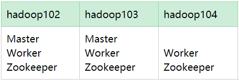

---

Created at: 2021-09-22
Last updated at: 2022-12-13
Source URL: about:blank


---

# 1-Spark快速上手


**IDEA本地模式跑Spark程序**
1.配置好Scala的环境
2.导入Spark的依赖
```
<dependency>
    <groupId>org.apache.spark</groupId>
    <artifactId>spark-core_2.12</artifactId>
    <version>3.0.0</version>
</dependency>
```
3.添加log4j.properties
```
log4j.rootCategory=ERROR, console
log4j.appender.console=org.apache.log4j.ConsoleAppender
log4j.appender.console.target=System.err
log4j.appender.console.layout=org.apache.log4j.PatternLayout
log4j.appender.console.layout.ConversionPattern=%d{yy/MM/dd HH:mm:ss} %p %c{1}: %m%n

# Set the default spark-shell log level to ERROR. When running the spark-shell, the
# log level for this class is used to overwrite the root logger's log level, so that
# the user can have different defaults for the shell and regular Spark apps.
log4j.logger.org.apache.spark.repl.Main=ERROR

# Settings to quiet third party logs that are too verbose
log4j.logger.org.spark_project.jetty=ERROR
log4j.logger.org.spark_project.jetty.util.component.AbstractLifeCycle=ERROR
log4j.logger.org.apache.spark.repl.SparkIMain$exprTyper=ERROR
log4j.logger.org.apache.spark.repl.SparkILoop$SparkILoopInterpreter=ERROR
log4j.logger.org.apache.parquet=ERROR
log4j.logger.parquet=ERROR

# SPARK-9183: Settings to avoid annoying messages when looking up nonexistent UDFs in SparkSQL with Hive support
log4j.logger.org.apache.hadoop.hive.metastore.RetryingHMSHandler=FATAL
log4j.logger.org.apache.hadoop.hive.ql.exec.FunctionRegistry=ERROR
```

**WordCount案例**
对RDD的操作和Scala的集合一样，只不过对Scala集合的每一步操作都是有结果的，即每一步操作都是会立即对集合进行计算，而RDD操作不是，在RDD的collect函数之前调用的RDD函数都只是一种声明，并不没有真正的对数据进行处理，只有执行到collect函数时才开始从文件中读取数据，并按之前声明好的步骤进行计算（与tensorflow一模一样，都是先构建计算图，构建完之后等到最后一步调用才开始计算，最后一步调用相当于是一个开关，按下去之后数据才开始流动）。RDD是通过装饰者模式实现这样的效果的，类似于Java IO的设计，RDD的每一步操作其实都是在创建对象，即将上一个对象包装到下一个对象中。
setMaster("local\[\*\]")表示使用Local模式，其中的\[\*\]表示使用与本地cpu核心数相同多的线程进行并行计算，也可以指定具体指定使用多少个线程，比如setMaster("local\[2\]")，如果不指定setMaster("local")则使用单线程。
```
object WordCount {
 def main(args: Array[String]): Unit = {
   // TODO 建立和Spark框架的连接
   val sparConf = new SparkConf().`setMaster("local[*]")`.setAppName("WordCount")
   val sc = new SparkContext(sparConf)
   // TODO 执行业务操作
   // 1. 读取文件，获取一行一行的数据
   val lines: RDD[String] = sc.textFile("data")
   // 2. 映射：将每一行数据进行拆分，形成一个一个的单词（分词）放到一个List中
   //    扁平化：将所有List拆分成个体的操作
   val words: RDD[String] = lines.flatMap(_.split(" "))
   // 3. 将数据根据单词进行分组，便于统计，分组的结果是一个Map，key是分组的key，value是相同key的数据的List
   //    Map((Hello -> List(Hello, Hello, Hello)), (world -> List(world, world)))
   val wordGroup: RDD[(String, Iterable[String])] = words.groupBy(word => word)
   // 4. 对分组后的数据再进行map映射
   //    Map((hello -> 3), (world -> 2))
   val wordToCount: RDD[(String, Int)] = wordGroup.mapValues(_.size)
   // 5. 当调用collect时才会进行数据的计算。也就是说上面的步骤只是在声明操作，并没有真正的计算，只有执行collect方法时数据才会开始流动进行上面的操作
   // collect的返回值是Array，也就是最后会把RDD转换成Scala的数据结构，方便输出结果
   // Array((hello -> 3), (world -> 2))
   val array: Array[(String, Int)] = wordToCount.collect()
   array.foreach(println)
   // TODO 关闭连接
   sc.stop()
 }
}
```
还可以直接使用RDD提供的reduceByKey函数直接进行聚合操作，也就是将上面的第3、4步合并为一步，不用先分组然后再对每一组数据做map映射或者reduce聚合，不过需要注意的是，reduceByKey操作要求输入的数据必须是一个二元组，即kv键值对形式的，因为它的计算过程是直接对所有key相同的二元组的value做reduce操作。
```
object WordCount2 {
  def main(args: Array[String]): Unit = {
    // TODO 建立和Spark框架的连接
    val sparConf = new SparkConf().setMaster("local").setAppName("WordCount")
    val sc = new SparkContext(sparConf)
    // TODO 执行业务操作
    // 1. 读取文件，获取一行一行的数据
    val lines: RDD[String] = sc.textFile("data")
    // 2. 映射：将每一行数据进行拆分，形成一个一个的单词（分词）放到一个List中
    //    扁平化：将所有List拆分成个体的操作
    val words: RDD[String] = lines.flatMap(_.split(" "))
    `// 3.映射，把每个单词映射成一个二元组，第二个元素为1，方便后面直接使用reduceByKey`
 `// hello 变成 (hello, 1)`
 `val wordAndOne: RDD[(String, Int)] = words.map((_, 1))`
 `// 4.分组聚合两步操作直接合并在一起，也就是对所有key相同的二元组的value直接做reduce操作`
 `val wordToCount: RDD[(String, Int)] = wordAndOne.reduceByKey(_ + _)`
    // 5. 当调用collect时才会进行数据的计算。也就是说上面的步骤只是在声明操作，并没有真正的计算，只有执行collect方法时数据才会开始流动进行上面的操作
    // collect的返回值是Array，也就是最后会把RDD转换成Scala的数据结构，方便输出结果
    // Array((hello -> 3), (world -> 2))
    val array: Array[(String, Int)] = wordToCount.collect()
    array.foreach(println)
    // TODO 关闭连接
    sc.stop()
  }
}
```

**Local 模式**
1.解压缩Spark并重命名
```
tar -zxvf /opt/software/spark-3.0.0-bin-hadoop3.2.tgz -C /opt/module/
```
```
mv spark-3.0.0-bin-hadoop3.2/ spark-local
```
2.进入Spark的命令行交互界面
```
bin/spark-shell
```
Spark WebUI地址，查看本次会话期间任务运行情况：
```
http://hadoop102:4040
```
3.测试，使用命令行交互界面完成wordcount程序
3.1 在/opt/module/spark-local/data下新建一个words.txt并添加点内容
3.2 输入如下代码。在命令行中已经创建了SparkContext对象sc，sc使用的master是Local 模式，直接使用即可，所以命令行只能在Local模式下执行spark程序。
```
sc.textFile("data/words.txt").flatMap(_.split(" ")).map((_,1)).reduceByKey(_+_).collect()
```
4\. 退出命令行，按键 Ctrl+C 或输入 Scala 指令
```
:quit
```
5. Local 模式提交应用。还可以将IDEA中的程序打包之后再提交给spark运行，以下是将spark自带的计算圆周率的程序提交给spark运行的命令，spark-submit 提交的Local 模式的任务的日志不能在 http://hadoop102:4040 看到，http://hadoop102:4040 只能看到当前会话的任务的日志，因为会话的app-id与单独提交运行的app-id不同。
```
bin/spark-submit \
--class org.apache.spark.examples.SparkPi \
--master local[2] \
./examples/jars/spark-examples_2.12-3.0.0.jar \
10
```

**Standalone 模式**
Spark的Standalone（独立部署）模式指的是使用Spark自带的 资源调度器 部署Spark集群。
集群规划如下，Master类似于Yarn的ResourceManager，Work类似于Yarn的NodeManager，所以这里的集群指的是 资源调度器 的集群，由资源调度器调度spark程序的运行。


1.解压缩Spark并重命名
```
tar -zxvf /opt/software/spark-3.0.0-bin-hadoop3.2.tgz -C /opt/module/
```
```
mv spark-3.0.0-bin-hadoop3.2/ spark-standalone
```
2.修改 conf/slaves 文件
```
mv slaves.template slaves
```
添加worker：
```
hadoop102
hadoop103
hadoop104
```
3\. 修改 conf/spark-env.sh 文件
```
mv spark-env.sh.template spark-env.sh
```
指定 JAVA\_HOME 和 master 所在的主机 以及 向 master 的提交spark程序的端口
```
export JAVA_HOME=/opt/module/jdk1.8.0_301
SPARK_MASTER_HOST=hadoop102
SPARK_MASTER_PORT=7077
```
4\. 分发 spark
```
xsync spark-standalone
```
5\. 启动集群
```
sbin/start-all.sh
```
查看jvm进程：
```
jpsall
```
查看 Master 资源监控 Web UI 界面
```
http://hadoop102:8080/
```
6\. Standalone 模式提交应用，同样是运行自带的计算圆周率的spark程序，不过这次是提交给Spark自带的资源调度器的master，所以会以分布式计算的方式在多台主机上运行spark程序。
```
bin/spark-submit \
--class org.apache.spark.examples.SparkPi \
`--master spark://hadoop102:7077 \`
./examples/jars/spark-examples_2.12-3.0.0.jar \
10
```
7.停止集群
```
sbin/stop-all.sh
```

spark-submit命令参数说明：

|     |     |     |
| --- | --- | --- |
| 参数  | 解释  | 可选值举例 |
| \--class | 指定Spark 程序中包含主函数的类 |     |
| \--master | 指定Spark 程序运行的模式(环境) | 模式： local\[\*\]、 spark://haoop102:7077、Yarn |
| \--executor-memory 1G | 指定每个 executor 可用内存为 1G | 符合集群内存配置即可，具体情况具体分析 |
| \--total-executor-cores 2 | 指定所有executor使用的cpu核数为 2 个 |     |
| \--executor-cores | 指定每个executor使用的cpu核数 |     |
| application-jar | 打包好的应用 jar，包含依赖。这个 URL 在集群中全局可见。 比如 hdfs:// 共享存储系统，如果是file:// path，那么所有的节点的path 都包含同样的 jar |     |
| application-arguments | 传给 main()方法的参数 |     |

**配置历史服务**
Local模式时，退出命令行之后就无法通过 http://hadoop102:4040 查看任务运行情况了，并且任务运行的日志也不会被保存下来，也就是即使再次开启命令行也看不到之前任务的运行日志。Standalone 模式也是一样，只能查看在集群运行期间运行的任务的日志，集群停止之后就查看不到了，并且也不会保留任务的日志。历史服务器可以保存无论是Local模式还是Standalone 模式的任务的日志。
1.修改 conf/spark-defaults.conf 文件
```
mv spark-defaults.conf.template spark-defaults.conf
```
添加以下内容，开启日志，并设置将日志保存在HDFS上
```
spark.eventLog.enabled true
spark.eventLog.dir hdfs://hadoop102:8020/spark-history
```
注意：需要启动 hadoop 集群， HDFS 上的 /spark-history 目录需要提前存在
```
sbin/start-dfs.sh
hadoop fs -mkdir /spark-history
```
2\. 修改 spark-env.sh 文件, 添加日志配置
```
export SPARK_HISTORY_OPTS="
-Dspark.history.ui.port=18080
-Dspark.history.fs.logDirectory=hdfs://hadoop102:8020/spark-history
-Dspark.history.retainedApplications=30"
```
\-Dspark.history.ui.port： WEB UI 访问的端口号为 18080
\-Dspark.history.fs.logDirectory：指定历史服务器日志存储路径
\-Dspark.history.retainedApplications：指定保存 Application 历史记录的个数，如果超过这个值，旧的应用程序信息将被删除，这个是内存中的应用数，而不是页面上显示的应用数。
4\. 分发配置文件，不分发就只能保存本机Local模式下的日志
```
xsync conf
```
5.启动历史服务器
```
sbin/start-history-server.sh
```
启动spark集群
```
sbin/start-all.sh
```
6.访问历史服务的webui
```
http://hadoop102:18080/
```
7.停止历史服务器
```
sbin/stop-history-server.sh
```

**Master高可用**
因为 Master 节点只有一个，所以会存在单点故障问题。 为了解决单点故障问题，需要在集群中配置多个 Master 节点，一旦处于活动状态的 Master发生故障时，由备用 Master 提供服务，保证作业可以继续执行。 高可用一般采用Zookeeper 来实现，通过争抢创建某个节点完成主Master的选择。
集群规划：

1\. 停止spark集群
```
sbin/stop-all.sh
```
2. 启动 Zookeeper集群
```
zk.sh start
```
3.修改 spark-env.sh 文件
```
#注释如下内容：
#SPARK_MASTER_HOST=hadoop102
#SPARK_MASTER_PORT=7077

#添加如下内容:
#Master 监控页面默认访问端口为 8080，但是可能会和 Zookeeper 冲突，所以改成 8989，也可以自定义，访问 UI 监控页面时请注意
SPARK_MASTER_WEBUI_PORT=8989
export SPARK_DAEMON_JAVA_OPTS="
-Dspark.deploy.recoveryMode=ZOOKEEPER
-Dspark.deploy.zookeeper.url=hadoop102,hadoop103,hadoop104
-Dspark.deploy.zookeeper.dir=/spark"
```
4.分发配置
```
xsync conf/spark-env.sh
```
5.启动spark集群
```
sbin/start-all.sh
```
6.单独在hadoop103上启动Master，成为备用Master
```
sbin/start-master.sh
```
访问hadoop103的Master的webui
```
http://hadoop103:8989/
```
可以看到状态是standby

7.此时在提交应用时指定两个Master的地址，万一有一个Master挂了，此次提交也不会失败
```
bin/spark-submit \
--class org.apache.spark.examples.SparkPi \
`--master spark://hadoop102:7077,hadoop103:7077 \`
./examples/jars/spark-examples_2.12-3.0.0.jar \
10
```
8.测试高可用
先杀死hadoop102的master
```
kill -9 6652
```
然后查看hadoop103的master的状态，发现变为alive

**Yarn模式**
Standalone模式使用的是Spark自带的资源调度器，与spark-core不是同一个东西，spark-core本身只是一个分布式计算框架，不涉及资源调度，使用spark-core编写的应用程序，可以被资源调度器分散到不同的机器上执行。Yarn作为一款资源调度器，也可以调度Spark程序的运行。
1.解压缩Spark并重命名
注意这里不需要分发spark，因为将spark运行在yarn上，并不需要其它主机也配置spark的环境。也就是将spark程序提交yarn之后，剩下的将任务调度给其它主机的工作是由yarn来完成的，所以只需要有一台主机上有spark的环境即可，这台主机只是用于提交spark程序给yarn。
```
tar -zxvf /opt/software/spark-3.0.0-bin-hadoop3.2.tgz -C /opt/module/
```
```
mv spark-3.0.0-bin-hadoop3.2/ spark-yarn
```
2\. 修改 yarn 的配置文件/opt/module/hadoop-3.3.1/etc/hadoop/yarn-site.xml（不配置也是可以的），并分发
```
<!--是否启动一个线程检查每个任务正使用的物理内存量，如果任务超出分配值，则直接将其杀掉，默认是 true -->
<property>
    <name>yarn.nodemanager.pmem-check-enabled</name>
    <value>false</value>
</property>
<!--是否启动一个线程检查每个任务正使用的虚拟内存量，如果任务超出分配值，则直接将其杀掉，默认是 true -->
<property>
    <name>yarn.nodemanager.vmem-check-enabled</name>
    <value>false</value>
</property>
```
```
xsync /opt/module/hadoop-3.3.1/etc/hadoop/yarn-site.xml
```
3\. 修改 conf/spark-env.sh，添加 JAVA\_HOME 和 YARN\_CONF\_DIR 配置
```
mv spark-env.sh.template spark-env.sh
```
```
export JAVA_HOME=/opt/module/jdk1.8.0_301
export YARN_CONF_DIR=/opt/module/hadoop-3.3.1/etc/hadoop
```
4.启动Yarn的集群
```
start-yarn.sh
```
5.提交spark任务给yarn
client模式和cluster部署模式最直观的区别就是：client模式会将结果打印到控制台；而cluster部署模式不会将结果打印到控制台，而是会将输出记录到yarn历史服务器的日志上。
两种模式下真正做计算的Executor都是运行在Yarn集群上，而区别仅在于Driver运行地方，client模式下Driver运行在提交spark程序的本地机器上，Driver的日志和输出的结果都会直接打印到控制台上。而cluster部署模式下Driver 运行在 Yarn 上，Driver输出的日志以及结果会输出到yarn的历史服务器日志中。
```
bin/spark-submit \
--class org.apache.spark.examples.SparkPi \
`--master yarn \`
`--deploy-mode client \`
./examples/jars/spark-examples_2.12-3.0.0.jar \
10
```
```
bin/spark-submit \
--class org.apache.spark.examples.SparkPi \
`--master yarn \`
`--deploy-mode cluster \`
./examples/jars/spark-examples_2.12-3.0.0.jar \
10
```

6\. 配置历史服务器
与前面配置历史服务器步骤差不多，不过这里不需要分发配置。
6.1 修改 conf/spark-defaults.conf 文件
```
mv spark-defaults.conf.template spark-defaults.conf
```
添加以下内容，开启日志，并设置将日志保存在HDFS上
```
spark.eventLog.enabled true
spark.eventLog.dir hdfs://hadoop102:8020/spark-history
spark.yarn.historyServer.address=hadoop102:18080
spark.history.ui.port=18080
```
注意：需要启动 hadoop 集群， HDFS 上的 /spark-history 目录需要提前存在
```
在hadoop的目录下：sbin/start-dfs.sh
hadoop fs -mkdir /spark-history
```
6.2 修改 spark-env.sh 文件, 添加日志配置
```
export SPARK_HISTORY_OPTS="
-Dspark.history.ui.port=18080
-Dspark.history.fs.logDirectory=hdfs://hadoop102:8020/spark-history
-Dspark.history.retainedApplications=30"
```
6.3 启动Spark的历史服务，在Spark的目录下：
```
sbin/start-history-server.sh
```
7.重新提交任务到yarn，查看历史服务器上的日志

**三种部署模式对比**

|     |     |     |
| --- | --- | --- |
| 部署模式 | Spark安装机器数 | 启动的进程 |
| Local | 1   | 通过bin/spark-shell命令启动的SparkSubmit进程，退出命令行SparkSubmit进程就结束了 |
| Standalone | 3   | 1个 Master 和 3个分布在不同机器上的 Worker |
| Yarn | 1   | 1个 ResourceManager 和 3个分布在不同机器上的 NodeManager |

Spark在Local模式下只需要启动一个JVM进程就可以执行Spark程序，虽然不是以分布式的方式在运行程序，但是可以用于测试spark程序。既然Spark是用Scala写的，所以只要有JVM就能运行Spark，于是乎完全**可以在Windows环境下运行Local模式**，不过还是需要Spark提供一些启动脚本，当然Spark也提供了。其实感觉在IDEA里写的Spark程序和Local模式的Spark差不多，说白了Local模式下的Spark只是提供了spark程序运行所依赖的各种jar包，而在IDEA中则是用Maven完成了依赖的引入。

注意：需要将Spark解压都无空格的目录

**端口号**

* Spark 查看当前 Spark-shell 运行任务情况端口号： 4040（计算）
* Spark Master 内部通信服务端口号： 7077
* Standalone 模式下， Spark Master Web 端口号： 8080（资源）
* Spark 历史服务器端口号： 18080
* Hadoop YARN 任务运行情况查看端口号： 8088

