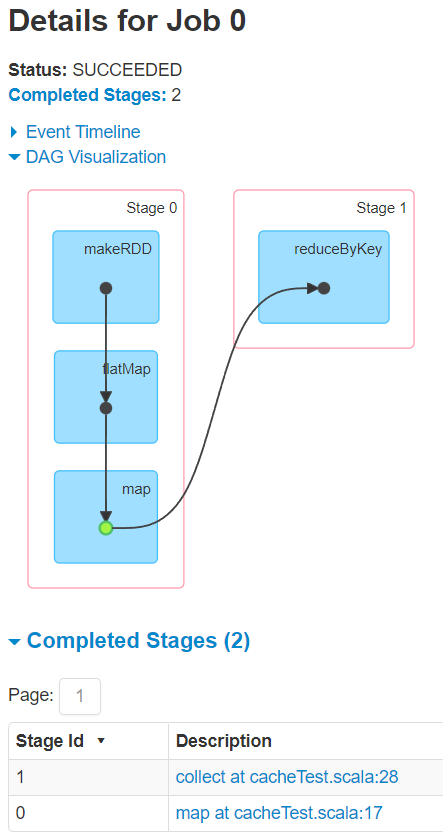
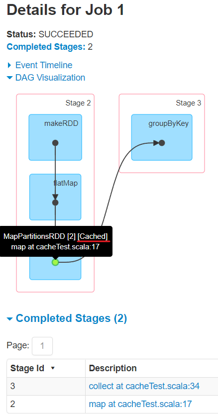
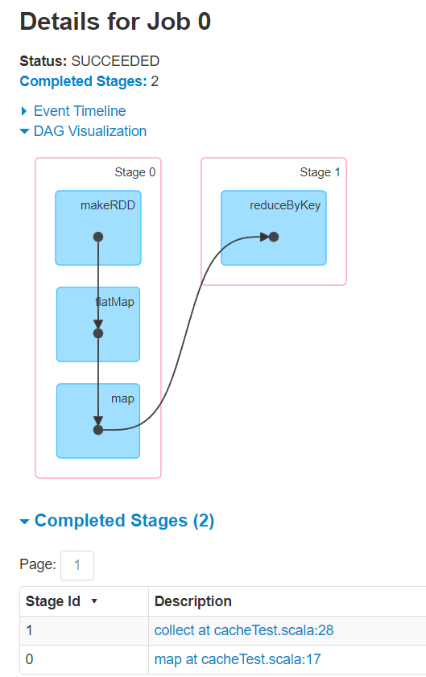
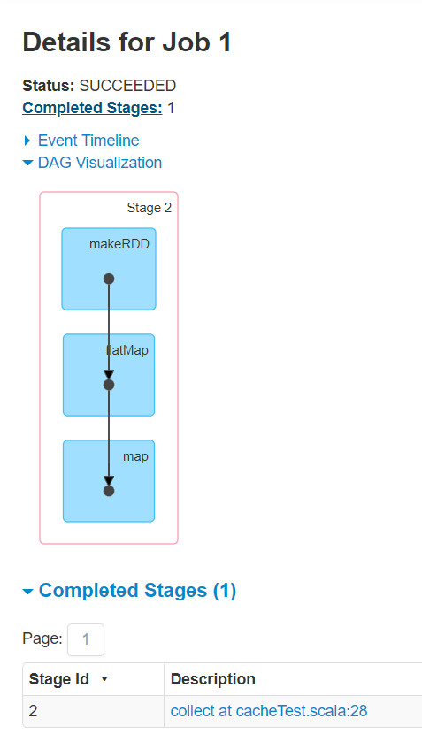
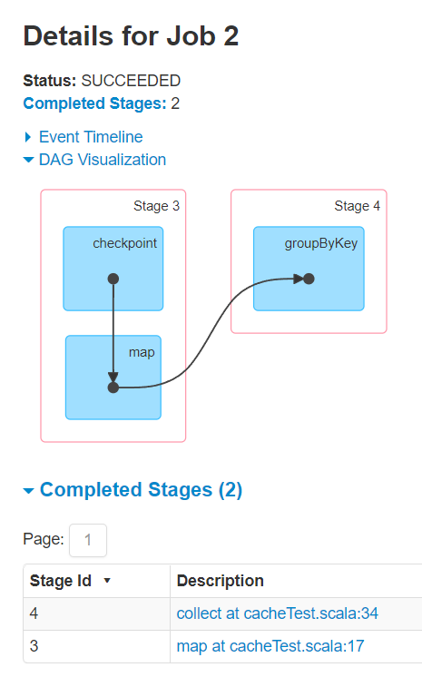
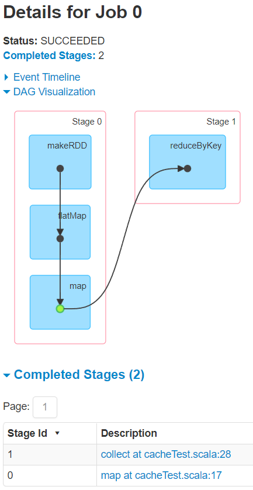
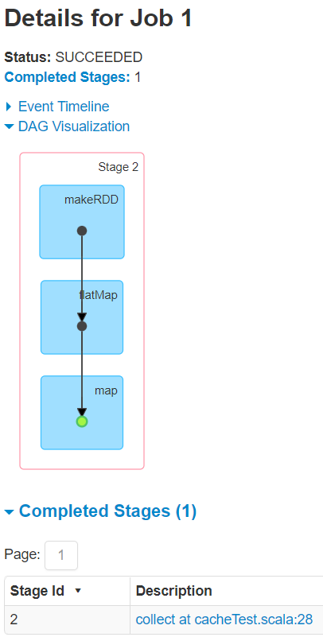
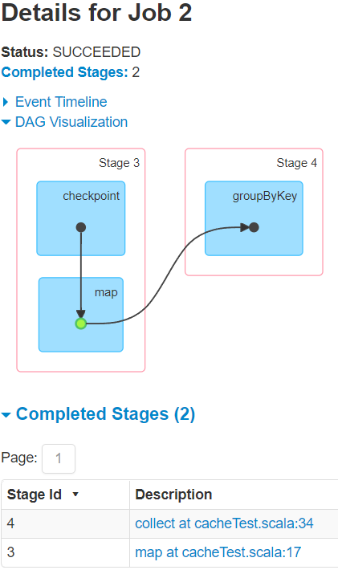

---

Created at: 2021-09-26
Last updated at: 2021-10-14
Source URL: about:blank


---

# 15-持久化


1.以下会有两个Job，因为有两个行动算子
```
def main(args: Array[String]): Unit = {
 val sc = new SparkContext("local[*]", "WordCount")
 val lines: RDD[String] = sc.makeRDD(List("Hello Spark", "Hello Scala"))
 val words: RDD[String] = lines.flatMap(_.split(" "))
 val wordAndOne: RDD[(String, Int)] = words.map(word => {
   println("@@@@@@@@")
   (word, 1)
 })

 //聚合
 val wordToCount: RDD[(String, Int)] = wordAndOne.reduceByKey(_ + _)
 wordToCount.collect().foreach(println)
 println("================")
 //分组
 val groupByKeyRDD: RDD[(String, Iterable[Int])] = wordAndOne.groupByKey()
 groupByKeyRDD.collect.foreach(println)

 TimeUnit.DAYS.sleep(1)
 sc.stop()
}
```
虽然在两个Job中前两个RDD是重用的，但是因为RDD是不保存数据的，RDD只是对数据的操作，所以两个Job会各自从数据源中读取数据，也就是数据会被读取两次，从输出结果中可以看到这一点：
```
@@@@@@@@
@@@@@@@@
@@@@@@@@
@@@@@@@@
(Hello,3)
(Scala,1)
(Spark,1)
================
@@@@@@@@
@@@@@@@@
@@@@@@@@
@@@@@@@@
(Hello,CompactBuffer(1, 1, 1))
(Scala,CompactBuffer(1))
(Spark,CompactBuffer(1))
```

2.如果想不重新读取数据，则可以使用 Cache 或者 Persist 方法将计算结果缓存下来。
cache会将数据缓存在内存，cache()方法其实调用的是persist()方法，persist()方法默认将数据缓存在内存中，还可以使用persist(StorageLevel.DISK\_ONLY)将数据缓存在磁盘中，程序结束时删除。
缓存在内存中的优点是快，但缺点是不可靠，因为缓存在内存的数据有可能会丢失，或者由于内存不足而被删除，不过RDD 的缓存容错机制（血缘关系）保证了即使缓存丢失也能保证计算的正确执行，既通过血缘关系可以重新对数据进行计算，由于 RDD 的各个 Partition 是相对独立的，因此只需要计算丢失的部分即可，并不需要重算全部 Partition。
Spark 会自动对一些 Shuffle 操作的中间数据做持久化操作(比如： reduceByKey)，这样做的目的一是数据量太大不可能在内存中等待分区数据到齐之后再开始下一阶段的计算，二是当下一阶段的计算任务失败了之后可以直接重新读取已经落盘的数据恢复计算，避免重新从头开始读取数据并计算。虽然shuffle会落盘，但是在实际使用的时候，如果想重用数据，仍然建议调用 persist 或 cache。
```
def main(args: Array[String]): Unit = {
    val sc = new SparkContext("local[*]", "WordCount")
    val lines: RDD[String] = sc.makeRDD(List("Hello Spark", "Hello Scala"))
    val words: RDD[String] = lines.flatMap(_.split(" "))
    val wordAndOne: RDD[(String, Int)] = words.map(word => {
      println("@@@@@@@@")
      (word, 1)
    })
`//    wordAndOne.cache() //缓存在内存中`
`//    wordAndOne.persist() //缓存在内存中`
 `wordAndOne.persist(StorageLevel.DISK_ONLY) //缓存在磁盘中，程序结束时删除`

    //聚合
    val wordToCount: RDD[(String, Int)] = wordAndOne.reduceByKey(_ + _)
    wordToCount.collect().foreach(println)
    println("================")
    //分组
    val groupByKeyRDD: RDD[(String, Iterable[Int])] = wordAndOne.groupByKey()
    groupByKeyRDD.collect.foreach(println)

    TimeUnit.DAYS.sleep(1)
    sc.stop()
  }
```
输出：
```
@@@@@@@@
@@@@@@@@
@@@@@@@@
@@@@@@@@
(Hello,2)
(Scala,1)
(Spark,1)
================
(Hello,CompactBuffer(1, 1))
(Scala,CompactBuffer(1))
(Spark,CompactBuffer(1))
```
从下图中可以看到，两个Job的第二个阶段的task都可以直接从cache中读取数据。与下面的checkPoint不同，cache算子并不会改变两个Job的血缘关系，因为缓存的数据可能会丢失，如果发生缓存数据丢失，那么就需要依靠血缘关系来恢复。
 

3.CheckPoint 检查点
checkPoint 与 persist(StorageLevel.DISK\_ONLY) 都会将数据落盘，但是persist保存的数据会在程序结束时删除，checkPoint不会，所以使用checkPoint时需要指定保存的路径。
```
def main(args: Array[String]): Unit = {
    val sc = new SparkContext("local[*]", "WordCount")
    //一般保存路径都是在分布式存储系统：HDFS
 `sc.setCheckpointDir("checkpoint")`

    val lines: RDD[String] = sc.makeRDD(List("Hello Spark", "Hello Scala"),1)
    val words: RDD[String] = lines.flatMap(_.split(" "))
    val wordAndOne: RDD[(String, Int)] = words.map(word => {
      println("@@@@@@@@")
      (word, 1)
    })
 `wordAndOne.checkpoint()`

    //聚合
    val wordToCount: RDD[(String, Int)] = wordAndOne.reduceByKey(_ + _)
    wordToCount.collect().foreach(println)
    println("================")
    //分组
    val groupByKeyRDD: RDD[(String, Iterable[Int])] = wordAndOne.groupByKey()
    groupByKeyRDD.collect.foreach(println)

    TimeUnit.DAYS.sleep(1)
    sc.stop()
  }
```
从输出结果中可以看到两个Job还是都重新读取了数据并完整地执行了整个流程，所以虽然checkPoint会将中间计算的结果保存在磁盘中，却不能让Job重用数据。
```
@@@@@@@@
@@@@@@@@
@@@@@@@@
@@@@@@@@
@@@@@@@@
@@@@@@@@
@@@@@@@@
@@@@@@@@
(Spark,1)
(Hello,2)
(Scala,1)
================
(Spark,CompactBuffer(1))
(Hello,CompactBuffer(1, 1))
(Scala,CompactBuffer(1))
```
从下图中可以看到checkPoint会改变其中一个任务的血缘关系，直接让其变成两个Job，其中的第二个Job会从checkpoint中读取数据，也就是说当job2计算失败后，可以直接从checkPoint中重新读取数据恢复计算，所以checkPoint即使改变了任务的血缘关系，也不会导致任务计算失败无法恢复重新计算，因为此时并不依赖血缘关系恢复，而是直接从 checkPoint中重新读取数据并计算。


所以需要将CheckPoint和cache结合起来使用：
```
def main(args: Array[String]): Unit = {
  val sc = new SparkContext("local[*]", "WordCount")
 `//一般保存路径都是在分布式存储系统：HDFS`
 `sc.setCheckpointDir("checkpoint")`

  val lines: RDD[String] = sc.makeRDD(List("Hello Spark", "Hello Scala"), 1)
  val words: RDD[String] = lines.flatMap(_.split(" "))
  val wordAndOne: RDD[(String, Int)] = words.map(word => {
    println("@@@@@@@@")
    (word, 1)
  })
 `wordAndOne.cache() //缓存在内存中`
 `wordAndOne.checkpoint()`

  //聚合
  val wordToCount: RDD[(String, Int)] = wordAndOne.reduceByKey(_ + _)
  wordToCount.collect().foreach(println)
  println("================")
  //分组
  val groupByKeyRDD: RDD[(String, Iterable[Int])] = wordAndOne.groupByKey()
  groupByKeyRDD.collect.foreach(println)

  TimeUnit.DAYS.sleep(1)
  sc.stop()
}
```
此时输出如下，两个Job并不会重新读取数据，而是从cache中读取。
```
@@@@@@@@
@@@@@@@@
@@@@@@@@
@@@@@@@@
(Spark,1)
(Hello,2)
(Scala,1)
================
(Spark,CompactBuffer(1))
(Hello,CompactBuffer(1, 1))
(Scala,CompactBuffer(1))
```
此时Job仍然是3个，因为checkPoint仍然会改变其中一个任务的血缘关系，直接让其变成两个Job，此时Job0和Job2的第二个阶段都会从cache中读数据。


注意： cache、persist 和 checkpoint 操作并不会马上被执行，必须执行 Action 算子才能触发执行。

4.缓存和检查点区别
（1）Cache 缓存只是将数据保存起来，不切断血缘依赖，而Checkpoint 检查点会切断血缘依赖。
（2）Cache 缓存将数据存储在内存或本地文件系统中，在程序运行结束时会删除，可靠性低。而Checkpoint可以将数据存储在 HDFS 等分布式文件系统中，在程序运行结束时不会删除，可靠性高。
（3）建议将 checkpoint 和 cache 结合起来使用，这样 checkpeoint 的 job 只需从 Cache 缓存中读取数据，否则会重新从数据源中读取数据并完整地执行整个计算流程。

