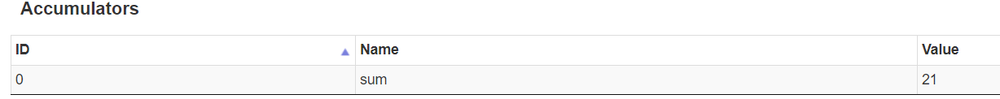
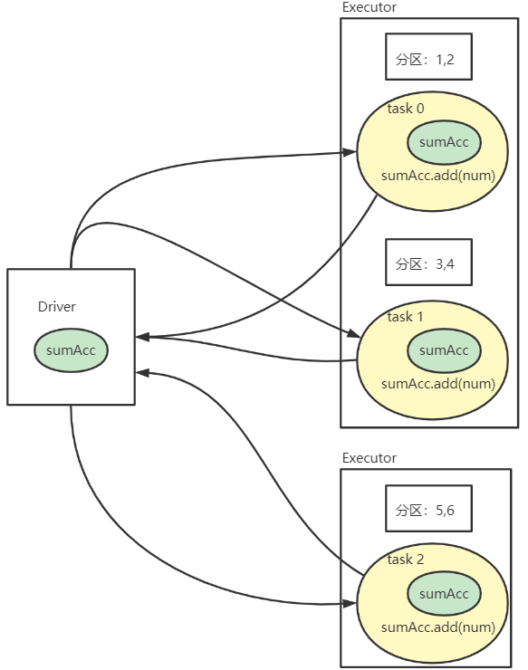

---

Created at: 2021-09-27
Last updated at: 2025-02-28
Source URL: about:blank


---

# 16-累加器


以下程序不能实现分布式计算对数据求和，因为sum变量闭包后被发送到了每个task中，每个task都有一份独立的sum变量，并且在task计算后，每个task并不会将sum返回到Driver端汇总，所以最后的输出结果是0。
```
def main(args: Array[String]): Unit = {
   val sc = new SparkContext("local[*]", "broadcast")
   val rdd = sc.makeRDD(List(1, 2, 3, 4))
   var sum = 0
   rdd.foreach(num => sum += num)
   println("sum = " + sum)
   sc.stop()
}
```

**1.使用Spark自带的简单累加器**
如果想实现每个task计算完毕后将sum变量返回到Driver端汇合的功能，可以使用Saprk提供的累加器， 累加器是分布式共享只写变量，Saprk自带了3个简单的累加器：longAccumulator、doubleAccumulator、collectionAccumulator。
```
def main(args: Array[String]): Unit = {
   val sc = new SparkContext("local[*]", "broadcast")
   val rdd = sc.makeRDD(List(1, 2, 3, 4, 5, 6), 3)
 `// 使用Spark提供了简单数据聚合功能的长整型数据累加器，`
 `// 需要给累加器取一个名字，是为了能记录在webui上`
 `val sumAcc = sc.longAccumulator("sum")`
   rdd.foreach(
      num => {
 `// 使用累加器`
 `sumAcc.add(num)`
      }
   )
 `// 获取累加器的值`
 `println(sumAcc.value)`
   TimeUnit.DAYS.sleep(1)
   sc.stop()
}
```
在webui上可以看到该累加器的值：

使用累加器的计算过程如下，Driver把累加器发送到每个task，task计算完毕后把累加器返回到Driver端汇合的：


使用累加器需要注意两个问题：
1.少加：不调用行动算子的话，就不会执行转换算子中累加器的累加操作，所以下面输出结果为0
```
def main(args: Array[String]): Unit = {
   val sc = new SparkContext("local[*]", "broadcast")
   val rdd = sc.makeRDD(List(1, 2, 3, 4, 5, 6), 3)
   val sumAcc = sc.longAccumulator("sum")
   `val mapRDD = rdd.map(sumAcc.add(_))`
   println(sumAcc.value)
   sc.stop()
}
```
2.多加：多次调用行动算子的话，就会对累加器进行多次累加聚合的操作，所以下面的的结果是42
```
def main(args: Array[String]): Unit = {
    val sc = new SparkContext("local[*]", "broadcast")
    val rdd = sc.makeRDD(List(1, 2, 3, 4, 5, 6), 3)
    // 使用Spark提供了简单数据聚合功能的长整型数据累加器，
    // 需要给累加器取一个名字，是为了能记录在webui上
    val sumAcc = sc.longAccumulator("sum")
    val mapRDD = rdd.map(sumAcc.add(_))
 `mapRDD.collect`
 `mapRDD.collect`
    // 获取累加器的值
    println(sumAcc.value)
    sc.stop()
}
```

**2.自定义累加器**
需求自定义累加器实现WordCount
1.自定义累加器
```
/**
* 自定义数据累加器：
* 1. 继承AccumulatorV2, 定义泛型
*  IN: 累加器的输入数据类型 String, 即调用add方法时输入的数据类型
*  OUT: 累加器返回的数据类型 mutable.Map[String, Long], 即调用value方法时返回的数据类型
* 2. 重写方法
*/
class WordCountAccumulator extends AccumulatorV2[String, mutable.Map[String, Long]] {
  private val wcMap = mutable.Map[String, Long]()
  /**
   * 判断是否初始状态
   */
  override def isZero: Boolean = wcMap.isEmpty

  override def copy(): AccumulatorV2[String, mutable.Map[String, Long]] = new WordCountAccumulator

  override def reset(): Unit = wcMap.clear()

  /**
   * 对每个输入的元素做累加的方法，在算子中调用
   */
  override def add(word: String): Unit = wcMap.update(word, wcMap.getOrElse(word, 0L) + 1L)

  /**
   * 在Driver端需要将累加器两两合并，这是合并的方法
   */
  override def merge(other: AccumulatorV2[String, mutable.Map[String, Long]]): Unit = {
    // 合并两个Map
    other.value.foreach {
      case (word, count) => wcMap.update(word, wcMap.getOrElse(word, 0L) + count)
    }
  }

  /**
   * 在Driver中获取累加器的值时调用的方法
   */
  override def value: mutable.Map[String, Long] = wcMap
}
```

2.使用累加器做WordCount
```
def main(args: Array[String]): Unit = {
  val sc = new SparkContext("local[*]", "broadcast")
  val rdd = sc.makeRDD(List("hello world", "hello scala", "hello spark"))
  // 1.创建累加器对象
  val wcAcc = new WordCountAccumulator
  // 2.向Spark进行注册
  sc.register(wcAcc)
  rdd.flatMap(_.split(" "))
    // 3.使用累加器进行累加
    .foreach(wcAcc.add)
  // 4.获取累加器累加的结果
  wcAcc.value.foreach(println)
}
```

