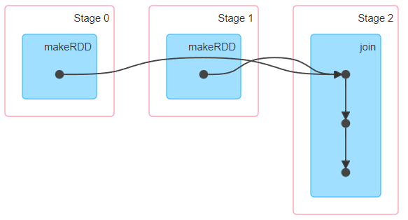
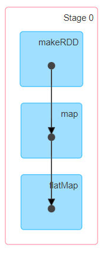
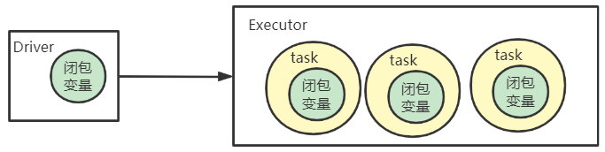
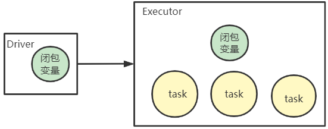

---

Created at: 2021-09-27
Last updated at: 2021-10-08


---

# 17-广播变量


使用join算子连接两个kv类型的数据时，会有shuffle的过程
```
def main(args: Array[String]): Unit = {
  val sc = new SparkContext("local[*]", "broadcast")
  val rdd1 = sc.makeRDD(List(("a", 1), ("b", 2), ("c", 3)))
  val rdd2 = sc.makeRDD(List(("a", 4), ("b", 5), ("c", 6)))
  rdd1.join(rdd2).collect().foreach(println)
  sc.stop()
}
```

输出结果：
```
(a,(1,4))
(a,(1,5))
(c,(3,6))
```

shuffle会有中间数据落盘的操作，效率较低，当一个大数据源和一个小数据源做join时，可以将小数据源的所有数据直接发送到大数据源的每个分区做join，这样就可以避开Shuffle，从而提高效率了。
```
def main(args: Array[String]): Unit = {
  val sc = new SparkContext("local[*]", "broadcast")
  val rdd1 = sc.makeRDD(List(("a", 1), ("b", 2), ("c", 3)))
  val list = List(("a", 4), ("a", 5), ("c", 6))
 `rdd1.map(kv => {`
 `val res = for (elem <- list if elem._1 == kv._1) yield (kv._1,(kv._2, elem._2))`
 `if (res.isEmpty) Nil`
 `else res`
 `}).flatMap(a => a)`.collect().foreach(println)
  sc.stop()
}
```

map算子内的匿名函数会闭包外部的list，然后发送给每一个task执行，实现了将小数据源发送到大数据源的每个分区做join的操作，这正是我们想要的效果。但时当多个task被分配到一个Executor时，这个Executor会启动相应数量的线程来执行task，于是每个线程都会独立拥有一份小数据源的副本（每个线程在堆内存上都有一份完整的副本），那么这时就可能会有OOM的问题了：

所以Spark为此提供了广播变量，让处于同一Executor的task可以共享同一个变量（所有线程共享堆内存上的一份副本），注意广播变量是分布式只读变量：
```
def main(args: Array[String]): Unit = {
  val sc = new SparkContext("local[*]", "broadcast")
  val rdd1 = sc.makeRDD(List(("a", 1), ("b", 2), ("c", 3)))
  val list = List(("a", 4), ("a", 5), ("c", 6))
 `val bc: Broadcast[List[(String, Int)]] = sc.broadcast(list)`
  rdd1.map(kv => {
    val res = for (elem <- `bc.value` if elem._1 == kv._1) yield (kv._1,(kv._2, elem._2))
    if (res.isEmpty) Nil
    else res
  }).flatMap(a => a).collect().foreach(println)
  sc.stop()
}
```


总结：数据源中的数据以分区为单位划分之后发送到每一个分区，但是算子中闭包的变量会被完整地发送到每个包含这个算子的任务中，所以当有多个包含这个算子的任务在同一Executor上执行时，该Executor进程就会有同一个闭包变量的多个副本，针对这种情况，我们可以使用广播变量，让Executor只保存这个变量的一个副本，让处于这个Executor上的task共享这一个变量，但是要注意广播变量是只读变量，不可以修改。

