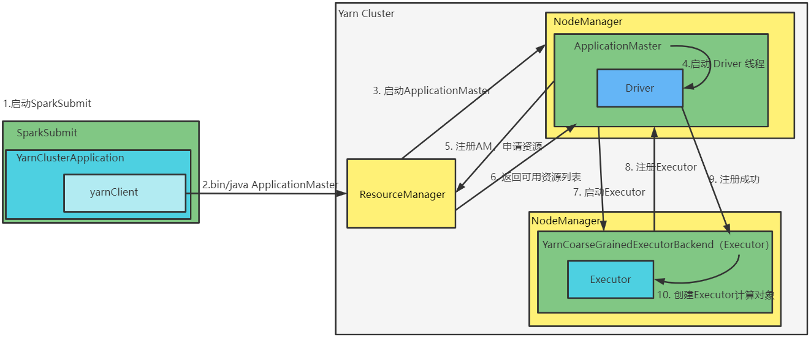
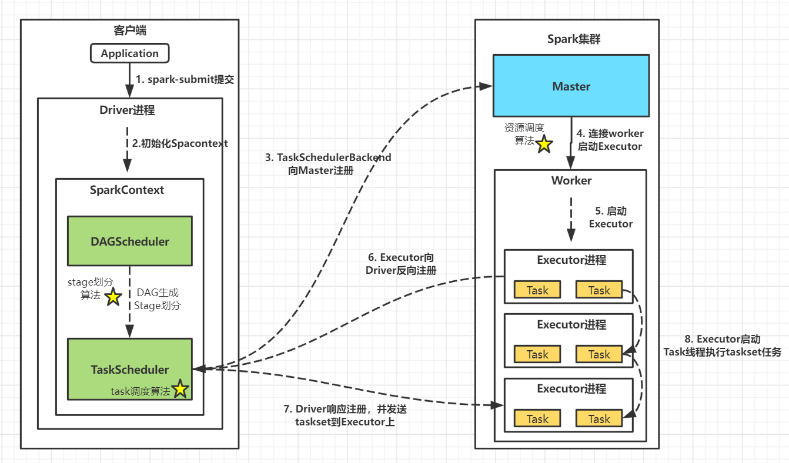
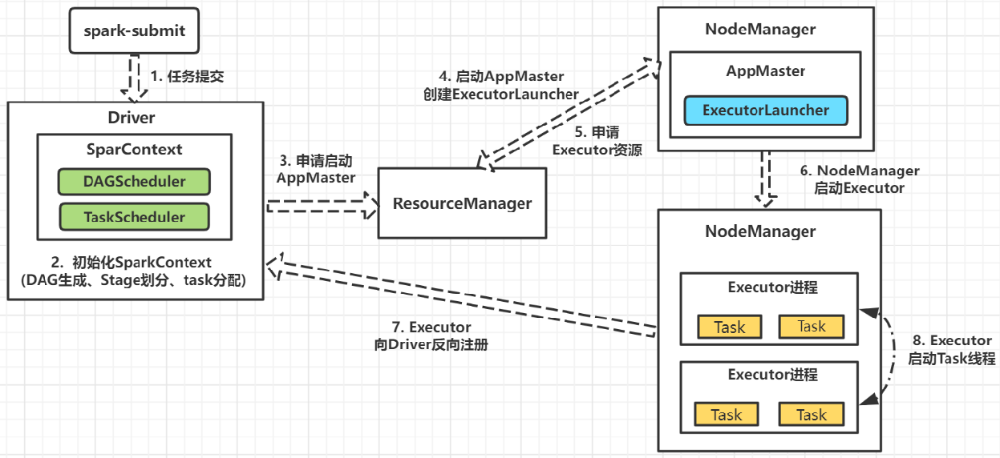
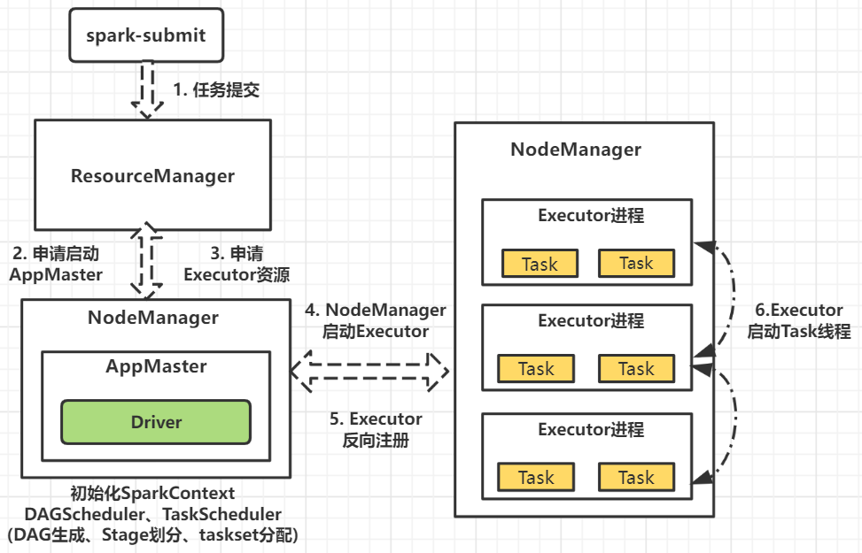

---

Created at: 2021-09-29
Last updated at: 2025-03-01

---

# 2-Spark 核心组件 和 Yarn Client 模式

Spark 核心组件
**Driver**
Spark 驱动器节点，用于执行 Spark 任务中的 main 方法， 主要负责：

1. 将用户程序转化为作业（Job）；
2. 在 Executor 之间调度任务（Task）；
3. 跟踪 Executor 的执行情况；
4. 通过 UI 展示查询运行情况；

**Executor**
Spark Executor对象是负责在 Spark 作业中运行具体任务，任务彼此之间相互独立。Spark 应用启动时， ExecutorBackend 节点被同时启动，并且始终伴随着整个 Spark 应用的生命周期而存在。如果有 ExecutorBackend 节点发生了故障或崩溃， Spark 应用也可以继续执行，会将出错节点上的任务调度到其他 Executor 对象上继续运行。
Executor 有两个核心功能：

1. 负责运行task，并将结果返回给驱动器（Driver）；
2. 它们通过自身的块管理器（Block Manager）为用户程序中要求缓存的 RDD 提供内存式存储， RDD 是直接缓存在 Executor 进程内的，因此任务可以在运行时充分利用缓存数据加速运算。

**Yarn Cluster模式** 与 **Yarn Client 模式**的区别仅在于Driver运行地方，Cluster模式下Driver运行在Yarn集群上，而client模式下Driver运行在提交spark程序的本地机器上，两种模式下真正做计算的Executor都是运行在Yarn集群上。

**Yarn Cluster 模式**：Cluster 模式将用于监控和调度的 Driver 模块启动在 Yarn 集群资源中执行， 一般应用于实际生产环境。
注意： SparkSubmit、ApplicationMaster 和 YarnCoarseGrainedExecutorBackend 是独立的进程； Driver是独立的线程； Executor 和 YarnClusterApplication 是对象。但是经常不具体区分YarnCoarseGrainedExecutorBackend 和 Executor对象，而是直接称为Executor。
Yarn Cluster 模式下Spark程序的提交流程如下：

1\. 执行脚本提交任务，实际上是启动一个名叫 SparkSubmit 的 JVM 进程
2\. SparkSubmit 类的 main 方法反射调用 YarnClusterApplication 的 main 方法，YarnClusterApplication 创建 Yarn 客户端，然后向 ResourceManager 发送执行指令：bin/java ApplicationMaster
3\. ResourceManager 收到指令后会在指定的 NodeManager 中启动 ApplicationMaster
4\. ApplicationMaster 启动 Driver 线程，执行用户的作业
5\. ApplicationMaster 向 ResourceManager 注册，申请资源
6\. ResourceManager返回可用资源列表
7\. 获取资源后 ApplicationMaster 向 NodeManager 发送指令： bin/java YarnCoarseGrainedExecutorBackend 启动 Executor
8\. YarnCoarseGrainedExecutorBackend 启动后向 Driver 注册
9\. Driver 返回注册成功的消息
10.YarnCoarseGrainedExecutorBackend创建Executor计算对象等待接收任务

* * *

### **Spark运行模式有哪些？工作流程是怎么样的？**

Spark的运行模式包括Local、Standalone、Yarn、Mesos、k8s几种。其中Local模式仅用于本地开发，Mesos模式国内几乎不用。在公司中因为大数据服务基本搭载Yarn集群调度，因此Spark On Yarn模式会用的比较多。
**Standalone****模式**：
Standalone模式是Spark内置的运行模式，常用于小型测试集群，其中:

* Master为资源调度器，负责executors资源调度
* Worker负责Executor进程的启动和监控
* Driver在客户端启动，负责SparkContext初始化

1. Driver在客户端启动，向客户端提交job之后，Driver初始化SparkContext，SparkContext 包括 DAGScheduler 和 TaskScheduler。**DAGScheduler负责为每个job生成DAG有向无环图并划分stage，然后提交taskset给TaskScheduler；TaskScheduler负责task任务调度工作。**
2. Driver向Master注册申请资源
3. Master让Worker启动Executor
4. Executor向Driver反向注册
5. Driver把taskset发送到Executor上
6. Executor启动线程执行task

**Yarn Client模式：**
Yarn Client模式 和 Standalone模式一样，Driver在客户端启动

**Yarn Cluster模式：**
与Yarn Client模式不同，Yarn Cluster模式的Driver在Yarn的NodeManager上启动运行。

1. 客户端向ResourceManager提交任务，ResourceManager将任务加入到队列中。
2. NodeManager领取任务启动ApplicationMaster，ApplicationMaster 启动 Driver，Driver初始化SparkContext、DAGScheduler、TaskScheduler，DAGScheduler负责DAG生成、Stage划分，TaskScheduler负责分阶段调度taskset执行。
3. Driver首先将第一个阶段的task加入到队列中，NodeManager 领取到任务之后启动Executor，Executor向Driver反向注册，之后Executor启动线程执行task。
4. 然后Driver调度下一个阶段的taskset执行。

