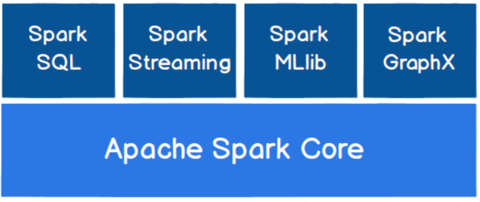
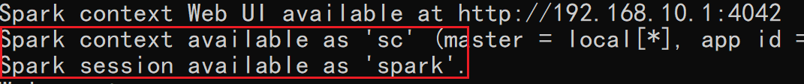
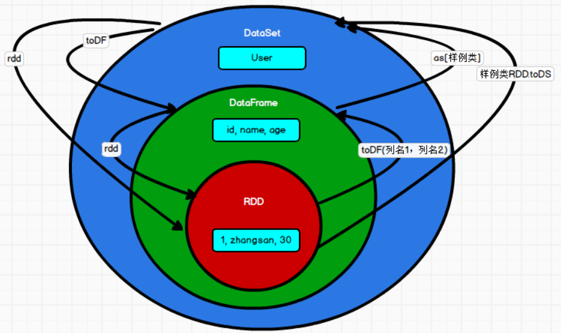

---

Created at: 2021-09-29
Last updated at: 2023-09-15


---

# 20-SparkSQL命令行中使用


下图是Spark的核心模块，可见SparkSQL是在SparkCore上的一个扩展， 是用来操作结构化数据的组件， 用户通过 SparkSQL 可以使用 SQL 或者 Apache Hive 版本的 SQL 方言（HQL）来查询数据，SparkSQL会将SQL转换成RDD来运行。


SparkSQL提供了两个编程抽象： DataFrame 和 DataSet。

**DataFrame**
因为SparkSQL是构建在SparkCore上的一个模块，所以DataFrame可以看作是对RDD更进一步的封装，RDD并不关心数据源是什么结构（意思是RDD并没有直接针对数据源数据结构查询的API，需要程序员直接去处理每一条数据），但DataFrame是针对结构化数据的查询，所以DataFrame是需要数据具有表结构的，DataFrame提供针对数据的结构进行查询的API，即可以通过SQL语句来查询（不需要程序员直接处理每一条数据，而是直接通过SQL语句来表达先查询什么数据，SparkSQL会将SQL语句转换成RDD来运行）。
在 Spark SQL 中 SparkSession 是创建 DataFrame 和执行 SQL 的入口，创建 DataFrame 有三种方式：

1. 通过数据源（文件等）创建
2. 从一个存在的 RDD 进行转换
3. 从 HiveTable 进行查询返回

**一、命令行中使用**
命令行中用于创建RDD的环境对象是sc，用于创建DataFrame的环境对象spark


1 通过文件创建 DataFrame ，以下直接从json文件中读取结构化的数据：
```
{"name": "zhangsan", "age": 18}
{"name": "lisi", "age": 20}
{"name": "wangwu", "age": 21}
```
```
val df = spark.read.json("../data/sql/user.json")
```
```
返回结果：df: org.apache.spark.sql.DataFrame = [age: bigint, name: string]
```
如果从内存中获取数据， spark 可以知道数据类型具体是什么。 如果是数字，默认作为 Int 处理；但是从文件中读取的数字，不能确定是什么类型，所以用 bigint 接收，可以和Long 类型转换，但是和 Int 不能进行转换。

2 展示结果：
```
df.show
```
```
+---+--------+
|age|    name|
+---+--------+
| 18|zhangsan|
| 20|    lisi|
| 21|  wangwu|
+---+--------+
```

3 使用SQL语句查询需要先对 DataFrame 创建一个临时视图:
```
df.createTempView("user")  //创建临时视图，如果已存在就报错
df.createOrReplaceTempView("user")  //创建临时视图，如果已存在就替换
df.createGlobalTempView("user")  //创建全局临时视图，如果已存在就报错，全局视图可以跨会话使用
df.createOrReplaceGlobalTempView("user") //创建全局临时视图，如果已存在就替换，全局视图可以跨会话使用
```

4 使用SQL语句在视图上查询，返回的还是一个DataFrame
```
val row = spark.sql("select * from user where age=18")
row: org.apache.spark.sql.DataFrame = [age: bigint, name: string]
```

5 创建全局临时视图
```
df.createOrReplaceGlobalTempView("emp")
```
跨会话使用
```
spark.newSession.sql("select * from global_temp.emp").show
```

从上面执行SQL语句的过程可以看到，spark.sql是在DataFrame创建视图之上执行的，所以saprk.sql所执行的sql语句是不能修改数据的，当然我们一直也都不需要修改数据，RDD也不能修改数据源中的数据，spark.sql和RDD都只是做计算分析的，数据的增删改查是数据库的事。
另外还可以看到DataFrame创建视图后sql的执行是与DataFrame无关的，那我们能不能直接使用DataFrame进行查询呢，就像RDD调用算子一样，答案是可以的，那就是使用DSL (domain-specific language, DSL) ，因为DataFrame是包含列信息的，所以使用它的方法来查询和计算是比直接使用RDD更高一层的，可以说使用DSL就相当于是把SQL语句换成API调用的方式，并且DSL还提供了许多其它功能的函数。
既然直接使用DataFrame的API查询，也就是说使用DSL不用再创建临时视图了。
6 查看 DataFrame 的 Schema 信息
```
df.printSchema
```
```
root
|-- age: long (nullable = true)
|-- name: string (nullable = true)
```

7 查看"age"列数据
```
val res = df.select("age")
res: org.apache.spark.sql.DataFrame = [age: bigint]
```
```
res.show
```
```
+---+
|age|
+---+
| 18|
| 20|
| 21|
+---+
```

8 将查询到的age列的数据加1，涉及到运算的时候, 每列都必须使用$, 或者采用单引号表达式：单引号+字段名
```
df.select($"name", $"age" + 1).show
df.select('name, 'age + 1).show
```

9 给列起一个别名
```
df.select('name, 'age + 1 as "newage").show
```

10 过滤数据
```
df.filter($"age">20).show
```

11 分组统计
```
df.groupBy("age").count.show
```
```
+---+-----+
|age|count|
+---+-----+
| 18|    1|
| 21|    1|
| 20|    1|
+---+-----+
```

**DataSet**
DataFrame提供针对数据具体结构的查询，但是这种查询是针对列进行，有时还需要将一行数据直接看作是一个对象，这样通过对象来操作数据就更加方便，所以DataSet可以看作是对DataFrame的再一次封装，DataSet在查询数据时不仅可以使用SQL只针对列进行，还可以把查询到的结果的每一行都看作是一个对象直接使用。
从RDD中创建DataSet
先创建RDD
```
case class User(name: String, age: Int)
val rdd = sc.makeRDD(List(User("zhangsan",18), User("lisi", 19), User("wangwu", 20)))
rdd: org.apache.spark.rdd.RDD[User] = ParallelCollectionRDD[55]
```
RDD 转换成 DataSet
```
val ds = rdd.toDS
```
```
ds.show
+--------+---+
|    name|age|
+--------+---+
|zhangsan| 18|
|    lisi| 19|
|  wangwu| 20|
+--------+---+
```

**RDD、DataFrame、DataSet 三者之间的转换：**

1.RDD 与 DataFrame 之间的转换
先定义一个样例类
```
case class User(name: String, age: Int)
```
再创建一个RDD
```
val rdd = sc.makeRDD(List(User("zhangsan",18), User("lisi", 19), User("wangwu", 20)))
rdd: org.apache.spark.rdd.RDD[User] = ParallelCollectionRDD[55]
```
将 RDD 转换为 DataFrame
```
val df = rdd.toDF
df: org.apache.spark.sql.DataFrame = [name: string, age: int]
```
```
df.show
+--------+---+
|    name|age|
+--------+---+
|zhangsan| 18|
|    lisi| 19|
|  wangwu| 20|
+--------+---+
```
再将DataFrame转换成RDD，会发现RDD的类型不再是User，而是org.apache.spark.sql.Row
```
val rdd1 = df.rdd
rdd1: org.apache.spark.rdd.RDD[org.apache.spark.sql.Row] = MapPartitionsRDD[63] at rdd at <console>:25
```

2.DataSet 与 DataFrame 之间的转换
DataFrame 到  DataSet 可以看作是给表的所有列加上一个类型信息
```
val df = spark.read.json("../data/sql/user.json")
df: org.apache.spark.sql.DataFrame = [age: bigint, name: string]
```
注意上面的age是bigint，所以创建的样例类的age必须是Long
```
case class User(name: String, age: Long)
```
DataFrame 转换成  DataSet，其实DataFrame正式类型是Dataset\[Row\]，所以这里将DataFrame 转换成 Dataset\[User\] 只是将Row类型变成User类型。
```
val ds = df.as[User]
ds: org.apache.spark.sql.Dataset[User] = [age: bigint, name: string]
```
再将DataSet转换成DataFrame
```
val df = ds.toDF
df: org.apache.spark.sql.DataFrame = [age: bigint, name: string]
```

3.RDD 与 DataSet 之间的转换
RDD 转换成 DataSet 需要每个元素有统一的结构，最好都是一个样例类的对象。
先创建一个RDD
```
case class User(name: String, age: Int)
val rdd = sc.makeRDD(List(User("zhangsan",18), User("lisi", 19), User("wangwu", 20)))
rdd: org.apache.spark.rdd.RDD[User] = ParallelCollectionRDD[55]
```
RDD 转换成 DataSet
```
val ds = rdd.toDS
ds: org.apache.spark.sql.Dataset[User] = [name: string, age: int]
```
DataSet 转换成 RDD
```
val rdd = ds.rdd
rdd: org.apache.spark.rdd.RDD[User] = MapPartitionsRDD[30]
```



