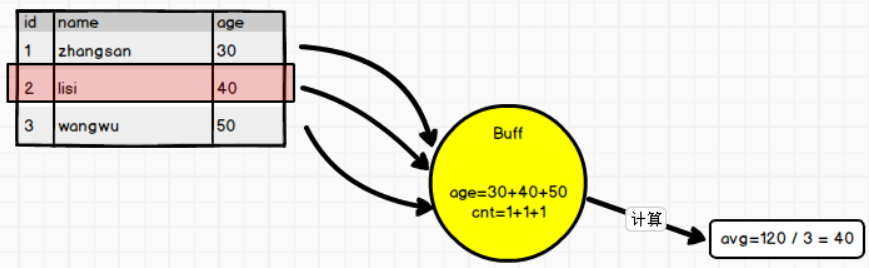

---

Created at: 2021-09-30
Last updated at: 2021-09-30
Source URL: about:blank


---

# 22-SparkSQL用户自定义函数


**UDF，一进一出**
用户可以通过 spark.udf 功能添加自定义函数，实现自定义功能。以下给查询出来的name加一个前缀
```
def main(args: Array[String]): Unit = {
 // TODO 创建SparkSQL的运行环境
 val sparkConf = new SparkConf().setMaster("local[*]").setAppName("sparkSQL")
 val spark = SparkSession.builder().config(sparkConf).getOrCreate()
 import spark.implicits._

 val df = spark.read.json("data/user.json")
 df.createOrReplaceTempView("user")
 `spark.udf.register("prefix", (name: String) => {`
 `"UDF: " + name`
 `})`

 spark.sql("select age, `prefix(name)` from user").show

 // TODO 关闭环境
 spark.close()
}
```

**UDAF，聚合函数，多进一出**
自定义聚合函数的要素是定义缓存区，即每遍历一条数据应该如何更新缓冲区中的值，以及最后如何通过缓冲区中的值计算得到最后的结果。

自定义算平均值的函数
```
def main(args: Array[String]): Unit = {
 // TODO 创建SparkSQL的运行环境
 val sparkConf = new SparkConf().setMaster("local[*]").setAppName("sparkSQL")
 val spark = SparkSession.builder().config(sparkConf).getOrCreate()
 val df: DataFrame = spark.read.json("data/user.json")
 df.createOrReplaceTempView("user")

`//注册自定义的聚合函数`
 `spark.udf.register("myAvg", functions.udaf(new MyAvgUDAF()))`
 spark.sql("select myAvg(age) from user").show

 // TODO 关闭环境
 spark.close()
}
```
```
/**
* 缓冲区样例类
* @param total 数据的总和
* @param count 数据的总条数
*/
case class Buff(var total: Long, var count: Long)

/**
* 自定义聚合函数类：计算平均值
* 1. 继承org.apache.spark.sql.expressions.Aggregator, 定义泛型
*  IN : 输入的数据类型 Long
*  BUF : 缓冲区的数据类型 Buff
*  OUT : 输出的数据类型 Long
* 2. 重写6个方法
*/
class MyAvgUDAF extends Aggregator[Long, Buff, Long] {
 // zero : 初始值或零值
 // 缓冲区的初始化
 override def zero: Buff = {
   Buff(0L, 0L)
 }

 // 根据输入的数据更新缓冲区的数据
 override def reduce(buff: Buff, in: Long): Buff = {
   buff.total = buff.total + in
   buff.count = buff.count + 1
   buff
 }

 // 合并缓冲区，因为是分布式计算，所以在不同的task上就会有不同的缓冲区，所以需要合并
 // 合并的过程是，把后一个缓冲区的数据加到前一个缓冲区中，不断这样合并，最后就只剩下一个了
 override def merge(buff1: Buff, buff2: Buff): Buff = {
   buff1.total = buff1.total + buff2.total
   buff1.count = buff1.count + buff2.count
   buff1
 }

 // 计算平均值
 override def finish(buff: Buff): Long = {
   buff.total / buff.count
 }

 // 缓冲区编码器，用于序列化，固定写法，自定义类型就是 product 自带类型根据类型选择
 override def bufferEncoder: Encoder[Buff] = Encoders.product
 // 输出的编码器
 override def outputEncoder: Encoder[Long] = Encoders.scalaLong
}
```

以上是在SQL语句使用自定义的聚合函数，我们知道通过DataSet使用DSL不仅可以直接使用列，还可以将查询结果的每一行当作对象使用的，所以如果通过DSL使用聚合函数，那么聚合函数的输入就可以是一个对象了。
```
def main(args: Array[String]): Unit = {
  // TODO 创建SparkSQL的运行环境
  val sparkConf = new SparkConf().setMaster("local[*]").setAppName("sparkSQL")
  val spark = SparkSession.builder().config(sparkConf).getOrCreate()
  import spark.implicits._

  val df: DataFrame = spark.read.json("data/user.json")
  val ds: Dataset[User] = df.as[User]
  `// 将UDAF函数转换为查询的列对象`
 `val avgAge: TypedColumn[User, Long] = new MyAvgUDAF().toColumn`
 `//注册自定义的聚合函数`
 `ds.select(avgAge).show`

  // TODO 关闭环境
  spark.close()
}
```
```
case class User(name: String, age: Long)
```
```
/**
* 缓冲区样例类
* @param total 数据的总和
* @param count 数据的总条数
*/
case class Buff(var total: Long, var count: Long)

/**
* 自定义聚合函数类：计算平均值
* 1. 继承org.apache.spark.sql.expressions.Aggregator, 定义泛型
*  IN : 输入的数据类型 User
*  BUF : 缓冲区的数据类型 Buff
*  OUT : 输出的数据类型 Long
* 2. 重写6个方法
*/
class MyAvgUDAF extends Aggregator[`User`, Buff, Long] {
  // zero : 初始值或零值
  // 缓冲区的初始化
  override def zero: Buff = {
    Buff(0L, 0L)
  }
  // 根据输入的数据更新缓冲区的数据
  override def reduce(buff: Buff, `in: User)`: Buff = {
    buff.total = buff.total + `in.age`
    buff.count = buff.count + 1
    buff
  }
  // 合并缓冲区，因为是分布式计算，所以在不同的task上就会有不同的缓冲区，所以需要合并
  // 合并的过程是，把后一个缓冲区的数据加到前一个缓冲区中，不断这样合并，最后就只剩下一个了
  override def merge(buff1: Buff, buff2: Buff): Buff = {
    buff1.total = buff1.total + buff2.total
    buff1.count = buff1.count + buff2.count
    buff1
  }
  // 计算平均值
  override def finish(buff: Buff): Long = {
    buff.total / buff.count
  }
  // 缓冲区编码器，用于序列化，固定写法，自定义类型就是 product 自带类型根据类型选择
  override def bufferEncoder: Encoder[Buff] = Encoders.product
  // 输出的编码器
  override def outputEncoder: Encoder[Long] = Encoders.scalaLong
}
```

