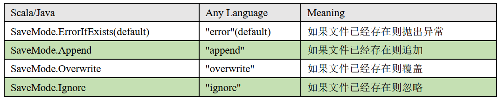

---

Created at: 2021-09-30
Last updated at: 2021-10-01
Source URL: about:blank


---

# 23-SparkSQL 数据的加载和保存


**加载数据**
SparkSQL 加载数据的方式，注意： 如果 classpath 中有配好的hdfs-site.xml（应该是如果配置了HADOOP\_HOME），那么默认的文件系统就是 HDFS，否则就是本地文件系统。
```
scala> spark.read.
csv   format   jdbc   json   load   option   options   orc   parquet   schema   table   text   textFile
```
spark.read.load 是加载数据的通用方法，不使用format方法指定的话，默认读取的文件格式是 parquet，读其它格式的文件会报错。
```
val df = spark.read.load("../examples/src/main/resources/users.parquet")
```
可以使用format方法指定读取的格式
```
spark.read.format("…")[.option("…")].load("…")
```

* format("…")：指定加载的数据类型，包括"csv"、 "jdbc"、 "json"、 "orc"、 "parquet"和 "textFile"，不指定默认就是parquet
* option("…")：在"jdbc"格式下需要传入 JDBC 相应参数： url、 user、 password 和dbtable
* load("…")：数据的路径

比如指定读取json格式的文件：
```
val df = spark.read.format("json").load("../data/user.json")
```
也可以直接使用**json方法读取**，load只是一个比较通用的方法：
```
val df = spark.read.json("../data/user.json")
```
注意：Spark 读取的 json 格式的文件不是标准的 JSON 文件，标准的JSON文件要求只能有一个JSON对象，也就是只能有一个顶级的元素，而Spark 读取的 json 格式的文件要求每一行都是一个json格式的字符串，因为Spark是以行为单位进行读取的。

其实还可以直接在执行sql时指定要读取的文件格式及文件的路径：
```
spark.sql("select * from json.`../data/user.json`").show
```

**保存数据**
SparkSQL 保存数据的方式
```
scala> df.write.
bucketBy   format       jdbc   mode     options   parquet       save          sortBy
csv        insertInto   json   option   orc       partitionBy   saveAsTable   text
```
df.write.save 是保存数据的通用方法，默认的保存格式是 parquet
```
df.write.save("../output")
```
可以使用format方法指定保存的格式
```
scala>df.write.format("…")[.option("…")].save("…")
```

* format("…")：指定保存的数据类型，包括"csv"、 "jdbc"、 "json"、 "orc"、 "parquet"和 "textFile"，不指定默认就是parquet
* option("…")：在"jdbc"格式下需要传入 JDBC 相应参数： url、 user、 password 和 dbtable
* load("…")：数据的路径

比如将数据保存成json格式：
```
df.write.format("json").save("../output")
```
也可以直接使用json方法保存，save只是一个比较通用的方法：
```
df.write.json("../output")
```

保存时还可以使用mode方法指定SaveMode，不使用mode方法默认是SaveMode.ErrorIfExists
```
df.write.mode("append").json("../output")
```


**SparkSQL读取和保存csv文件**，csv文件默认以逗号,分割。
读取csv文件，option("sep", ",")表示以,号分割，option("header", "true")表示有表头
```
spark.read.format("csv").option("sep", ",").option("inferSchema","true").option("header", "true").load("data/user.csv")
```
```
df.write.mode("overwrite").option("header", "true").csv("../data/csv")
```

**SparkSQL从MySQL中读取和写入数据**
Spark SQL 可以通过 JDBC 从关系型数据库中读取数据的方式创建 DataFrame，通过对DataFrame 一系列的计算后，还可以将数据再写回关系型数据库中。
在IEDA中使用SparkSQL与MySQL交互：
1.导入MySQL驱动
```
<dependency>
    <groupId>mysql</groupId>
    <artifactId>mysql-connector-java</artifactId>
    <version>8.0.22</version>
</dependency>
```
2.代码
```
def main(args: Array[String]): Unit = {
  // TODO 创建SparkSQL的运行环境
  val sparkConf = new SparkConf().setMaster("local[*]").setAppName("sparkSQL")
  val spark = SparkSession.builder().config(sparkConf).getOrCreate()
  import spark.implicits._

  // 读取MySQL数据
  val df = spark.read
    .format("jdbc")
    .option("url", "jdbc:mysql://localhost:3306/test?serverTimezone=UTC")
    .option("driver", "com.mysql.cj.jdbc.Driver")
    .option("user", "root")
    .option("password", "079335")
    .option("dbtable", "user")
    .load()

  df.show

  // 保存数据到MySQL
  df.write
    .format("jdbc")
    .option("url", "jdbc:mysql://localhost:3306/test?serverTimezone=UTC")
    .option("driver", "com.mysql.cj.jdbc.Driver")
    .option("user", "root")
    .option("password", "079335")
    .option("dbtable", "user1")
    .mode(SaveMode.Append)
    .save()

  // TODO 关闭环境
  spark.close()
}
```

