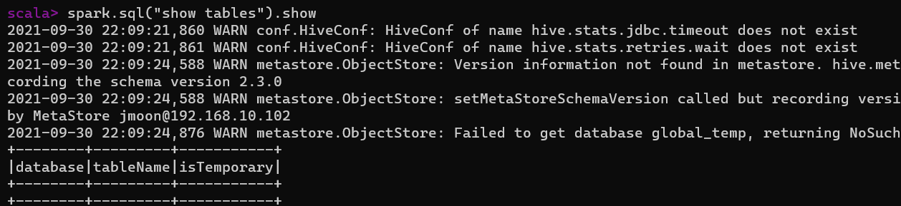
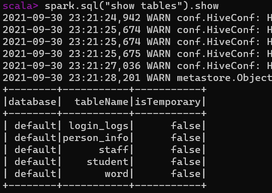
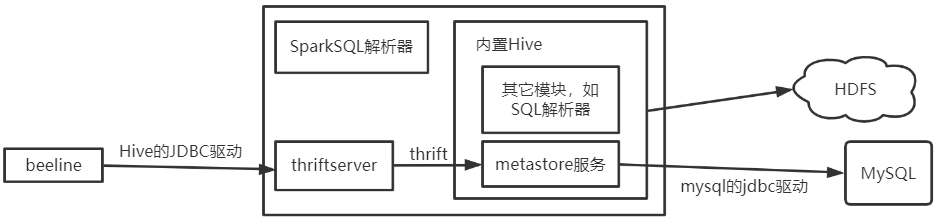
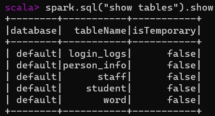
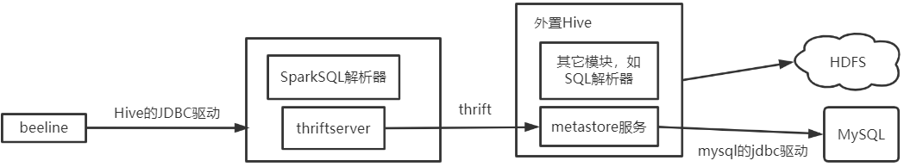

---

Created at: 2021-09-30
Last updated at: 2021-10-21
Source URL: about:blank


---

# 24-SparkSQL 连接 Hive


Hive本身只是一个数据仓库（管理表的元数据信息），对于SparkSQL来说Hive只是一个数据源，这点和SparkSQL从文件或者MySQL读取数据类似，将SQL和HQL翻译成RDD后提交并执行的工作是由SparkSQL完成的。但Hive对于SparkSQL来说不仅仅只是像从文件或者MySQL中读写数据那么简单，在SparkSQL中可以使用SQL直接对Hive表进行增删改查，这样SparkSQL才是真正把Hive作为了一个数据仓库，而不仅仅只是一次读取或写入的数据源。

SparkSQL连接Hive有两种方式，一是使用SparkSQL内置的Hive，二是使用外部的Hive。
**1.使用SparkSQL内置的Hive，并且使用****Hive自带的数据库derby来保存元数据信息**
直接启动spark-shell，然后输入
```
spark.sql("show tables").show
```
这时会出现hive的几个配置信息没找到的警告，然后在spark-shell启动的目录下新建一个metastore\_db目录，这个就是保存hive表的元数据库，最后会输出此时hive中有哪几张表。

接着创建一张表
```
spark.sql("create table student(id int)")
```
SparkSQL会把表的数据保存在本地，也就是会在spark-shell启动的目录下新建一个spark-warehouse目录用来保存表的数据，此时创建的student表会在spark-warehouse下新建一个对应的名叫student的目录来保存表的数据（注意区别于表的元数据，student表的元数据还是存储在metastore\_db中的）。
查看hive中有哪些表：
```
scala> spark.sql("show tables").show
+--------+---------+-----------+
|database|tableName|isTemporary|
+--------+---------+-----------+
| default|  student|      false|
+--------+---------+-----------+
```
向student表中导入数据，这时spark-warehouse/student目录下就有数据了：
```
spark.sql("load data local inpath 'data/id.txt' into table student")
```
查看表的数据，SparkSQL的sql语句执行的结果是保存在DataFrame中的：
```
scala> val df = spark.sql("select * from student")
df: org.apache.spark.sql.DataFrame = [id: int]

scala> df.show
+---+
| id|
+---+
|  1|
|  2|
|  3|
|  4|
+---+
```

注意，直接从DataFrame中创建的临时视图与Hive表没有关系，不会保存在Hive中：
```
scala> df.createOrReplaceTempView("emp")

scala> spark.sql("show tables").show
+--------+---------+-----------+
|database|tableName|isTemporary|
+--------+---------+-----------+
| default|  student|      false|
|        |      emp|       true|
+--------+---------+-----------+
```

**2.使用SparkSQL内置的Hive，将****元数据信息保存在MySQL中，将表的数据保存在HDFS上**
2.1 在/opt/module/spark-yarn/conf目录下创建hive-site.xml（可以直接把前面学Hive时配置好的hive-site.xml拷贝到这里，但注意要删除掉有关于metastore和hiveservice2的配置）。
```
<?xml version="1.0"?>
<?xml-stylesheet type="text/xsl" href="configuration.xsl"?>
<configuration>

    <!-- jdbc 连接的 URL -->
    <property>
        <name>javax.jdo.option.ConnectionURL</name>
        <value>jdbc:mysql://192.168.10.1:3306/metastore?serverTimezone=UTC&characterEncoding=utf-8</value>
    </property>

    <!-- jdbc 连接的 Driver-->
    <property>
        <name>javax.jdo.option.ConnectionDriverName</name>
        <value>com.mysql.cj.jdbc.Driver</value>
    </property>

    <!-- jdbc 连接的 username-->
    <property>
        <name>javax.jdo.option.ConnectionUserName</name>
        <value>root</value>
    </property>

    <!-- jdbc 连接的 password -->
    <property>
        <name>javax.jdo.option.ConnectionPassword</name>
        <value>079335</value>
    </property>

    <!-- Hive 元数据存储版本的验证 -->
    <property>
        <name>hive.metastore.schema.verification</name>
        <value>false</value>
    </property>

    <!-- 元数据存储授权 -->
    <property>
        <name>hive.metastore.event.db.notification.api.auth</name>
        <value>false</value>
    </property>

    <!-- Hive 默认在 HDFS 的工作目录 -->
    <property>
        <name>hive.metastore.warehouse.dir</name>
        <value>/user/hive/warehouse</value>
    </property>

</configuration>
```
2.2 然后把MySQL的驱动拷贝到/opt/module/spark-yarn/jars
2.3 启动spark-shell，查看Hive中有哪些表，因为是直接复制前面学Hive时配置的hive-site.xml，所以元数据库的信息没变，这是在前面学Hive时创建的表。


2.4 在spark-shell中执行sql语句要通过SparkSession对象spark，返回的结果是DataFrame，使用DataFrame来操作数据虽然方便，但是有时候在命令行中只是想直接得到sql语句执行的结果，所以Spark还提供了与Hive的hiveserver2类似的 Spark Thrift Server， Spark Thrift Server 的接口和通信协议与 HiveServer2 完全一致，所以无论是 使用spark的bin目录下的beeline客户端 还是 Hive的beeline客户端，都可以连接到该服务上，因为两个beeline其实是一样的东西（用Hive的beeline客户端连接没有测试成功）。
在spark目录下执行以下命令启动Spark Thrift Server，Spark Thrift Server 与 hiveserver2一样也依赖于 metastore 服务，从输出的信息可以看到，在使用内置的Hive时，启动Spark Thrift Server的同时会启动metastore 服务，不需要单独在配置文件中配置。
```
[jmoon@hadoop102 spark-yarn]$ sbin/start-thriftserver.sh
starting org.apache.spark.sql.hive.thriftserver.HiveThriftServer2, logging to /opt/module/spark-yarn/logs/spark-jmoon-org.apache.spark.sql.hive.thriftserver.HiveThriftServer2-1-hadoop102.out
[1]+  退出 143              hive --service metastore
```
在spark目录下执行以下命令使用beeline连接到Spark Thrift Server
```
bin/beeline -u jdbc:hive2://hadoop102:10000 -n jmoon
```
之后就可以直接在命令行中执行SQL语句了，此时使用的计算引擎就是Spark，而不是MapReduce，如果beeline直接连接的是Hive的hiveserver2，那么计算引擎就是MR。


**3.使用外置的Hive，只是使用外置Hive的元数据服务**
3.1 把前面拷贝的MySQL驱动删除
3.2 开启外置hive的元数据服务metastore，SparkSQL只是使用外置Hive的元数据服务，也就是Hive中的那些表信息
```
hive --service metastore &
```
3.3 修改/opt/module/spark-yarn/conf/hive-site.xml，只需要添加metastore的连接信息
```
<?xml version="1.0"?>
<?xml-stylesheet type="text/xsl" href="configuration.xsl"?>
<configuration>
    <property>
        <name>hive.metastore.uris</name>
        <value>thrift://hadoop102:9083</value>
    </property>
</configuration>
```
3.4 启动spark-shell，查看Hive中有哪些表，因为这里使用的外置的Hive，所以就是前面学Hive时创建的表

3.5 同样可以开启Spark Thrift Server，此时Spark Thrift Server会连接到前面已经开启的外置Hive的metastore服务上
```
sbin/start-thriftserver.sh
```
在spark目录下执行以下命令使用beeline连接到Spark Thrift Server
```
bin/beeline -u jdbc:hive2://hadoop102:10000 -n jmoon
```


**spark-sql**
除了使用spark-shell和beeline在命令行执行SQL外，还可以使用spark-sql在命令行执行SQL，spark-sql和beeline一样直接返回SQL的结果，不过spark-sql并没有beeline的输出好看。
```
bin/spark-sql
```

**4.在SparkSQL代码中操作Hive**，这和在Spark-shell中使用SparkSQL内置的Hive（将元数据信息保存在MySQL中，将表的数据保存在HDFS上）的方式一样。
4.1 引入spark-hive\_2.12的依赖和MySQL的驱动，（不要引入hive-exec的依赖，会冲突）
```
<dependency>
    <groupId>org.apache.spark</groupId>
    <artifactId>spark-hive_2.12</artifactId>
    <version>3.0.0</version>
</dependency>
<!--<dependency>
    <groupId>org.apache.hive</groupId>
    <artifactId>hive-exec</artifactId>
    <version>3.1.2</version>
</dependency>-->
<dependency>
    <groupId>mysql</groupId>
    <artifactId>mysql-connector-java</artifactId>
    <version>8.0.22</version>
</dependency>
```
4.2 把不带hiveservice2配置的hive-site.xml拷贝带resource目录下，由于在Windows环境下的环境变量 HADOOP\_HOME 中没有配好的hdfs-site.xml，所以hive.metastore.warehouse.dir应该加上 hdfs://hadoop102:8020/ ，不然使用的就是本地文件系统。
```
<?xml version="1.0"?>
<?xml-stylesheet type="text/xsl" href="configuration.xsl"?>
<configuration>

    <!-- jdbc 连接的 URL -->
    <property>
        <name>javax.jdo.option.ConnectionURL</name>
        <value>jdbc:mysql://192.168.10.1:3306/metastore?serverTimezone=UTC&amp;characterEncoding=utf-8</value>
    </property>

    <!-- jdbc 连接的 Driver-->
    <property>
        <name>javax.jdo.option.ConnectionDriverName</name>
        <value>com.mysql.cj.jdbc.Driver</value>
    </property>

    <!-- jdbc 连接的 username-->
    <property>
        <name>javax.jdo.option.ConnectionUserName</name>
        <value>root</value>
    </property>

    <!-- jdbc 连接的 password -->
    <property>
        <name>javax.jdo.option.ConnectionPassword</name>
        <value>079335</value>
    </property>

    <!-- Hive 元数据存储版本的验证 -->
    <property>
        <name>hive.metastore.schema.verification</name>
        <value>false</value>
    </property>

    <!-- 元数据存储授权 -->
    <property>
        <name>hive.metastore.event.db.notification.api.auth</name>
        <value>false</value>
    </property>

 `<!-- Hive 默认在 HDFS 的工作目录 -->`
 `<property>`
 `<name>hive.metastore.warehouse.dir</name>`
 `<value>hdfs://hadoop102:8020/user/hive/warehouse</value>`
 `</property>`

</configuration>
```
4.3 在代码中查看Hive中有哪些表，访问HDFS时需要加上System.setProperty("HADOOP\_USER\_NAME", "jmoon")，不然没有写权限
```
def main(args: Array[String]): Unit = {
  `System.setProperty("HADOOP_USER_NAME", "jmoon")`
  // TODO 创建SparkSQL的运行环境
  val sparkConf = new SparkConf().setMaster("local[*]").setAppName("sparkSQL")
  val spark = SparkSession.builder()`.enableHiveSupport()`.config(sparkConf).getOrCreate()
  // 使用SparkSQL连接外置的Hive
  // 1.增加对应的依赖关系(包含MySQL驱动)
  // 2.拷贝Hive-size.xml文件到classpath下
  `// 3.启用Hive的支持`
  spark.sql("show tables").show
  spark.sql("select * from student").show
  // TODO 关闭环境
  spark.close()
}
```

