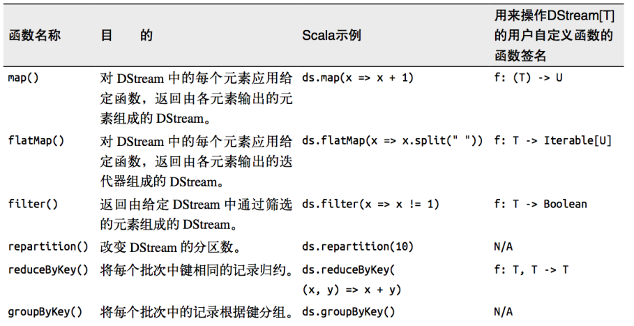

---

Created at: 2021-10-05
Last updated at: 2021-10-09
Source URL: about:blank


---

# 27-SparkStreaming原语


和 SparkCore 的 RDD 的概念很相似， SparkStreaming 使用离散化流(discretized stream)作为抽象表示，叫作 DStream。
DStream 原语类似于 RDD 的算子，都是方法，只是为了区分才取名为原语，不过也有区别，原语可看作是对算子的再一次封装。
DStream 原语分为 Transformations（转换）和 Output Operations（输出）两种。其中Transformations（转换）有分为 无状态 和 有状态 两种，无状态是指对每个周期数据的计算是独立，而有状态更新是指会在前面周期计算的结果之上做更新。

**Transformations（转换）****原语**
**1.无状态转化操作**
无状态转化操作就是把简单的 RDD 转化操作应用到每个批次上，部分无状态转化操作列在了下表中。注意，针对键值对的 DStream 转化操作（比如reduceByKey()）要添加 import StreamingContext.\_才能在 Scala 中使用。


**1.1 transform**
DStream 原语是对RDD的再次封装，使用除transform外的其它原语时，传入的参数是RDD的计算逻辑，比如map原语传入的匿名函数是每一个元素映射的逻辑，但是 DStream 原语的处理流程是不会改变的。而transform原语则直接把其封装的 RDD 交给程序员，让我们可以用RDD算子组合成更加复杂的功能，不过transform的匿名函数最后的返回还是RDD，因为transform原语属于转换原语。
```
def main(args: Array[String]): Unit = {
    val sparkConf = new SparkConf().setMaster("local[*]").setAppName("SparkStreaming")
    val ssc = new StreamingContext(sparkConf, Seconds(3))
    val lines = ssc.socketTextStream("localhost", 9999)

    // transform方法可以将底层RDD获取到后进行操作
    // 1. DStream功能不完善
    // 2. 需要代码周期性的执行

    // Code : 这里的代码只在Driver端执行一次
    val newDS: DStream[String] = lines.transform(
        rdd => {
            `// Code : 这里的代码会在Driver端周期性执行`
            rdd.map(
                str => {
                   `// Code : 这里是RDD算子里面的代码，所以会Executor端执行，会周期性地执行，并且一个周期内有几个task就会执行多少次`
                    str
                }
            )
        }
    )

    // Code : 这里的代码只在Driver端执行一次
    val newDS1: DStream[String] = lines.map(
        data => {
            // Code : 这里是RDD算子里面的代码，所以会Executor端执行，一个周期内有几个task就会执行多少次
            data
        }
    )

    ssc.start()
    ssc.awaitTermination()
}
```
transform WordCount
```
def main(args: Array[String]): Unit = {
  val sparkConf = new SparkConf().setMaster("local[*]").setAppName("SparkStreaming")
  val ssc = new StreamingContext(sparkConf, Seconds(3))
  val lineDStream: ReceiverInputDStream[String] = ssc.socketTextStream("localhost", 9999)

  val wordAndCountDStream: DStream[(String, Int)] = lineDStream.transform(rdd => {
    val words: RDD[String] = rdd.flatMap(_.split(" "))
    val wordAndOne: RDD[(String, Int)] = words.map((_, 1))
    val value: RDD[(String, Int)] = wordAndOne.reduceByKey(_ + _)
    value
  })
  wordAndCountDStream.print

  ssc.start()
  ssc.awaitTermination()
}
```

**1.2 join**，对两个流一个周期内的数据进行join操作
```
def main(args: Array[String]): Unit = {
    val sparkConf = new SparkConf().setMaster("local[*]").setAppName("SparkStreaming")
    val ssc = new StreamingContext(sparkConf, Seconds(5))
    val data9999 = ssc.socketTextStream("localhost", 9999)
    val data8888 = ssc.socketTextStream("localhost", 8888)

    val map9999: DStream[(String, Int)] = data9999.map((_,9))
    val map8888: DStream[(String, Int)] = data8888.map((_,8))

    // 所谓的DStream的Join操作，其实就是两个RDD的join
    val joinDS: DStream[(String, (Int, Int))] = map9999.join(map8888)
    joinDS.print()

    ssc.start()
    ssc.awaitTermination()
}
```

**1.3 window**， 滑动窗口
基于滑动窗口的操作需要两个参数，分别为窗口时长以及滑动步长。
窗口时长：计算内容的时间范围
滑动步长：隔多久触发一次计算
注意：这两个参数都必须为采集周期大小的整数倍。
```
def main(args: Array[String]): Unit = {
  val sparkConf = new SparkConf().setMaster("local[*]").setAppName("SparkStreaming")
  val ssc = new StreamingContext(sparkConf, Seconds(3))

  val lines = ssc.socketTextStream("localhost", 9999)
  val wordToOne = lines.map((_, 1))

  // 窗口的范围应该是采集周期的整数倍
  // 窗口可以滑动的，但是默认情况下，一个采集周期进行滑动，
  // 这样的话，可能会出现重复数据的计算，为了避免这种情况，可以改变滑动的滑动（步长）
  val windowDS: DStream[(String, Int)] = wordToOne.window(Seconds(6), Seconds(6))

  val wordToCount = windowDS.reduceByKey(_ + _)
  wordToCount.print()
  ssc.start()
  ssc.awaitTermination()
}
```

**2\. 有状态转化操作**，就是可以在 DStream 中维护状态，实现跨批次统计
UpdateStateByKey，使用 updateStateByKey 需要对检查点目录进行配置，会使用检查点来保存状态。
```
def main(args: Array[String]): Unit = {
  val sparkConf = new SparkConf().setMaster("local[*]").setAppName("SparkStreaming")
  val ssc = new StreamingContext(sparkConf, Seconds(3))
  val datas = ssc.socketTextStream("localhost", 9999)
 `// 使用有状态操作时，需要设定检查点路径`
 `ssc.checkpoint("cp")`
  val wordToOne = datas.map((_, 1))
  // 无状态数据操作，只对当前的采集周期内的数据进行处理，而有状态操作会在前面周期计算的结果之上做更新
  // updateStateByKey：根据key对数据的状态进行更新
  // 传递的参数中含有两个值，第一个值表示相同的key的value数据，第二个值表示缓存区相同key的value数据
  val state = wordToOne.updateStateByKey(
    (seq: Seq[Int], buff: Option[Int]) => {
      val newCount = buff.getOrElse(0) + seq.sum
      Option(newCount)
    }
  )
  state.print()
  ssc.start()
  ssc.awaitTermination()
}
```

**Output Operations（输****出）原语**
输出操作指定了对流数据经转化操作得到的数据所要执行的操作(例如把结果推入外部数据库或输出到屏幕上)。与 RDD 中的惰性求值类似，如果一个 DStream 及其派生出的 DStream 都没有被执行输出操作，那么这些 DStream 就都不会被求值。如果 StreamingContext 中没有设定输出操作，整个 context 就都不会启动。
输出操作如下：
print()：在运行流程序的驱动结点上打印 DStream 中每一批次数据的最开始 10 个元素，常用于开发和调试。

* saveAsTextFiles(prefix, \[suffix\])：以 text 文件形式存储这个 DStream 的内容。每一批次的存储文件名基于参数中的 prefix 和 suffix，"prefix-Time\_IN\_MS\[.suffix\]"。
* saveAsObjectFiles(prefix, \[suffix\])：以 Java 对象序列化的方式将 Stream 中的数据保存为SequenceFiles。每一批次的存储文件名基于参数中的 prefix 和 suffix，"prefix-Time\_IN\_MS\[.suffix\]"。
* saveAsHadoopFiles(prefix, \[suffix\])：将 Stream 中的数据保存为 Hadoop files。每一批次的存储文件名基于参数中的 prefix 和 suffix，"prefix-Time\_IN\_MS\[.suffix\]"。
* foreachRDD(func)：这是最通用的输出操作，即将函数 func 用于产生于 stream 的每一个RDD。其中参数传入的函数 func 应该实现将每一个 RDD 中数据推送到外部系统，如将RDD 存入文件或者通过网络将其写入数据库。

foreachRDD原语 和 transform原语类似，都是直接把RDD交给程序员来操作，提供了更大的灵活性，但是 foreachRDD是输出原语，所以 foreachRDD的匿名函数的返回值是Unit。

