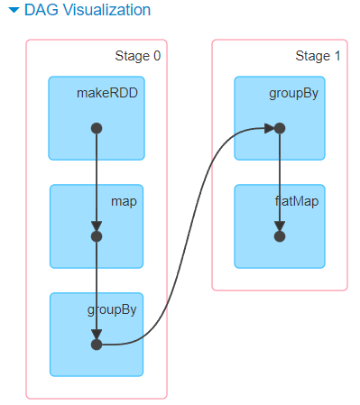
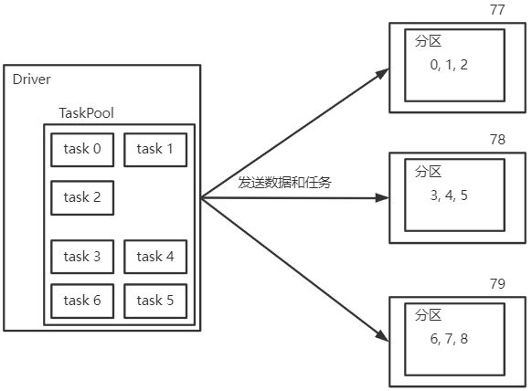
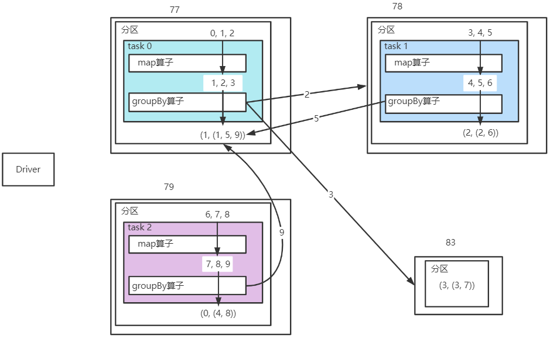
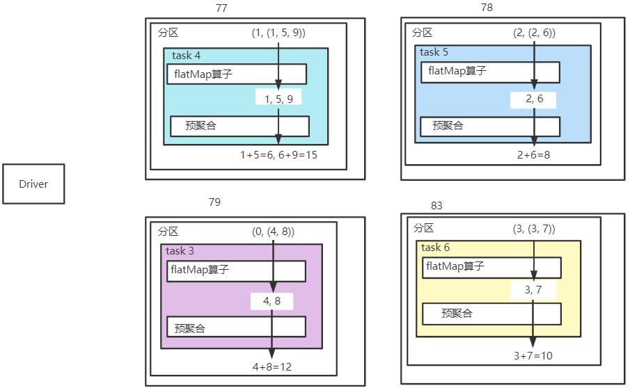
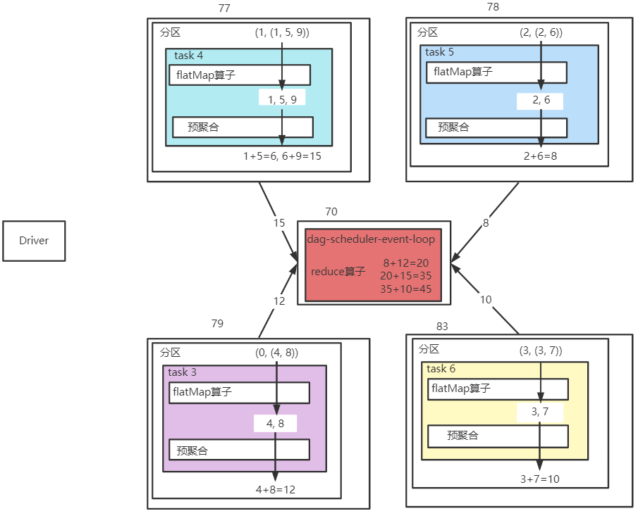
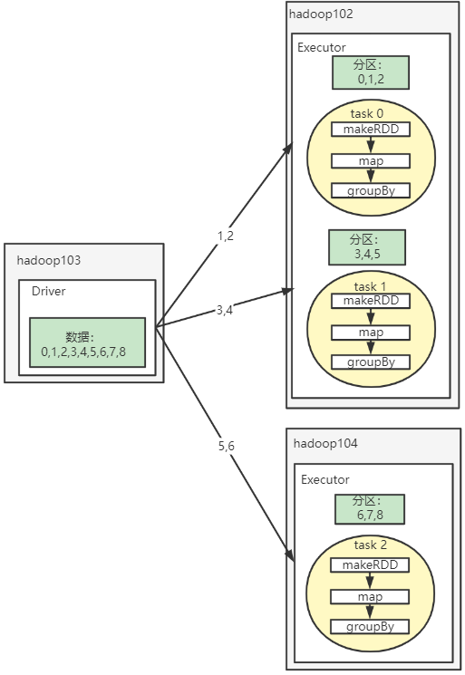
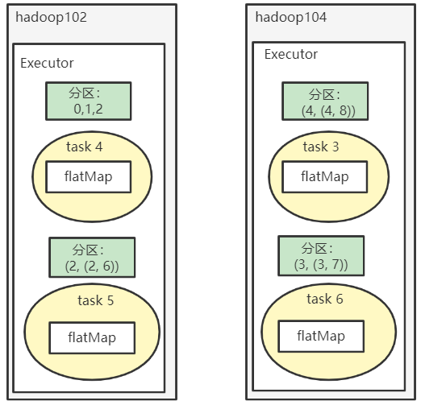

---

Created at: 2021-09-25
Last updated at: 2021-10-12
Source URL: about:blank


---

# 7-Spark的理解


通过以下程序说明：RDD算子、分区、task、Executor之间的关系 以及 整个分布式计算流程
简单说明一下程序的处理流程：数据首先会被分成3个分区，map算子会将集合中的所有数据加1，groupBy会对所有数据进行分组并将分区增加至4个，然后flatMap会将所有分组的数据展开，最后reduce对所有数据求和。整个程序的效果就是1加到9等于45，不要在意为什么整这么多没有用的操作，这纯粹是为了方便说明整个分布式计算的流程。
```
def main(args: Array[String]): Unit = {
  val sc = new SparkContext("local[*]", "test")
  val rdd = sc.makeRDD(List(0, 1, 2, 3, 4, 5, 6, 7, 8), `3)`
  val sum: Int = rdd.map(a => {
    println(s"${Thread.currentThread.getId} : ${Thread.currentThread.getName} >> $a")
    a + 1
  }).groupBy(a => {
    println(s"${Thread.currentThread.getId} : ${Thread.currentThread.getName} >> $a")
 `a % 4`
  `}, 4).`flatMap(kv => {
    println(s"${Thread.currentThread.getId} : ${Thread.currentThread.getName} >> $kv")
    kv._2
  }).reduce((a, b) => {
    println(s"${Thread.currentThread.getId} : ${Thread.currentThread.getName} >> $a+$b=${a + b}")
    a + b
  })
  println(sum)
}
```
输出结果中黄色高亮的是task0的计算任务，处理的分区数据是【1, 2, 3】，可以看到task0包含map算子和groupBy算子的两步计算，并且分区内数据的处理是有序。
```
77 : Executor task launch worker for `task 0 >> 0`
78 : Executor task launch worker for task 1 >> 3
79 : Executor task launch worker for task 2 >> 6
78 : Executor task launch worker for task 1 >> 4
77 : Executor task launch worker for `task 0 >> 1`
79 : Executor task launch worker for task 2 >> 7
79 : Executor task launch worker for task 2 >> 7
78 : Executor task launch worker for task 1 >> 4
78 : Executor task launch worker for task 1 >> 5
77 : Executor task launch worker for `task 0 >> 1`
79 : Executor task launch worker for task 2 >> 8
77 : Executor task launch worker for `task 0 >> 2`
78 : Executor task launch worker for task 1 >> 5
78 : Executor task launch worker for task 1 >> 6
79 : Executor task launch worker for task 2 >> 8
77 : Executor task launch worker for `task 0 >> 2`
79 : Executor task launch worker for task 2 >> 9
77 : Executor task launch worker for `task 0 >> 3`
79 : Executor task launch worker for task 3 >> (0,CompactBuffer(4, 8))
77 : Executor task launch worker for task 4 >> (1,CompactBuffer(1, 5, 9))
83 : Executor task launch worker for task 6 >> (3,CompactBuffer(3, 7))
78 : Executor task launch worker for task 5 >> (2,CompactBuffer(2, 6))
77 : Executor task launch worker for task 4 >> 1+5=6
83 : Executor task launch worker for task 6 >> 3+7=10
78 : Executor task launch worker for task 5 >> 2+6=8
79 : Executor task launch worker for task 3 >> 4+8=12
77 : Executor task launch worker for task 4 >> 6+9=15
70 : dag-scheduler-event-loop >> 8+12=20
70 : dag-scheduler-event-loop >> 20+15=35
70 : dag-scheduler-event-loop >> 35+10=45
45
```
还可以看出，task0、task1、task2都包含了map算子和groupBy算子，属于第一阶段的任务，分别处理3个分区中的数据。task3、task4、task5、task6包含了flatMap算子和reduce算子的部分计算（预聚合），属于第二阶段的任务，分别处理4个分区中的数据。最后一个阶段是reduce算子的聚合任务dag-scheduler-event-loop。

在上面程序末尾添加一行TimeUnit.DAYS.sleep(1)，然后打开 http://localhost:4040/ 可以看到Job的执行情况，其中DAG图如下，可以看到groupBy是有Shuffle操作的，所以groupBy前后的操作被划分到了不同的阶段，因为reduce是行动算子，所以不会出现在DAG图上，但是它也是在这两个阶段之外执行的，所以咱也可以把它单独看作是在最后一个阶段中执行的。

所以可以看到，像map、filter这种只是对分区内的数据进行操作算子，无论被连续调用多少次，都只会被封装在一个阶段的task里面，而groupBy算子会将数据打散重新分配到分区，所以groupBy算子之后的算子就必须被封装在下一个阶段的task中。reduce属于行动算子，不会放在DAG图中进行划分，reduce的执行过程是先做分区内的聚合，然后再做分区间的聚合。

**在Local模式下**，只会有一个Executor，所有任务都是在这个Executor上执行的，一个阶段内有多少个分区就会有多少个task，Executor会为每个task启动一个线程来执行，会上面的计算过程的图解：
1.当执行到reduce行动算子时，就会触发整个计算开始执行。Driver会把数据发往每个分区，并根据宽依赖开始划分 stage，一个阶段内，有多少个分区就会有多少个task，有多少个task就会启动多少个线程执行，上面程序打印结果的第一个数字就是线程id。

2.task0、task1、task2都包含了map算子和groupBy算子，属于第一阶段的任务，同一个阶段的task所做的操作都是相同的，只不过是处理的数据不同而已。groupBy会打散所有数据，将数据分组后重新发往每一个分区，同一组数据会进入同一个分区，此时刚好有4个分组4个分区，所以每一个分区一个分组。因为第一个阶段执行结束后会有4个分区，所以下一个阶段将会有4个task。
图中画的是，task0将2和3发送到其它分区，其它分区把5和9发往task0的过程，将数据重新发送到不同分区的过程叫Shuffle。

3.task3、task4、task5、task6包含了flatMap算子和预聚合，属于第二阶段的任务，分别处理4个分区中的数据。

4.最后是reduce算子的聚合任务dag-scheduler-event-loop，该任务在70号线程上，会将其它分区内的预聚合的结果拉取过来然后再做分区间的聚合。


在**集群上运行**可能是这样的：
第一阶段：

第二阶段：


总之就是，把数据分区发送到每个Executor，分区数大于Executor时，就会有一个Executor有多个分区。根据宽依赖对转换算子划分阶段，每个阶段包含一个或多个转换算子，在一个阶段内，为每一个分区封装一个task，task里面就是这个阶段的算子，然后把task发送到Executor，Executor为每一个task启动一个线程来执行。

