---

Created at: 2021-09-27
Last updated at: 2021-09-29
Source URL: about:blank


---

# 8-向Yarn集群提交Spark应用


1.创建Maven工程，选择Scala-tools的骨架
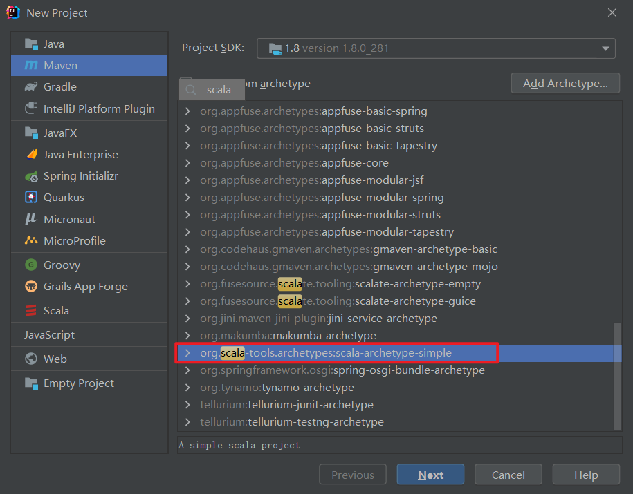
2.修改pom文件中的scala.version
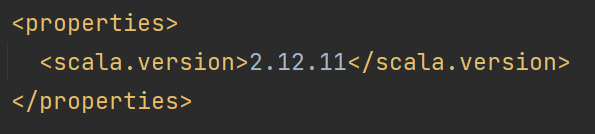
3.添加依赖
```
<dependency>
  <groupId>org.apache.spark</groupId>
  <artifactId>spark-core_2.12</artifactId>
  <version>3.0.0</version>
</dependency>
```
4.给两个maven插件添加版本信息，不填加的话，每次打包都会报警告，并且会去远程仓库里面检查最新版，如果本地仓库已经下载了最新版则不会重复下载，如果本地仓库不是最新则会下载最新版。
```
<groupId>org.scala-tools</groupId>
<artifactId>maven-scala-plugin</artifactId>
<version>2.15.2</version>
```
```
<groupId>org.apache.maven.plugins</groupId>
<artifactId>maven-eclipse-plugin</artifactId>
<version>2.10</version>
```
并且第一个插件maven-scala-plugin的args改成jvm-1.8
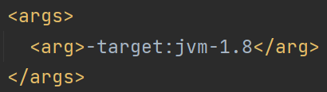
5.spark程序，注意提交方式为yarn，然后使用Maven打包
```
object Test {
  def main(args: Array[String]): Unit = {
 `val sparConf = new SparkConf().setMaster("yarn").setAppName("TestStage")`
    val sc = new SparkContext(sparConf)
    val rdd = sc.makeRDD(List(0, 1, 2, 3, 4, 5, 6, 7, 8), 3)
    val sum: Int = rdd.map(a => {
      println(s"${Thread.currentThread.getId} : ${Thread.currentThread.getName} >> $a")
      a + 1
    }).groupBy(a => {
      println(s"${Thread.currentThread.getId} : ${Thread.currentThread.getName} >> $a")
      a % 4
    }, 4).flatMap(kv => {
      println(s"${Thread.currentThread.getId} : ${Thread.currentThread.getName} >> $kv")
      kv._2
    }).reduce((a, b) => {
      println(s"${Thread.currentThread.getId} : ${Thread.currentThread.getName} >> $a+$b=${a + b}")
      a + b
    })
    println(sum)
    sc.stop()
  }
}
```
5.Yarn Client模式提交，注意先启动Hadoop集群(HDFS和Yarn都要启动) 和 Spark的历史服务器
```
bin/spark-submit \
--class org.example.Test \
--master yarn \
--deploy-mode client \
/opt/software/Stage-1.0-SNAPSHOT.jar
```
Driver端的输出结果打印在控制台上
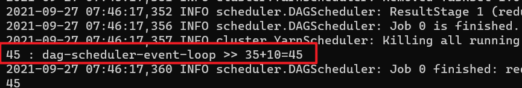
Yarn历史服务服务器上没有Driver端的标准输出
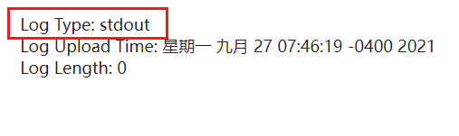
RDD算子是在task上执行的，task被分配给了不同主机上的Executor，从Spark历史服务器上可以看到每个task是被哪台主机执行的，task会输出两种类型的日志，stdout和stderr，stdout是println打印的，stderr是spark使用的日志框架打印的。
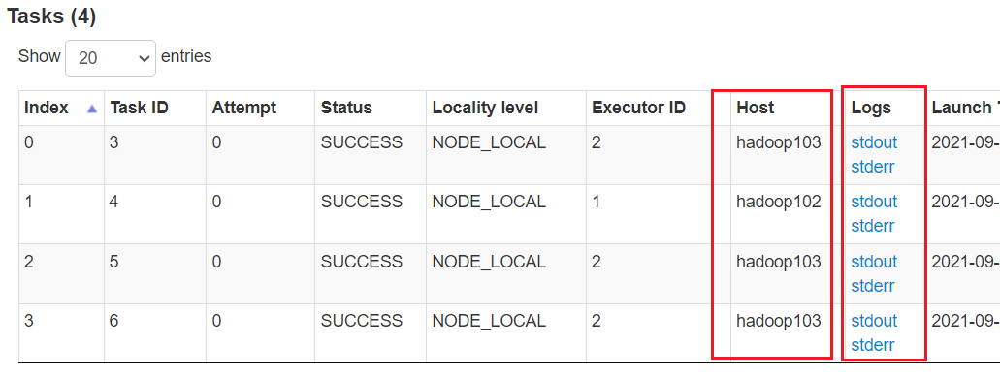
点进stdout里面就会发现Executor中的println会输出到Yarn的历史服务器上：
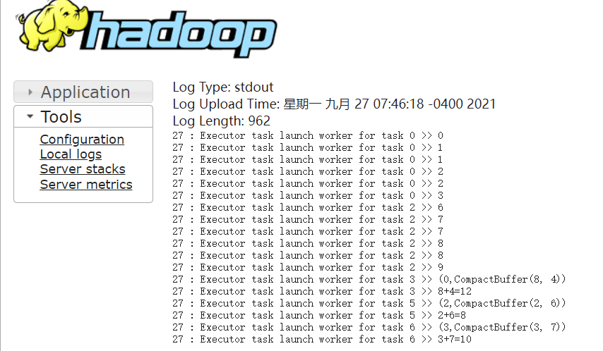
同样点进stderr会发现是Executor的日志，也是输出到Yarn的历史服务器上了：
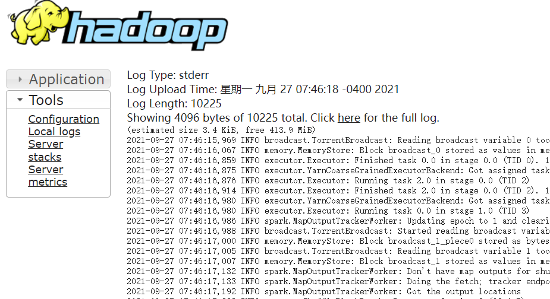

6.Yarn Cluster模式提交
```
bin/spark-submit \
--class org.example.Test \
--master yarn \
--deploy-mode cluster \
/opt/software/Stage-1.0-SNAPSHOT.jar
```
Driver端的控制台上没有输出结果，结果被输出Yarn的历史服务器上了
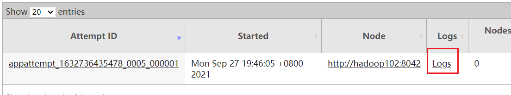
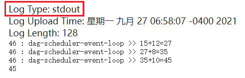
RDD算子的输出同样可以通过Spark历史服务器的task找到。

该程序会被分成两个阶段，因为groupBy有一次Shuffle的过程。第一个阶段有3个任务，因为分区有3个，第二个阶段有4个任务，因为分区有4个，见下图。
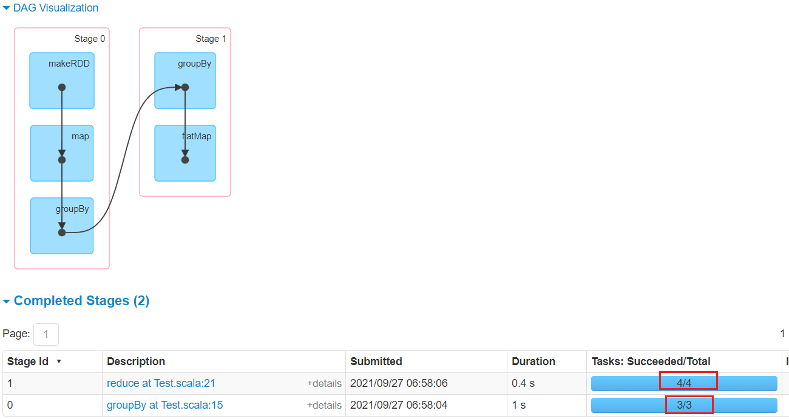
从事件发生的事件线来看，最先启动driver，然后在第一阶段任务开始之前就先分两次启动了3个Executor，并且在第一个阶段结束后就紧接着开始了第二个阶段。
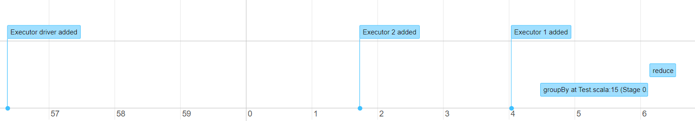
第一阶段和第二阶段的任务被分配到的主机见下面前两张图，以及此时主机内的进程见下面最后一张图，可见，一个Executor会执行同一阶段的两个任务，也就是说一个Executor会被分配到多个分区，那么也就说明一个task其实是对应于Executor里面的一个线程。
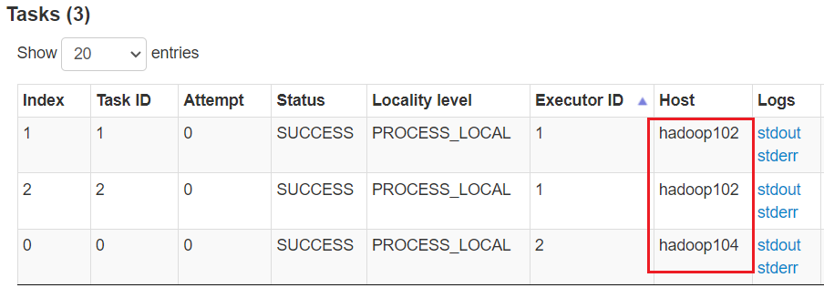
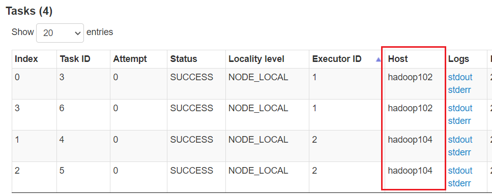
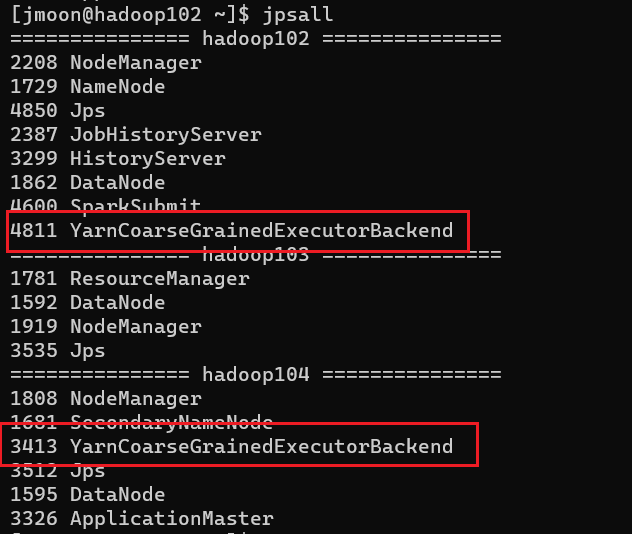

