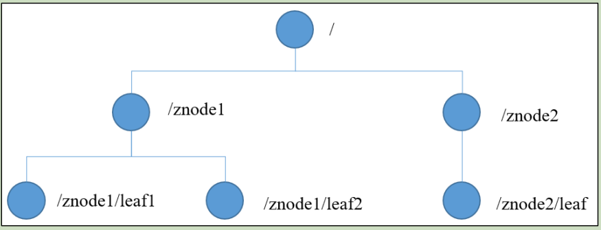
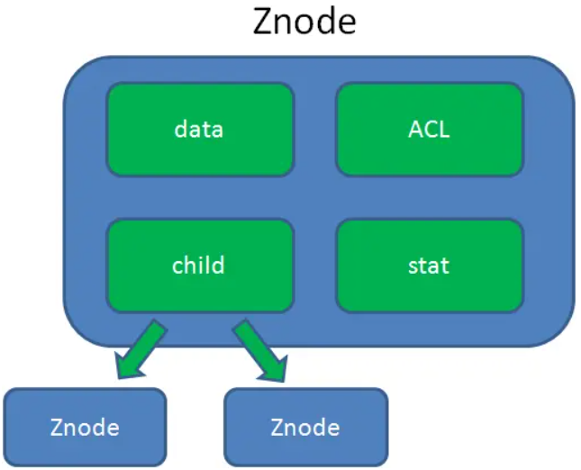

---

Created at: 2021-08-30
Last updated at: 2021-08-31
Source URL: https://www.cnblogs.com/leesf456/p/6022357.html


---

# 3-zookeeper客户端命令


ZooKeeper 组织数据的结构是一棵树，每个节点称做一个 ZNode。每一个 ZNode 默认能够存储 1MB 的数据，每个 ZNode 都可以通过其路径唯一标识。


Znode中存储的信息：

data：Znode存储的数据信息。
ACL：记录Znode的访问权限，即哪些人或哪些IP可以访问本节点。
stat：包含Znode的各种元数据，比如事务ID、版本号、时间戳、大小等等。
child：当前节点的子节点引用，类似于二叉树的左孩子右孩子。

ZooKeeper的四种节点类型：持久无序号、持久有序号、短暂有序号、短暂无序号
持久与短暂的意思是： 客户端与Zookeeper断开连接后， 该节点是否依旧存在。持久代表依旧存在，短暂表示断开连接之后节点就被删除了。
有序号和无序号的意思是：Zookeeper是否在用户给节点起的名字后面加上递增的顺序编号，有序号表示加上，无序号表示不加。

bin目录下常用的脚本解释
zkCleanup.sh　　清理Zookeeper历史数据，包括事务日志文件和快照数据文件
zkCli.sh　　　　  启动Zookeeper的客户端
zkEnv.sh　　　　设置Zookeeper的环境变量
zkServer.sh　　   Zookeeper服务器的启动、停止、和重启脚本

客户端命令:
1.显示所有操作命令
    help
2.使用 ls 命令来查看当前 znode 的子节点 \[可监听\]
    ls \[-s\] \[-w\] \[-R\] path
    -s 查看详细信息
    -w 监听子节点变化
3.创建节点，不加任何参数表示持久无序号
    create \[-s\] \[-e\] \[-c\] \[-t ttl\] path \[data\] \[acl\]
    -s 含有序列
 \-e 临时(重启或者超时消失)
 path 路径
    data 节点的数据
4.获得节点的值 \[可监听\]
    get \[-s\] \[-w\] path
 -s 查看详细信息
 -w 监听节点内容变化
5.设置节点的具体值
    set \[-s\] \[-v version\] path data
    path 路径
    data 节点的数据
6.查看节点的详细信息
    stat \[-w\] path
7.删除节点
    delete \[-v version\] path
    path 路径
8.递归删除节点
    deleteall path
    path 路径

查看节点详细数据 stat 
```
[zk: localhost:2181(CONNECTED) 12] stat /
cZxid = 0x0
ctime = Wed Dec 31 19:00:00 EST 1969
mZxid = 0x0
mtime = Wed Dec 31 19:00:00 EST 1969
pZxid = 0x10000001e
cversion = 6
dataVersion = 0
aclVersion = 0
ephemeralOwner = 0x0
dataLength = 0
numChildren = 4
```

（1） czxid： 创建节点时的事务 zxid，每次执行create、set、delete这样的修改命令时都是一个事务，每次事务都会都有一个事务id，这个id是在整个集群全局唯一的，每次生成的事务id都是在这个全局的事务id上加1，czxid就是create这个节点时的事务id。
（2） ctime：  创建znode的时间
（3） mzxid： znode 最后更新的事务 zxid
（4） mtime： znode 最后修改的时间
（5） pZxid： 最后创建的子节点的事务 zxid
（6） cversion： 添加删除子节点的次数
（7） dataversion： znode 数据变化了多少次
（8） aclVersion： znode 访问控制列表变化了多少次
（9） ephemeralOwner： 如果是临时节点，这个是 znode 拥有者的 session id，如果不是临时节点则是 0。
（10） dataLength： znode 的数据长度
（11） numChildren： znode 子节点数量

