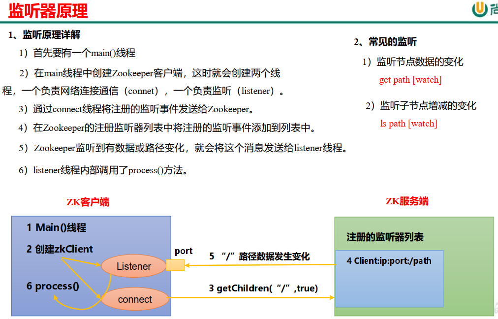

---

Created at: 2021-08-30
Last updated at: 2021-08-31
Source URL: about:blank


---

# 4-zookeeper监听通知机制


客户端注册监听它关心的目录节点，当目录节点发生变化（数据改变、节点删除、子目录节点增加删除）时， ZooKeeper 会快速通知监听了该节点的应用程序，类似于设计模式中的观察者模式。


注意：注册一次，只能监听一次，想再次监听，需要再次注册。

案例： 监听服务器动态上下线，和作为注册中心

Server端，简单的一个业务逻辑，接受来自客户端的连接请求，然后将客户端发送过的数据打印到控制台，重点是args\[0\]是服务名，args\[1\]是ip+端口号，也就是我把服务名和连接地址保存到了zookeeper，zookeeper作为注册中心。
```
public class DistributeServer {

    public static void main(String[] args) throws Exception {
        // 1 获取zk连接
        ZooKeeper zkCli = ZKUtils.getConnect();
        // 2 注册服务器到zk集群
        if (zkCli.exists("/servers", false) == null) {
            zkCli.create("/servers", null, ZooDefs.Ids.OPEN_ACL_UNSAFE, CreateMode.PERSISTENT);
        }
        ZKUtils.serverRegister(zkCli, args[0], args[1]);
        // 3 启动业务逻辑
        new DistributeServer().business(Integer.parseInt(args[1].split(":")[1]));
    }

    private void business(int port) throws Exception {
        Socket socket = new ServerSocket(port).accept();
        Runnable task = () -> {
            try {
                BufferedReader bufferedReader = new BufferedReader(new InputStreamReader(socket.getInputStream()));
                String line;
                while ((line = bufferedReader.readLine()) != null) {
                    System.out.println("服务端收到：" + line);
                }
            } catch (IOException e) {
                e.printStackTrace();
            }
        };
        new Thread(task).start();
    }
}
```

客户端，args\[0\]是想连接的服务名，先从zookeeper中获取服务名对应的地址，然后连接到服务
```
public class Client {

    public static void main(String[] args) throws Exception {
        // 1 获取zk连接
        ZooKeeper zkCli = ZKUtils.getConnect();
        // 2 监听/servers下面子节点的增加和删除
        ZKUtils.printServerList(zkCli);
        // 3 业务逻辑
        new Client().business(ZKUtils.getServerAddr(zkCli, args[0]));
    }

    private void business(String serverAddr) throws Exception {
        String[] str = serverAddr.split(":");
        Socket socket = new Socket(str[0], Integer.parseInt(str[1]));
        PrintStream printStream = new PrintStream(socket.getOutputStream());
        Scanner scanner = new Scanner(System.in);
        while (true) {
            System.out.print("客户端发送：");
            String line = scanner.nextLine();
            if (line.equals("exit")) {
                socket.close();
                break;
            }
            printStream.println(line);
        }
    }
}
```

ZKUtils是核心的工具类。getConnect()是获取连接；serverRegister() 是服务注册；printServerList()是查看所有在线服务的方法，也就是监听服务器动态上下线；getServerAddr()是根据服务名获取服务的连接地址，也就是从注册中心中获取服务地址。因为回调函数只会回调一次，所以如果想要能一直监听，技巧就是在回调函数中调用自己即可，serverRegister() 和 printServerList()就是这样做的。
```
public class ZKUtils {

    private static final String SERVER = "/servers/";

    public static ZooKeeper getConnect() throws IOException {
        int sessionTimeout = 2000;
        String connectString = "hadoop102:2181,hadoop103:2181,hadoop104:2181";
        return new ZooKeeper(connectString, sessionTimeout, null);
    }

    public static void serverRegister(ZooKeeper zkCli, String serverName, String serverAddr) throws KeeperException, InterruptedException {
        //创建临时不带序号的节点
        String create = zkCli.create(SERVER + serverName, serverAddr.getBytes(), ZooDefs.Ids.OPEN_ACL_UNSAFE, CreateMode.EPHEMERAL);
        System.out.println("服务：" + serverName + " 上线");
    }

    public static void printServerList(ZooKeeper zkCli) throws Exception {
        List<String> children = zkCli.getChildren("/servers", watchedEvent -> {
            try {
                ZKUtils.printServerList(zkCli);
            } catch (Exception e) {
                e.printStackTrace();
            }
        });
        System.out.println("已上线的服务：" + children);
    }

    public static String getServerAddr(ZooKeeper zkCli, String serverName) throws InterruptedException, KeeperException {
        byte[] data = zkCli.getData(SERVER + serverName, watchedEvent -> {
            try {
                String serverAddr = ZKUtils.getServerAddr(zkCli, serverName);
                System.out.println(serverName + "的地址改变了，新地址是：" + serverAddr);
            } catch (Exception e) {
                e.printStackTrace();
            }
        }, null);
        return new String(data);
    }
}
```

