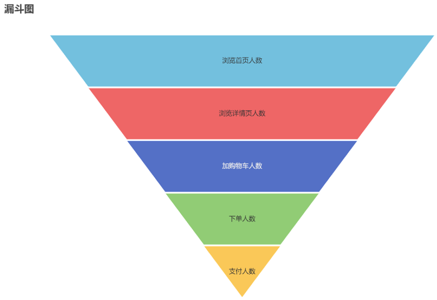
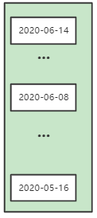
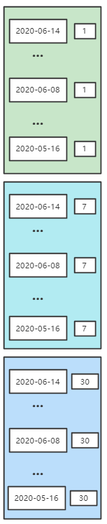
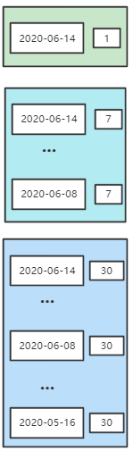

---

Created at: 2021-10-30
Last updated at: 2021-11-16
Source URL: about:blank


---

# 10-ADS层


ADS层是为直接为应用提供数据的一层，如各种报表和统计图，所以一般是应用需要什么样数据，ADS层就会相应地建什么样的表等。ADS层的数据来源是 ODS层（特殊表只在ODS层装载一次）、DIM层、DWD层、DWS层、DWT层，也就是ADS层会充分利用前面各层的数据计算一些新的指标。因为ADS层的数据来源很多，统计需求不固定，不像前面各层的数据来源及去向那么固定，所以ADS层的数据装载不区分首日和每日（后者说视具体的统计需求而定）。
由于ADS层数据量比较小，所以ADS层的表没有采用parquet列式存储和lzo压缩，如下用于用户行为漏斗分析的表，表中的一行数据表示的是在某一天统计的最近1日（或者最近7日、或者最近30日）的聚合值。（DWT层用户主题表的一行表示的是一个用户的累积聚合值，而ADS层计算的是所有用户的统计值，比如DWT层的用户主题表的一行表示一个用户有没有在今日下单，如果截止到今日有一亿个用户，那么DWT层用户主题表就有一亿条数据，而ADS层则是通过DWT层数据计算出今日用户下单数，所以ADS层今日的统计数据只会有一行）。
从ADS层用户行为漏斗分析的表结构可以看到，与DWT层一样，我们需要统计最近1天、最近7天、最近30天的各种聚合值，但是DWT层是把每个统计指标都作为了一列，而ADS层使用recent\_days字段标识该行数据统计的是哪一种指标，差别就是DWT层以横向扩展增加列的方式保存数据，而ADS层以纵向扩展增加行的方式保存数据。
```
CREATE EXTERNAL TABLE `ads_user_action` (
  `dt` STRING COMMENT '统计日期',
  `recent_days` BIGINT COMMENT '最近天数,1:最近1天,7:最近7天,30:最近30天',
  `home_count` BIGINT COMMENT '浏览首页人数',
  `good_detail_count` BIGINT COMMENT '浏览商品详情页人数',
  `cart_count` BIGINT COMMENT '加入购物车人数',
  `order_count` BIGINT COMMENT '下单人数',
  `payment_count` BIGINT COMMENT '支付人数'
) COMMENT '漏斗分析'
ROW FORMAT DELIMITED  FIELDS TERMINATED BY '\t'
LOCATION '/warehouse/gmall/ads/ads_user_action/';
```
漏斗分析是一个数据分析模型，它能够科学反映一个业务过程从起点到终点各阶段用户转化情况。由于其能将各阶段环节都展示出来，故哪个阶段存在问题，就能一目了然。


写ADS层表装载数据sql的一个技巧是，先不管所有维度字段（比如recent\_days等），直接计算出数据的各项聚合值后，然后再考虑维度字段，加上维度字段就相当于对数据按该维度分组聚合，也就是需要按该维度字段group by。

比如统计这俩字段，因为没有DWT层没有关于页面的主题，所以统计页面浏览次数得用DWD层页面日志表
```
`home_count`        BIGINT COMMENT '浏览首页人数',
`good_detail_count` BIGINT COMMENT '浏览商品详情页人数',
```
首先不考虑最近天数这个维度，直接写出统计当日全量数据的sql：
```
select sum(if(array_contains(page_detail, 'home'), 1, 0))        home_count,
       sum(if(array_contains(page_detail, 'good_detail'), 1, 0)) good_detail_count
from (
         select collect_set(page_id) page_detail
         from dwd_page_log
         where dt = '2020-06-14'
           and page_id in ('home', 'good_detail')
         group by mid_id
     );
```
然后考虑最近1、7、30日，可以直接将上面的sql复制3份，然后在where里面限制不同的时间范围，但是这要查这张表3次。还有一种做法是使用explode将数据扩展成3份，然后按最近1、7、30日分组统计。
```
select '2020-06-14',
       recent_days,
       sum(if(array_contains(page_detail, 'home'), 1, 0))        home_count,
       sum(if(array_contains(page_detail, 'good_detail'), 1, 0)) good_detail_count
from (
         select recent_days,
                collect_set(page_id) page_detail
         from (
                  select mid_id, page_id, dt
                  from dwd_page_log
                  `-- 1.先把30天的数据过滤出来，不然会扫描所有分区的数据`
                  where dt >= date_add('2020-06-14', -29)
                    and page_id in ('home', 'good_detail')
                  `-- 2.然后使用lateral view explode把数据扩成3倍`
              ) t1 lateral view explode(array(1, 7, 30)) tmp as recent_days
              `-- 3.过滤掉时间与统计当日相差的天数不符合recent_days要求的数据`
         where dt >= date_add('2020-06-14', -recent_days + 1)
               `-- 最后按recent_days分组就可以对3份数据分开计算了`
         group by recent_days, mid_id
     ) t2
     -- 加上按recent_days分组
group by recent_days;
```
1.先把30天的数据过滤出来，不然会扫描所有分区的数据

2.然后使用lateral view explode把数据扩成3倍

3.过滤掉时间与统计当日相差的天数不符合recent\_days要求的数据


再统计这仨字段，因为DWT层用户主题表中有每个用户最近1、7、30日的加购次数、下单次数 和 支付次数，所以下面字段的计算可以直接从DWT层用户主题表取数。
```
`cart_count` BIGINT COMMENT '加入购物车人数',
`order_count` BIGINT COMMENT '下单人数',
`payment_count` BIGINT COMMENT '支付人数'
```
首先不考虑最近天数这个维度，直接写出统计全量数据的sql，比如统计最近1日的加购次数、下单次数 和 支付次数
```
select sum(if(cart_last_1d_count > 0, 1, 0))    cart_count,
       sum(if(order_last_1d_count > 0, 1, 0))   order_count,
       sum(if(payment_last_1d_count > 0, 1, 0)) payment_count
from dwt_user_topic
where dt='2020-06-14';
```
可以直接把上面这条sql复制3份，然后改一下select后面的字段，然后union起来，但是这要查这张表3次。还有一种与上面统计页面浏览次数类似的做法，即也是使用explode将数据扩展成3份，然后按最近1、7、30日分组统计。这种做法相当于是把DWT层横向以列记录的数据转变成了纵向以行记录，然后靠recent\_days列的值区分，所以直接按recent\_days分组统计，即可分别算出最近1、7、30日分组统计值。
```
select '2020-06-14',
       recent_days,
       sum(if(cart_count > 0, 1, 0))    cart_count,
       sum(if(order_count > 0, 1, 0))   order_count,
       sum(if(payment_count > 0, 1, 0)) payment_count
from (
         select recent_days,
                case
                    when recent_days = 1 then cart_last_1d_count
                    when recent_days = 7 then cart_last_7d_count
                    when recent_days = 30 then cart_last_30d_count
                    end cart_count,
                case
                    when recent_days = 1 then order_last_1d_count
                    when recent_days = 7 then order_last_7d_count
                    when recent_days = 30 then order_last_30d_count
                    end order_count,
                case
                    when recent_days = 1 then payment_last_1d_count
                    when recent_days = 7 then payment_last_7d_count
                    when recent_days = 30 then payment_last_30d_count
                    end payment_count
         from dwt_user_topic lateral view explode(array(1, 7, 30)) tmp as recent_days
         where dt = '2020-06-14'
     ) t1
group by recent_days;
```

总结，如果数据来自于DWD层，那么使用第一种方法将数据扩张成3倍，如果数据来自于DWT层，则使用第二种方式（这种方式最终的效果实际上是将数据由横向变成了纵向，然后由recent\_days字段区分），然后按recent\_days分组分别统计出最近1、7、30日的结果。

最后把上面的结果按 recent\_days 连接起来，就可得到 2020-06-14 这一天的最近1、7、30日统计数据了：
```
with tmp_page as (select recent_days,
                         sum(if(array_contains(page_detail, 'home'), 1, 0))        home_count,
                         sum(if(array_contains(page_detail, 'good_detail'), 1, 0)) good_detail_count
                  from (
                           select recent_days,
                                  collect_set(page_id) page_detail
                           from (
                                    -- 先把30天的数据过滤出来
                                    select mid_id, page_id, dt
                                    from dwd_page_log
                                    where dt >= date_add('2020-06-14', -29)
                                      and page_id in ('home', 'good_detail')
                                    -- 使用explode把数据扩成3倍
                                ) t1 lateral view explode(array(1, 7, 30)) tmp as recent_days
                                -- 过滤掉时间与统计当日相差的天数不符合recent_days要求的数据
                           where dt >= date_add('2020-06-14', -recent_days + 1)
                                 -- 加上按recent_days分组
                           group by recent_days, mid_id
                       ) t2
                       -- 加上按recent_days分组
                  group by recent_days),
     tmp_count as (select recent_days,
                          sum(if(cart_count > 0, 1, 0))    cart_count,
                          sum(if(order_count > 0, 1, 0))   order_count,
                          sum(if(payment_count > 0, 1, 0)) payment_count
                   from (
                            select recent_days,
                                   case
                                       when recent_days = 1 then cart_last_1d_count
                                       when recent_days = 7 then cart_last_7d_count
                                       when recent_days = 30 then cart_last_30d_count
                                       end cart_count,
                                   case
                                       when recent_days = 1 then order_last_1d_count
                                       when recent_days = 7 then order_last_7d_count
                                       when recent_days = 30 then order_last_30d_count
                                       end order_count,
                                   case
                                       when recent_days = 1 then payment_last_1d_count
                                       when recent_days = 7 then payment_last_7d_count
                                       when recent_days = 30 then payment_last_30d_count
                                       end payment_count
                            from dwt_user_topic lateral view explode(array(1, 7, 30)) tmp as recent_days
                            where dt = '2020-06-14'
                        ) t1
                   group by recent_days)
insert
overwrite
table
ads_user_action
select *
from ads_user_action
union all
select '2020-06-14',
       tmp_page.recent_days,
       home_count,
       good_detail_count,
       cart_count,
       order_count,
       payment_count
from tmp_page
         join
     tmp_count
     on tmp_page.recent_days = tmp_count.recent_days;
```
因为ADS一张表每天的统计结果只有3行数据，即统计当日最近1、7、30日的统计值，所以每天的新增数据量很少，如果直接使用hive的insert into的话就会单独生成一个小文件，所以这里采用了先将原来的数据查出来，然后再与今天的结果union，最后再insert overwrite会原表，这样就解决了小文件过多的问题了。

