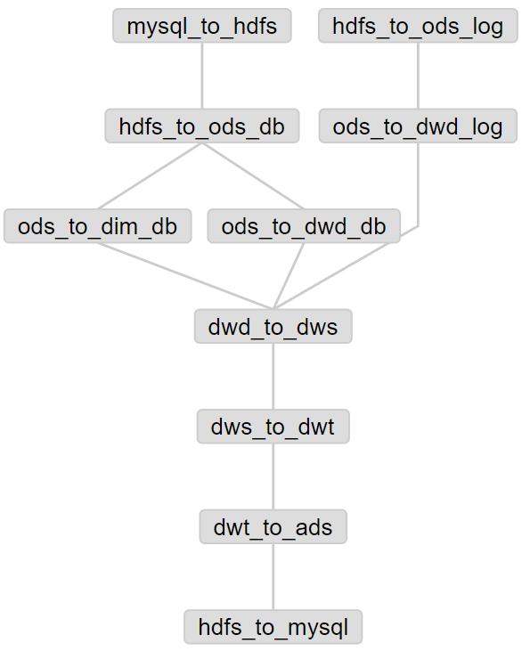

---

Created at: 2021-11-01
Last updated at: 2021-11-01


---

# 11-azkaban


使用工作流调度工具的两步：

1. 描述工作流程
2. 设置定时

区分两个概念：job 和 flow，关系是由job组成flow。

描述工作流程的步骤：
1\. 新建 azkaban.project 文件， 编辑内容如下：
```
azkaban-flow-version: 2.0
```
该文件的内容是告诉azkaban使用yaml的语法解析 .flow 文件，如果是1.0，那么会使用properties的格式解析 .flow 文件。
2. 新建 gmall.flow 文件，描述工作流程：

```
nodes:
  - name: mysql_to_hdfs
    type: command
    config:
     command: /home/jmoon/bin/mysql_to_hdfs.sh all ${dt}

  - name: hdfs_to_ods_log
    type: command
    config:
     command: /home/jmoon/bin/hdfs_to_ods_log.sh ${dt}

  - name: hdfs_to_ods_db
    type: command
    dependsOn:
     - mysql_to_hdfs
    config:
     command: /home/jmoon/bin/hdfs_to_ods_db.sh all ${dt}

  - name: ods_to_dim_db
    type: command
    dependsOn:
     - hdfs_to_ods_db
    config:
     command: /home/jmoon/bin/ods_to_dim_db.sh all ${dt}

  - name: ods_to_dwd_log
    type: command
    dependsOn:
     - hdfs_to_ods_log
    config:
     command: /home/jmoon/bin/ods_to_dwd_log.sh all ${dt}

  - name: ods_to_dwd_db
    type: command
    dependsOn:
     - hdfs_to_ods_db
    config:
     command: /home/jmoon/bin/ods_to_dwd_db.sh all ${dt}

  - name: dwd_to_dws
    type: command
    dependsOn:
     - ods_to_dim_db
     - ods_to_dwd_log
     - ods_to_dwd_db
    config:
     command: /home/jmoon/bin/dwd_to_dws.sh all ${dt}

  - name: dws_to_dwt
    type: command
    dependsOn:
     - dwd_to_dws
    config:
     command: /home/jmoon/bin/dws_to_dwt.sh all ${dt}

  - name: dwt_to_ads
    type: command
    dependsOn:
     - dws_to_dwt
    config:
     command: /home/jmoon/bin/dwt_to_ads.sh all ${dt}

  - name: hdfs_to_mysql
    type: command
    dependsOn:
     - dwt_to_ads
    config:
      command: /home/jmoon/bin/hdfs_to_mysql.sh all
```

