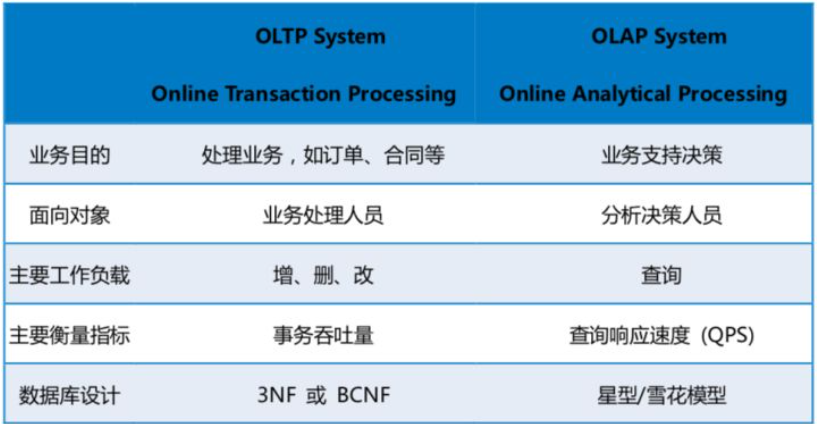
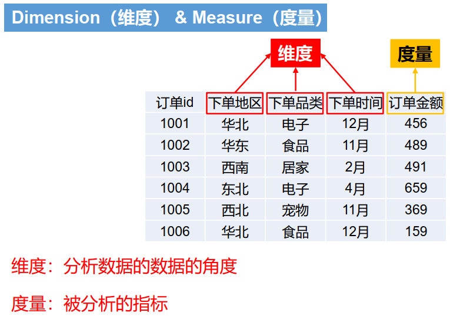
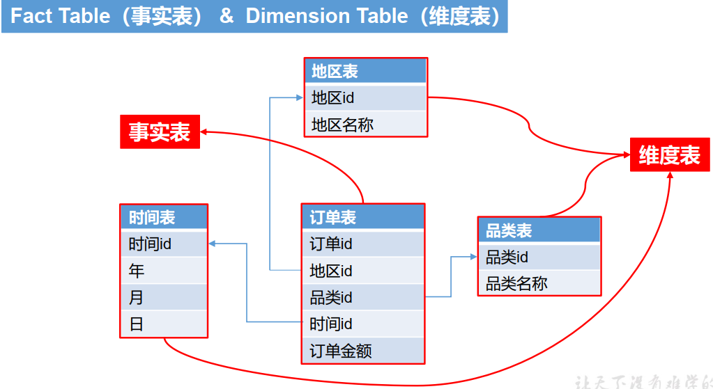
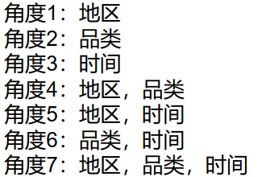
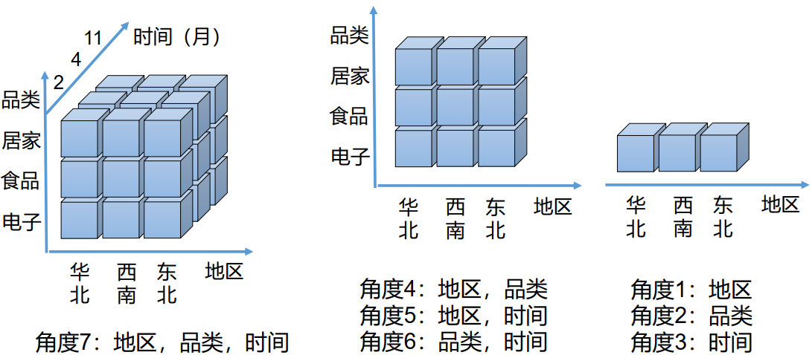

---

Created at: 2021-11-01
Last updated at: 2021-11-13
Source URL: https://www.zhihu.com/question/24110442


---

# 13-数仓其它


**可视化报表**
Apache Superset是一款开源的轻量级BI（Business Intelligence）分析工具，能够对接多种数据源，以丰富的图表展示数据。
本项目的Superset对接的是MySQL，所以需要将ADS层数据导入到MySQL中时，由于sqoop只支持将HDFS的文件导出，无法做到从Hive中查询数据导出，所以使用sqoop每次导出的都是ADS层一整张表的数据（因为ADS层的数据没有分区，并且所有数据都保存在一个文件中），于是在MySQL中建表时需要注意以下几个问题：
1.MySQL表的列要与ADS层表的列保持一致，即数据类型要对应上，列的个数和顺序也要一样。
2.MySQL中的表需要有主键，因为每次都是导一整张表的数据，所以为了防止重复插入数据，得有主键，这个主键就是统计ADS层数据时的group by字段。还要注意一个问题，MySQL复合主键中不能有null值，所以如果group by字段有可能为null，那就不能将其定义为主键，而应该定义为唯一键，唯一键允许有null值。（也可以步这么麻烦，每次写到MySQL前先truncate表就行了）
sqoop导出时需要加上这两个参数，不使用这俩参数，sqoop导出时使用的insert，如果唯一键有重复会报错，如果使用这俩两个参数，那么会使用更新模式。--update-key指明表的唯一键，--update-mode表示更新模式，allowinsert表示如果更新数据的唯一键存在，那么直接更新，如果更新数据的唯一键不存在，那么直接将这条数据插入，使用的是MySQL的upsert实现的功能（INSERT INTO … ON DUPLICATE KEY UPDATE），--update-mode还有另外一个取值updateonly，表示如果重复就更新，如果没有重复就不做任何事情，使用的是MySQL的update实现的功能。
```
--update-key $2 \
--update-mode allowinsert \
```

**即席查询**
Apache Kylin是一个开源的分布式分析引擎，提供Hadoop/Spark之上的SQL查询接口，具有超大规模数据OLAP的能力，能在亚秒内查询巨大的Hive表。

**OLTP与OLAP：**
OLTP（on-line transaction processing，联机事务处理）是数据库的应用，针对的是业务系统的增删改查，强调的是实时地事务处理。
OLAP（On-Line Analytical Processing，联机分析处理）针对的是数据的统计查询，即对数据进行实时地统计并获取结果，以便能及时地分析并获取有价值的信息，OLAP的数据源可以数据仓库的海量数据，也可以是传统关系数据库的数据。

OLAP的数据来源是由OLTP产生的，所以OLAP依赖于OLTP，OLAP可以看作是OLTP的一种延展，一个发现OLTP产生数据的价值的过程。

OLAP的分类：ROLAP（Relational OLAP，关系型联机分析处理） 和 MOLAP（Multi-dimensional OLAP，多维联机分析处理）。
ROLAP 基于关系型数据库，不需要预计算，代表产品有：Impala、ClickHouse。
MOLAP 基于多维数据集，需要预计算，代表产品有：Kylin。

多维分析的两个重要概念：维度（Dimension） 和 度量（Measure）

维度 和 度量 也正是维度模型中的两个概念，维度就是维度表的字段，度量就是事实表中度量值，当然事实表中也有维度退化后的维度。Kylin对接的正是维度模型，可以是星型模型，也可以是雪花模型。

对数据进行分析其实就是从不同维度去观察度量值的变化，也就是说我们需要以不同的维度对度量值进行聚合。上面那张表可以从7（2^3-1）个维度去观察度量的变化，也就说观察度量值变化的角度是可以穷举出来的，那么只要提前计算出所有角度的聚合值，就能做到用户对海量数据统计查询的秒级响应了，Kylin就是这么做的。


**Cuboid**
一个角度得到的所有聚合值就是一个Cuboid，如下展示了3个Cuboid，Cuboid中的每一个小方块就是通过具体的维度值分组聚合得到值，比如3维Cuboid中右上角那个小方块表示东北地区居家品类2月份的销售总额。所有Cuboid组成一个Cube。Kylin在计算时是先计算最高维的Cuboid，然后再对高维Cuboid降维聚合就可低维Cuboid了。


使用Kylin的步骤就是先选择一大推表，然后选择这些表的join类型和join字段，接着确定哪些字段是维度，哪些字段是度量，最后选择度量值的聚合函数。Kylin会把你选择的表先连接在一起，然后用维度字段分组，对度量字段聚合，最后把结果保存在cube中（cube保存在HBase中）。所以使用Kylin最重要的是区分维度和度量，建模的方式其实并不那么重要，建模的方法只是方法论，最后落实的还是表。

