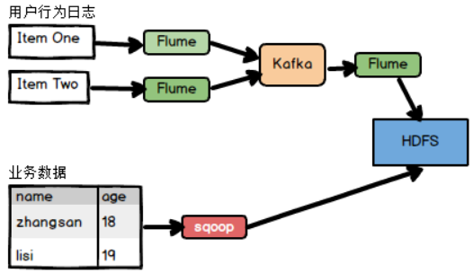
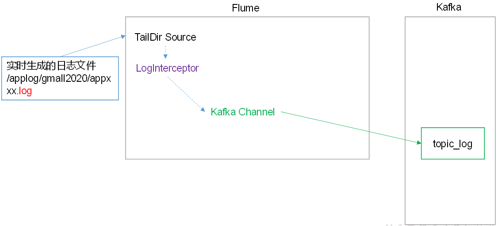
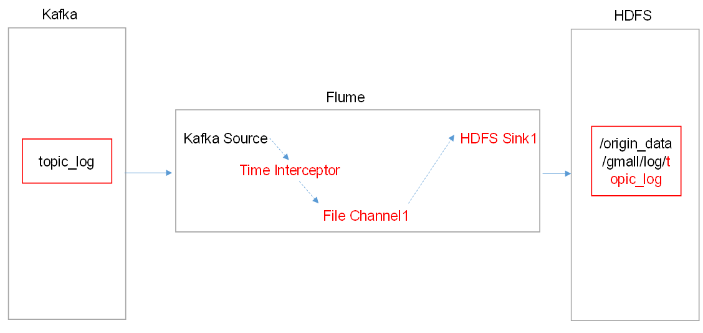
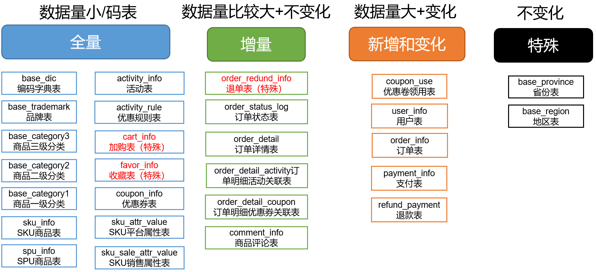

---

Created at: 2021-10-26
Last updated at: 2021-11-01


---

# 2-数据采集通道


数据采集通道

日志数据采用Flume+Kafka+Flume的方式上传到HDFS上。
第一层Flume部署在每个Springboot服务器上，采用TAILDIR的source 和 Kafka channel，Kafka的作用是流量削峰。该层Flume有一个用于校验日志是否为json格式的拦截器。

第二层Flume部署在非Springboot主机上，负责消费Kafka中的日志数据，并上传到HDFS。正常应该是使用Kafka Channel 和 HDFS Sink。本项目使用了Kafka source 、Flie Channel 和 HDFS Sink，另外还有一个用于向Event 头添加timestamp的拦截器，用于解决零点偏移问题，所谓零点偏移问题是指由于数据源到HDFS之间的数据传输过程需要一定的时间，在数据23:59分产生的数据到达HDFS Sink时可能就已经00:00，对于这部分数据不能将其放到第二天创建的目录中，而是应该放到前一天的目录，所以为了解决零点偏移问题，需要使用拦截器将日志里的时间戳添加到Event头的timestamp字段中，原理其实是，HDFS Sink会根据Event头里面的timestamp字段的值将数据写入到相应的目录下。
如果本层不使用source，而是直接使用Kafka Channel，那么就无法在添加拦截器了，解决方法是把这个拦截器的功能放到第一层的那个拦截器中，也就是json格式校验合格后直接向Event 头中添加timestamp。
HDFS Sink采用lzop的压缩方式将日志写到HDFS上，没有创建索引。


业务数据采用sqoop将MySQL的数据导入HDFS上。业务数据的同步策略有如下4种：

1. 全量同步：存储完整的数据。

全量同步就是每天都把表的全部数据导入到HDFS上（路径为 表名/日期）。这种同步策略适用于表的数据量不大，且每天既会有新数据的插入，也会有旧数据的修改。

2. 增量同步：存储新增加的数据。

只把表中每天新增加的数据导入到HDFS上（路径为 表名/日期），即过滤条件是create\_time=当前日期。这种同步策略适用于表数据量很大，且每天只会有新数据插入。

3. 新增及变化同步：存储新增加的数据和变化的数据。

把每天新增和修改过的数据导入到HDFS上（路径为 表名/日期），即过滤条件是modify\_time=当天日期。这种同步策略适用于表的数据量很大，并且每天既会有新数据的插入，也会旧数据的修改。

4. 特殊同步：只需要存储一次。

根据表的特点，每个表的同步策略如下：

注意：对于日志数据，配置好Flume的时间戳拦截器之后，Flume可以依照日志中的时间戳将每一条日志写到HDFS相应的目录下。而对于业务数据，需要根据每张表的含义及特点来选择同步策略，不过第一次将MySQL的业务数据导入到HDFS上时，所有表都是全量同步，称为首日同步，日后每天需要严格按照同步策略进行，对于特殊的两张表只需要再首日同步将数据导入到HDFS中，每日同步不需要再管这两张表了。
sqoop使用sql语句先把数据查出来然后导入到HDFS上，所以如果是全量同步则where 1=1，如果增量同步则where create\_time=do\_date，如果是新增及变化同步则where operate\_time=do\_date or create\_time=do\_date。
sqoop可使用参数指定导入到HDFS上文件的压缩方式，本项目使用的lzop。由于sqoop的同步命令是写在shell脚本中的批任务，所以在sqoop同步完成之后，可以随即使用lzop的jar包为lzop文件建立索引。而日志文件的同步是流式的，即Flume启动后会一直运行，第一层Flume会不间断地读取源日志文件中数据写入Kafka，第二层Flume会不间断读取Kafka中的数据写入HDFS，HDFS上文件的生成由Flume控制，所以日志同步到HDFS后不方便为其创建的lzop文件建立索引。

sqoop导入命令的这两个参数的作用是，当遇到MySQL中的null值时，在hive表中使用\\N保存，这样在hive中使用is null 才不会失效，因为不加上这俩参数sqoop默认会将MySQL中的null值在hive表中保存成null字符串，这样is null就失效了。
```
--null-string '\\N' \
--null-non-string '\\N'
```

