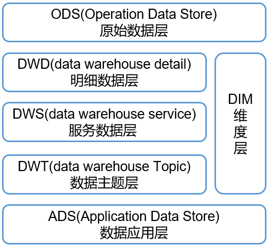
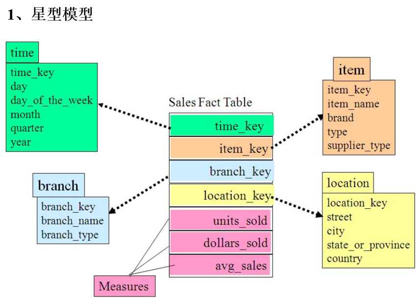
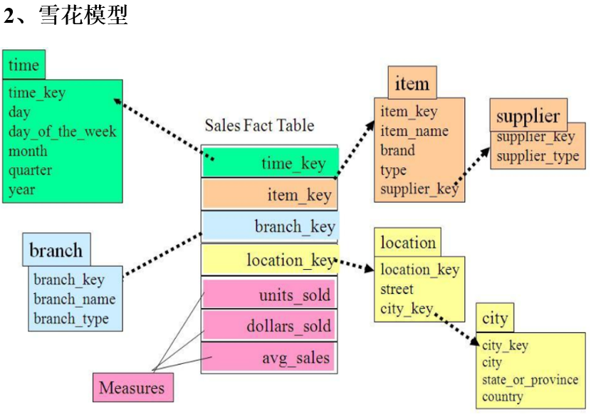
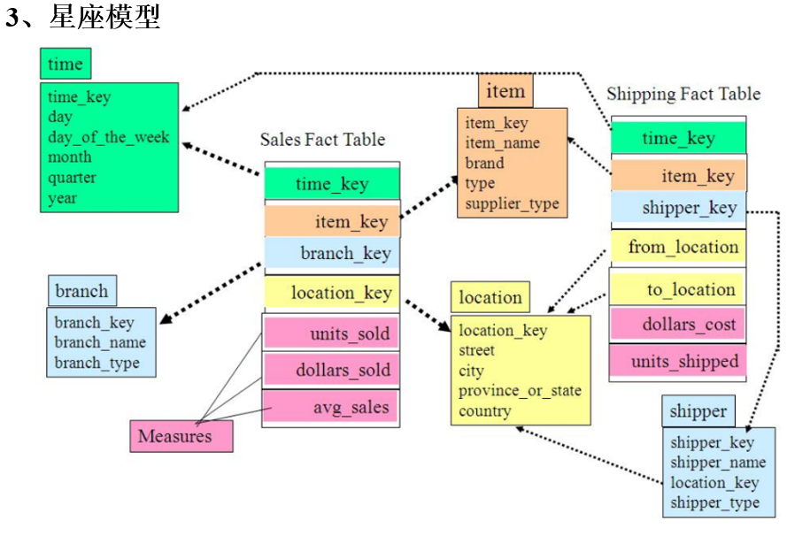

---

Created at: 2021-10-23
Last updated at: 2021-11-03

---

# 3-数仓建模

**数据仓库与数据集市的区别：**
数据仓库是企业级别的，能为整个企业的各个部门提供决策支持。数据集市是部门级别的微型数据仓库，数据集市分为从属型和独立型两种，从属型是指数据集市的数据来自企业级别的数据仓库，而独立型数据集市是指各个部门自己独立建立的数据仓库，独立型数据仓库有数据孤岛的问题，整个企业的各个部门之间数据存在不一致的情况。

**数仓分层：**

* ODS层：原始数据层，直接加载原始日志、业务数据，不对数据做任何处理，保存的是数据的原貌。
* DWD层：数据明细层，对ODS层数据进行清洗（去除空值，脏数据，超过极限范围值的数据）、脱敏等，保存的是业务事实明细，一行数据代表一次业务行为，如一次下单行为。
* DIM层：维度层，保存的是维度数据，主要是对业务事实的描述信息，例如何人、何时、何地等。
* DWS层：数据服务层，对DWD层数据按天进行轻度汇总，例如一个用户一天的下单次数。
* DWT层：数据主题层，对DWS层数据进行累积汇总，例如用户从注册起的所有下单次数。
* ADS层：应用数据层，为统计报表提供数据。

数仓为什么要分成？
1.把复杂问题简单化：每一层都只负责完成该层的任务，结构清晰，方便定位问题。
2.减少重复开发：通过中间层数据能极大减少重复计算，增加计算结果的复用性，比如DIM层和DWD层将业务数据库的关系模型转换成查询更为高效的维度模型，DWS层和DWT层对数据汇总，计算出常用的指标，方便后续复用。
3.隔离原始数据：每一层数据都是将上一层数据做了一次计算和转换后的再次存储（相当于是对上一层数据创建了视图，并且还把这个视图保存了下来），这样就实现了数据的隔离，隔离的好处就是可以更加细粒度控制数据，比如只对新手开放某一层的数据。

**数仓命名规范**
表命名

* ODS层命名为ods\_表名
* DIM层命名为dim\_表名
* DWD层命名为dwd\_表名
* DWS层命名为dws\_表名  
* DWT层命名为dwt\_表名
* ADS层命名为ads\_表名
* 临时表命名为tmp\_表名

脚本命名

* 数据源\_to\_目标\_db/log.sh
* 用户行为脚本以log为后缀；业务数据脚本以db为后缀。

表字段类型

* 数量类型为bigint
* 金额类型为decimal(16, 2)，表示：16位有效数字，其中小数部分2位
* 字符串(名字，描述信息等)类型为string
* 主键外键类型为string
* 时间戳类型为bigint

**关系建模与维度建模**
关系建模将复杂的数据抽象为两个概念：实体和关系，遵循范式理论的要求。其优点是降低数据的冗余，从而保证数据的一致性，缺点是查询涉及多张表的连接，效率较低。
而维度建模以数据分析作为出发点，不遵循三范式，所以数据存在一定的冗余。维度模型面向业务，将业务用事实表和维度表呈现出来，表结构简单，故查询简单，查询效率较高。（相当于是原先在进行关系建模时拆开的表，现在在数仓建设使用维度模型时有合并回来了，因为具有冗余带来的查询效率的提升，也有点像在关系型数据库查询建立视图的那个意思，数仓每一层的表相当于是对关系型数据库建立视图并保存了下来，当然维度建模并没有这么简单，它还是有一套建模思想的，并不是随意的合并关系数据库的表）

**维度表和事实表**
**维度表**：一般是对事实的描述信息。每一张维表对应现实世界中的一个对象或者概念，例如：用户、商品、日期、地区等。
维度表的特征：

* 因为维度表不遵循三范式，所以维度表一般为宽表，即列比较多
* 跟事实表相比，维度表行数相对较少，通常小于10万条
* 维度表内容相对固定，比如编码表

**事实表**：事实表中的每行数据代表一个业务事件，如：下单、支付、退款、评价等。**事实表的列一般分为两类：维度表的外键和度量值。**
事实表的特征：

* 非常的大，即行非常多
* 内容相对的窄，即列数较少，主要是维度外键和度量值
* 经常发生变化，每天会新增加很多

**事实表一般可分为3类：**
1.事务型事实表
以每个事务或事件为单位作为事实表里的一行数据，例如一个销售订单记录，一笔支付记录等。一旦事务被提交，数据被插入事实表，数据就不再会被更改，故其更新方式为增量同步。
2.周期型快照事实表
周期型快照事实表中不保留中间状态，只在保留某个时间点保存数据，例如每天或者每月的销售额、每月的账户余额等，故其更新方式为全量同步。
3.累积型快照事实表
累积快照事实表用于跟踪业务事实的变化，其更新方式为新增及变化同步。

**维度模型的分类：**
维度模型分为：星型模型、雪花模型。两种模型的区别在于是否对维度表按关系范式进行规范化，星型模型不进行规范化，而雪花模型会对维度表规范化。
  
雪花模型与星型模型的区别主要在于维度的层级，标准的星型模型的维度只有一层，而雪花模型会有多级。
雪花模型比较靠近3NF，但不会完全遵守3NF的要求，因为遵循3NF的性能成本太高了。

星座模型：

星座模型是指多张事实表共用维度表。这是数仓的常态，星座模型与星型模型并不冲突，星型模型是单一的从事实表和维度表的关系来看，而星座模型是从整个数仓的表的关系来看。

**数仓建模过程**
**ODS层**
针对HDFS上的用户行为数据和业务数据，我们如何规划处理？
（1）保持数据原貌不做任何修改，起到备份数据的作用。
（2）数据采用压缩，减少磁盘存储空间（例如：原始数据100G，可以压缩到10G左右）
（3）创建分区表，防止后续的全表扫描

**DWD层和DIM层**
DIM层和DWD层需构建维度模型，一般采用星型模型，呈现的状态一般为星座模型。**DIM层对应的是维度表，DWD层对应的是事实表。**
DWD层和DIM层以业务过程为驱动，DWD层维度建模一般按照以下四个步骤：
选择业务过程→声明粒度→确认维度→确认事实
（1）选择业务过程，即确定有哪些事实表
在业务系统中，挑选我们感兴趣的业务线，比如下单业务，支付业务，退款业务，物流业务，一条业务线对应一张事实表。
（2）声明粒度，即确定事实表的每行数据是什么
定义事实表中的一行数据表示什么，应该尽可能选择最小粒度，以此来应各种各样的需求。
比如：
订单事实表中一行数据表示的是对一个商品的订单。
支付事实表中一行数据表示的是一个支付记录。
（3）确定维度，即确定事实表有哪些维度外键
维度的主要作用是描述业务事实，比如“谁，何处，何时”等信息。确定维度的原则是，后续需求中是否要分析相关维度的指标。
例如，需要统计什么时间下的订单多、哪个地区下的订单多、哪个用户下的订单多，于是需要确定的维度就包括：时间维度、地区维度、用户维度。
（4）确定事实，即确定事实表的度量值
此处的“事实”一词指的是业务中的度量值（次数、个数、件数、金额，可以进行累加），例如订单金额、下单次数等。

**DWS层与DWT层**
DWS层和DWT层统称宽表层。DWD层和DIM层建表的过程是，以业务过程出发确定事实表，然后再确定维度表；而DWS层和DWT层是以维度为基准确定需要建哪些表。比如一张地区维度表关联了订单事实表、退单事实表、支付事实表、退款事实表，那么DWS层就会相应有一张表存的是，每个地区每天的订单数量、订单总金额、退单次数、退单总金额、支付次数、支付总金额、退款次数、退款总金额，相应地，DWT层存的是对DWS层数据按星期、月、年的累积聚合值。DWS层和DWT层将与维度表关联的所有事实表的度量值的聚合值指标统一计算一遍，然后将结果保存在宽表中，这样就能有效避免数据的重复计算。
总结，DWD层和DIM层是以事实表出发建表，而 DWS层与DWT层则是以维度表出发建表，即以维度表的角度去看事实表。DWS层存的是DWD层和DIM层数据的轻度汇总结果，即与每张维度表相关联的事实表的度量值的聚合值，DWT层存的是DWS层数据的累积汇总。DWD层和DIM层的目的是避免重复计算。

**ADS层**
可视化需要哪些数据就存什么数据。

**总结**
DWD层和DIM层以业务过程为驱动，DWS层、DWT层和ADS层都是以需求为驱动，已经和维度建模没有关系了。DWS和DWT都是建宽表，按照主题去建表，主题相当于观察问题的角度。

