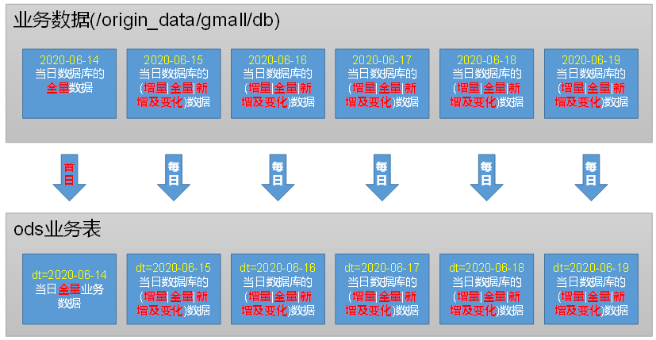

---

Created at: 2021-10-26
Last updated at: 2021-11-01


---

# 4-ODS层


ODS层：
（1）保持数据原貌不做任何修改，起到备份数据的作用。
（2）数据采用LZO压缩并创建索引，减少磁盘存储空间。100G数据可以压缩到10G以内。
（3）创建分区表，防止后续的全表扫描，在企业开发中大量使用分区表。
（4）创建外部表。在企业开发中，除了自己用的临时表，创建内部表外，绝大多数场景都是创建外部表。

1 日志表
由于ODS需要保存数据原貌，所以日志表只有一列，数据类型为string。本层表的数据存储方式是lzo+索引，所以要在建表时指定INPUTFORMAT和OUTPUTFORMAT（为什么是指定这两个，而不是TBLPROPERTIES ("parquet.compression"="lzo"); 不是很清楚）
```
drop table if exists ods_log;
CREATE EXTERNAL TABLE ods_log (`line` string)
PARTITIONED BY (`dt` string) -- 按照时间创建分区
STORED AS -- 指定存储方式，读数据采用LzoTextInputFormat；
  INPUTFORMAT 'com.hadoop.mapred.DeprecatedLzoTextInputFormat'
  OUTPUTFORMAT 'org.apache.hadoop.hive.ql.io.HiveIgnoreKeyTextOutputFormat'
LOCATION '/warehouse/gmall/ods/ods_log'  -- 指定数据在hdfs上的存储位置
;
```
创建完表后需要使用load命令将前面使用Flume+Kafka+Flume的方式上传到HDFS的日志导入这张Hive表中。由于前面导入到HDFS上的日志文件虽然是lzop的压缩文件，但是没有创建索引，所以在将数据导入到日志表后需要对文件创建索引。每天将日志文件导入到日志表中的操作应该是相同的，所以不分首日同步和每日同步，其每日同步脚本如下：
```
#!/bin/bash
# 定义变量方便修改
APP=gmall
# 如果是输入的日期按照取输入日期；如果没输入日期取当前时间的前一天
if [ -n "$1" ] ;then
   do_date=$1
else
   do_date=`date -d "-1 day" +%F`
fi
echo ================== 日志日期为 $do_date ==================
sql="
load data inpath '/origin_data/$APP/log/topic_log/$do_date' into table ${APP}.ods_log partition(dt='$do_date');
"
hive -e "$sql"
hadoop jar /opt/module/hadoop-3.1.3/share/hadoop/common/hadoop-lzo-0.4.20.jar com.hadoop.compression.lzo.DistributedLzoIndexer /warehouse/$APP/ods/ods_log/dt=$do_date
```

2 业务数据表
同样由于ODS只保存数据的原貌，所以ODS层的所有业务数据的表结构与MySQL中表结构相同，只不过需要对每天同步的数据按天分区，所以需要额外指定一个分区字段，比如活动表：
```
DROP TABLE IF EXISTS ods_activity_info;
CREATE EXTERNAL TABLE ods_activity_info(
    `id` STRING COMMENT '编号',
    `activity_name` STRING  COMMENT '活动名称',
    `activity_type` STRING  COMMENT '活动类型',
    `start_time` STRING  COMMENT '开始时间',
    `end_time` STRING  COMMENT '结束时间',
    `create_time` STRING  COMMENT '创建时间'
) COMMENT '活动信息表'
PARTITIONED BY (`dt` STRING)
ROW FORMAT DELIMITED FIELDS TERMINATED BY '\t'
STORED AS
  INPUTFORMAT 'com.hadoop.mapred.DeprecatedLzoTextInputFormat'
  OUTPUTFORMAT 'org.apache.hadoop.hive.ql.io.HiveIgnoreKeyTextOutputFormat'
LOCATION '/warehouse/gmall/ods/ods_activity_info/';
```
创建完表后需要使用load命令将前面使用sqoop写入到HDFS的文件导入这张Hive表中。由于前面使用sqoop导入数据到HDFS时使用了lzo压缩并且创建了索引，所以可以使用load命令导入数据（load命令本身是不能改变存储格式），并且导入数据后不需要再为其创建索引了。
由于ODS只保存数据的原貌，所以可以直接将 sqoop同步到HDFS上的数据 导入到ODS层的业务表中。即首日同步直接将全量数据导入到ODS业务表中；每日同步时，直接将 sqoop同步的数据 导入到ODS业务表中即可，因为sqoop同步数据时是按照同步策略执行，而ODS层不需要对数据进行处理，所以可以直接使用load命令将 sqoop同步的数据 迁移到ODS表所在的目录下（效果就是把sqoop同步的数据文件移动到了ODS表所在的目录下）。同样需要注意的是，首日同步时是需要使用load命令将两张特殊表（省份表 和 地区表）的数据导入ODS层相应的表中，而每日同步不需要（所以需要编写两个同步脚本）。
看上去好像可以将 使用sqoop将数据导入HDFS，然后再把HDFS上的数据导入到Hive 的两步操作合并为一步，即直接使用sqoop将MySQL中的数据导入到Hive。


