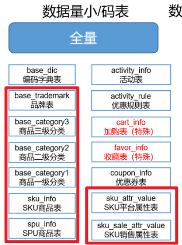
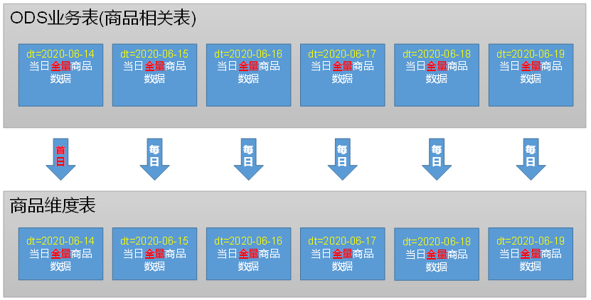
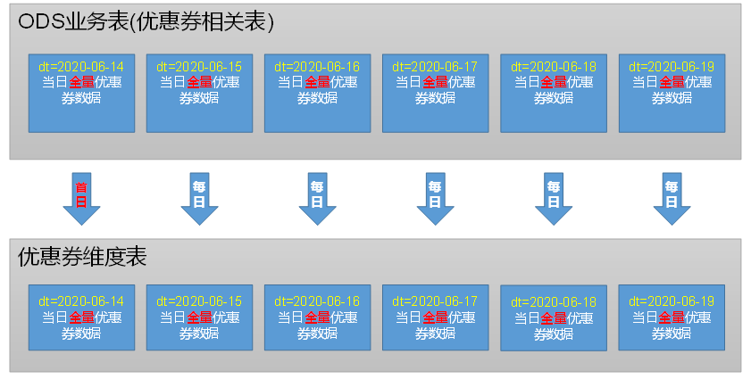
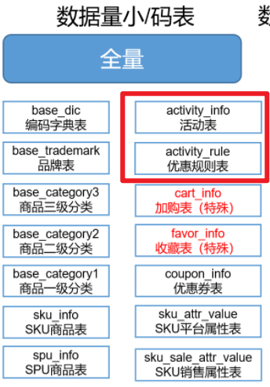
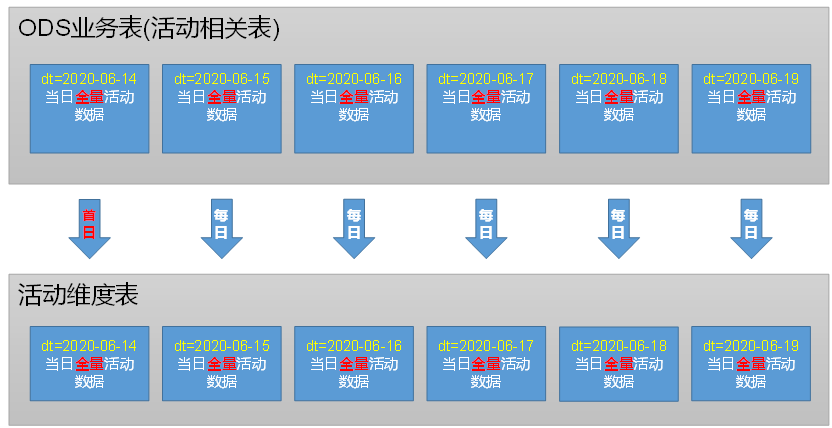
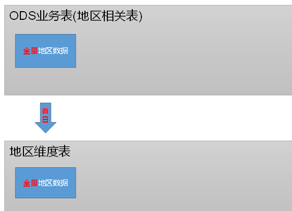
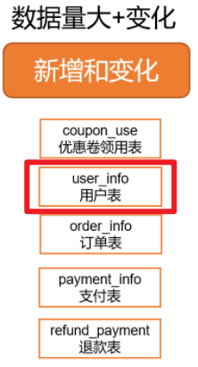
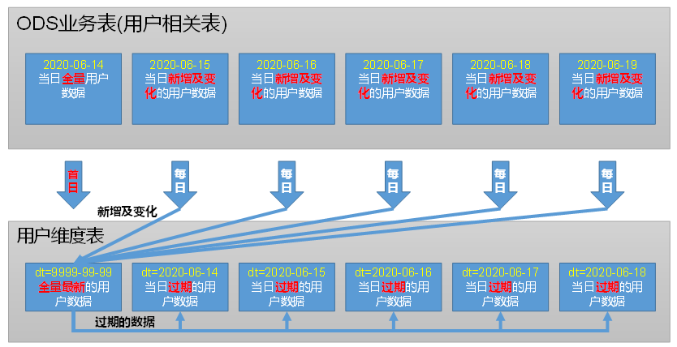
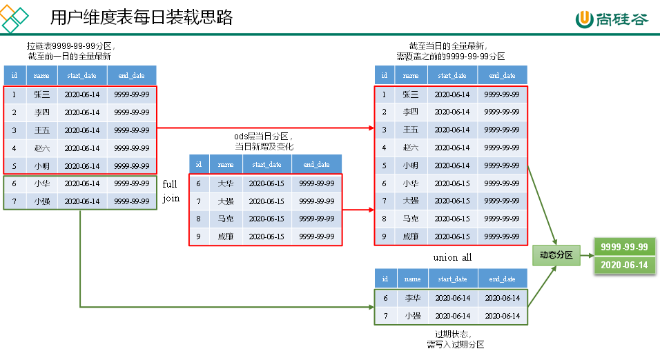

---

Created at: 2021-10-26
Last updated at: 2021-10-27

---

# 6-DIM层

ODS层以后的各层的存储格式使用parquet，压缩方式使用lzo。由于ODS层存储的格式是最普通的TEXTFILE，压缩方式是lzo+索引，因为hive默认的hive.input.format=org.apache.hadoop.hive.ql.io.CombineHiveInputFormat 会将索引当作是小文件进行合并，所以在将ODS层数据写到DIM层和DWD层时，需要将合并小文件关闭，也就需要设置set hive.input.format=org.apache.hadoop.hive.ql.io.HiveInputFormat;（不是很清楚为什么直接读ODS层表没有这个问题，但是将ODS层数据写到DIM和DWD层会合并小文件，本来写的过程也是先从ODS层读数据。）
DIM层和DWD层需要进行维度建模确定有哪些维度表和事实表，每张维度表和事实表的数据来自于ODS层一张或者多张表，也就是DIM层和DWD层表中的数据是ODS层多张表合并的结果。

DIM层一共有6张维度表：商品维度表、优惠券维度表、活动维度表、地区维度表、时间维度表、用户维度表。
1 商品维度表（**全量**）
商品维度表的字段来自于ODS层这几张全量同步的表：

所以DIM层的商品维度表的同步策略也是每日全量同步，也就是首日同步和每日同步的逻辑是相同的，都是把ODS层几张表的当日分区的数据连接之后查询出来写到DIM当日的表中：

2 优惠券维度表（全量）
优惠券维度表只来自于ODS层的优惠券表，所以优惠券维度表也是每日全量同步：

3 活动维度表（全量）
活动维度表来自于ODS层的这两张表：

同样DIM层的活动表的同步策略是全量同步，也就是把ODS的这两张表的每日全量数据连接之后查询出来，再写到DIM层的活动维度表中：

4 地区维度表
地区维度表来自于ODS层地区表和省份表，地区维度表比较特殊，无需每日同步装载，只需要在首日同步一次即可：

5 时间维度表
时间维度表也比较特殊，无须每日导入，一般可一次性导入一年的数据，因为其具有可预见性。

6 用户维度表（**拉链表**）
用户维度表的数据只来自于ODS层的用户表，这张表的同步策略是新增及变化，即ODS层每个分区存的是当日的新增及变化的数据，也就是说如果一个用户记录没有发生过变化，那么这个用户的记录只会出现很久之前的同步的分区中，所以如果要在ODS层查询该用户记录，那么就需要对所有分区的数据进行遍历，这在ODS层是允许的，因为ODS层不对数据做任何处理，只是对数据的原貌进行备份。但这在DIM和DWD层是不允许出现的，DIM和DWD层应该对来自ODS层的数据进行处理，保证新增及变化的数据在这两层中查询时不需要遍历所有分区。

对于用户表而言，如果一个用户很久都没有修改过用户记录，那么该用户的记录将保存在ODS很久之前的某个分区中，但是在DIM层不能这样保存，DIM层应该将这条数据保存在最新的一个分区中，因为这条用户记录是当前用户的最新状态，这样在查询用户的最新的状态时就只需要在最新的这一个分区中进行即可。
如果用户修改了用户数据，那么在ODS层当日分区将会新增一条该用户的记录，该用户之前的那一条记录依然保留在ODS层很久之前的某个分区中。在DIM层，这条最新的用户记录需要保存在最新的一个分区中，那条历史的记录应该保存在前一日的分区中，因为用户今天更新的了状态，表示之前的那条记录是昨天过期的。
所以DIM层用户维度表从ODS层用户表同步的策略如下：

首日直接将ODS层的全量数据同步到DIM层最新的分区9999-99-99即可，因为MySQL中的用户表不会也不能保存用户的历史记录，表中保存的一直都是用户的最新的记录，所以首日从MySQL同步到ODS层的所有记录都是用户的最新的状态，于是从ODS层到DIM层也就是最新的。之后的每日同步就不同，从MySQL到ODS层用户表是直接当天新增及变化的数据同步到新的分区中，而从ODS层到DIM层需要将这部分新增及变化的数据与9999-99-99分区的数据进行合并，合并的逻辑是将新增和变化的数据保存在最新的9999-99-99分区中，对于变化之前的记录，需要将其移到前一天的分区中，因为这部分数据已经属于历史数据了。
实现上述每日同步的逻辑需要给用户维度表添加两个字段start\_date 和 end\_date，start\_date是从ODS同步到DIM的日期，end\_date是该条记录过期的日期，比如2020-06-15同步过来的数据导致9999-99-99分区中部分数据过期了，那么这部分数据的end\_date就应该是2020-06-14，因为2020-06-15是最新数据的start-time，对于9999-99-99分区中的数据，end\_date是9999-99-99。具体sql语句的实现思路就是ODS层新增及变化的数据与DIM层9999-99-99的分区full outer join，然后将ODS层新增及变化的数据和DIM层9999-99-99的分区没有join上的数据overwrite到DIM层9999-99-99分区，DIM层9999-99-99的分区其它join上的数据写到前一天的分区中。

通过以上同步策略，在DIM层查询用户最新的状态 和 某一天的历史记录 都只需要扫描一个分区即可。比如查询2020-06-14的数据，那么where dt=2020-06-14即可(dt是分区字段)。
为什么叫拉链表？因为一个用户的最新记录（一定有且end\_date等于9999-99-99，start\_date不定）和 用户的多条历史记录（只有当用户修改过信息才会有） 的start\_date 和 end\_date是首位相连不存在重叠的，分别分散在不同的分区中。

总结就是，虽然对于新增及变化的数据在ODS也能查到数据，但是效率比较低，并且sql也较为复杂，如果根据表的特点，将数据以一定的策略同步到DIM后，可以避免复杂低效的查询，这正是数仓分层的优点所在。

